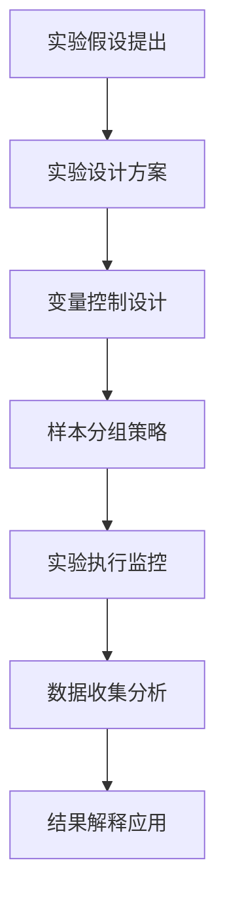
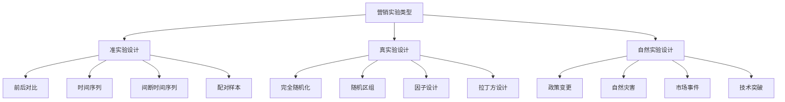
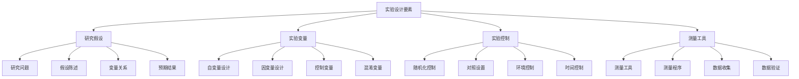
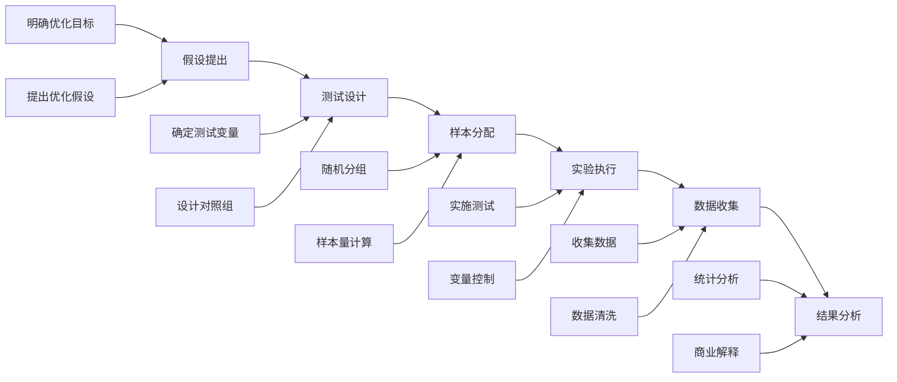

# 营销实验设计

## 📋 知识框架总览



---

## 🎯 核心理念

**营销实验设计** = 运用科学实验方法，在控制变量条件下验证营销假设，为营销决策提供可靠依据的方法论。

**核心价值**：将营销决策从经验驱动转向科学驱动，降低决策风险，提升成功率

---

## 🏗️ 知识结构

### 第一层：认知基础

#### 1.1 营销实验设计的核心原则

| 设计原则 | 核心要求 | 实施方法 | 成功标准 |
|----------|----------|----------|----------|
| **随机化** | 随机分配实验组和对照组 | 随机抽样算法 | 组间无显著差异 |
| **对照性** | 设置合适的对照基准 | 对照组设计 | 因果关系明确 |
| **复制性** | 确保实验结果可重复 | 多轮实验验证 | 结果一致性95%+ |
| **可测性** | 量化测量实验效果 | 准确指标体系 | 指标敏感度高 |

#### 1.2 营销实验类型分类

**实验类型体系**



#### 1.3 实验有效性评估

**实验有效性维度**

| 有效性类型 | 判断标准 | 影响因子 | 提升方法 |
|------------|----------|----------|----------|
| **内部有效性** | 自变量→因变量因果关系 | 混淆变量控制 | 随机化+统计控制 |
| **外部有效性** | 结果推广到总体 | 样本代表性 | 分层抽样+大样本 |
| **建构有效性** | 实验操作反映理论建构 | 操作定义准确性 | 标准化操作+验证 |
| **统计有效性** | 统计检验可靠性 | 样本量+测量精度 | 功效分析+重复检测 |

---

### 第二层：理解深化

#### 2.1 实验设计的基本要素

**实验设计要素系统**



#### 2.2 实验设计方法论

**Box-Hunter-Hunter方法论**

**实验设计七个关键问题**

1. **研究目标**：明确实验要验证什么？
2. **假设提出**：具体的实验假设是什么？
3. **变量识别**：关键变量和混淆变量有哪些？
4. **实验设计**：采用什么实验设计方法？
5. **样本确定**：需要多大的样本量？
6. **执行计划**：如何确保实验正确执行？
7. **数据分析**：如何分析和解释实验结果？

#### 2.3 样本量估算方法

**样本量计算要素**

**样本量计算工具**

| 计算方法 | 适用场景 | 计算公式 | 软件工具 |
|----------|----------|----------|----------|
| **功效分析法** | 假设检验 | n = 2σ²(Zα/2 + Zβ)²/δ² | G*Power |
| **效应量法** | Cohen's d | n = 2(Zα/2 + Zβ)²/d² | OpenEpi |
| **置信区间法** | 参数估计 | n = Z²pq/d² | SampSize |
| **在线计算器** | 便捷计算 | 图形化界面 | Evan Miller |

---

### 第三层：应用实战

#### 3.1 A/B测试实验设计

**A/B测试设计流程**



#### 3.2 多变量实验设计

**多因素实验设计类型**

**因子设计矩阵**

| 设计类型 | 因子数 | 交互作用 | 样本量需求 | 复杂度 |
|----------|--------|----------|------------|----------|
| **2²设计** | 2因子2水平 | 1个交互 | 最小 | 低 |
| **2³设计** | 3因子2水平 | 4个交互 | 适中 | 中 |
| **3³设计** | 3因子3水平 | 7个交互 | 较大 | 高 |
| **部分因子** | 多因子 | 主要交互 | 适中 | 中 |

#### 3.3 营销实验平台工具

**实验平台功能比较**

| 平台类型 | 代表产品 | 主要功能 | 适用场景 | 成本 |
|----------|----------|----------|----------|----------|
| **通用平台** | Google Optimize | 网站A/B测试 | 网站优化 | 免费 |
| **专业平台** | Optimizely | 高级测试功能 | 复杂实验 | 高 |
| **营销平台** | HubSpot | 营销活动测试 | 营销优化 | 中 |
| **自建系统** | 内部开发 | 完全定制 | 特殊需求 | 很高 |

---

## 🎯 刻意练习计划

### 练习1：网站转化率A/B测试设计
**任务**：设计一个网站注册页面的A/B测试实验
**输出**：完整实验设计文档+实施计划+数据分析报告
**评估**：设计的科学性+统计显著性+商业价值+可执行性

### 练习2：邮件营销多变量实验
**任务**：设计邮件营销的多变量测试实验方案
**输出**：实验设计方案+样本量计算+实施监控方案
**评估**：变量控制+样本设计+复杂度管理+结果可解释性

### 练习3：营销活动效果评估实验
**任务**：设计评估新营销活动效果的准实验研究
**输出**：研究设计方案+分析方法+评估报告+改进建议
**评估**：准实验设计合理性+统计方法适当性+结论可靠性+应用价值

---

## 🧩 实战案例分析

### 案例：亚马逊推荐系统A/B测试

**业务背景**：Amazon需要优化其商品推荐算法，提升用户点击和购买转化率

**实验设计挑战**：
- 推荐算法复杂度高，变量控制困难
- 用户行为多样化，干扰因素多
- 业务要求快速迭代，实验周期短

**完整实验设计方案**：

1. **实验假设**
   ```
   H0: 新推荐算法与现有算法效果无显著差异
   H1: 新推荐算法显著优于现有算法
   ```

2. **实验设计**
   - **完全随机化设计**：用户随机分配到两算法组
   - **对照组设计**：现有算法作为对照基准
   - **样本量**：每组50万用户（基于功效分析计算）
   - **实验周期**：4个星期（覆盖用户行为周期）

3. **变量控制**
   - **自变量**：推荐算法（新vs现有）
   - **因变量**：点击率、购买转化率、订单价值
   - **控制变量**：用户性别、年龄、历史偏好

4. **数据收集分析**
   ```
   实时数据收集 → 数据清洗验证 → 统计假设检验 → 效应量分析
   ```

5. **关键成果**
   - **点击率提升**：新算法提升8.2%（p<0.05）
   - **购买转化率**：提升15.6%（p<0.01）
   - **用户满意度**：净推荐值提升12%

**成功的关键要素**：
- 明确的业务假设和预期
- 严格的随机化控制
- 充足的样本量和统计功效
- 全面的数据收集和验证
- 清晰的业务结果解释

---

## 🔗 知识连接

**核心关联模块**：
- [[01-A-B测试方法]] - A/B测试实验方法基础
- [[01-营销效果优化]] - 营销实验目标导向
- [[02-营销优化策略]] - 实验驱动的优化策略
- [[03-持续改进机制]] - 实验验证的改进机制

**技能提升路径**：
1. [[06-营销效果评估/01-营销指标]] - 实验效果评估指标体系
2. [[09-营销工具资源/01-营销工具]] - 营销实验工具平台选择
3. [[08-营销创新趋势/01-新兴技术]] - 新技术在营销实验中的应用
4. [[02-营销数据分析]] - 实验数据分析和挖掘技能

---

## 📚 学习检查清单

**基础认知检查**：
- [ ] 理解营销实验设计的核心原理和科学价值
- [ ] 掌握营销实验设计的核心原则和基本要素
- [ ] 能够识别营销实验的内部有效性和外部有效性要求

**深化理解检查**：
- [ ] 能够设计完整的A/B测试和多变量营销实验方案
- [ ] 掌握样本量计算和实验统计分析方法
- [ ] 理解营销实验平台工具的选择和应用原理

**应用实践检查**：
- [ ] 能够独立设计和执行营销实验项目
- [ ] 能够进行实验结果的统计分析和商业解释
- [ ] 能够基于实验结果制定营销改进策略

**知识整合检查**：
- [ ] 能够将营销实验设计与整体营销研究有机整合
- [ ] 能够在实际业务中建立系统化的营销实验文化
- [ ] 能够通过营销实验实现营销决策的科学化和精准化
