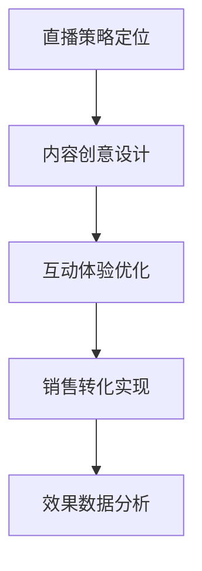

# 直播营销

## 📋 知识框架总览



---

## 🎯 核心理理

**直播营销** = 通过实时视频直播形式进行产品展示、互动交流和销售转化的营销模式，实现品牌曝光和商业变现的综合性营销活动。

**核心价值**：通过实时互动和真实展示，建立消费者信任，提升转化效果

---

## 🏗️ 知识结构

### 第一层：认知基础

#### 1.1 直播营销特征

| 核心特征 | 具体表现 | 营销价值 | 成功要素 |
|----------|----------|----------|----------|
| **实时互动** | 即时交流+现场反馈 | 信任建立快速 | 互动设计能力 |
| **真实体验** | 真实产品展示+使用体验 | 减少购买疑虑 | 体验效果优化 |
| **情感连接** | 主播人格魅力+粉丝粘性 | 购买决策加速 | 人格营销能力 |
| **社交传播** | 分享转发+口碑传播 | 影响力扩散 | 传播机制设计 |

#### 1.2 直播营销类型

**直播模式矩阵**

```mermaid
graph TD
    A[直播营销类型] --> B[电商直播"]
    A --> C[品牌直播"]"
    A --> D[知识直播"]"
    A --> E[娱乐直播"]"
    
    B --> B1[带货直播"]
    B --> B2[产品展示"]
    
    C --> C1[品牌宣传"]
    C --> C2[活动发布"]"
    
    D --> D1[技能教学"]
    D --> D2[行业分享"]"
    
    E --> E1[互动娱乐"]
    E --> E2[才艺展示"]"
```

---

### 第二层：理解深化

#### 2.1 直播策划设计

**直播内容策略**

| 要素类型 | 设计要求 | 实施要点 | 评价指标 |
|----------|----------|----------|----------|
| 直播主题 | 吸引力+相关性 | 热点+痛点+价值 | 观看停留率 |
| 时间安排 | 用户活跃时间 | 避开竞品时间 | 直播转化率 |
| 互动设计 | 多元且简单 | 问答+抽奖+投票 | 互动参与率 |
| 销售策略 | 优惠+紧迫感 | 限时+限量+限价 | 订单转化率 |

---

### 第三层：应用实战

#### 3.1 直播营销实施

**直播执行流程**

```mermaid
graph LR
    A[预热推广"] --> B[直播准备"] --> C[直播执行"] --> D[复盘优化"]"
    
    A1[多渠道预告+社群预热"] --> A
    B1[设备调试+内容预演"] --> B
    C1[互动管理+实时优化"] --> C
    D1[数据分析+问题改进"] --> D
```

---

## 🎯 刻意练习计划

### 练习1：直播营销策划执行
**输出**：直播方案+执行过程+结果报告
**评估**：策划创意+执行质量+转化效果

### 练习2：直播互动优化
**输出**：互动策略+用户体验+优化方案
**评估**：互动效果+用户满意度+活跃度提升

---

## 🧩 典型案例

### 直播带货成功案例：薇娅/李佳琦

**成功要素**：
- **专业能力**：深厚的行业知识和选品能力
- **个人魅力**：独特的直播风格和人格魅力
- **用户体验**：真正为用户谋福利的价值观
- **供应链实力**：强大的品牌合作和价格谈判能力

---

## 🔗 知识连接

**关联模块**：
- [[07-营销创新趋势/02-新兴模式/01-私域流量]] - 直播引流私域
- [[08-营销案例分析]] - 直播营销案例分析

---

## 📚 学习检查清单

**基础**：[直播特征+营销价值+成功要素]
**理解**：[策划设计+执行要点+优化方法]
**应用**：[直播实战+互动优化+效果分析]

---

## 📝 核心要点

**直播营销成功要素**：
1. 内容策划要有情感价值和使用价值
2. 主播专业能力和人格魅力是核心
3. 互动设计要与销售目标结合
4. 供应链和价格因素影响最终转化
5. 数据分析驱动持续优化改进
