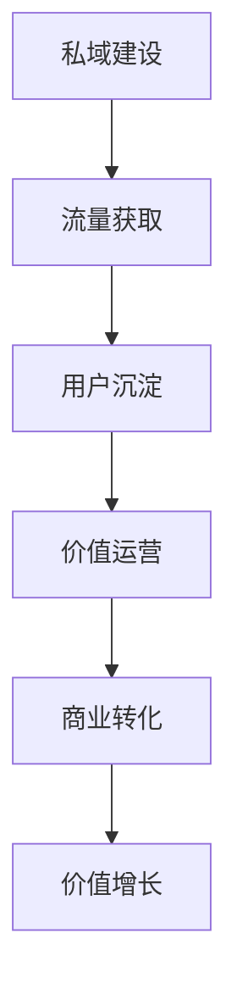
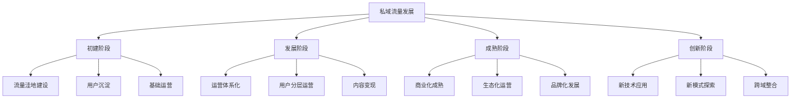
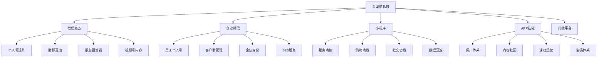
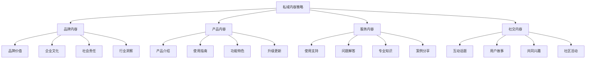
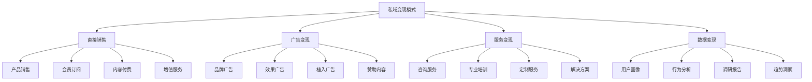

# 私域流量运营

## 📋 知识框架总览



---

## 🎯 核心理念

**私域流量运营** = 在自有平台上构建用户触达能力，通过精细化运营实现用户价值最大化的营销模式。

**核心价值**：降低获客成本，提升用户生命周期价值，建立可持续的商业增长引擎

---

## 🏗️ 知识结构

### 第一层：认知基础

#### 1.1 私域流量核心要素

| 核心要素 | 关键内容 | 价值体现 | 成功指标 |
|----------|----------|----------|----------|
| **自有性** | 平台控制权 | 自主运营 | 平台独立性95%+ |
| **触达性** | 直接到达能力 | 高效沟通 | 触达率80%+ |
| **可复用性** | 重复使用价值 | 成本摊薄 | 复用成本<获客成本50% |
| **数据性** | 用户画像能力 | 精准营销 | 数据完整度90%+ |

#### 1.2 私域流量vs公域流量

**流量属性对比表**

| 对比维度 | 公域流量 | 私域流量 | 差异程度 | 运营策略 |
|----------|----------|----------|----------|----------|
| **成本属性** | 按次付费 | 一次获客长期使用 | 成本优势明显 | 投公域建私域 |
| **控制程度** | 平台主导 | 完全自主 | 控制自由度极高 | 平台规则适应 |
| **触达能力** | 被动等待 | 主动出击 | 主动性差异显著 | 主动营销激活 |
| **数据深度** | 表层指标 | 深度洞察 | 数据价值层次差异 | 深度分析应用 |

#### 1.3 私域流量发展阶段

**私域流量成熟度模型**



---

### 第二层：理解深化

#### 2.1 私域流量建设策略

**全渠道私域建设架构**



#### 2.2 用户价值分层运营

**RFM私域用户分层**

**私域用户价值矩阵**

| 用户类型 | R值 | F值 | M值 | 运营策略 | 主要目标 |
|----------|-----|-----|-----|----------|----------|
| **明星用户** | 高 | 高 | 高 | VIP专属服务 | 提升忠诚度 |
| **重要用户** | 高 | 高 | 中 | 深度运营 | 增加消费 |
| **潜力用户** | 高 | 中 | 中 | 激活引导 | 提升频次 |
| **沉睡用户** | 低 | 中 | 中 | 流失挽回 | 挽回激活 |
| **流失用户** | 低 | 低 | 低 | 低成本维护 | 减少流失 |

#### 2.3 私域内容策略框架

**内容策略金字塔**



---

### 第三层：应用实战

#### 3.1 私域流量成长漏斗

**私域成长转化模型**

**转化漏斗关键节点**

| 转化阶段 | 核心目标 | 关键动作 | 成功指标 | 优化重点 |
|----------|----------|----------|----------|----------|
| **引流获客** | 拉新到私域 | 诱饵设计+触点构建 | 引流率5-15% | 触点价值+诱惑力 |
| **激活首购** | 完成首次转化 | 产品体验+服务触达 | 首购率10-25% | 产品匹配+服务体验 |
| **复购提升** | 增加消费频次 | 需求唤醒+便利体验 | 复购率30-50% | 使用便利+场景唤醒 |
| **价值提升** | 单客价值增长 | 交叉推荐+向上销售 | ARPU增长15-30% | 价值沟通+服务增值 |
| **推荐裂变** | 用户推荐传播 | 激励设计+分享便利 | 推荐率8-15% | 激励机制+社交便利 |

#### 3.2 私域运营自动化

**智能化运营体系**

#### 私域运营自动化场景

| 运营场景 | 触发条件 | 自动化动作 | 个性化内容 | 预期效果 |
|----------|----------|------------|-------------|----------|
| **新用户欢迎** | 首次进入私域 | 欢迎信息+引导 | 个性化内容推荐 | 激活率提升30% |
| **购买后跟进** | 完成首次购买 | 使用指导+关怀 | 相关产品推荐 | 满意度提升25% |
| **沉睡用户唤醒** | 7天未互动 | 优惠活动推送 | 个性化优惠券 | 回流率提升15% |
| **生日关怀** | 用户生日 | 祝福+专属优惠 | 个性化生日礼包 | 忠诚度提升20% |

#### 3.3 私域商业化变现

**多元化变现模式**



---

## 🎯 刻意练习计划

### 练习1：私域建设方案设计
**任务**：为企业设计完整的私域流量建设方案
**输出**：建设策略+实施方案+成功指标+预算规划+ROI预测
**评估**：战略合理性+实施方案+资源配置+预期效果+可持续性

### 练习2：私域运营策略制定
**任务**：制定针对不同用户群体的差异化运营策略
**输出**：用户分层+运营策略+内容规划+触达计划+效果监控
**评估**：策略针对性+运营效果+用户体验+商业价值+执行可行性

### 练习3：私域变现模式探索
**任务**：设计私域流量的商业化变现模式组合
**输出**：变现模式+定价策略+激励机制+实施计划+效果评估
**评估**：模式创新性+商业可行性+用户接受度+收益预期+长期发展

---

## 🧩 实战案例分析

### 案例：完美日记私域运营成功经验

**企业背景**：国产彩妆品牌，通过私域流量实现从0到百亿的增长

**私域运营策略架构**：

1. **多层次私域矩阵建设**
   ```
   微信个人号 + 微信群 + 小程序 + 公众号 = 全链条私域
   ```

2. **用户分层精准运营**
   - **新人用户**：专属顾问对接，产品试用指导
   - **活跃用户**：日常护肤彩妆知识分享
   - **高价值用户**：VIP专享服务，限量产品预约
   - **沉睡用户**：定期优惠唤醒活动

3. **内容价值化运营**
   - **专业性内容**：化妆技巧、护肤知识
   - **社交性内容**：用户妆容分享、话题互动
   - **商业性内容**：新品发布、促销活动
   - **服务性内容**：产品使用指导、问题解答

4. **营销自动化系统**
   ```
   用户行为触发 → 自动内容推送 → 个性化体验 → 转化效果跟踪
   ```

**关键成果指标**：
- **私域用户规模**：沉淀数百万精准用户
- **复购转化率**：私域复购率达到65%+
- **用户生命周期价值**：LTV提升300%+
- **获客成本优势**：私域获客成本仅为公域20%

**核心成功经验**：
- 多渠道私域矩阵的协同效应
- 重度用户分层运营策略
- 专业内容的价值化变现
- 强大的运营自动化系统
- 深刻理解目标用户需求和行为

---

## 🔗 知识连接

**核心关联模块**：
- [[02-直播营销]] - 直播私域流量转化
- [[03-短视频营销]] - 短视频私域建设入口
- [[04-社群营销]] - 社群化私域运营方法
- [[05-influencer营销]] - KOL私域流量协同

**平台技能延伸**：
1. [[01-营销总览]] - 私域流量在整体营销体系中的定位
2. [[04-营销策略制定]] - 私域策略与其他营销策略的协同
3. [[05-营销执行实施]] - 私域运营的执行实施方法
4. [[06-营销效果评估]] - 私域流量效果评估和优化

---

## 📚 学习检查清单

**基础认知检查**：
- [ ] 理解私域流量运营的核心价值和商业逻辑
- [ ] 掌握私域流量与公域流量的本质差异和协同策略
- [ ] 能够识别私域流量建设的关键要素和成功条件

**深化理解检查**：
- [ ] 能够设计多渠道私域流量建设架构
- [ ] 掌握用户分层运营和个性化服务策略
- [ ] 理解内容策略和自动化运营的深度应用

**应用实践检查**：
- [ ] 能够独立构建并运营完整的私域流量体系
- [ ] 能够实现私域用户的商业价值转化和变现
- [ ] 能够持续优化私域运营效果和用户价值

**知识整合检查**：
- [ ] 能够将私域流量运营有效整合到整体营销战略中
- [ ] 能够在实际业务中建立可持续的私域流量增长体系
- [ ] 能够基于私域数据洞察指导产品、服务、营销的全面优化
