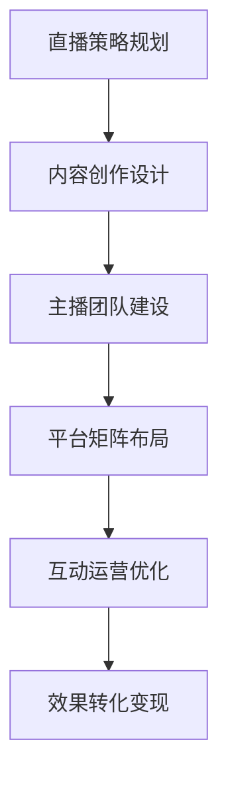
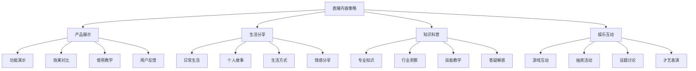
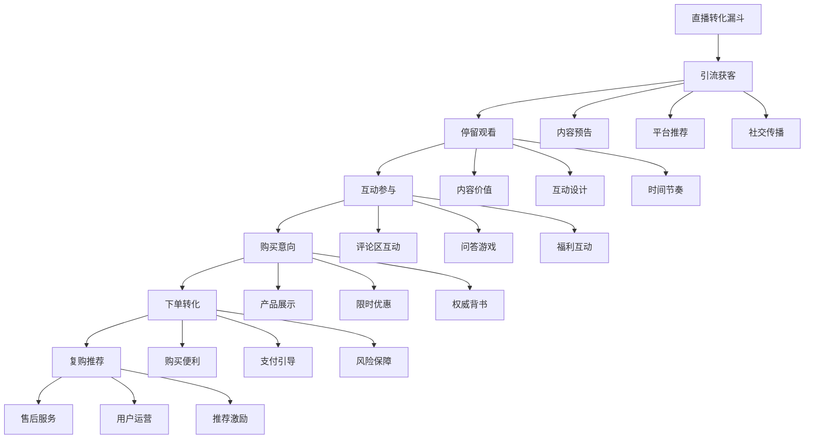

# 直播营销

## 📋 知识框架总览



---

## 🎯 核心理念

**直播营销** = 通过实时直播形式进行产品展示、品牌传播、用户互动和销售转化的新兴营销模式。

**核心价值**：创造沉浸式购物体验，实现品牌与用户的深度连接和即时转化

---

## 🏗️ 知识结构

### 第一层：认知基础

#### 1.1 直播营销核心要素

| 核心要素 | 关键内容 | 成功标准 | 影响权重 |
|----------|----------|----------|----------|
| **内容质量** | 专业度+娱乐性 | 观看时长>15分钟 | 40% |
| **主播魅力** | 专业性+亲和力 | 粉丝转化率>5% | 30% |
| **产品匹配** | 适合度高+性价比 | 购买转化率>3% | 20% |
| **互动体验** | 实时性+参与感 | 互动率>10% | 10% |

#### 1.2 直播营销vs传统营销

**营销模式对比分析**

| 对比维度 | 传统广告 | 直播营销 | 优势倍数 |
|----------|----------|----------|----------|
| **互动性** | 单向传播 | 实时互动 | 100倍+ |
| **信任度** | 品牌背书 | 真实体验 | 5倍+ |
| **转化路径** | 长链条转化 | 即时下单 | 10倍+ |
| **成本效率** | 高门槛投入 | 低门槛启动 | 50倍+ |
| **数据获取** | 间接反馈 | 实时数据 | 20倍+ |

---

### 第二层：理解深化

#### 2.1 直播内容策略

**内容类型矩阵**



#### 2.2 直播运营流程

**直播全生命周期管理**

**24小时直播运营流程**

| 时间阶段 | 运营重点 | 关键动作 | 成功指标 |
|----------|----------|----------|----------|
| **开播前4h** | 预热宣传 | 预告发布、私域通知 | 预约观看人数 |
| **开播前2h** | 预热升温 | 话题制造、互动准备 | 实时关注度 |
| **开播后0-30min** | 破冰互动 | 欢迎互动、价值输出 | 互动参与率 |
| **开播后30-60min** | 内容核心 | 产品展示、价值传递 | 观看时长 |
| **开播后60-90min** | 销售转化 | 购买引导、优惠说明 | 转化订单量 |
| **开播结束后** | 后续跟进 | 客服跟进、数据复盘 | 客户满意度 |

---

### 第三层：应用实战

#### 3.1 直播带货策略

**转化漏斗优化模型**



#### 3.2 多平台直播矩阵

**平台特性差异化策略**

| 直播平台 | 用户特征 | 内容偏好 | 营销策略 | 适合产品 |
|----------|----------|----------|----------|----------|
| **淘宝直播** | 购物导向 | 产品展示 | 强销售转化 | 标品、快消 |
| **抖音直播** | 娱乐导向 | 创意内容 | 娱乐化营销 | 潮流、美妆 |
| **快手直播** | 社区导向 | 真实互动 | 信任建立 | 生活用品 |
| **小红书直播** | 品质导向 | 生活美学 | 品质展示 | 美妆、家居 |

---

## 🎯 刻意练习计划

### 练习1：直播内容策划
**任务**：为品牌设计完整的直播内容策划方案
**输出**：内容策略+主播人设+脚本设计+互动方案+效果预期
**评估**：内容吸引力+主播适配度+转化可行性+差异化价值

### 练习2：直播带货实战
**任务**：设计和执行一场完整的直播带货活动
**输出**：直播方案+执行过程+数据复盘+效果优化+经验总结
**评估**：转化效果+用户体验+成本控制+可复制性+持续优化

### 练习3：直播矩阵运营
**任务**：建立多平台直播矩阵运营体系
**输出**：平台策略+内容差异化+资源配置+协同机制+整体效果
**评估**：平台匹配度+内容差异化+协同效应+投入产出+规模发展

---

## 🧩 实战案例分析

### 案例：李佳琦直播带货成功经验

**个人背景**：前美妆导购，现头部带货主播

**成功要素分析**：

1. **专业能力过硬**
   - 深度了解美妆产品特性
   - 丰富的化妆品从业经验
   - 持续的学习和专业提升

2. **独特人格魅力**
   - "Oh My God"等标志性口头禅
   - 真实直接的评价风格
   - 高度的亲和力和感染力

3. **精细化运营**
   ```
   选品严格 + 价格优势 + 品质保证 + 售后完善 = 用户信任
   ```

4. **数据驱动优化**
   - 实时监控直播数据指标
   - 基于数据调整内容策略
   - 深度分析用户反馈

**关键成果指标**：
- **粉丝规模**：数千万级精准粉丝
- **带货能力**：单场销售额数亿元
- **转化率**：平均转化率15%+
- **用户忠诚度**：高复购率和推荐率

---

## 🔗 知识连接

**核心关联模块**：
- [[01-私域流量运营]] - 直播+私域的协同营销
- [[03-短视频营销]] - 短视频+直播的组合营销
- [[05-社群营销]] - 直播社区化运营
- [[04-营销案例分析]] - 直播营销成功案例

---

## 📚 学习检查清单

**基础认知检查**：
- [ ] 理解直播营销的核心价值和商业逻辑
- [ ] 掌握直播营销与传统营销的本质差异
- [ ] 能够识别直播营销成功的关键要素

**深化理解检查**：
- [ ] 能够设计差异化的直播内容策略
- [ ] 掌握直播运营的全流程管理方法
- [ ] 理解多平台直播的协同运营策略

**应用实践检查**：
- [ ] 能够独立策划和执行完整的直播营销活动
- [ ] 能够实现直播带货的有效转化和销售增长
- [ ] 能够建立可持续的直播营销运营体系

**知识整合检查**：
- [ ] 能够将直播营销有效整合到整体营销战略中
- [ ] 能够在实际业务中建立专业的直播营销能力
- [ ] 能够基于直播数据洞察优化整体营销效果
