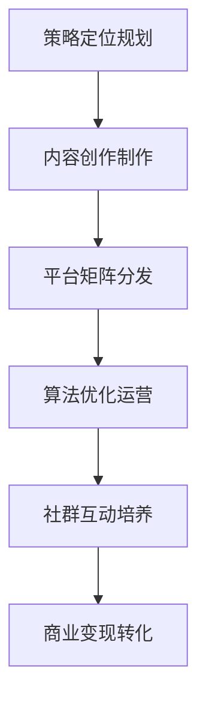
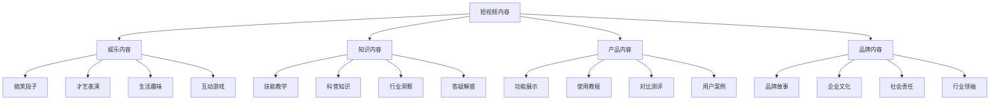

# 短视频营销

## 📋 知识框架总览



---

## 🎯 核心理念

**短视频营销** = 通过短时长视频内容实现品牌传播、用户触达和商业转化的新媒体营销模式。

**核心价值**：满足用户碎片化消费习惯，利用高互动性和传播力实现营销目标

---

## 🏗️ 知识结构

### 第一层：认知基础

#### 1.1 短视频营销核心特征

| 核心特征 | 具体表现 | 营销价值 | 成功要素 |
|----------|----------|----------|----------|
| **碎片化** | 15-60秒短时长 | 降低观看门槛 | 快速抓住注意力 |
| **移动化** | 手机端观看为主 | 触达时间灵活 | 适配移动场景 |
| **社交化** | 易分享、强互动 | 自然传播扩散 | 病毒式传播潜力 |
| **算法化** | 智能推荐分发 | 精准内容匹配 | 算法友好内容 |

#### 1.2 短视频平台生态对比

**平台特征矩阵**

| 平台名称 | 用户定位 | 内容风格 | 算法偏好 | 营销策略 |
|----------|----------|----------|----------|----------|
| **抖音** | 年轻潮酷 | 创意新颖 | 强算法机制 | 创意化营销 |
| **快手** | 真实接地气 | 生活记录 | 社区化推荐 | 真实化营销 |
| **小红书** | 品质生活 | 精致美图 | 内容质量导向 | 品质化营销 |
| **视频号** | 微信生态 | 社交传播 | 社交分享机制 | 私域化营销 |

---

### 第二层：理解深化

#### 2.1 短视频内容策略

**内容类型金字塔**



#### 2.2 短视频制作流程

**专业化制作体系**

**制作核心要素**

| 要素类别 | 核心组成 | 专业要求 | 影响权重 |
|----------|----------|----------|----------|
| **脚本策划** | 文案+分镜头 | 创意+结构 | 40% |
| **视觉呈现** | 拍摄+剪辑 | 技术+审美 | 35% |
| **音效配合** | BGM+音效 | 节奏+情感 | 15% |
| **特效包装** | 字幕+转场 | 品牌+识别 | 10% |

---

### 第三层：应用实战

#### 3.1 短视频运营策略

**全链路运营模型**

```mermaid
graph TD
    A[运营策略体系] --> B[内容运营]
    A --> C[用户运营] 
    A --> D[平台运营]
    A --> E[数据运营]
    
    B --> B1[内容规划]
    B --> B2[创作执行]
    B --> B3[发布时机]
    B --> B4[持续优化]
    
    C --> C1[用户画像]
    C --> C2[社群建设]
    C --> C3[互动管理]
    C --> C4[粉丝转化]
    
    D --> D1[平台规则]
    D --> D2[算法优化]
    D --> D3[矩阵协同]
    D --> D4[商业化】
    
    E --> E1[数据监控]
    E --> E2[效果分析】
    E --> E3[策略调整]
    E --> E4[ROI评估】
```

#### 3.2 短视频变现模式

**多元化变现策略**

**变现模式架构**

| 变现类型 | 实施方式 | 收入来源 | 门槛要求 | ROI周期 |
|----------|----------|----------|----------|----------|
| **广告变现** | 品牌合作广告 | 广告费用 | 粉丝10万+ | 1-3个月 |
| **带货变现** | 视频带货销售 | 销售佣金 | 专业度+信任 | 立即可见 |
| **知识付费** | 技能培训教学 | 课程费用 | 专业能力 | 3-6个月 |
| **IP授权** | 个人品牌授权 | 授权费用 | 知名度+影响力 | 6-12个月 |

---

## 🎯 刻意练习计划

### 练习1：短视频内容策划
**任务**：为品牌策划完整的短视频内容体系
**输出**：内容策略+脚本设计+制作标准+发布计划
**评估**：内容创意性+品牌契合度+用户关注度+转化潜力

### 练习2：短视频运营实战
**任务**：操作短视频账号，实现粉丝增长和互动提升
**输出**：运营方案+执行记录+数据分析+优化策略
**评估**：增长效果+内容质量+用户互动+持续运营

### 练习3：短视频商业化
**任务**：实现短视频账号的商业变现
**输出**：变现方案+实施过程+收入数据+规模化规划
**评估**：变现能力+商业化程度+可持续性+规模潜力

---

## 🧩 实战案例分析

### 案例：完美日记短视频营销成功经验

**品牌背景**：国产彩妆品牌，通过短视频营销实现品牌突破

**短视频营销策略**：

1. **KOL合作矩阵**
   ```
   头部达人(品牌影响力) + 腰部达人(专业度) + 素人用户(真实性) = 全覆盖矩阵
   ```

2. **内容创意策略**
   - **教学类内容**：化妆技巧、产品使用教程
   - **测评类内容**：真实体验、效果对比
   - **种草类内容**：使用场景、搭配推荐

3. **平台协同策略**
   - **抖音**：创意舞蹈+产品展示
   - **小红书**：精致妆容+使用教程  
   - **快手**：真实分享+生活场景

**关键成功成果**：
- **品牌知名度**：从0到国民品牌认知
- **用户获取**：短视频获客成本仅为传统广告20%
- **销售转化**：短视频带动销量增长300%+
- **品牌价值**：品牌估值提升数十倍

---

## 🔗 知识连接

**核心关联模块**：
- [[02-直播营销]] - 短视频+直播组合营销
- [[01-私域流量运营]] - 短视频私域引流
- [[04-社群营销]] - 短视频社群运营
- [[08-营销案例]] - 短视频营销案例研究

---

## 📚 学习检查清单

**基础认知检查**：
- [ ] 理解短视频营销的核心特征和价值
- [ ] 掌握各短视频平台的差异化特征
- [ ] 能够识别短视频营销成功的关键要素

**深化理解检查**：
- [ ] 能够设计系统化的短视频内容策略
- [ ] 掌握短视频制作的完整专业流程
- [ ] 理解短视频运营的全链路管理方法

**应用实践检查**：
- [ ] 能够策划和执行完整的短视频营销campaign
- [ ] 能够实现短视频账号的有效运营和增长
- [ ] 能够通过短视频实现商业变现目标

**知识整合检查**：
- [ ] 能够将短视频营销整合到整体营销战略中
- [ ] 能够在实际业务中建立专业的短视频营销能力
- [ ] 能够基于短视频数据洞察优化整体营销效果
