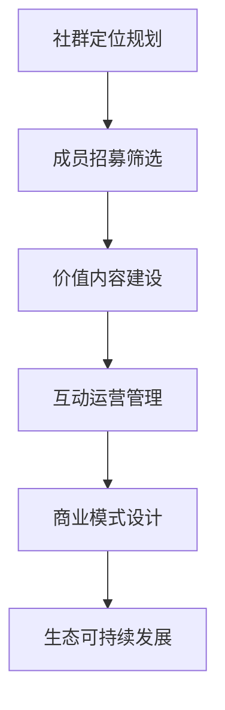
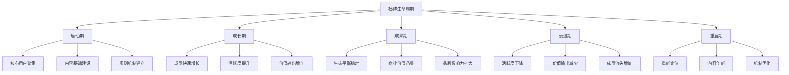

# 社群营销

## 📋 知识框架总览



---

## 🎯 核心理念

**社群营销** = 基于共同兴趣、需求或价值观聚合精准用户群体，通过持续价值输出和深度互动实现商业转化和品牌建设的营销模式。

**核心价值**：打造品牌与用户深度连接的价值共同体，实现低成本高价值的情感营销和商业转化

---

## 🏗️ 知识结构

### 第一层：认知基础

#### 1.1 社群营销核心要素

| 核心要素 | 关键内容 | 成功标准 | 影响权重 |
|----------|----------|----------|----------|
| **共同价值** | 共同兴趣/需求/目标 | 成员认同度>80% | 30% |
| **互动氛围** | 活跃度+参与感 | 日活跃率>30% | 25% |
| **内容质量** | 价值输出+独特性 | 推荐率>70% | 25% |
| **管理机制** | 规则+激励机制 | 规则执行力>90% | 20% |

#### 1.2 社群vs传统群体

**群体特征对比分析**

| 对比维度 | 传统群体 | 营销社群 | 差异倍数 |
|----------|----------|----------|----------|
| **聚合动因** | 血缘/地缘 | 兴趣/价值 | 主动性10倍+ |
| **互动频次** | 低频偶发 | 高频持续 | 活跃度20倍+ |
| **内容产出** | 被动接收 | 主动创作 | 参与度50倍+ |
| **商业价值** | 间接潜在 | 直接变现 | 转化率30倍+ |
| **忠诚度** | 外在约束 | 内在驱动 | 粘性100倍+ |

#### 1.3 社群生命周期

**社群发展阶段模型**



---

### 第二层：理解深化

#### 2.1 社群类型和定位

**社群分类策略矩阵**

```mermaid
graph TD
    A[社群分类] --> B[产品型社群]
    A --> C[兴趣型社群]
    A --> D[知识型社群]
    A --> E[品牌型社群]
    
    B --> B1[产品用户群]
    B --> B2[售后服务群]
    B --> B3[新品体验群]
    B --> B4[售后反馈群]
    
    C --> C1[行业交流群]
    C --> C2[技能学习群]
    C --> C3[生活方式群]
    C --> C4[兴趣爱好群]
    
    D --> D1[专业技能群]
    D --> D2[教育培训群]
    D --> D3[专家咨询群]
    D --> D4[经验分享群】
    
    E --> E1[品牌粉丝群]
    E --> E2[企业文化群]
    E --> E3[品牌大使群】
    E --> E4[活动推广群】
```

#### 2.2 社群运营核心方法

**运营方法论体系**

**用户分层运营策略**

| 用户层级 | 用户特征 | 运营策略 | 激励机制 | 转化目标 |
|----------|----------|----------|----------|----------|
| **KOL用户** | 影响力大+专业度高 | 重点维护+深度合作 | 特权+利益+荣誉 | 品牌代言 |
| **活跃用户** | 参与度高+贡献内容 | 积极引导+价值认可 | 榜单+奖品+认可 | 付费转化 |
| **普通用户** | 关注观看为主 | 内容吸引+互动激发 | 积分+优惠+游戏 | 活跃度提升 |
| **潜水用户** | 很少发言互动 | 唤醒激活+简单参与 | 低门槛+小奖励 | 参与度提升 |

#### 2.3 社群商业化模式

**变现模式架构**

```mermaid
graph TD
    A[社群变现] --> B[直接变现]
    A --> C[间接变现]
    A --> D[衍生变现]
    
    B --> B1[会员费用]
    B --> B2[产品销售]
    B --> B3[服务收费]
    B --> B4[广告合作"]
    
    C --> C1[品牌传播]
    C --> C2[用户获取】
    C --> C3[市场调研]
    C --> C4[口碑建设】
    
    D --> D1[教育培训]
    D --> D2[内容付费】
    D --> D3[社群周边]
    D --> D4[行业影响力】
```

---

### 第三层：应用实战

#### 3.1 社群建设实践

**从0到1社群建设流程**

**建设五步法**

| 步骤 | 核心任务 | 关键动作 | 成功指标 | 时间周期 |
|------|----------|----------|----------|----------|
| **定位** | 确定社群价值主张 | 差异化定位+目标用户 | 定位清晰度100% | 1周 |
| **种子** | 招募首批核心用户 | 寻找KOL+活跃用户+精准用户 | 核心用户20-50人 | 2-4周 |
| **规则** | 建立社群运营机制 | 制度制定+管理者设定+激励机制 | 规则接纳度90%+ | 1-2周 |
| **内容** | 持续价值内容输出 | 内容规划+创作者培养+多元化内容 | CPGC占比60%+ | 持续进行 |
| **互动** | 促进群内深度互动 | 话题策划+活动设计+角色扮演 | 互动率15%+ | 持续进行 |

#### 3.2 社群管理和激励

**精细化运营体系**

**激励机制设计矩阵**

| 激励类型 | 激励方式 | 适用范围 | 实施成本 | 效果指数 |
|----------|----------|----------|----------|----------|
| **社交激励** | 等级称号+排行榜 | 全体成员 | 低 | ⭐⭐⭐⭐ |
| **内容激励** | 优秀内容推荐+打赏 | 内容贡献者 | 中 | ⭐⭐⭐⭐⭐ |
| **参与激励** | 签到积分+任务奖励 | 普通用户 | 低 | ⭐⭐⭐ |
| **商业激励** | 折扣券+佣金收入 | 购买活跃用户 | 中 | ⭐⭐⭐⭐ |
| **精神激励** | 荣誉称号+特别权限 | 核心用户 | 低 | ⭐⭐⭐⭐⭐ |

---

## 🎯 刻意练习计划

### 练习1：社群定位和建设方案
**任务**：为企业设计完整的社群营销建设方案
**输出**：社群定位+用户画像+运营策略+治理机制+发展路径
**评估**：定位准确性+用户匹配度+策略可行性+机制完整性+成长潜力

### 练习2：社群运营实战管理
**任务**：运营一个300人左右的社群，提升活跃度和价值产出
**输出**：运营计划+日常管理+活动组织+数据分析+优化效果
**评估**：运营专业性+活跃度提升+成员满意度+价值产出+可持续发展

### 练习3：社群商业化变现探索
**任务**：设计并实践社群商业变现模式
**输出**：变现策略+实施过程+收益分析+模式验证+规模化规划
**评估**：变现能力+收益规模+模式创新+可持续性+复制推广

---

## 🧩 实战案例分析

### 案例：小米社区营销成功模式

**企业背景**：小米公司通过社区营销实现品牌建设和产品创新双成功

**社群运营核心策略**：

1. **米粉文化打造**
   ```
   参与感 + 为发烧而生 + 用户共创 = 独特米粉文化
   ```

2. **多层次社群体系**
   - **全国MIUI主题开发组**：专业开发者社群
   - **小米粉丝节**：年度盛大聚会
   - **线上论坛社区**：日常交流讨论
   - **线下同城会**：地域性粉丝活动

3. **用户参与产品设计**
   - **需求收集**：用户需求直达产品经理
   - **内测体验**：核心用户前置体验新产品
   - **功能共创**：用户参与功能设计改进

4. **深度商业化应用**
   - **新品首发**：核心用户优先体验和购买
   - **品牌传播**：用户主动传播品牌和产品
   - **口碑建设**：真实用户评价和推荐

**关键成功成果**：
- **用户忠诚度**：米粉忠诚度行业领先
- **产品创新**：用户深度参与产品迭代
- **营销成本**：营销成本显著低于行业水平
- **品牌价值**：用户共创的品牌价值无限大

**核心成功要素**：
- 真正以用户为中心的经营理念
- 完善的社群治理和管理机制
- 持续的创新和内容产出
- 深度融入的商业化应用

---

## 🔗 知识连接

**核心关联模块**：
- [[01-私域流量运营]] - 私域社群化运营协同
- [[02-直播营销]] - 直播+社群互动营销
- [[03-短视频营销]] - 短视频+社群内容营销
- [[10-营销工具资源]] - 社群运营工具和平台

---

## 📚 学习检查清单

**基础认知检查**：
- [ ] 理解社群营销的核心价值和运作机制
- [ ] 掌握社群的分类特征和定位策略
- [ ] 能够识别高质量社群的关键要素

**深化理解检查**：
- [ ] 能够设计完整的社群建设和运营体系
- [ ] 掌握用户分层运营和激励机制的深度应用
- [ ] 理解社群商业化变现的多重路径

**应用实践检查**：
- [ ] 能够从0到1建设并运营成功社群
- [ ] 能够实现社群的活跃度提升和价值转化
- [ ] 能够设计有效的社群激励机制和管理体系

**知识整合检查**：
- [ ] 能够将社群营销有效整合到整体营销战略中
- [ ] 能够在实际业务中建立可持续的社群生态
- [ ] 能够基于社群数据洞察指导产品和营销决策

