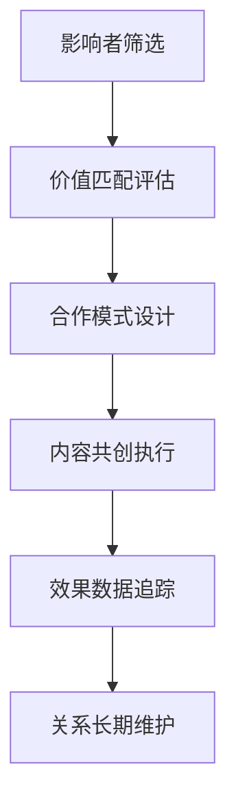

# Influencer营销

## 📋 知识框架总览



---

## 🎯 核心理念

**Influencer营销** = 通过具有影响力的关键意见领袖进行品牌传播和消费引导的营销策略。

**核心价值**：借助影响力者的信任背书和粉丝基础，实现精准圈层营销和高转化率

---

## 🏗️ 知识结构

### 第一层：认知基础

#### 1.1 影响者分级体系

| 影响者级别 | 粉丝规模 | 影响力特征 | 合作成本 | ROI水平 |
|------------|----------|------------|----------|---------|
| **明星级** | 1000万+ | 全民认知 | 超高 | 品牌曝光 |
| **头部KOL** | 100-1000万 | 深度影响 | 很高 | 转化+品牌 |
| **腰部KOL** | 10-100万 | 专业可信 | 中高 | 精准转化 |
| **长尾KOC** | 1-10万 | 真实亲近 | 中低 | 高ROI |

#### 1.2 影响者类型分析

**影响力类型矩阵**

```mermaid
graph TD
    A[影响者类型] --> B[娱乐明星]
    A --> C[垂直专家]
    A --> D[生活方式]
    A --> E[草根达人]
    
    B --> B1[影视明星]
    B --> B2[音乐偶像]
    B --> B3[体育明星]
    B --> B4[综艺艺人]
    
    C --> C1[美妆博主]
    C --> C2[科技评测]
    C --> C3[健身达人]
    C --> C4[育儿专家]
    
    D --> D1[时尚博主]
    D --> D2[旅行达人]
    D --> D3[美食博主]
    D --> D4[家居达人]
    
    E --> E1[普通消费者]
    E --> E2[用户评价】
    E --> E3[朋友圈分享】
    E --> E4[小红书笔记】
```

#### 1.3 影响力营销优势vs挑战

**营销模式对比分析**

| 对比维度 | 传统广告 | 影响力营销 | 优势倍数 | 实施挑战 |
|----------|----------|------------|----------|----------|
| **可信度** | 品牌自说 | 第三方背书 | 5倍+ | 真实性监管 |
| **精准度** | 泛大众化 | 精准粉丝群 | 10倍+ | 匹配度把控 |
| **互动性** | 单向传播 | 双向互动 | 20倍+ | 内容质量控制 |
| **成本效率** | 高频曝光 | 精准触达 | 3-5倍 | ROI测量难度 |

---

### 第二层：理解深化

#### 2.1 影响者筛选评估

**影响力评估模型**

**五维度评估体系**

| 评估维度 | 核心指标 | 权重 | 评估方法 | 应用指导 |
|----------|----------|------|----------|----------|
| **粉丝数量** | 粉丝规模+增长率 | 20% | 平台数据统计 | 触达范围 |
| **粉丝质量** | 活跃率+互动率 | 25% | 互动数据分析 | 真实影响力 |
| **内容匹配** | 品牌调性+专业度 | 30% | 内容分析和定性评估 | 沟通效果 |
| **合作态度** | 配合度+专业度 | 15% | 历史合作经验 | 执行风险 |
| **性价比** | 费用vs预期效果 | 10% | ROI计算分析 | 投入回报 |

#### 2.2 合作模式设计

**合作模式架构**

```mermaid
graph TD
    A[合作模式] --> B[内容创作]
    A --> C[活动参与]
    A --> D[品牌代言]
    A --> E[深度整合"]
    
    B --> B1[内容植入]
    B --> B2[定制创作]
    B --> B3[使用评测]
    B --> B4[教程分享"]
    
    C --> C1[主题活动"]
    C --> C2[线下活动"]
    C --> C3[粉丝见面会"]
    C --> C4[行业大会"]
    
    D --> D1[品牌大使"]
    D --> D2[产品推荐官"]
    D --> D3[形象代言人"]
    D --> D4[长期合作"]
    
    E --> E1[股权合作"]
    E --> E2[联名产品"]
    E --> E3[企业顾问"]
    E --> E4[投资人关系"]
```

#### 2.3 ROI评估体系

**营销效果量化指标**

| 指标层级 | 核心指标 | 计算公式 | 目标值 | 测量周期 |
|----------|----------|----------|--------|----------|
| **曝光层** | 覆盖人数+触达率 | 触达人/潜在客户×100% | >80% | 即时时 |
| **互动层** | 点赞数+评论数+分享数 | 互动数/曝光数×100% | >10% | 发布后1周 |
| **转化层** | 点击率+转化率 | 转化数/曝光数×100% | >3% | 发布后2周 |
| **商业层** | ROI+成本效益 | (收入-成本)/成本×100% | >300% | 发布后1月 |

---

### 第三层：应用实战

#### 3.1 影响力营销策略

**矩阵化营销策略**

**策略组合优化**

| 策略类型 | 适用场景 | 合作对象 | 预期效果 | 实施难度 |
|----------|----------|----------|----------|----------|
| **明星代言** | 品牌提升+市场开拓 | 头部明星 | 知名度提升50%+ | 难 |
| **专业推荐** | 产品功效+行业认可 | 垂直专家 | 可信度提升40%+ | 中 |
| **种草分享** | 使用体验+购买决策 | 生活方式博主 | 转化率提升30%+ | 易 |
| **KOC传播** | 真实反馈+用户体验 | 普通用户 | 信任度提升60%+ | 易 |

#### 3.2 争议风险管理

**声誉风险管理框架**

```mermaid
graph TD
    A[风险管理] --> B[事前预防]
    A --> C[事中监控]
    A --> D[事后应对"]
    
    B --> B1[背调筛选"]
    B --> B2[合同约束"]
    B --> B3[内容审核"]
    B --> B4[培训教育"]
    
    C --> C1[实时监控"]
    C --> C2[舆情预警"]
    C --> C3[快速响应"]
    C --> C4[危机公关"]
    
    D --> D1[损失评估"]
    D --> D2[处理方案"]
    D --> D3[风险传递"]
    D --> D4[经验总结"]
```

#### 3.3 长期关系维护

**关系管理策略矩阵**

| 关系类型 | 维护策略 | 合作深度 | 续约率目标 | 核心价值 |
|----------|----------|----------|------------|----------|
| **战略伙伴** | 股权+深度合作 | 全面整合 | >90% | 战略协同 |
| **长期合作** | 年度合同+奖励计划 | 定期合作 | >70% | 稳定产出 |
| **项目合作** | 灵活合作+效果激励 | 按需合作 | >50% | 灵活高效 |
| **应急合作** | 短期临时合作 | 一次性合作 | N/A | 快速响应 |

---

## 🎯 刻意练习计划

### 练习1：影响者筛选和评估
**任务**：为品牌筛选和评估适合的影响力者组合
**输出**：评估体系+候选名单+匹配分析+合作建议+预算方案
**评估**：筛选科学性+评估准确性+匹配合理性+方案可执行性

### 练习2：影响力营销campaign执行
**任务**：设计并执行完整的影响力营销campaign
**输出**：campaign方案+执行过程+效果监控+数据复盘+优化建议
**评估**：策略有效性+执行专业性+效果达成度+数据准确性+学习价值

### 练习3：长期关系建设管理
**任务**：建立和维护长期的影响者合作关系
**输出**：关系策略+合作协议+维护计划+效果评估+可持续发展
**评估**：关系建设能力+合作管理效果+长期价值实现+风险控制+规模化发展

---

## 🧩 实战案例分析

### 案例：欧莱雅集团影响力营销成功策略

**企业背景**：全球美妆巨头，成功运用影响力营销实现数字化转型

**影响力营销策略架构**：

1. **分层级合作网络**
   ```
   全球明星 + 本土KOL + 垂直专家 + 长尾KOC = 全域覆盖网络
   ```

2. **精准匹配策略**
   - **品牌匹配**：根据品牌调性匹配不同类型影响者
   - **市场匹配**：不同市场选择本土有影响力的合作对象
   - **产品匹配**：产品特性与影响者专业领域精准对接

3. **创新合作模式**
   - **长期代言**：明星长期品牌形象代言
   - **内容共创**：与KOL共创产品使用内容
   - **培训扶持**：培养新的美妆影响力者
   - **数据驱动**：基于数据分析优化合作策略

4. **效果评估体系**
   ```
   品牌认知度 + 用户互动量 + 销售转化率 + 口碑美誉度 = 综合效果评估
   ```

**关键成功成果**：
- **数字化增长**：数字化渠道营收占比超过50%
- **品牌影响力提升**：全球美妆影响力持续领先
- **销售转化率**：影响力营销转化率比传统广告高300%
- **用户粘性**：品牌用户粘性和复购率显著提升

**核心成功要素**：
- 系统化的影响者筛选和评估体系
- 差异化的合作模式和激励机制
- 完善的数据分析和效果评估
- 持续的关系维护和生态建设
- 灵活的风险管理和危机应对

---

## 🔗 知识连接

**核心关联模块**：
- [[02-直播营销]] - KOL直播带货营销
- [[03-短视频营销]] - 短视频KOL内容营销
- [[04-社群营销]] - 影响者社群化运营
- [[01-私域流量]] - 影响者私域流量建设

---

## 📚 学习检查清单

**基础认知检查**：
- [ ] 理解影响力营销的核心价值和运作机制
- [ ] 掌握不同类型影响者的特征和价值优势
- [ ] 能够识别影响力营销实施的关键成功要素

**深化理解检查**：
- [ ] 能够设计和实施系统化的影响者筛选评估体系
- [ ] 掌握多种合作模式的差异化设计和管理
- [ ] 理解影响力营销ROI评估和风险管理方法

**应用实践检查**：
- [ ] 能够独立策划和执行完整的影响力营销campaign
- [ ] 能够有效管理和优化影响力者合作关系
- [ ] 能够基于数据分析持续优化影响力营销效果

**知识整合检查**：
- [ ] 能够将影响力营销整合到整体营销战略中
- [ ] 能够在实际业务中建立可持续发展的影响力营销生态
- [ ] 能够基于影响力营销洞察指导品牌建设和产品创新

