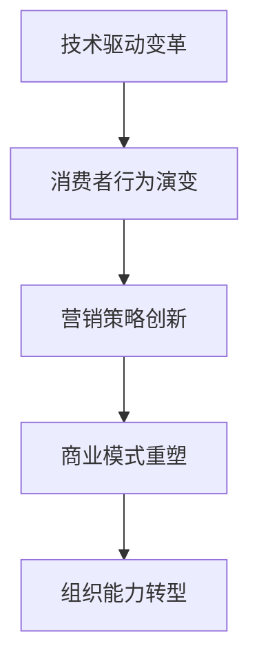

# 营销发展趋势

## 📋 知识框架总览



---

## 🎯 核心理念

**营销发展趋势** = 基于技术进步、消费者行为变化和环境因素，营销行业未来演进的方向和特征。

**核心洞察**：从"营销产品"向"营销体验"转变，从"触达思维"向"联结思维"演进

---

## 🏗️ 知识结构

### 第一层：认知基础

#### 1.1 营销发展趋势维度

| 发展趋势 | 核心特征 | 影响范围 | 演进速度 | 确定性 |
|----------|----------|----------|----------|--------|
| **数字化渗透** | 全流程数字化 | 全域 | 快速 | 高 |
| **个性化定制** | 精准个性化 | 服务模式 | 中速 | 高 |
| **智能化决策** | AI赋能营销 | 决策效率 | 快速 | 高 |
| **体验式营销** | 沉浸式体验 | 客户关系 | 中速 | 中 |
| **可持续发展** | ESG理念融入 | 品牌价值 | 慢速 | 高 |

#### 1.2 驱动趋势的核心力量

**趋势驱动力模型**

```mermaid
graph TD
    A[趋势驱动力] --> B[技术推力]
    A --> C[需求拉力]
    A --> D[环境压力]
    A --> E[竞争压力]
    
    B --> B1[人工智能]
    B --> B2[大数据]
    B --> B3[物联网]
    B --> B4[5G技术"]
    
    C --> C1[消费升级"]
    C --> C2[个性化需求"]
    C --> C3[体验追求"]
    C --> C4[便利性要求"]
    
    D --> D1[政策法规"]
    D --> D2[社会文化"]
    D --> D3[环境保护"]
    D --> D4[隐私保护"]
    
    E --> E1[跨境竞争"]
    E --> E2[新业态冲击"]
    E --> E3[资源稀缺"]
    E --> E4[人才争夺"]
```

#### 1.3 营销发展周期模型

**演进阶段特征**

| 发展阶段 | 特征描述 | 时间跨度 | 核心理念 | 主要挑战 |
|----------|----------|----------|----------|----------|
| **传统营销** | 产品为中心 | 1980-2000 | 销售推广 | 效率低下 |
| **数字营销** | 渠道数字化 | 2000-2020 | 精准触达 | 隐私保护 |
| **智能营销** | AI驱动决策 | 2020-2030 | 预测洞察 | 算法透明 |
| **生态营销** | 价值共创 | 2030-2040 | 可持续发展 | 治理复杂性 |

---

### 第二层：理解深化

#### 2.1 数字化转型趋势

**营销数字化转型全景图**

**数字化演进路径**

```mermaid
graph LR
    A[线下营销] --> B[线上营销]
    B --> C[数字化营销]
    C --> D[智能化营销]
    D --> E[生态化营销]
    
    A1[传统媒体+渠道] --> A
    B1[网站+邮件+社交媒体] --> B
    C1[数据+分析+自动化] --> C
    D1[AI+机器学习+预测】--> D
    E1[平台+生态+价值共创"]--> E
```

**数字化转型关键领域**

| 转型领域 | 转型深度 | 技术支撑 | 变革周期 | ROI预期 |
|----------|----------|----------|----------|---------|
| **客户触达** | 全域数字化 | CRM+CDP+MA | 1-2年 | 成本-30% |
| **内容创作** | AI辅助创作 | NLP+计算机视觉 | 2-3年 | 效率+50% |
| **营销决策** | 数据驱动 | 商业智能+AI | 2-4年 | 准确性+40% |
| **客户服务** | 智能化服务 | 客服机器人+NLP | 1-3年 | 满意度+25% |

#### 2.2 消费行为演变趋势

**新一代消费者特征**

**消费行为演进模型**

```mermaid
graph TD
    A[消费行为变化] --> B[价值追求]
    A --> C[体验要求"]
    A --> D[互动偏好"]
    A --> E[社会责任"]
    
    B --> B1[功能价值→情感价值"]
    B --> B2[产品价值→体验价值"]
    B --> B3[个人价值→社会价值"]
    
    C --> C1[被动接受→主动参与"]
    C --> C2[线下体验→沉浸体验"]
    C --> C3[单次体验→持续体验"]
    
    D --> D1[单向沟通→双向互动"]
    D --> D2[标准化→个性化"]
    D --> D3[即时消费→长期关系"]
    
    E --> E1[经济诉求→环保理念"]
    E --> E2[品牌追随→价值观匹配"]
    E --> E3[个人利益→公共利益"]
```

#### 2.3 商业模式创新趋势

**商业模式演进方向**

**新商业模式矩阵**

| 商业模式 | 核心特征 | 适用行业 | 盈利机制 | 发展成熟度 |
|----------|----------|----------|----------|------------|
| **订阅经济** | 持续付费服务 | SaaS+媒体+教育 | 月费/年费 | 成熟 |
| **平台经济** | 撮合交易服务 | 电商+出行+住宿 | 佣金+广告 | 成熟 |
| **共享经济** | 资源共享利用 | 出行+办公+工具 | 按使用付费 | 发展中 |
| **循环经济** | 可持续发展 | 时尚+电子+包装 | 回收+再利用 | 新兴 |

---

### 第三层：应用实战

#### 3.1 营销战略前瞻规划

**基于趋势的战略规划框架**

**战略规划五步法**

| 规划步骤 | 核心任务 | 关键工具 | 成功标准 | 时间周期 |
|----------|----------|----------|----------|----------|
| **趋势分析** | 识别关键趋势 | PEST+趋势分析 | 趋势识别准确度90%+ | 3-6个月 |
| **影响评估** | 评估趋势影响 | 影响矩阵+SWOT | 影响评估全面性 | 1-3个月 |
| **机会识别** | 发现新机会 | 机会地图+可行性分析 | 机会质量评分 | 1-2个月 |
| **战略制定** | 制定前瞻策略 | 战略画布+路线图 | 策略可行性验证 | 2-4个月 |
| **执行规划** | 制定实施计划 | 项目计划+资源配置 | 执行可操作性 | 1-3个月 |

#### 3.2 组织能力建设

**未来营销组织能力模型**

```mermaid
graph TD
    A[营销组织能力] --> B[数据能力]
    A --> C[技术能力"]
    A --> D[创新能力"]
    A --> E[协作能力']
    
    B --> B1[数据收集分析']
    B --> B2[洞察挖掘应用"]
    B --> B3[预测决策支撑"]
    
    C --> C1[工具平台应用']
    C --> C2[技术趋势跟踪"]
    C --> C3[技术合作整合"]
    
    D --> D1[创新文化氛围"]
    D --> D2[实验试错机制"]
    D --> D3[持续学习能力"]
    
    E --> E1[跨部门协作"]
    E --> E2[生态伙伴合作"]
    E --> E3[敏捷响应能力']
```

#### 3.3 技术前瞻布局

**关键技术应用时间表**

**技术成熟度评估**

| 技术类别 | 当前成熟度 | 预测商用时间 | 营销应用场景 | 投资优先级 |
|----------|------------|--------------|--------------|------------|
| **AI生成内容** | 快速发展 | 1-2年 | 内容自动化创作 | 高 |
| **元宇宙营销** | 概念阶段 | 3-5年 | 沉浸式品牌体验 | 中 |
| **边缘计算** | 技术成熟 | 2-3年 | 实时营销决策 | 高 |
| **区块链营销** | 早期应用 | 5-7年 | 透明化广告投放 | 低 |

---

## 🎯 刻意练习计划

### 练习1：营销趋势前瞻分析
**任务**：针对特定行业进行5年营销发展趋势分析
**输出**：趋势分析报告+影响评估+机会识别+战略建议
**评估**：分析深度+前瞻准确性+战略价值+实施可行性

### 练习2：数字化转型规划
**任务**：为企业制定营销数字化转型路线图
**输出**：转型规划+技术选型+实施计划+投资评估+风险评估
**评估**：规划完整性+技术先进性+实施可操作性+ROI合理性+风险可控性

### 练习3：未来商业模式设计
**任务**：设计适应未来趋势的新营销商业模式
**输出**：商业模式画布+竞争优势分析+实施路径+投资回报+风险控制
**评估**：模式创新性+市场适应性+盈利可持续性+实施复杂性+抗风险能力

---

## 🧩 实战案例分析

### 案例：Netflix数字化转型成功经验

**企业背景**：传统影视租赁公司成功转型为全球领先的流媒体平台

**转型过程与关键转折点**：

**第一阶段：线下到线上转型（1999-2007）**
- **识别趋势**：互联网和DVD技术的兴起
- **商业模式**：线上订阅+DVD邮递服务
- **关键决策**：全面转向线上订阅模式

**第二阶段：内容数字化分发（2007-2013）**
- **技术驱动**：流媒体技术成熟
- **用户体验**：即时观看+无限选择
- **竞争优势**：技术和数据驱动的内容推荐

**第三阶段：原创内容制作者（2013-至今）**
- **战略升级**：从渠道商到内容创造者
- **数据驱动**：基于用户数据的内容投资决策
- **全球化**：快速扩展到全球市场

**关键成功要素**：
1. **前瞻性趋势识别**：技术趋势+用户需求变化预判
2. **快速战略调整**：灵活适应市场变化
3. **数据驱动决策**：用户行为数据指导战略
4. **组织能力建设**：技术创新、内容创作、全球化能力

**转型成果**：
- **用户规模**：全球2.3亿付费用户
- **市值增长**：从传统业务到2800亿美元市值
- **创新引领**：重新定义娱乐内容消费模式
- **规模效应**：边际成本递减的商业模式

**启示**：
- 对趋势的敏感度和洞察力是企业转型的关键
- 技术驱动的商业模式创新能创造巨大价值
- 数据资产将成为未来的核心竞争力
- 组织学习适应能力是可持续发展的基础

---

## 🔗 知识连接

**核心关联模块**：
- [[02-消费者行为变化]] - 消费者行为演变趋势分析
- [[03-营销技术演进]] - 营销技术发展前沿
- [[04-营销模式创新]] - 营销模式创新实践
- [[01-营销总览]] - 营销发展趋势整体认知

**技能拓展路径**：
1. [[08-营销创新趋势/01-新兴技术]] - 新兴技术在营销中的应用
2. [[09-营销工具资源]] - 未来营销工具和技术资源
3. [[04-营销策略制定]] - 基于趋势的营销策略设计
4. [[05-营销执行实施]] - 未来营销执行实施方法

---

## 📚 学习检查清单

**基础认知检查**：
- [ ] 理解营销发展趋势的核心驱动力和演进规律
- [ ] 掌握数字化、个性化、智能化等关键趋势特征
- [ ] 能够识别营销商业模式创新的主要方向

**深化理解检查**：
- [ ] 能够分析消费者行为变化对营销策略的影响
- [ ] 掌握基于趋势的战略规划方法和工具
- [ ] 理解营销组织能力建设的关键维度

**应用实践检查**：
- [ ] 能够进行前瞻性的营销趋势分析和影响评估
- [ ] 能够制定基于趋势的营销数字化转型规划
- [ ] 能够设计适应未来发展的创新商业模式

**知识整合检查**：
- [ ] 能够将趋势洞察与具体营销实践有机结合
- [ ] 能够在实际业务中建立持续的趋势跟踪和能力建设机制
- [ ] 能够基于趋势分析指导长期战略决策和组织发展
