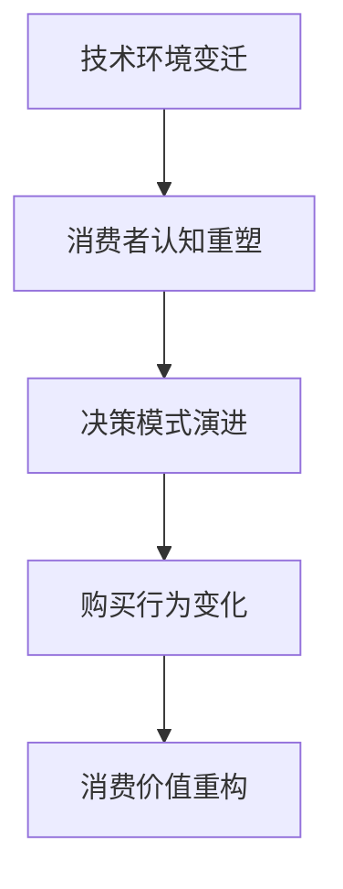

# 消费者行为变化

## 📋 知识框架总览



---

## 🎯 核心理念

**消费者行为变化** = 在社会经济、技术进步、文化环境等因素综合作用下，消费者的认知、态度、决策和购买行为发生系统性演进的趋势。

**核心价值**：深度理解消费者变化规律，为营销策略创新提供根本指导

---

## 🏗️ 知识结构

### 第一层：认知基础

#### 1.1 消费者行为变化维度

| 变化维度 | 核心特征 | 演进趋势 | 营销影响 | 应对策略 |
|----------|----------|----------|----------|----------|
| **信息获取** | 被动接受到主动搜索 | 全渠道信息整合 | 内容营销重要性提升 | 建立权威信息源 |
| **决策参与** | 个人决策到社会化决策 | 群体智慧驱动 | 社区营销价值凸显 | 品牌社区建设 |
| **价值追求** | 功能价值到情感/社会价值 | 多元价值并存 | 品牌故事化需求 | 情感化品牌塑造 |
| **消费体验** | 交易导向到关系导向 | 全生命周期体验 | 客户体验管理 | 全方位体验设计 |

#### 1.2 消费者世代对比分析

**世代特征差异矩阵**

```mermaid
graph TD
    A[消费者世代] --> B[X世代]
    A --> C[Y世代千禧一代]
    A --> D[Z世代Gen Z]
    A --> E[Alpha世代"]
    
    B --> B1[1965-1980出生"]
    B --> B2[传统+数字混合"]
    B --> B3[品牌忠诚度高"]
    
    C --> C1[1981-1996出生"]
    C --> C2[数字化原住民"]
    C --> C3[体验个性化需求"]
    
    D --> D1[1997-2012出生"]
    D --> D2[移动社交一代"]
    D --> D3[社会意识强"]
    
    E --> E1[2013+出生"]
    E --> E2[AI时代原住民"]
    E --> E3[可持续消费理念"]
```

#### 1.3 消费环境影响因素

**PESTEL分析框架**

| 环境因素 | 具体影响 | 变化趋势 | 消费者行为变化 | 营销策略调整 |
|----------|----------|----------|-----------------|--------------|
| **技术环境** | 数字化生活方式 | 快速演进 | 即时性+便利性需求 | 数字体验优化 |
| **经济环境** | 收入结构变化 | 中等收入群体扩大 | 品质消费升级 | 差异化定位 |
| **社会环境** | 社会价值观多元 | 个性化+包容性 | 身份认同需求 | 价值观营销 |
| **文化环境** | 全球化+本土化 | 文化融合 | 文化认同消费 | 本土化策略 |
| **法律环境** | 消费者保护加强 | 隐私权利重视 | 透明化需求 | 合规营销
| **环境因素** | 可持续发展理念 | ESG标准 | 环境保护意识 | 绿色营销 |

---

### 第二层：理解深化

#### 2.1 数字化消费行为模式

**全渠道消费行为路径**

**数字化行为特征**

```mermaid
graph LR
    A[认知阶段] --> B[兴趣阶段]
    B --> C[考虑阶段]
    C --> D[购买阶段"]
    D --> E[使用阶段"]
    E --> F[分享阶段"]
    
    A1[搜索发现] --> A
    B1[内容消费] --> B
    C1[对比评测] --> C
    D1[多渠道比价"] --> D
    E1[体验反馈"] --> E
    F1[社交分享"] --> F
```

**跨渠道行为特征**

| 购买阶段 | 传统行为 | 数字化行为 | 营销触点 | 优化策略 |
|----------|----------|------------|----------|----------|
| **认知发现** | 广告印象 | 主动搜索+算法推荐 | 搜索引擎+社交媒体 | SEO+内容营销 |
| **考虑评估** | 门店体验 | 在线对比+用户评价 | 电商平台+评测网站 | 评价管理+对比分析 |
| **购买决策** | 单渠道购买 | 全渠道比价+O2O | 线上线下整合 | 全渠道一致性 |
| **后续互动** | 有限联系 | 持续数字化交互 | APP+小程序+社群 | 数字化会员服务 |

#### 2.2 社会化消费行为

**社会化决策影响因素**

**社交影响力矩阵**

| 影响类型 | 影响者来源 | 影响强度 | 营销应用 | 控制可行性 |
|----------|------------|----------|----------|------------|
| **专业影响力** | KOL+行业专家 | 高 | 专业背书营销 | 中 |
| **同伴影响力** | 朋友+同事+同龄人 | 很高 | 用户推荐+社群营销 | 低 |
| **网络口碑** | 在线评价+讨论 | 中高 | 口碑管理+舆情监控 | 中 |
| **算法推荐** | 平台算法+个性化 | 高 | 精准广告+算法优化 | 高 |

#### 2.3 可持续消费行为

**绿色消费行为驱动因素**

**环保消费决策模型**

```mermaid
graph TD
    A[环保消费动机] --> B[环境意识"]
    A --> C[社会责任"]
    A --> D[健康考虑"]
    A --> E[经济理性"]
    
    B --> B1[环境问题认知"]
    B --> B2[环保知识了解"]
    B --> B3[环保能力感知"]
    
    C --> C1[社会规范压力"]
    C --> C2[道德责任感"]
    C --> C3[群体认同感"]
    
    D --> D1[健康风险感知"]
    D --> D2[自我健康关注"]
    D --> D3[家人健康考虑"]
    
    E --> E1[长期成本考虑"]
    E --> E2[节能效率需求"]
    E --> E3[性价比评估"]
```

---

### 第三层：应用实战

#### 3.1 消费者行为洞察方法

**行为数据收集策略**

**多渠道数据整合**

| 数据来源 | 数据类型 | 收集方式 | 分析价值 | 隐私考虑 |
|----------|----------|----------|----------|----------|
| **线上行为** | 点击+浏览+搜索 | 网站分析+广告追踪 | 精准画像+行为预测 | Cookie+同意管理 |
| **社交数据** | 分享+评论+互动 | 社交媒体监控 | 情感分析+影响传播 | 用户授权+公开数据 |
| **购买数据** | 交易+偏好+RFM | CRM+电商平台 | 价值评估+个性化 | 消费者权益保护 |
| **调研数据** | 态度+偏好+动机 | 问卷+访谈+焦点小组 | 深度洞察+根因分析 | 知情同意+匿名化 |

#### 3.2 个性化营销策略

**消费者行为预测模型**

**个性化程度递进**

```mermaid
graph LR
    A[标准化营销] --> B[基于分群营销]
    B --> C[基于标签营销]
    C --> D[基于个体营销]]
    D --> E[基于情境营销]
    
    A1[大众市场"] --> A
    B1[细分市场"] --> B
    C1[精准分群"] --> C
    D1[个人定制"] --> D
    E1[实时情境"] --> E
```

#### 3.3 消费者体验优化

**消费者旅程全接触点管理**

**体验优化关键要素**

| 接触点 | 体验要素 | 消费者期望 | 体验设计原则 | 成功指标 |
|--------|----------|------------|--------------|----------|
| **网上搜索** | 信息易找+相关性 | 快速准确结果 | 简洁+相关+便捷 | 搜索成功率95%+ |
| **产品浏览** | 详细+真实信息 | 充分了解产品 | 全面+真实+吸引 | 页面停留时间+转化率 |
| **购买过程** | 流畅+安全+灵活 | 简单快速完成 | 简化+信任+选择 | 退出率<30% |
| **售后服务** | 及时+专业+人性 | 快速满意解决 | 快速+专业+贴心 | 满意度90%+ |

---

## 🎯 刻意练习计划

### 练习1：消费者行为调研分析
**任务**：深度调研目标消费者的行为变化趋势
**输出**：调研方案+数据分析+洞察报告+营销建议+实施方案
**评估**：调研深度+数据分析准确性+洞察价值+策略可行性+实施效果

### 练习2：个性化消费体验设计
**任务**：基于消费者行为洞察设计个性化体验方案
**输出**：体验设计+技术方案+实施计划+效果预测+优化迭代
**评估**：体验创新性+个性化程度+技术可行性+商业价值+持续优化

### 练习3：数字化消费行为预测
**任务**：构建消费者行为预测模型并应用于营销实践
**输出**：预测模型+应用场景+实施效果+价值评估+改进建议
**评估**：模型准确性+预测价值+应用效果+业务影响+技术先进性

---

## 🧩 实战案例分析

### 案例：ZARA快时尚消费者行为洞察与应对

**企业背景**：全球快时尚巨头，面对消费者行为变化的市场挑战

**消费者行为变化识别**：

**传统快时尚消费者特征**：
- 追求低价和时尚
- 购买决策基于价格和外观：
- 较少考虑品质和可持续性
- 冲动性购买倾向

**新一代消费者变化**：
1. **价值观驱动**：可持续发展意识觉醒，关注环保和社会责任
2. **品质要求提升**：从低价导向转向品质+价格平衡
3. **个性化需求**：不再满足于标准化产品，寻求独特表达
4. **数字化习惯**：全数字化购物体验，高度依赖移动端
5. **社会影响力增大**：品牌价值观匹配度影响购买决策

**ZARA的应对策略**：

1. **可持续时尚转型**
   ```
   Join Life环保系列 + 闭环回收计划 + 可持续材料使用 = 绿色时尚品牌
   ```

2. **数字化体验优化**
   - **移动优先**：优化移动端购物体验
   - **数据驱动**：基于消费数据的精准营销
   - **社交媒体整合**：instagram等平台深度整合

3. **快速响应机制**
   - 从设计到上架周期缩短至2-3周
   - 小批量快速试错机制
   - 实时市场反馈调整产品

4. **个性化服务**
   - AI驱动的个性化推荐
   - 定制化购物体验
   - 线上线下无缝连接

**关键成果与挑战**：
**成功方面**：
- 快速适应消费者变化，保持市场份额领先
- 可持续发展策略获得消费者认可
- 数字化能力建设保持竞争优势

**面临挑战**：
- 成本控制与可持续发展平衡
- 个性化与规模化效率矛盾
- 新兴竞争对手的冲击

**启示**：
- 消费者行为变化是企业战略调整的重要信号
- 价值观营销将成为差异化竞争的关键
- 数字化转型是应对消费者行为变化的必然选择
- 快速响应能力是企业竞争优势的重要来源

---

## 🔗 知识连接

**核心关联模块**：
- [[01-营销发展趋势]] - 消费者变化驱动的营销趋势
- [[03-消费者心理学]] - 消费者心理变化分析
- [[01-营销数据分析]] - 消费者行为数据分析
- [[02-客户关系管理]] - 基于行为变化的客户关系管理

**技能拓展路径**：
1. [[04-营销策略制定/01-市场分析]] - 基于消费者行为的市场分析
2. [[05-营销执行实施/03-客户管理]] - 个性化客户体验设计
3. [[08-营销创新趋势/01-新兴技术]] - 技术驱动的行为洞察
4. [[09-营销工具资源]] - 消费者行为分析工具和方法

---

## 📚 学习检查清单

**基础认知检查**：
- [ ] 理解消费者行为变化的根本驱动力和演进规律
- [ ] 掌握不同消费者世代的特征差异和行为模式
- [ ] 能够识别环境变化对消费者行为的具体影响

**深化理解检查**：
- [ ] 能够分析数字化和社会化对消费行为的深层影响
- [ ] 掌握消费者行为洞察的方法和分析工具
- [ ] 理解个性化和体验化营销的设计原理

**应用实践检查**：
- [ ] 能够进行深度的消费者行为调研和分析
- [ ] 能够设计基于行为洞察的个性化营销策略
- [ ] 能够构建消费者行为预测模型并应用实践

**知识整合检查**：
- [ ] 能够将消费者行为洞察与营销策略制定有机结合
- [ ] 能够在实际业务中建立持续的行为洞察和分析能力
- [ ] 能够基于消费者行为变化指导产品创新和营销创新
