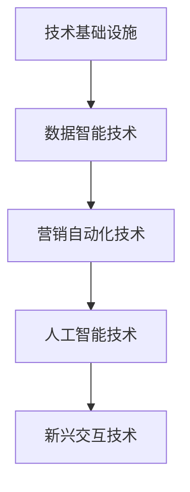

# 营销技术演进

## 📋 知识框架总览



---

## 🎯 核心理念

**营销技术演进** = 以技术为核心驱动力，营销工具、平台和方法不断创新迭代，推动营销效率和质量提升的技术发展轨迹。

**核心价值**：技术赋能营销，实现自动化、智能化、个性化的营销创新

---

## 🏗️ 知识结构

### 第一层：认知基础

#### 1.1 营销技术发展历程

| 发展阶段 | 时间周期 | 核心技术 | 营销能力 | 应用特征 |
|----------|----------|----------|----------|----------|
| **传统营销** | 1990-2000 | 基础数字化 | CRM+邮件+网站 | 手工操作 |
| **互联网营销** | 2000-2010 | 搜索引擎+社交媒体 | SEO+SEM+Social | 初步自动化 |
| **数字营销** | 2010-2020 | 大数据+云服务 | 分析平台+DMP | 数据驱动 |
| **智能营销** | 2020-至今 | AI+机器学习 | 智能决策+预测 | 高度自动化 |
| **全域营销** | 未来展望 | 物联网+区块链 | 全场景智能 | 生态化运营 |

#### 1.2 营销技术栈架构

**MarTech技术生态系统**

```mermaid
graph TD
    A[MarTech生态] --> B[数据层]
    A --> C[应用层]
    A --> D[交互层]
    A --> E[分析层"]
    
    B --> B1[数据收集]
    B --> B2[数据治理]
    B --> B3[数据平台]
    B --> B4[数据安全"]
    
    C --> C1[营销自动化"]
    C --> C2[客户关系管理"]
    C --> C3[内容管理系统"]
    C --> C4[电商平台系统"]
    
    D --> D1[网站优化工具"]
    D --> D2[社交媒体管理"]
    D --> D3[广告投放平台"]
    D --> D4[客户服务系统"]
    
    E --> E1[数据分析平台"]
    E --> E2[商业智能工具"]
    E --> E3[预测分析模型"]
    E --> E4[实时决策引擎"]
```

#### 1.3 技术演进驱动力

**技术创新驱动因素**

| 驱动力类型 | 核心要素 | 技术影响 | 演进速度 | 未来趋势 |
|------------|----------|----------|----------|----------|
| **计算效率** | 算力+算法+存储 | 数据处理能力 | 指数增长 | 边缘计算+量子计算 |
| **网络通信** | 5G+WiFi6+物联网 | 实时互联能力 | 高速发展 | 6G+卫星互联网 |
| **人工智能** | 机器学习+深度学习 | 智能化水平 | 快速迭代 | AGI+强化学习 |
| **数据价值** | 大数据+隐私保护 | 洞察深度 | 监管影响 | 联邦学习+隐私计算 |

---

### 第二层：理解深化

#### 2.1 核心营销技术分类

**技术分类体系**

**营销自动化技术演进**

```mermaid
graph LR
    A[简单自动化] --> B[规则引擎化"]
    B --> C[机器学习化"]
    C --> D[深度学习化"]
    D --> E[自主智能化"]
    
    A1[邮件自动发送"] --> A
    B1[条件触发+规则执行"] --> B
    C1[算法推荐+个性化"] --> C
    D1[图像识别+自然语言"] --> D
    E1[自主决策+持续学习"] --> E
```

**关键技术应用场景**

| 技术类别 | 核心技术 | 营销应用场景 | 成熟度 | 投资性价比 |
|----------|----------|--------------|--------|------------|
| **数据处理** | CDP+实时计算 | 客户全景画像 | 高 | 很高 |
| **个性化推荐** | 机器学习算法 | 精准内容推送 | 高 | 很高 |
| **营销自动化** | 工作流引擎 | 客户生命周期管理 | 高 | 高 |
| **智能客服** | NLP+知识图谱 | 多渠道客户服务 | 中高 | 高 |
| **内容生成** | GPT+图像生成 | 营销内容自动化 | 中 | 中 |

#### 2.2 AI在营销中的应用

**人工智能营销应用矩阵**

**AI能力层级递进**

```mermaid
graph TD
    A[AI营销应用] --> B[感知层]
    A --> C[认知层"]
    A --> D[决策层"]
    A --> E[创造层"]
    
    B --> B1[图像识别"]
    B --> B2[语音识别"]
    B --> B3[文本理解"]
    B --> B4[情感分析"]
    
    C --> C1[用户画像"]
    C --> C2[需求预测"]
    C --> C3[行为分析"]
    C --> C4[趋势洞察】
    
    D --> D1[自动决策"]
    D --> D2[策略优化"]
    D --> D3[智能定价"]
    D --> D4[风险控制"]
    
    E --> E1[内容生成"]
    E --> E2[创意设计"]
    E --> E3[代码生成"]
    E --> E4[解决方案"
```

#### 2.3 新兴营销技术

**前沿技术发展预测**

| 新兴技术 | 发展阶段 | 营销潜力 | 商业化时间 | 投资建议 |
|----------|----------|----------|------------|----------|
| **元宇宙营销** | 概念验证 | 沉浸式体验 | 3-5年 | 关注+试点 |
| **区块链广告** | 早期应用 | 透明化投放 | 2-4年 | 重点布局 |
| **边缘AI** | 技术成熟 | 实时决策 | 1-3年 | 尽快实施 |
| **数字人营销** | 快速发展 | 虚拟形象 | 2-3年 | 适度投入 |
| **Web3.0营销** | 概念阶段 | 去中心化 | 5-7年 | 跟踪关注 |

---

### 第三层：应用实战

#### 3.1 营销技术选型策略

**技术选型评估框架**

**技术ROI评估模型**

| 评估维度 | 权重 | 评估要点 | 量化方法 | 决策标准 |
|----------|------|----------|----------|----------|
| **业务匹配度** | 30% | 解决核心痛点 | 需求满足度评分 | 80分以上 |
| **技术成熟度** | 25% | 稳定性+可靠性 | 市场验证程度 | 商业应用2年+ |
| **集成难度** | 20% | 与现有系统兼容 | 接口数量+开发成本 | 成本在预算内 |
| **投资回报** | 25% | ROI+投资回收期 | 量化效果估算 | ROI>200% |

#### 3.2 营销技术实施路径

**技术实施里程碑**

**分阶段推进策略**

```mermaid
graph LR
    A[技术规划] --> B[搭建基础]
    B --> C[应用扩展"]
    C --> D[深度集成"]
    D --> E[智能升级"]
    
    A1[需求分析+技术选型"] --> A
    B1[数据整合+基础平台"] --> B
    C1[核心应用+标准化"] --> C
    D1[跨系统集成+优化"] --> D
    E1[AI赋能+自主决策"] --> E
```

#### 3.3 营销技术创新管理

**技术团队建设框架**

**技术队伍建设要素**

| 能力层级 | 人员角色 | 核心技能 | 人员需求 | 培养周期 |
|----------|----------|----------|----------|----------|
| **技术架构** | CTO+架构师 | 系统设计+技术选型 | 2-3人 | 3-5年经验 |
| **数据科学** | 数据科学家+分析师 | 分析建模+算法应用 | 5-8人 | 2-4年经验 |
| **AI工程师** | AI工程师+算法专家 | 机器学习+深度学习 | 3-5人 | 2-3年经验 |
| **营销技术** | 营销技术专家 | 营销自动化+工具应用 | 10-15人 | 1-3年经验 |

---

## 🎯 刻意练习计划

### 练习1：营销技术栈设计与规划
**任务**：为企业设计完整的营销技术架构和实施路线图
**输出**：技术方案+平台选型+实施计划+投资预算+风险控制+成功评估
**评估**：技术先进性+架构合理性+方案完整性+投资性价比+实施可操作性

### 练习2：AI营销应用场景开发
**任务**：开发具体的AI在营销中的应用场景和解决方案
**输出**：AI应用场景+技术方案+实施过程+效果验证+优化迭代+规模推广
**评估**：场景创新性+技术可行性+效果显著+商业价值+可复制推广

### 练习3：营销技术创新与未来布局
**任务**：研究前瞻性营销技术并进行创新探索
**输出**：技术研究+创新方案+试点项目+效果验证+投资建议+发展战略
**评估**：技术前瞻+创新价值+试点成功+市场潜力+投资合理性+战略价值

---

## 🧩 实战案例分析

### 案例：Amazon AI营销技术生态构建

**企业背景**：全球电商巨头，在AI驱动的营销技术创新方面持续领先

**技术演进历程与核心成就**：

**第一阶段：数据基础设施建立（2000-2010）**
- **核心建设**：大规模分布式计算平台
- **数据基础**：用户行为数据+交易数据+内容数据
- **关键成果**：建立了全球最大的电商数据仓库之一

**第二阶段：推荐算法创新（2010-2015）**
- **技术突破**：协同过滤+内容推荐算法
- **产品应用**：个性化推荐系统
- **商业成果**：推荐系统贡献了35%的商品销售

**第三阶段：深度学习应用（2015-2020）**
- **技术升级**：深度学习+神经网络推荐
- **智能功能**：图像识别+语音助手+智能客服
- **竞争优势**：AI能力成为核心差异化优势

**第四阶段：全域智能营销（2020至今）**
- **生态整合**：AI+云计算+IoT+边缘计算
- **全链路智能**：从算法推荐到物流预测的全链路AI
- **商业创新**：无人零售+预测性库存+自动驾驶配送

**核心技术创新与营销应用**：

1. **深度学习推荐系统**
   ```
   用户画像 + 商品特征 + 实时行为 + 深度学习算法 = 高度个性化推荐
   ```

2. **AI驱动的广告投放**
   - 智能出价：机器学习优化的广告竞价
   - 精准定向：AI优化的人群定向策略
   - 创意优化：AI生成和优化的广告创意

3. **语音智能营销**
   - Alexa语音助手成为新的营销触点
   - 语音购物和智能家居营销
   - 基于语音交互的个性化服务

4. **图像识别营销**
   - Amazon Go的计算机视觉零售
   - 图像搜索和商品识别
   - AR/VR购物体验技术

**关键成功要素**：
- **技术创新驱动**：持续投入AI研发，技术领先
- **数据资产积累**：海量数据为AI算法提供训练基础
- **产品与AI整合**：AI技术深度融入核心产品和服务
- **开放生态建设**：AWS让AI能力对外输出，形成生态

**技术演进启示**：
- AI营销技术需要长周期投入和持续创新
- 数据资产是AI营销技术发展的核心基础
- 技术与业务的深度融合是成功的关键
- 开放生态能够放大技术创新的商业价值

**投资与ROI**：
- **AI研发投入**：年投入数百亿美元
- **技术创新产出**：多项AI技术全球领先
- **商业价值创造**：AI驱动的业务增长贡献巨大
- **生态价值**：技术平台化带来的长期收益

---

## 🔗 知识连接

**核心关联模块**：
- [[01-营销发展趋势]] - 技术驱动的营销发展趋势
- [[02-消费者行为变化]] - 技术对消费者行为的影响
- [[04-营销模式创新]] - 技术驱动的营销模式创新
- [[01-AI营销应用]] - AI技术在营销中的具体应用

**技能拓展路径**：
1. [[08-营销创新趋势/01-新兴技术]] - 新兴技术在营销中的应用
2. [[09-营销工具资源/01-营销工具]] - 营销技术工具和平台选择
3. [[06-营销效果评估/02-数据分析]] - 数据技术驱动的营销分析
4. [[04-营销策略制定]] - 基于技术能力的营销策略创新

---

## 📚 学习检查清单

**基础认知检查**：
- [ ] 理解营销技术演进的核心脉络和发展规律
- [ ] 掌握MarTech技术生态系统的基本架构
- [ ] 能够识别不同营销技术的成熟度和应用价值

**深化理解检查**：
- [ ] 能够分析AI等核心技术在营销中的应用场景和价值
- [ ] 掌握营销技术选型和实施的系统方法
- [ ] 理解新兴营销技术的发展趋势和商业潜力

**应用实践检查**：
- [ ] 能够设计完整的营销技术架构和实施计划
- [ ] 能够开发和实施AI驱动的营销创新应用
- [ ] 能够进行前瞻性的营销技术研究和创新探索

**知识整合检查**：
- [ ] 能够将营销技术发展与应用实践有机结合
- [ ] 能够在实际业务中建立持续的技术创新能力
- [ ] 能够基于技术演进指导营销战略和技术投资决策
