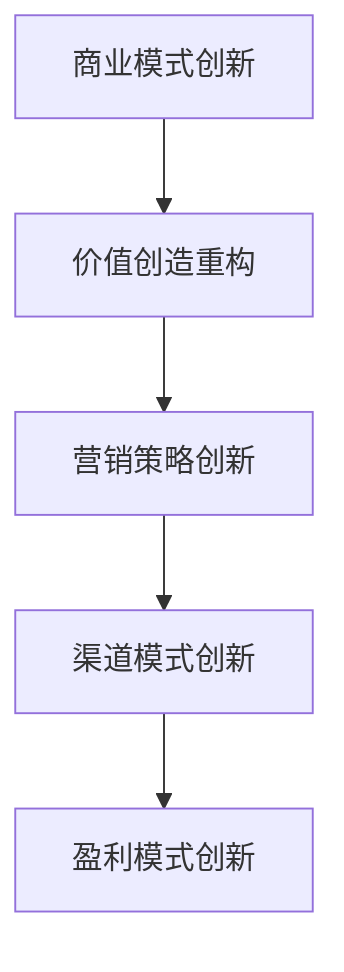

# 营销模式创新

## 📋 知识框架总览



---

## 🎯 核心理念

**营销模式创新** = 基于新的技术、消费者需求和市场竞争环境，对传统营销思维、方法和实践进行系统性革新，创造新的营销价值和竞争优势。

**核心价值**：通过模式创新驱动营销效率提升、成本优化和价值创造，获得差异化竞争优势

---

## 🏗️ 知识结构

### 第一层：认知基础

#### 1.1 营销模式创新维度

| 创新维度 | 核心变化 | 主要驱动因素 | 创新影响 | 成功要素 |
|----------|----------|--------------|----------|----------|
| **价值主张** | 从产品营销到体验营销 | 消费者主权崛起 | 差异化程度提升 | 价值定义精准 |
| **营销渠道** | 从单渠道到全渠道 | 数字化技术普及 | 触达效率倍增 | 渠道整合协同 |
| **内容策略** | 从广告到内容 | 内容为王时代 | 用户参与度提升 | 内容质量与相关性 |
| **数据驱动** | 从经验到数据 | 大数据+AI技术 | 决策精准度提升 | 数据资产化 |
| **生态系统** | 从竞争到协同 | 平台经济兴起 | 生态价值放大 | 伙伴关系管理 |

#### 1.2 营销模式演进路径

**模式进化阶段模型**

```mermaid
graph LR
    A[传统营销] --> B[数字化营销"]
    B --> C[智能营销"]
    C --> D[生态营销"]
    D --> E[可持续营销"]
    
    A1[4P理论】 --> A
    B1[多渠道+数据分析】 --> B
    C1[AI+个性化】 --> C
    D1[平台+生态+协同】 --> D
    E1[ESG+社会价值】 --> E
```

#### 1.3 创新驱动因素分析

**营销创新影响因素**

| 驱动因素 | 影响程度 | 变化速度 | 对营销的影响 | 创新机会 |
|----------|----------|----------|--------------|----------|
| **技术驱动** | 高 | 快 | 营销工具+效率革命 | 智能化+自动化 |
| **消费者变化** | 很高 | 中 | 需求+行为重塑 | 个性化+体验化 |
| **竞争加剧** | 高 | 中 | 差异化要求提升 | 商业模式创新 |
| **社会变迁** | 中 | 慢 | 价值观+标准变化 | ESG+可持续营销 |
| **政策环境** | 中 | 中 | 合规+创新边界 | 合规创新+隐私保护 |

---

### 第二层：理解深化

#### 2.1 核心营销模式分类

**创新模式矩阵**

**营销模式创新类型**

```mermaid
graph TD
    A[营销模式创新] --> B[平台模式"]
    A --> C[订阅模式"]
    A --> D[生态模式"]
    A --> E[体验模式"]"
    
    B --> B1[电商平台"]
    B --> B2[内容平台"]
    B --> B3[服务平台"]
    B --> B4[数据平台"] "
    
    C --> C1[SaaS订阅"]
    C --> C2[内容订阅"]
    C --> C3[服务订阅"]
    C --> C4[硬件订阅"] "
    
    D --> D1[商业生态"]
    D --> D2[技术生态"]
    D --> D3[营销生态"]
    D --> D4[社群生态"] "
    
    E --> E1[沉浸体验"]
    E --> E2[全渠道体验"]
    E --> E3[个性化体验"]
    E --> E4[智能体验"] "
```

#### 2.2 商业模式创新在营销中的应用

**商业画布+营销应用**

**商业模式创新案例**

| 创新模式 | 代表企业 | 核心创新 | 营销特征 | 竞争优势 |
|----------|----------|----------|----------|----------|
| **平台经济** | 阿里巴巴+腾讯 | 连接供需双方 | 网络效应营销 | 低成本获客 |
| **订阅经济** | Netflix+Adobe | 持续服务模式 | 关系型营销 | 客户LTV提升 |
| **共享经济** | Uber+Airbnb | 资源共享利用 | 社区化营销 | 轻资产扩张 |
| **免费模式** | Google+Facebook | 免费+广告变现 | 眼球经济营销 | 规模先于利润 |
| **Freemium** | Slack+Spotify | 免费+付费增值 | 漏斗营销 | 低成本转化 |

#### 2.3 营销技术创新应用

**新技术驱动的营销创新**

**技术革新营销应用**

```mermaid
graph TD
    A[营销技术创新] --> B[AI智能营销"]
    A --> C[VR/AR体验营销"]
    A --> D[区块链营销"]
    A --> E[IoT数据营销"] "
    
    B --> B1[智能客服"]
    B --> B2[个性化推荐"]
    B --> B3[智能创意"]
    B --> B4[预测营销"] "
    
    C --> C1[虚拟试穿"]
    C --> C2[AR购物"]
    C --> C3[沉浸营销"]
    C --> C4[互动体验"] "
    
    D --> D1[透明广告"]
    D --> D2[去中心化营销"]
    D --> D3[数字资产"]
    D --> D4[智能合约"] "
    
    E --> E1[实时数据"]
    E --> E2[场景营销"]
    E --> E3[智能家居营销"]
    E --> E4[车联网营销"] "
```

---

### 第三层：应用实战

#### 3.1 营销模式创新策略

**创新策略规划框架**

**创新策略实施路径**

| 策略层级 | 创新重点 | 实施方法 | 风险控制 | 成功指标 |
|----------|----------|----------|----------|----------|
| **渐进式创新** | 优化现有方法 | 持续改进+测试优化 | 低风险试点 | 效率提升20%+ |
| **突破式创新** | 改变游戏规则 | 颠覆性重新定义 | 小范围验证 | 商业模式重塑 |
| **开放式创新** | 外部创新整合 | 合作+投资+收购 | 合作伙伴关系 | 创新速度+倍 |
| **生态式创新** | 生态系统构建 | 平台+伙伴+标准 | 生态平衡管理 | 网络效应显现 |

#### 3.2 营销创新实践方法

**创新设计思维流程**

```mermaid
graph LR
    A[用户洞察] --> B[问题定义"]
    B --> C[创意构思"]
    C --> D[原型设计"]
    D --> E[测试验证"]"
    
    A1[深度调研+行为分析"] --> A
    B1[痛点分析+机会识别"] --> B
    C1[头脑风暴+跨界借鉴"] --> C
    D1[快速原型+方案设计"] --> D
    E1[试点测试+数据验证"] --> E
```

#### 3.3 营销创新管理

**创新文化建设要素**

**创新治理体系**

| 管理要素 | 核心内容 | 执行要求 | 支撑条件 | 衡量标准 |
|----------|----------|----------|----------|----------|
| **创新文化** | 鼓励试错+学习成长 | 容忍失败+奖励创新 | 领导示范+机制保障 | 创新提案数量 |
| **创新资源** | 投入+人才+平台 | 预算保障+人才招聘 | 技术平台+工具支持 | 创新投入占比 |
| **创新流程** | 创意收集+评估+实施 | 标准化+敏捷化 | 数字化平台+协作机制 | 创新成功率 |
| **激励机制** | 创新激励+职业发展 | 物质+精神激励 | 晋升通道+股权激励 | 创新成果转化 |

---

## 🎯 刻意练习计划

### 练习1：营销模式创新设计与验证
**任务**：为企业设计创新的营销模式并进行小规模验证
**输出**：创新模式设计+实施方案+试点验证+效果分析+规模化策略
**评估**：创新程度+模式合理性+验证效果+商业价值+规模化可行性

### 练习2：跨界营销创新实践
**任务**：设计并执行跨界营销创新项目
**输出**：跨界策略+合作伙伴+项目执行+效果评估+复制推广
**评估**：跨界创意+合作质量+执行效果+市场反响+可复制性

### 练习3：数字化转型创新领导
**任务**：领导企业营销数字化转型创新项目
**输出**：转型规划+技术选型+实施管理+变革推动+成果转化
**评估**：转型深度+创新程度+管理效果+变革成功+价值实现

---

## 🧩 实战案例分析

### 案例：Tesla颠覆式营销模式创新

**企业背景**：全球电动汽车领军企业，通过营销模式创新重塑汽车行业

**颠覆性营销模式创新**：

**1. 直营销售模式创新**
```
传统模式：经销商网络+大量库存+门店营销
Tesla模式：直营店+线上销售+体验中心 = 完全控制客户体验
```

**2. 数字化客户关系**
- **无经销商依赖**：直接面对消费者，深度数据洞察
- **OTA升级**：在线升级优化用户体验
- **超级充电网络**：基础设施+品牌体验一体化

**3. 技术创新驱动的营销**
- **自动驾驶体验**：技术领先+安全营销
- **能源生态**：太阳板+储能+充电网络生态营销
- **数据优势**：车辆运行数据驱动的产品改进

**4. 极简式营销策略**
- **零传统广告**：完全依靠产品力和口碑传播
- **CEO个人品牌**：马斯克个人影响力驱动品牌
- **事件营销**：火箭发射、火星计划等话题营销

**营销模式创新成果**：

**商业成果**：
- **市场份额**：全球电动汽车市场领军地位
- **市值**：超越传统汽车厂商，成为全球最有价值车企
- **盈利能力**：电动汽车业务实现盈利突破
- **品牌价值**：电动汽车领域最强品牌影响力

**创新优势**：
- **成本优势**：直营模式降低销售成本
- **数据优势**：全面客户数据驱动产品优化
- **体验优势**：创新购买和体验流程
- **生态优势**：能源+出行生态协同

**颠覆性影响**：
- **行业规则重塑**：推动传统车企变革
- **消费者认知改变**：电动汽车从小众到主流
- **技术标准引领**：自动驾驶+电池技术行业标杆
- **商业模式创新**：订阅服务+数据服务新模式

**创新启示**：
- **技术驱动力**：技术领先是营销模式和商业成功的基础
- **直营模式价值**：直销模式能够更好控制和优化用户体验
- **数据资产意义**：全面客户数据是未来竞争的核心资源
- **生态协同效应**：构建完整生态能够创造无法复制的竞争优势

**挑战与反思**：
- **质量控制**：快速扩张对质量管理的挑战
- **供应链管理**：全球供应对生产能力的压力
- **竞争加剧**：传统厂商+新势力双重竞争压力
- **可持续发展**：长期盈利能力和市场份额的平衡

---

## 🔗 知识连接

**核心关联模块**：
- [[01-营销发展趋势]] - 模式创新驱动的营销发展
- [[02-消费者行为变化]] - 消费者变化驱动的模式创新
- [[03-营销技术演进]] - 技术创新引领的模式创新
- [[04-营销创新趋势/01-新兴模式]] - 新兴营销模式探索

**技能拓展路径**：
1. [[08-营销创新趋势/01-新兴模式]] - 具体新兴模式实践指南
2. [[04-营销策略制定]] - 基于模式创新的营销策略
3. [[05-营销执行实施]] - 新模式下的营销执行方法
4. [[01-营销总览]] - 营销模式创新整体战略

---

## 📚 学习检查清单

**基础认知检查**：
- [ ] 理解营销模式创新的核心内涵和演进路径
- [ ] 掌握不同营销模式创新类型特征和应用场景
- [ ] 能够识别营销模式创新的主要驱动因素和阻碍因素

**深化理解检查**：
- [ ] 能够分析商业模式创新对营销的深层影响
- [ ] 掌握营销技术创新应用的系统方法
- [ ] 理解营销创新管理和文化建设的核心要素

**应用实践检查**：
- [ ] 能够设计并验证创新的营销模式
- [ ] 能够执行跨界营销创新项目
- [ ] 能够领导营销数字化转型创新

**知识整合检查**：
- [ ] 能够将营销模式创新与整体经营战略有机结合
- [ ] 能够在实际业务中建立持续创新的组织和能力
- [ ] 能够基于创新实践指导长期营销和商业发展策略
