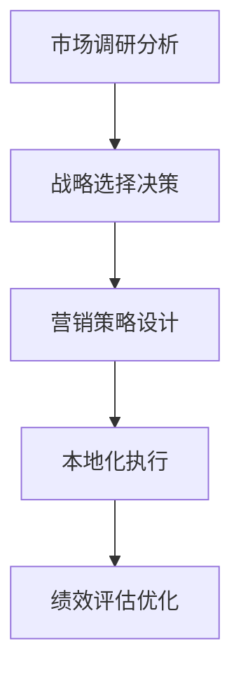

# 全球化营销策略

## 📋 知识框架总览



---

## 🎯 核心理念

**全球化营销策略** = 企业在国际市场中通过系统性的市场分析、战略决策和执行管理，实现品牌全球化和业务国际化的营销策略体系。

**核心价值**：通过全球化拓展实现市场规模化、资源配置优化和竞争优势的全球化形成

---

## 🏗️ 知识结构

### 第一层：认知基础

#### 1.1 全球化营销模式

| 营销模式 | 全球化程度 | 竞争优势 | 适用条件 | 实施复杂度 |
|----------|------------|----------|----------|------------|
| **标准化策略** | 完全一致 | 规模经济+成本最低 | 市场需求趋同 | 低 |
| **本地化策略** | 完全差异 | 适应性强+本土优势 | 差异显著 | 高 |
| **混合策略** | 差异化程度 | 灵活性+效率平衡 | 整体一致局部差异 | 中 |

#### 1.2 全球化战略选择矩阵

**市场进入策略矩阵**

```mermaid
graph TD
    A[全球化战略] --> B[出口贸易"]
    A --> C[特许经营"]
    A --> D[合资合作"]
    A --> E[直接投资"]
    
    B --> B1[产品出口"]
    B --> B2[品牌授权"]
    B --> B3[代理销售"]
    
    C --> C1[品牌特许"]
    C --> C2[技术许可"]
    C --> C3[管理输出"]
    
    D --> D1[股权合资"]
    D --> D2[技术合作"]
    D --> D3[市场伙伴"]
    
    E --> E1[独资运营"]
    E --> E2[收购兼并"]
    E --> E3[绿地投资"]
```

#### 1.3 全球化挑战因素

**全球化成功要素分析**

| 成功要素 | 重要性 | 可控性 | 影响因素 | 应对策略 |
|----------|--------|--------|----------|----------|
| **文化差异** | 很高 | 中 | 价值观+语言+习惯 | 文化适应性设计 |
| **法规合规** | 很高 | 高 | 政策+法律+标准 | 合规管理体系 |
| **市场竞争** | 高 | 低 | 本土品牌+国际竞争 | 差异化竞争策略 |
| **供应链管理** | 中高 | 中 | 物流+质量+成本 | 全球供应链优化 |
| **人才管理** | 中高 | 中 | 本土化+文化融合 | 人才本土化策略 |

---

### 第二层：理解深化

#### 2.1 全球化环境分析

**PESTG分析框架**

**全球化环境要素**

```mermaid
graph TD
    A[全球化环境] --> B[政治环境"]
    A --> C[经济环境"]
    A --> D[社会环境"]
    A --> E[技术环境"]
    A --> F[地理环境"]
    
    B --> B1[贸易政策"]
    B --> B2[投资政策"]
    B --> B3[监管环境"]
    B --> B4[双边关系"]
    
    C --> C1[市场规模"]
    C --> C2[购买力水平"]
    C --> C3[汇率稳定"]
    C --> C4[经济增长"]
    
    D --> D1[文化差异"]
    D --> D2[消费习惯"]
    D --> D3[语言障碍"]
    D --> D4[宗教信仰"]
    
    E --> E1[数字化水平"]
    E --> E2[基础设施"]
    E --> E3[技术创新"]
    E --> E4[标准化程度"]
    
    F --> F1[地理位置"]
    F --> F2[物流便利"]
    F --> F3[气候条件"]
    F --> F4[资源禀赋"]
```

#### 2.2 市场进入策略设计

**市场选择评估矩阵**

| 评估维度 | 权重 | 评估标准 | 量化方法 | 决策权重 |
|----------|------|----------|----------|----------|
| **市场规模** | 30% | 潜在客户数量×购买力 | 数据调研+GDP分析 | 市场规模 |
| **竞争强度** | 25% | 竞争对手数量+实力 | 竞争分析+市场份额 | 竞争格局 |
| **进入壁垒** | 20% | 法规+资源+技术门槛 | 门槛评估+行业分析 | 进入难度 |
| **文化匹配** | 15% | 文化差异+接受度 | 文化评估+消费者调研 | 适应难度 |
| **盈利潜力** | 10% | 价格水平+成本结构 | 财务预测+投资回报 | 盈利预期 |

#### 2.3 本地化营销策略

**本地化实施框架**

**本地化程度矩阵**

| 营销要素 | 标准化程度 | 本地化要求 | 实施策略 | 成功指标 |
|----------|------------|------------|----------|----------|
| **品牌定位** | 高标准化 | 价值观适配 | 核心价值保持+表现形式调整 | 品牌认知度 |
| **产品功能** | 高本地化 | 需求差异 | 基础功能+本地化功能 | 产品适应性 |
| **定价策略** | 中本地化 | 购买力差异 | 价值定价+本地化定价 | 价格接受度 |
| **分销渠道** | 高本地化 | 渠道生态差异 | 本土渠道+合作伙伴 | 渠道覆盖率 |
| **推广方式** | 中本地化 | 文化媒体差异 | 通用创意+本土化渠道 | 推广效果 |

---

### 第三层：应用实战

#### 3.1 全球化营销实施

**全球营销项目管理**

**实施阶段规划**

```mermaid
graph LR
    A[市场调研] --> B[战略规划"]
    B --> C[营销设计"]
    C --> D[资源部署"]
    D --> E[市场启动"]"
    E --> F[运营优化"]"
    
    A1[深度调研+机会识别"] --> A
    B1[战略选择+路径设计"] --> B
    C1[策略制定+方案设计"] --> C
    D1[资源配置+团队建设"] --> D
    E1[市场推广+销售启动"] --> E
    F1[效果监控+持续优化"] --> F
```

#### 3.2 跨文化营销管理

**文化适应性管理**

**跨文化营销挑战与解决方案**

| 挑战类型 | 具体表现 | 解决方案 | 实施要点 | 效果评估 |
|----------|----------|----------|----------|----------|
| **语言障碍** | 沟通误解+文化误读 | 本土化团队+专业翻译 | 本土员工+文化培训 | 沟通准确性 |
| **价值观差异** | 品牌理解偏差+接受障碍 | 价值观适配+本土化传播 | 深度调研+价值观重构 | 品牌一致性 |
| **消费习惯差异** | 购买行为+决策因素不同 | 需求洞察+行为适配 | 本土化产品+营销方式 | 市场适应性 |
| **媒体环境差异** | 渠道生态+内容偏好不同 | 本土媒体+合作渠道 | 媒体合作+内容本土化 | 传播效果 |

#### 3.3 全球营销绩效管理

**KPI指标体系设计**

**全球营销效果评估**

| 层级 | KPI类别 | 核心指标 | 目标值 | 监控频率 |
|------|---------|----------|--------|----------|
| **战略层** | 市场份额+品牌价值 | 市场份额50%+ | 逐年提升20%+ | 季度 |
| **策略层** | 营销效率+客户价值 | ROI>300% | 持续优化 | 月度 |
| **执行层** | 运营指标+销售转化 | 转化率>15% | 行业领先 | 周度 |
| **财务层** | 收入+利润+成本 | 利润率>20% | 盈利增长 | 月度 |

---

## 🎯 刻意练习计划

### 练习1：全球化市场进入战略设计
**任务**：为目标市场设计完整的全球化市场进入战略
**输出**：市场分析+进入策略+实施方案+资源配置+风险评估+绩效目标
**评估**：战略深度+市场适应性+实施可行性+资源配置+风险控制+收益预期

### 练习2：跨文化营销campaign执行
**任务**：设计并执行面向不同文化背景的全球化营销campaign
**输出**：campaign策略+本土化设计+执行过程+效果跟踪+优化改进+经验总结
**评估**：文化适配度+campaign效果+执行质量+本土化程度+优化能力+复制推广

### 练习3：全球营销体系建设管理
**任务**：建立完整的全球营销管理体系和组织架构
**输出**：管理体系+组织设计+流程标准+工具平台+人才培养+绩效管理
**评估**：体系完整性+管理效率+组织协作+流程标准化+工具先进性+人才能力

---

## 🧩 实战案例分析

### 案例：华为全球化营销成功经验

**企业背景**：中国领先的全球通信设备制造商，成功实现全球化业务拓展

**全球化营销战略演进**：

**第一阶段：出口贸易（1990-2000）**
- **战略重点**：产品出口+技术学习
- **市场目标**：发展中国家+性价比路线
- **营销策略**：低价+技术跟随

**第二阶段：本土化拓展（2000-2010）**
- **战略升级**：本土化运营+服务网络
- **市场目标**：发达国家市场进入
- **营销策略**：技术突破+品牌建设

**第三阶段：全球领先（2010-2020）**
- **战略引领**：技术创新+生态建设
- **市场目标**：全球市场领导者
- **营销策略**：全栈解决方案+开放合作

**全球化营销核心策略**：

1. **技术驱动全球化**
   ```
   技术创新领先 + 全球研发网络 + 标准制定参与 = 技术全球化优势
   ```

2. **客户价值营销**
   - **解决方案导向**：从产品销售到整体解决方案
   - **长期价值承诺**：技术服务+生态建设
   - **本地化深度**：本土研发+本地化服务

3. **品牌国际化建设**
   - **国家形象关联**：中国企业的技术全球化代表
   - **技术创新营销**：5G+云计算+AI技术领先
   - **生态开放战略**：开发者生态+合作伙伴

4. **全球资源整合**
   - **全球研发网络**：全球16大研发中心
   - **供应链全球化**：全球供应商+本地化生产
   - **人才国际化**：多元化团队+国际化高管

**关键成功要素**：
- **技术创新能力**：持续的技术创新投入和产出
- **客户关系深度**：从B2B关系营销到生态伙伴关系
- **本土化执行**：深度本土化运营和管理
- **风险意识**：对全球化风险的识别和控制

**全球化挑战与应对**：
- **技术封锁挑战**：通过开放合作和国际标准参与应对
- **市场竞争加剧**：技术创新深化和差异化竞争
- **本土化深度**：加强本土化研发和人才培养
- **供应链风险**：多元化供应链和关键技术自主

**全球化成果**：
- **业务全球化**：业务遍布170+国家地区
- **技术领先**：5G技术全球领先地位
- **品牌价值**：全球最有价值的品牌之一
- **生态影响力**：构建全球产业生态系统

**成功启示**：
- 技术创新是全球化最重要的核心竞争力
- 客户价值导向的营销策略具有国际通用性
- 深度本土化是全球化成功的关键要素
- 开放合作生态能够放大全球化价值

---

## 🔗 知识连接

**核心关联模块**：
- [[02-跨文化营销]] - 跨文化营销管理实践
- [[03-国际品牌建设]] - 国际品牌建设和传播
- [[04-全球供应链营销]] - 全球供应链营销管理
- [[01-营销发展趋势]] - 全球化营销发展趋势

**技能拓展路径**：
1. [[08-营销创新趋势/04-全球化营销]] - 全球化营销创新实践
2. [[04-营销策略制定]] - 全球化环境下的营销策略制定
3. [[05-营销执行实施]] - 全球化营销执行实施方法
4. [[01-营销总览]] - 全球化营销整体战略规划

---

## 📚 学习检查清单

**基础认知检查**：
- [ ] 理解全球化营销的核心内涵和战略意义
- [ ] 掌握不同全球化营销模式的特征和适用条件
- [ ] 能够识别全球化营销的主要挑战和成功要素

**深化理解检查**：
- [ ] 能够进行深入的全球化环境分析和市场评估
- [ ] 掌握全球化市场进入策略的设计和选择方法
- [ ] 理解本地化营销策略的设计和实施要点

**应用实践检查**：
- [ ] 能够设计完整的全球化市场进入战略
- [ ] 能够执行有效的跨文化营销campaign
- [ ] 能够建立完整的全球营销管理体系

**知识整合检查**：
- [ ] 能够将全球化营销战略与企业发展整体规划有机结合
- [ ] 能够在实际业务中建立可持续的全球化营销能力
- [ ] 能够基于全球化实践指导国际业务发展策略
