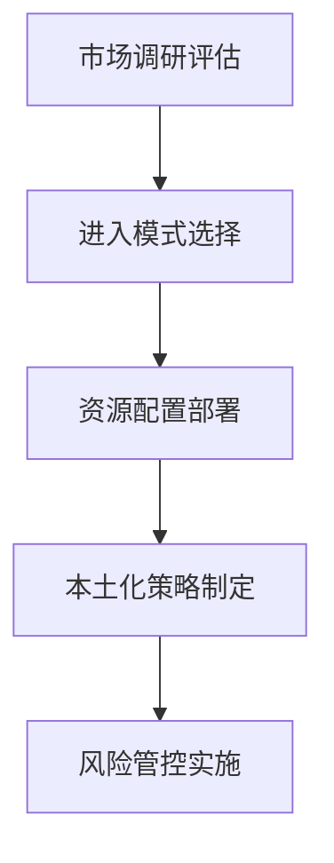
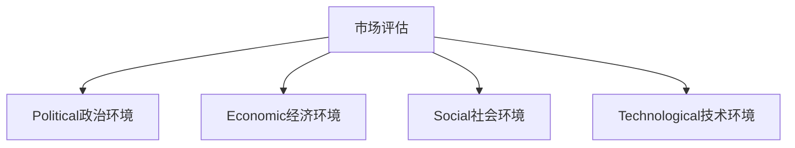

# 国际市场进入策略

## 📋 知识框架总览



---

## 🎯 核心理念

**国际市场进入策略** = 企业通过系统性市场分析、进入模式设计和策略实施，成功进入并发展国际市场的完整方案。

**核心价值**：降低进入风险，提高成功率，实现全球化商业目标

---

## 🏗️ 知识结构

### 第一层：认知基础

#### 1.1 市场进入模式

| 进入模式 | 投资风险 | 控制程度 | 适用条件 | 代表案例 |
|----------|----------|----------|----------|----------|
| **出口贸易** | 低 | 低 | 初期试探 | 产品直销 |
| **许可经营** | 中低 | 中 | 技术有优势 | 品牌授权 |
| **合资经营** | 中高 | 中高 | 资源共享 | 技术合作 |
| **直接投资** | 高 | 高 | 市场成熟度高 | 全资子公司 |

#### 1.2 市场选择评估

**PEST分析框架**



---

### 第二层：理解深化

#### 2.1 风险评估体系

**市场风险矩阵**

| 风险类型 | 影响因素 | 评估方法 | 防控措施 |
|----------|----------|----------|----------|
| **政治风险** | 政策稳定性+贸易关系 | 政治风险评估 | 多元化布局 |
| **经济风险** | 汇率+通胀+市场波动 | 经济指标监测 | 对冲策略 |
| **文化风险** | 价值观+消费习惯 | 文化调研 | 本土化策略 |
| **竞争风险** | 本地对手+品牌认知 | 竞争分析 | 差异化定位 |

---

### 第三层：应用实战

#### 3.1 实施路径设计

**进入策略五步法**

```mermaid
graph LR
    A[市场调研"] --> B[战略制定"] --> C[模式选择"] --> D[资源配置"] --> E[执行监控"]"
```

#### 3.2 本土化策略

**本土化深度适配**

| 适配维度 | 标准化程度 | 本土化要求 | 实施策略 |
|----------|------------|------------|----------|
| 产品功能 | 高标准化 | 功能需求差异 | 功能模块化 |
| 品牌定位 | 中标准化 | 文化价值观差异 | 表达形式本土化 |
| 营销策略 | 低标准化 | 渠道+消费者差异 | 全面本土化 |
| 定价策略 | 高本土化 | 购买力+竞争差异 | 本地定价策略 |

---

## 🎯 刻意练习计划

### 练习1：市场进入战略设计
**任务**：为企业制定完整的国际市场进入战略
**输出**：市场分析+进入模式+实施方案+风险评估+监控机制
**评估**：分析深度+策略合理性+实施可行性+风险可控性

### 练习2：本土化营销执行
**任务**：在目标市场实施本土化营销策略
**输出**：本土化方案+实施过程+市场反馈+优化调整
**评估**：本土化程度+市场适应性+执行效果+持续优化

---

## 🧩 典型案例

### 案例：特斯拉中国市场进入

**成功要素**：
```mermaid
graph LR
    A[本地制造"] --> B[文化赋能"]
    B --> C[生态建设"]
    C --> D[品牌价值"]"
```

- **本地化生产**：上海超级工厂降低成本和关税
- **文化融入**：中国特色充电网络和营销策略
- **生态建设**：与中国产业链深度合作
- **品牌适应**：从高端定位到多元化产品线

---

## 🔗 知识连接

**关联模块**：
- [[01-全球化营销策略]] - 全球化整体战略
- [[02-跨文化营销]] - 跨文化适应策略

---

## 📚 学习检查清单

**基础**：[进入模式+市场评估+风险分析]
**理解**：[战略制定+模式选择+资源配署]
**应用**：[本土化实施+市场拓展+风险管控]

---

## 📝 核心要点

**国际市场进入关键因素**：
1. 深度市场调研是成功进入的基础
2. 进入模式要与自身能力和风险承受力匹配
3. 本土化程度决定市场适应性和成功概率
4. 风险管理是国际市场运营的核心能力
5. 长期投入和耐心是国际市场成功的必要条件
