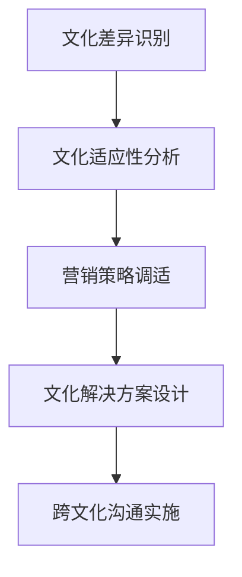

# 跨文化营销

## 📋 知识框架总览



---

## 🎯 核心理念

**跨文化营销** = 在不同文化背景的市场中，通过深度理解文化差异和消费者行为特征，设计适应性的营销策略和实施方案。

**核心价值**：通过文化适应性策略实现品牌本土化融入，提升营销效果和品牌价值

---

## 🏗️ 知识结构

### 第一层：认知基础

#### 1.1 文化维度理论

**Hofstede文化维度模型**

| 文化维度 | 维度含义 | 高低差异影响 | 营销应用 | 案例对比 |
|----------|----------|--------------|----------|----------|
| **权力距离** | 对权力不平等的接受度 | 高：等级+权威；低：平等+个人 | 代言人选择+定价策略 | 日本vs丹麦 |
| **个人主义vs集体主义** | 个体独立vs群体依赖 | 个人：个性化；集体：群体归属 | 品牌定位+广告创意 | 美国vs韩国 |
| **男性气质vs女性气质** | 竞争vs关爱价值取向 | 男性：成就竞争；女性：生活质量 | 营销主题+情感表达 | 德国vs北欧 |
| **不确定性规避** | 对不确定性的容忍度 | 高：安全稳定；低：灵活创新 | 产品策略+信息传达 | 日本vs荷兰 |
| **长期vs短期导向** | 时间价值观念 | 长期：投资储蓄；短期：即时满足 | 品牌建设+消费者教育 | 中国vs菲律宾 |
| **放纵vs约束** | 欲望控制程度 | 放纵：享受即时；约束：控制欲望 | 营销诱惑度+道德标准 | 法国 vs 日本 |

#### 1.2 文化对消费行为的影响

**文化-消费行为映射**

```mermaid
graph TD
    A[文化价值观] --> B[消费动机"]
    A --> C[决策模式"]
    A --> D[购买行为"]
    A --> E[品牌关系"]
    
    B --> B1[自我实现需求"]
    B --> B2[社会认同需求"]
    B --> B3[安全感需求"]
    B --> B4[归属感需求"]
    
    C --> C1[个人决策vs群体决策"]
    C --> C2[理性分析vs感性认知"]
    C --> C3[快速决策vs慎重考虑"]
    C --> C4[自主选择vs他人影响"]
    
    D --> D1[价格敏感vs品质追求"]
    D --> D2[品牌忠诚vs性价比重视"]
    D --> D3[冲动购买vs计划购买"]
    D --> D4[线上vs线下偏好"]
    
    E --> E1[情感联结强度"]
    E --> E2[品牌信任程度"]
    E --> E3[口碑传播意愿"]
    E --> E4[品牌互动频率"]
```

#### 1.3 跨文化营销障碍

**文化障碍类型分析**

| 障碍类型 | 具体表现 | 影响程度 | 预防措施 | 应对策略 |
|----------|----------|----------|----------|----------|
| **语言障碍** | 翻译错误+文化误读 | 高 | 专业本土化翻译 | 本土化团队 |
| **符号理解偏差** | 品牌标志+色彩含义不同 | 中高 | 文化符号研究 | 本地化设计 |
| **价值观冲突** | 品牌价值观与本土价值观不符 | 很高 | 价值观适配研究 | 价值观调整 |
| **沟通方式差异** | 直接vs间接+正式vs非正式 | 中 | 沟通方式调研 | 本土化沟通 |
| **社会规范违反** | 触犯本土社会规范 | 很高 | 社会规范研究 | 合规性检查 |

---

### 第二层：理解深化

#### 2.1 文化适应策略

**Glocalization策略矩阵**

**全球本土化策略层次**

```mermaid
graph TD
    A[Glocalization策略] --> B[标准化策略"]
    A --> C[适应化策略']
    A --> D[本土化策略]
    A --> E[创新化策略"]
    
    B --> B1[核心产品不变"]
    B --> B2[全球统一品牌"]
    B --> B3[标准化流程"]
    
    C --> C1[功能适度调整"]
    C --> C2[品牌形式变化"]
    C --> C3[渠道方式调整"]
    
    D --> D1[深度产品改造"]
    D --> D2[本土品牌形象"]
    D --> D3[完全本土化"]
    
    E --> D1[文化融合创新"]
    E --> D2[全新市场创造"]
    E --> D3[文化引领创新"]
```

#### 2.2 跨文化品牌传播

**文化传播策略设计**

**品牌传播本土化要素**

| 传播要素 | 全球化程度 | 本土化要求 | 实施策略 | 效果评估 |
|----------|------------|------------|----------|----------|
| **品牌定位** | 核心价值不变 | 表达方式本土化 | 价值适配+表达创新 | 品牌认知度 |
| **广告创意** | 核心创意全球化 | 文化表现形式本土化 | 国际创意+本土制作 | 创意接受度 |
| **代言人选择** | 全球化明星 | 本地化偏好 | 国际明星+本土明星 | 代言人影响力 |
| **传播媒介** | 数字化全球化 | 本地化媒介生态 | 媒介组合+内容适配 | 媒介到达率 |
| **情感诉求** | 人类共情基础 | 文化特定情感 | 共情挖掘+文化表达 | 情感共鸣度 |

#### 2.3 文化融合营销创新

**文化融合营销模式**

**文化创新策略**

```mermaid
graph LR
    A[文化理解"] --> B[文化融合"]
    B --> C[文化创造"]
    C --> D[文化引领"]
    
    A1[深度文化研究"] --> A
    B1[文化与品牌结合"] --> B
    C1[文化元素创新应用"] --> C
    D1[引领文化潮流"] --> D
```

#### 文化融合度评估

| 融合层级 | 融合程度 | 实施难度 | 创新程度 | 市场影响 |
|----------|----------|----------|----------|----------|
| **表面融合** | 外观装饰+色彩调整 | 低 | 低 | 短期增长 |
| **功能融合** | 功能特性+使用习惯 | 中 | 中 | 中期发展 |
| **深度融合** | 价值观念+情感连接 | 高 | 高 | 长期品牌价值 |
| **创新融合** | 文化元素+商业模式 | 很高 | 很高 | 市场引领 |

---

### 第三层：应用实战

#### 3.1 跨文化营销实施

**文化适应性实施框架**

**实施路径设计**

```mermaid
graph LR
    A[文化调研"] --> B[策略设计"]
    B --> C[方案制定"]
    C --> D[试点验证"]
    D --> E[规模化实施"]
    
    A1[文化环境分析"] --> A
    B1[适应性策略制定"] --> B  
    C1[详细方案设计"] --> C
    D1[小范围市场试错"] --> D
    E1[全面市场推广"] --> E
```

#### 3.2 跨文化团队管理

**文化多元化团队建设**

**团队文化管理要素**

| 管理要素 | 核心任务 | 实施方法 | 挑战应对 | 成功指标 |
|----------|----------|----------|----------|----------|
| **文化认知** | 文化差异理解 | 文化培训+体验交流 | 偏见消除 | 文化敏感度提升 |
| **沟通管理** | 跨文化沟通效率 | 沟通规则+翻译支持 | 沟通障碍 | 沟通效果提升 |
| **协作机制** | 团队协作优化 | 工作流程+冲突解决 | 文化冲突 | 协作效率提升 |
| **激励机制** | 多元激励体系 | 差异化激励+公平考核 | 文化偏见 | 团队满意度提升 |

#### 3.3 文化风险管控

**文化风险管理体系**

**风险控制机制**

```mermaid
graph TD
    A[文化风险管理] --> B[风险识别"]
    A --> C[风险评估"]
    A --> D[风险控制"]
    A --> E[风险应对"]
    
    B --> B1[文化差异识别"]
    B --> B2[潜在冲突点识别"]
    
    C --> C1[影响程度评估"]
    C --> C2[发生概率评估"]
    
    D --> C1[预防措施实施"]
    C --> C2[监控机制建立"]
    
    E --> E1[应急响应"]
    E --> E2[损失控制"]
```

---

## 🎯 刻意练习计划

### 练习1：跨文化市场调研分析
**任务**：深度调研目标市场的文化特征和消费行为
**输出**：文化分析报告+消费行为洞察+市场机会识别+营销策略建议
**评估**：调研深度+culture分析准确性+消费洞察价值+策略可行性+文化敏感性

### 练习2：跨文化营销campaign设计
**任务**：设计并实施面向特定文化背景的营销campaign
**输出**：campaign策略+文化适配方案+创意设计+执行过程+效果评估+优化改进
**评估**：文化适配度+campaign创意性+执行质量+效果达成+文化接受度+学习价值

### 练习3：跨文化团队建设管理
**任务**：建立和管理文化多元化的全球化营销团队
**输出**：团队设计方案+文化管理体系+沟通机制+协作流程+激励机制+绩效管理
**评估**：团队多样性+culture管理水平+沟通效率+协作效果+团队满意度+创新能力

---

## 🧩 实战案例分析

### 案例：可口可乐全球化文化营销成功经验

**企业背景**：全球饮料品牌领导者，在跨文化营销方面具有经典成功案例

**可口可乐跨文化营销策略**：

**1. 统一品牌+本地化执行**
```
Share a Coke + 本土名字 + 本土音乐 = 全球统一体验+本土化个性
```

**核心策略**：
- **品牌核心保持不变**：可乐的味道和"快乐"的品牌价值
- **执行方式本土化**：广告、包装、促销活动的本土化呈现
- **文化元素融入**：融入当地文化符号和情感元素

**2. 全球本土化营销案例**

**中国市场营销策略**：
- **节日营销**：春节、中秋等传统节日特别营销
- **文化符号融合**：用龙、节庆色彩等中国文化符号
- **明星代言本土化**：使用中国明星作为代言人
- **本土合作**：与中国文化机构和品牌合作

**印度市场营销策略**：
- **宗教文化考虑**：考虑印度宗教饮食习惯
- **家庭文化营销**：强调家庭聚会和传统价值
- **本土代言人**：使用宝莱坞明星和体育明星
- **本地化口味**：推出适合印度人口味的变体产品

**3. 文化适应经验分享**

**成功要素**：
- **深度文化理解**：对目标市场的深入文化研究
- **灵活适应性**：既有全球一致性又有本土灵活性
- **情感共鸣关注**：重视文化与情感的结合
- **持续本土化**：不断适应本土文化变化

**中国春节营销campaign**：
- **创意背景**：将可口可乐与中国春节传统结合
- **文化元素**：红色包装+中国龙+春节主题广告
- **情感诉求**：家庭团聚+庆祝+分享快乐
- **营销执行**：节日特装+限量产品+主题推广

**4. 跨文化挑战应对**

**面临的挑战**：
- **文化价值观差异**：不同文化对快乐的理解不同
- **消费习惯差异**：饮料消费的场合和方式差异
- **社交文化差异**：分享和社交的文化差异
- **宗教饮食限制**：某些地区的宗教饮食考虑

**应对策略**：
- **价值观统一化**：找到跨越文化的"快乐"价值
- **消费行为适应**：适应不同市场的消费习惯
- **社交文化融入**：融入当地社交文化传统
- **宗教合规管理**：严格遵守当地的宗教和文化规范

**全球化营销成果**：
- **市场渗透率**：在200+国家和地区销售
- **品牌认知度**：全球最有价值的品牌之一
- **本土化水平**：深度融入全球主流文化
- **文化影响力**：成为流行文化和社交的重要载体

**成功启示**：
- 成功品牌能够保持核心价值的同时融入不同文化
- 跨文化营销需要深度理解地方文化的细微差别
- 文化适应性策略是全球化成功的关键要素
- 品牌本土化程度需要与全球化需求平衡

---

## 🔗 知识连接

**核心关联模块**：
- [[01-全球化营销策略]] - 跨文化营销在全球化战略中的作用
- [[03-国际品牌建设]] - 跨文化品牌建设和管理
- [[04-全球供应链营销]] - 跨文化供应链营销管理
- [[01-消费者行为变化]] - 文化对消费行为的影响

**技能拓展路径**：
1. [[08-营销创新趋势/04-全球化营销]] - 全球化创新营销模式
2. [[04-营销策略制定]] - 跨文化环境下的营销策略制定
3. [[05-营销执行实施]] - 跨文化营销执行管理
4. [[02-营销趋势分析]] - 跨文化营销发展趋势

---

## 📚 学习检查清单

**基础认知检查**：
- [ ] 理解文化对消费者行为的深层影响机制
- [ ] 掌握跨文化营销的核心理论和实践框架
- [ ] 能够识别跨文化营销的主要挑战和风险因素

**深化理解检查**：
- [ ] 能够进行深度的跨文化市场环境分析
- [ ] 掌握文化适应性和本土化策略的设计方法
- [ ] 理解跨文化团队管理的核心要素

**应用实践检查**：
- [ ] 能够进行专业的跨文化市场调研和分析
- [ ] 能够设计有效的跨文化营销campaign
- [ ] 能够建设和管理跨文化营销团队

**知识整合检查**：
- [ ] 能够将跨文化营销与全球化战略有机整合
- [ ] 能够在实际业务中建立可持续的跨文化适应性
- [ ] 能够基于文化洞察指导国际品牌建设和市场拓展策略
