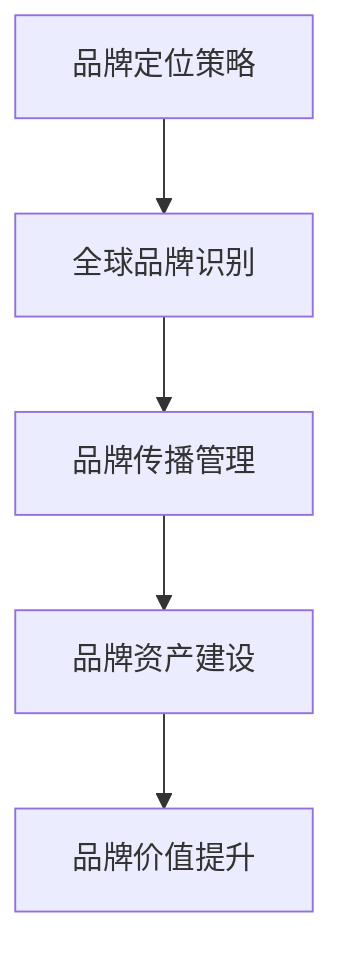

# 国际品牌建设

## 📋 知识框架总览



---

## 🎯 核心理念

**国际品牌建设** = 在全球市场中通过系统化的品牌战略、识别设计、传播管理和资产建设，建立强大的国际品牌价值和竞争优势。

**核心价值**：通过国际品牌建设实现品牌价值全球化、市场认知提升和商业竞争力强化

---

## 🏗️ 知识结构

### 第一层：认知基础

#### 1.1 国际品牌发展阶段

| 发展阶段 | 核心特征 | 建设重点 | 主要挑战 | 成功指标 |
|----------|----------|----------|----------|----------|
| **品牌认知** | 建立品牌知名度 | 曝光+认知 | 竞争激烈 | 知名度60%+ |
| **品牌信任** | 建立消费者信任 | 品质+信誉 | 信任建立 | 信任度40%+ |
| **品牌偏好** | 形成品牌偏好 | 差异化+价值 | 偏好建立 | 偏好率30%+ |
| **品牌忠诚** | 建立品牌忠诚 | 情感+体验 | 忠诚培养 | 忠诚度20%+ |
| **品牌资产** | 积累品牌资产 | 价值+影响力 | 资产管理 | 品牌价值提升 |

#### 1.2 全球品牌结构模式

**国际化品牌架构**

```mermaid
graph TD
    A[国际品牌结构] --> B[双品牌策略]
    A --> C[品牌组合策略"]
    A --> D[全球统一品牌"]
    A --> E[本土化品牌"
    
    B --> B1[母公司品牌"]
    B --> B2[子品牌"
    
    C --> C1[旗舰品牌"]
    C --> C2[区域性品牌"]
    C --> C3[专业品牌"]
    C --> C4[价格品牌"
    
    D --> D1[全球化统一"]
    D --> D2[标准化管理"]
    D --> D3[一致性体验"
    
    E --> E1[本土适应"]
    E --> E2[本土收购"]
    E --> E3[本土创新"
```

#### 1.3 国际品牌驱动因素

**品牌价值驱动模型**

| 价值要素 | 权重 | 影响因素 | 建设策略 | 衡量指标 |
|----------|------|----------|----------|----------|
| **品牌认知度** | 25% | 营销传播+知名度建设 | 媒体投放+内容营销 | 品牌回忆度 |
| 品牌联想度 | 20% | 品牌形象+文化内涵 | 品牌故事+文化价值 | 品牌联想测试 |
| **品牌品质感知** | 25% | 产品品质+服务质量 | 产品创新+服务优化 | 品质评分 |
| **品牌忠诚度** | 30% | 客户满意度+体验价值 | 客户关系+体验营销 | 重复购买率 |

---

### 第二层：理解深化

#### 2.1 全球品牌定位策略

**品牌定位金字塔模型**

**定位策略框架**

```mermaid
graph TD
    A[全球品牌定位] --> B[核心价值定位"]
    A --> C[功能利益定位"]
    A --> D[情感价值定位"]
    A --> E[文化理念定位"
    
    B --> B1[独特价值主张"]
    B --> B2[核心理念传播"]
    
    C --> C1[产品功能优势"]
    C --> C2[服务体验优势"]
    
    D --> D1[情感连接建立"]
    D --> D2[生活方式匹配"]
    
    E --> E1[文化价值观认同"]
    E --> E2[社会责任感"]
```

#### 2.2 品牌识别全球化

**品牌识别系统架构**

**全球化品牌识别要素**

| 识别要素 | 全球化程度 | 本土化要求 | 设计原则 | 实施标准 |
|----------|------------|------------|----------|----------|
| **品牌名称** | 高 | 语言+文化适配 | 简单+易记+正面联想 | 全球注册+通用性 |
| **Logo设计** | 高 | 文化+美学适配 | 简洁+识别度高 | 多场景+多尺寸适用 |
| **色彩系统** | 中高 | 文化色彩含义 | 统一+差异化+层次性 | 标准化+灵活性 |
| **字体系统** | 中高 | 当地阅读习惯 | 可读性强+字库丰富 | 多语言支持 |
| **视觉风格** | 中 | 文化美学偏好 | 现代+国际+本土特色 | 一致性与适应性 |
| **品牌声音** | 中 | 本土化适应 | 音调+语言文化 | 全球化+本土化 |

#### 2.3 跨文化品牌传播

**全球品牌传播策略矩阵**

**传播内容本地化策略**

```mermaid
graph TD
    A[品牌传播策略] --> B[核心信息一致性"]
    A --> C[内容表现形式本土化"]
    A --> D[渠道媒介适应性"]
    A --> E[文化情感共鸣化"
    
    B --> B1[品牌核心价值不变"]
    B --> B2[价值主张本土化表达"]
    
    C --> C1[视觉设计本土化"]
    C --> C2[语言表达本土化"]
    
    D --> D1[媒体渠道本土选择"]
    D --> D2[传播时机本土优化"]
    
    E --> E1[本土文化元素融入"]
    E --> E2[情感诉求本土化"]
```

---

### 第三层：应用实战

#### 3.1 国际品牌建设实施

**品牌建设实施路径**

**建设阶段里程碑**

```mermaid
graph LR
    A[品牌战略制定"] --> B[品牌识别设计"]
    B --> C[品牌传播实施"]
    C --> D[品牌体验优化"]
    D --> E[品牌资产管理"
    
    A1[市场分析+定位+战略"] --> A
    B1[Logo+视觉+包装设计"] --> B
    C1[广告+公关+数字营销"] --> C
    D1[产品+服务+渠道体验"] --> D
    E1[品牌价值+资产+声誉管理"] --> E
```

#### 3.2 品牌风险管理

**品牌危机管理体系**

**品牌风险类型与应对**

| 风险类型 | 主要表现 | 影响程度 | 预防措施 | 应对策略 | 
|----------|----------|----------<｜tool▁call▁begin｜>----------|----------|
| **声誉风险** | 负面新闻+品牌污名 | 高 | 监控+公关预防 | 危机公关+品牌修复 |
| **文化冲突风险** | 文化误解+价值观冲突 | 很高 | 文化研究+适配设计 | 文化道歉+策略调整 |
| **合规风险** | 法律法规违反 | 很高 | 合规审查+监督体系 | 紧急整改+制度完善 |
| **竞争风险** | 竞争对手恶意竞争 | 中高 | 竞争监控+差异化 | 竞争应对+创新反击 |
| **技术风险** | 质量问题+技术缺陷 | 高 | 质控体系+技术升级 | 召回+技术改进 |

#### 3.3 品牌价值评估

**品牌资产评估框架**

**品牌价值评估方法**

| 评估维度 | 评估方法 | 数据来源 | 权重 | 评估周期 |
|----------|----------|----------|------|----------|
| **财务价值** | 品牌溢价+净利润占比 | 财务报表+市场数据 | 30% | 年度 |
| **市场价值** | 市场份额+增长率 | 市场调研+销售数据 | 25% | 季度 |
| **客户价值** | 客户满意度+忠诚度 | 调研数据+行为数据 | 25% | 半年 |
| **社会价值** | 品牌声誉+社会影响 | 舆情监测+ESG指数 | 20% | 年度 |

---

## 🎯 刻意练习计划

### 练习1：国际品牌定位策略设计
**任务**：为新进入国际市场的品牌设计完整的品牌定位策略
**输出**：品牌定位分析+核心价值提炼+差异化策略+传播策略+实施计划+价值评估
**评估**：定位准确性+价值独特性+策略完整性+文化适应性+市场竞争力+实施可行性

### 练习2：全球品牌传播campaign执行
**任务**：设计并执行面向多个国际市场的品牌传播campaign
**输出**：campaign策略+创意设计+本土化方案+执行管理+效果跟踪+优化改进+经验总结
**评估**：campaign创意+本土化程度+执行质量+传播效果+品牌认知+文化敏感性+学习价值

### 练习3：国际品牌资产管理建设
**任务**：建立完整的国际品牌资产管理体系和价值评估机制
**输出**：资产管理体系+品牌监控+风险评估+危机管理+价值评估+持续优化+标准化运营
**评估**：体系完整性+管理规范性+风险控制力+价值提升效果+运营效率+可持续性+标准化

---

## 🧩 实战案例分析

### 案例：苹果Apple国际品牌建设成功典范

**企业背景**：全球最具价值的品牌之一，通过独特的品牌建设策略称霸国际市场

**Apple国际品牌建设历程**：

**第一阶段：产品导向品牌认知（1976-1997）**
- **品牌特征**：技术领先+创新产品
- **建设重点**：科技创新+产品卓越
- **品牌表现**：小众高端电脑品牌

**第二阶段：体验导向品牌重构（1997-2007）**
- **战略转型**：从产品公司到体验公司
- **核心价值**："Think Different"+简洁设计
- **品牌定位**：生活方式+情感连接

**第三阶段：生态导向品牌帝国（2007-至今）**
- **品牌升级**：生态系统+生活方式品牌
- **价值主张**：创新+设计+用户体验+生态
- **影响力**：重新定义多个行业

**Apple国际品牌建设核心策略**：

1. **简约至上的设计理念**
   ```
   Think Different + 简洁设计 + 用户体验 = 独特的Apple品牌气质
   ```

2. **生态化品牌建设**
   - **产品生态**：iPhone+iPad+Mac+Watch产品矩阵
   - **服务生态**：App Store+Apple TV+Apple Music
   - **体验生态**：零售店+开发者+用户社区

3. **情感化品牌营销**
   - **故事营销**：通过产品故事传递品牌价值
   - **体验营销**：Apple Store成为品牌体验圣地
   - **文化营销**：与创意、艺术、生活方式结合

4. **全球化一致性**
   - **设计一致性**：全球统一的视觉设计语言
   - **体验一致性**：全球统一的用户界面和体验
   - **价值观一致性**：创新和设计的全球价值观

**品牌建设的关键成就**：

**品牌价值方面**：
- **品牌价值**：连续多年全球品牌价值第一名
- **品牌忠诚度**：用户在生态中的忠诚度极高
- **品牌溢价**：产品定价远超成本获得高溢价
- **品牌影响力**：引领整个科技行业发展方向

**商业成功方面**：
- **市值增长**：从破产边缘到全球市值最高公司之一
- **盈利能力强*：iPhone等产品的高利润率
- **市场地位**：重新定义多个产品品类
- **竞争优势**：品牌和生态带来的难以超越优势

**国际影响力**：
- **文化影响力**：设计美学成为行业标杆
- **技术创新引领**：推动多项技术普及应用
- **生活方式改变**：改变全球用户的生活方式
- **行业标准制定**：推动多行业质量标准

**品牌建设成功要素分析**：

1. **核心价值观坚持**：创新+设计+用户体验的核心价值始终不变
2. **产品与品牌一体化**：产品就是最好的品牌营销载体
3. **体验至上的理念**：从设计到营销始终坚持体验优先
4. **生态协同效应**：通过生态系统放大品牌价值

**国际化实施的挑战与应对**：
- **文化适应性**：在保持核心价值的同时适应不同文化
- **本土化平衡**：在全球一致性和本土化之间找到平衡
- **市场竞争**：应对不同市场本土品牌的竞争
- **技术创新压力**：持续保持技术领先和设计创新

**品牌建设启示**：
- 强大的品牌核心价值和信念是企业国际化成功的基石
- 产品与品牌一体化战略能够创造独特的竞争优势
- 体验化营销是品牌建设的重要路径
- 生态系统建设能够大幅放大品牌价值

---

## 🔗 知识连接

**核心关联模块**：
- [[01-全球化营销策略]] - 国际品牌建设在全球化营销中的作用
- [[02-跨文化营销]] - 跨文化因素对国际品牌建设的影响
- [[04-全球供应链营销]] - 供应链对国际品牌建设的影响
- [[01-营销发展趋势]] - 国际品牌发展趋势

**技能拓展路径**：
1. [[08-营销创新趋势/04-全球化营销]] - 全球化品牌创新营销
2. [[04-营销策略制定]] - 国际环境下的营销策略制定
3. [[05-营销执行实施]] - 国际品牌营销执行管理
4. [[01-营销总览]] - 国际品牌建设整体战略规划

---

## 📚 学习检查清单

**基础认知检查**：
- [ ] 理解国际品牌建设的核心内涵和重要价值
- [ ] 掌握国际品牌发展的基本阶段和演进规律
- [ ] 能够识别国际品牌建设的主要挑战和成功要素

**深化理解检查**：
- [ ] 能够设计全面的国际品牌定位和识别策略
- [ ] 掌握跨文化的品牌传播和本土化适应方法
- [ ] 理解国际品牌风险管理和价值评估体系

**应用实践检查**：
- [ ] 能够设计完整的国际品牌建设策略
- [ ] 能够执行有效的全球品牌传播campaign
- [ ] 能够建立系统的国际品牌资产管理系统

**知识整合检查**：
- [ ] 能够将国际品牌建设与企业发展整体规划有机结合
- [ ] 能够在实际业务中建立可持续的国际品牌建设能力
- [ ] 能够基于品牌建设实践指导国际业务发展和市场竞争策略
