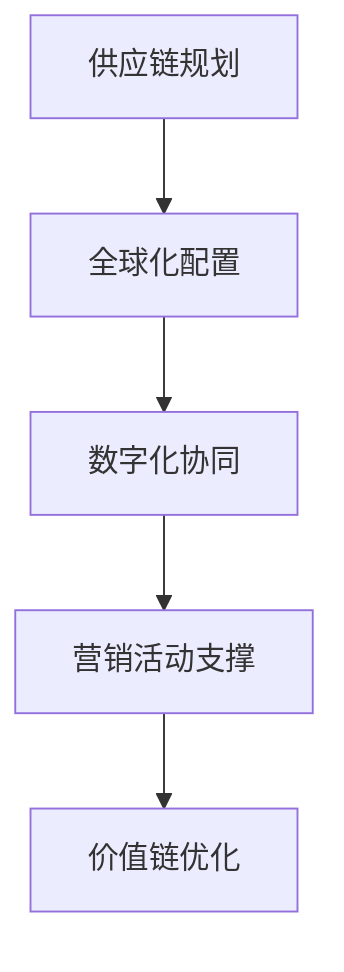

# 全球供应链营销

## 📋 知识框架总览



---

## 🎯 核心理念

**全球供应链营销** = 通过供应链的全球化布局与管理，支撑营销活动的高效执行，同时将供应链能力转化为营销竞争优势的整合营销模式。

**核心价值**：通过供应链协同提升营销效率，将供应能力转化为差异化营销优势和客户价值

---

## 🏗️ 知识结构

### 第一层：认知基础

#### 1.1 全球供应链营销模式

| 营销模式 | 核心特征 | 竞争优势来源 | 适用条件 | 实施复杂度 |
|----------|----------|--------------|----------|------------|
| **配送驱动营销** | 快速交付+覆盖率 | 物流效率+网络密度 | 时效敏感品 | 中等 |
| **定制化营销** | 个性化生产+柔性供应 | 柔性制造+快速响应 | 高价值定制 | 高 |
| **成本红利营销** | 成本控制+价格优势 | 规模化成本+效率优化 | 价格敏感品 | 中高 |
| **品质保障营销** | 品质承诺+保证供应 | 品控体系+供应链透明 | 品质关键品 | 高 |

#### 1.2 全球供应链架构

**供应链全球网络布局**

```mermaid
graph TD
    A[全球供应链网络] --> B[研发设计中心"]
    A --> C[制造生产基地"]
    A --> D[物流配送网络"]
    A --> E[售后服务网络"]
    
    B --> B1[创新研发"]
    B --> B2[技术转移"]
    B --> B3[产品设计"]
    B --> B4[标准化制定"]
    
    C --> C1[核心制造"]
    C --> C2[组装生产"]
    C --> C3[质量检测"]
    C --> C4[包装发货"]
    
    D --> D1[全球仓储"]
    D --> D2[运输配送"]
    D --> D3[最后一公里"]
    D --> D4[通关清关"]
    
    E --> E1[维修服务"]
    E --> E2[零配件供应"]
    E --> E3[回收处理"]
    E --> E4[客户支持"
```

#### 1.3 供应链营销协同优势

**协同价值创造模型**

| 协同要素 | 协同方式 | 营销价值 | 竞争优势 | 实现路径 | 
|----------|----------|----------|----------|----------|
| **信息协同** | 需求预测+库存共享 | 减少脱销+提高库存周转率 | 敏捷响应 | 供应链数字化系统 |
| **采购协同** | 集中采购+供应商管理 | 成本优势+品质保证 | 成本竞争力 | 优选供应商+长期合作 |
| **生产协同** | 柔性制造+快速转换 | 个性化定制+快速交付 | 定制能力 | 智能制造+柔性生产线 |
| **物流协同** | 优化配送+库存前置 | 快速交付+降低物流成本 | 交付体验 | 智能物流+本地化仓储 |
| **服务协同** | 统一标准+品牌体验 | 服务品质+品牌一致性 | 品牌信任 | 标准化服务+品牌承诺 |

---

### 第二层：理解深化

#### 2.1 供应链驱动营销策略

**供应链营销策略矩阵**

**营销能力建设路径**

```mermaid
graph TD
    A[供应链能力" > B[敏捷供应链"]
    A --> C[柔性供应链"]
    A --> D[智能供应链"]
    A --> E[可持续供应链"]
    
    B --> B1[快速响应能力"]
    B --> B2[实时调配能力"]
    B --> B3[动态优化能力"]
    
    C --> C1[个性化生产能力"]
    C --> C2[订单灵活调整"]
    C --> C3[小批量多品种"]
    
    D --> D1[AI预测与规划"]
    D --> D2[自动化运营"]
    D --> D3[数据驱动决策"]
    
    E --> D1[环保制造"]
    E --> D2[循环回收"]
    E --> D3[绿色物流"]
```

#### 2.2 数字化供应链营销

**数字化供应链转型**

**数字化转型要素体系**

| 转型层面 | 核心任务 | 技术支撑 | 数据来源 | 营销应用 | 
|----------|----------|----------|----------|----------|
| **连接数字化** | IoT+传感器 | 物联网技术 | 设备+环境数据 | 实时监控+预警营销 |
| **决策数字化** | AI+大数据分析 | 算法+模型 | 历史+实时数据 | 智能预测+精准营销 |
| **流程数字化** | 自动化+机器人 | RPA+自动化 | 流程+规则数据 | 效率提升+成本优化 |
| **生态数字化** | 平台化+生态化 | 云平台+API | 多方+多源数据 | 生态协同+创新营销 |

#### 2.3 供应链营销创新

**创新应用场景矩阵**

**供应链营销创新方向**

```mermaid
graph LR
    A[供应链创新"] --> B[商业模式创新"]
    B --> C[服务模式创新"]
    C --> D[技术模式创新"]
    D --> E[运营模式创新"]
    
    A1[新盈利模式"] --> A
    B1[新服务方式"] --> B
    C1[新技术应用"] --> C
    D1[新运营方式"] --> D
    E1[新发展路径"] --> E
```

**创新方向与营销价值**：

| 创新方向 | 创新内容 | 营销价值创造 | 竞争优势 | 实施难度 |
|----------|----------|--------------|----------|----------|
| **按需生产** | 订单驱动+小批量生产 | 零库存+个性化 | 定制化竞争优势 | 高 |
| **租赁服务** | 使用权租赁+服务化 | 降低门槛+客户粘性 | 服务收入持续增长 | 中高 |
| **平台化服务** | 供应链+服务平台化 | 生态协同+规模效应 | 行业领导者地位 | 很高 |
| **订阅模式** | 定期供应+自动补货 | 稳定收入+客户锁定 | 长期客户价值 | 中 |

---

### 第三层：应用实战

#### 3.1 供应链营销实施

**实施路径与里程碑**

**供应链营销实施阶段**

```mermaid
graph LR
    A[战略规划"] --> B[能力建设"]
    B --> C[数字化转型"]
    C --> D[营销协同"]
    D --> E[价值创造"]
    
    A1[供应链战略+营销融合"] --> A
    B1[基础设施+关键能力"] --> B
    C1[数字化+智能化"] --> C
    D1[渠道协同+营销支持"] --> D
    E1[价值实现+持续优化"] --> E
```

#### 3.2 供应链风险管理

**风险管理体系框架**

**全球供应链风险应对**

| 风险类型 | 风险来源 | 影响程度 | 预防措施 | 应对策略 | 营销影响 |
|----------|----------|----------|----------|----------|----------|
| **供需失衡** | 需求波动+供应中断 | 高 | 需求预测+库存缓冲 | 供需对接+库存优化 | 缺货影响营销承诺 |
| **质量风险** | 产品质量问题 | 很高 | 质量管理+供应商审核 | 召回+品牌修复 | 品牌信任度下降 |
| **成本波动** | 原材料+汇率涨跌 | 中高 | 成本管控+风险对冲 | 成本传导+价格调整 | 价格竞争劣势 |
| 物流中断 | 自然灾害+政策变化 | 中 | 多物流路径+仓储布局 | 应急物流+替代方案 | 交付承诺违约 |
| **合规风险** | 贸易制裁+法规变化 | 很高 | 合规审查+法务跟进 | 法规遵循+策略调整 | 市场准入障碍 |

#### 3.3 供应链营销绩效

**供应链营销KPI体系**

**绩效评估框架**

| 绩效维度 | 核心KPI | 目标值 | 计算方法 | 评估周期 | 营销关联 |
|----------|---------|--------|----------|----------|----------|
| **效率** | 供应链成本占比 | <15% | 总供应链成本/营收 | 月度 | 价格竞争力 |
| **敏捷** | 订单履行周期 | <7天 | 订单接收到交付天数 | 周度 | 交付承诺保障 |
| **质量** | 产品质量退货率 | <1% | 退货数量/交付总量 | 月度 | 品牌信誉维护 |
| **可靠性** | 按期交付率 | >98% | 按期交付/总订单数 | 周度 | 客户满意度保障 |

---

## 🎯 刻意练习计划

### 练习1：全球供应链营销战略设计
**任务**：设计完整的全球供应链营销战略和实施方案
**输出**：战略方案+实施路径+组织架构+技术平台+风险管理+绩效评估
**评估**：战略深度+系统性+创新性+实施可行性+风险控制+成本效益

### 练习2：供应链数字化营销实践
**任务**：实施供应链数字化转型并集成营销应用
**输出**：数字化规划+技术选型+系统集成+营销同步+效果评估+优化升级
**评估**：技术先进性+集成效果+营销价值+运营效率+创新能力+持续发展

### 练习3：供应链营销创新探索
**任务**：探索供应链营销的创新模式和应用场景
**输出**：创新方案+试点实施+效果验证+模式提炼+推广计划+商业价值
**评估**：创新程度+商业价值+技术可行+模式先进性+推广潜力+可持续性

---

## 🧩 实战案例分析

### 案例：亚马逊全球供应链营销优化

**企业背景**：全球电商和技术巨头，供应链营销模式创新引领者

**亚马逊全球供应链营销策略**：

**1. FBA全球物流营销**
```
Fulfillment by Amazon + Prime membership + 快速送达 = 客户体验营销
```

**配送能力营销价值**：
- **Prime会员服务**：快速免费配送成为核心卖点
- **配送承诺营销**：当日达、次日达的营销承诺
- **配送体验优化**：配送时间、包装、跟踪等全链路体验

**2. AWS基础设施能力营销**
- **云端服务市场化**：IT基础设施的服务化创新
- **生态合作伙伴营销**：开放平台吸引开发者和企业
- **能力输出型营销**：技术能力通过服务变现

**3. 供应链透明度营销**
- **产品溯源**：供应链源头可查可追溯
- **品质保障**：供应链质量管理体系展示
- **可持续性展示**：绿色供应链和环保承诺

**供应链营销创新实践**：

**1. 按需仓储网络**
- **分布式仓储**：全球数百个仓储中心
- **智能配送网络**：AI优化配送路径和时效
- **最后一公里创新**：无人机、机器人等创新配送

**2. 供应链平台化**
- **Seller Fulfilled Prime**：开放供应链能力给第三方卖家
- **Multi-Channel Fulfillment**：多渠道库存和配送管理
- **API生态**：供应链能力开放接口

**3. 数据驱动供应链营销**
- **需求预测营销**：基于大数据的产品推荐
- **库存优化**：智能库存管理减少缺货
- **价格优化**：动态定价策略结合供应情况

**供应链风险管理**：
- **多供应商策略**：避免单一供应源风险
- **库存战略布局**：关键产品多仓库存缓冲
- **应急物流**：突发事件的应急配送能力

**关键成功要素**：
- **规模效应**：大规模带来的成本优势和效率优势
- **技术领先**：供应链技术创新带来的竞争优势
- **客户导向**：一切以提升客户体验为核心
- **开放生态**：供应链能力开放产生的生态价值

**营销价值创造**：
- **差异化竞争**：供应链能力构建的护城河
- **客户粘性**：配送服务建立的客户忠诚度
- **生态协同**：平台化供应链产生的网络效应
- **品牌形象**：可靠的供应链支撑的品牌信任

**成功启示**：
- 供应链能力可以成为营销差异化竞争的重要抓手
- 技术创新可以改造供应链并创造新的营销价值
- 客户体验中心的设计使供应链成为营销支持的利器
- 平台化开放策略可以拓展供应链的商业价值边界

---

## 🔗 知识连接

**核心关联模块**：
- [[01-全球化营销策略]] - 全球供应链在全球营销中的支撑作用
- [[02-跨文化营销]] - 供应链跨文化适应的营销影响
- [[03-国际品牌建设]] - 供应链品质保障对品牌建设的支撑
- [[02-营销技术演进]] - 供应链数字化与营销技术创新

**技能拓展路径**：
1. [[08-营销创新趋势]] - 供应链营销创新发展方向
2. [[04-营销策略制定]] - 供应链驱动的营销策略制定
3. [[05-营销执行实施]] - 供应链协同的营销执行管理
4. [[06-营销效果评估]] - 供应链绩效与营销效果关联

---

## 📚 学习检查清单

**基础认知检查**：
- [ ] 理解全球供应链营销的核心价值和运作机制
- [ ] 掌握供应链营销的主要模式和创新方向
- [ ] 能够识别供应链营销协同的关键要素

**深化理解检查**：
- [ ] 能够设计供应链驱动的营销策略和创新模式
- [ ] 掌握供应链数字化与营销技术的融合应用
- [ ] 理解全球供应链风险管理和绩效评估体系

**应用实践检查**：
- [ ] 能够设计和实施全球供应链营销战略
- [ ] 能够推动供应链数字化并与营销整合
- [ ] 能够探索供应链营销创新应用

**知识整合检查**：
- [ ] 能够将供应链能力建设与营销竞争优势有机结合
- [ ] 能够在实际业务中建立供应链营销协同机制
- [ ] 能够基于供应链营销实践指导企业国际化和平台化发展策略
