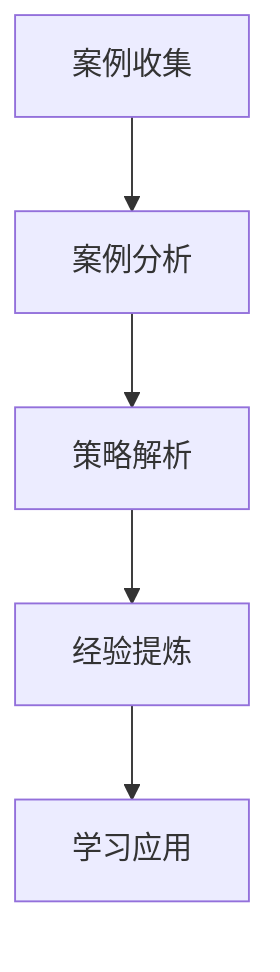

# 快消品营销案例

## 📋 知识框架总览



---

## 🎯 核心理念

**快消品营销案例研究** = 深度分析快消品行业成功和失败的营销实践，提炼关键成功要素和失败教训，为营销实践提供可借鉴的经验指导。

**核心价值**：通过案例学习了解快消品营销规律，掌握行业最佳实践和风险规避策略

---

## 🏗️ 知识结构

### 第一层：认知基础

#### 1.1 快消品营销特征

| 营销特征 | 核心要素 | 成功要素 | 挑战因素 | 应对策略 |
|----------|----------|----------|----------|----------|
| **高频消费** | 购买频次高+冲动消费 | 渠道渗透率 | 消费者决策快 | 便利性营销 |
| **价格敏感** | 对价格变化敏感 | 性价比优势 | 价格战激烈 | 价值营销 |
| **品牌忠诚度低** | 品牌切换成本低 | 情感连接 | 竞争激烈 | 差异化定位 |
| **渠道依赖性强** | 需要广泛分销网络 | 渠道管理 | 渠道冲突 | 渠道协同 |
| **广告投入大** | 营销预算占比高 | 创意营销 | 广告效果难测 | 精准投放 |

#### 1.2 快消品营销成功案例分类

**成功案例类型矩阵**

```mermaid
graph TD
    A[成功营销类型] --> B[品牌创新营销"]
    A --> C[渠道突破营销"]
    A --> D[产品创新营销"]
    A --> E[数字化营销"
    
    B --> B1[品牌重新定位"]
    B --> B2[文化营销"]
    B --> B3[品牌年轻化"]
    
    C --> C1[新兴渠道开辟"]
    C --> C2[渠道创新"]
    C --> C3[新零售创新"]
    
    D --> D1[产品升级"]
    D --> D2[细分产品"]
    D --> D3[创新产品"]
    
    E --> E1[社交营销"]
    E --> E2[直播营销"]
    E --> E3[内容营销"]
```

#### 1.3 快消品营销失败案例类型

**失败案例分析框架**

| 失败类型 | 失败原因 | 典型案例 | 失败后果 | 教训启示 |
|----------|----------|----------|----------|----------|
| **定位失误** | 目标市场判断错误 | 品牌高端化失策 | 市场份额下降 | 市场调研重要性 |
| **渠道策略错误** | 渠道选择不当 | 依赖单一渠道 | 渠道风险 | 渠道多元化 |
| **产品策略失败** | 产品创新方向错误 | 盲目追风 | 产品失败 | 差异化创新 |
| **品牌形象受损** | 品牌管理不当 | 负面事件危机 | 品牌价值下降 | 品牌保护 |
| **营销预算浪费** | 投放策略失误 | 低效广告投入 | ROI低下 | 精准营销 |

---

### 第二层：理解深化

#### 2.1 成功案例深度解析

#### 案例1：农夫山泉品牌年轻化成功案例

**企业背景**：中国领先的饮品企业，成功实现品牌年轻化转型

**品牌年轻化策略**：

**1. 品牌定位重新定义**
```
从"天然水"定位 → "东方美学+生活方式" = 文化自信+品牌高端化
```

**成功要素分析**：
- **文化元素融入**：挖掘中国传统文化元素
- **视觉设计升级**：现代化+东方美感的设计
- **生活方式营销**：从产品功能到生活方式

**2. 营销创新措施**
- **创意广告营销**：高水准的创意广告制作
- **社交媒体营销**：抖音、小红书等平台创新营销
- **跨界合作营销**：与时尚、艺术等领域跨界

**3. 渠道创新突破**
- **新零售结合**：线上线下全新零售模式
- **便利店渠道**：深耕便利店新兴消费场景
- **自动售货机**：新零售终端布局

**核心成功要素**：
- **品牌战略清晰**：品牌年轻化方向明确
- **创意执行优秀**：高水准的品牌创意和执行
- **渠道创新有效**：新兴渠道的成功开拓
- **文化自信运用**：传统文化现代运用

**营销成果**：
- **品牌价值提升**：品牌价值持续增长
- **市场地位巩固**：行业领导地位强化
- **消费者认知改变**：从低价到高品质认知转型
- **盈利能力增强**：品牌溢价能力提升

#### 案例2：三只松鼠电商营销成功案例

**企业背景**：中国领先的互联网零食品牌，电商营销成功典范

**电商营销创新策略**：

**1. 电商平台深度运营"
```
淘宝天猫旗舰店 + 京东平台 + 拼多多 = 全平台电商运营矩阵
```

**成功策略要素**：
- **电商平台化运营**：专业化电商运营团队
- **数据分析驱动**：电商数据深度分析和应用
- **用户运营精细化**：用户生命周期管理和激活

**2. IP化营销策略**
- **品牌IP化**：小坚果形象IP化打造
- **内容IP化**：动画、表情包等IP内容
- **粉丝经济**：IP粉丝化营销运营

**3. 新零售结合**
- **线上线下融合**：电商+实体店新零售模式
- **社交电商尝试**：社交化电商营销探索
- **快闪店创新**：创新零售业态尝试

**关键成功经验**：
- **电商专业化**：电商渠道的专业化运营
- **数据驱动决策**：基于电商数据的精准营销
- **IP营销创新**：品牌IP化营销模式创新

#### 2.2 失败案例深度剖析

#### 案例3：某乳制品品牌高端化营销失败案例

**失败背景**：某乳制品品牌尝试向高端市场转型遭遇严重挫折

**失败原因分析**：

**1. 市场定位判断错误**
- **高端市场需求低估**：对高端市场真实需求判断失误
- **品牌实力不匹配**：品牌基础无法支撑高端定位
- **价格策略激进**：价格定位于品牌实力不匹配

**2. 产品竞争力不足**
- **产品质量无优势**：产品本身并无明显优势
- **差异化不明显**：与其他高端品牌差异度不足
- **创新程度不够**：缺乏突破性产品创新

**3. 营销策略失误**
- **渠道选择错误**：高端渠道布局不足
- **广告策略不当**：高端营销手段不够精准
- **品牌形象错配**：品牌形象与高端定位不符

**失败后果**：
- **市场份额下降**：整体市场份额下滑
- **利润大幅下降**：盈利能力严重受损
- **品牌形象受损**：品牌形象受到负面影响

**经验教训**：
- **市场调研重要性**：充分的市场调研是成功的基础
- **品牌实力匹配**：营销策略需要与品牌实力匹配
- **差异化竞争**：需要建立真正的差异化优势

#### 案例4：某日化品牌线上营销转型失败

**失败背景**：传统日化品牌想通过电商转型遭遇困境

**失败原因详解**：

**1. 电商基因缺失**
- **传统思维固化**：仍然沿用传统营销思维
- **电商团队不足**：缺乏专业的电商运营能力
- **数字化能力弱**：整体数字化能力建设不足

**2. 渠道渠道冲突**
- **线上线下冲突**：电商与线下渠道冲突严重
- **价格体系混乱**：线上线下价格体系不统一
- **渠道管理失当**：渠道利益分配不当

**3. 实施过程问题**
- **转型步伐激进**：转型过程过于激进和急躁
- **组织适配不足**：组织架构未能适应电商要求
- **资源配置不当**：资源配置和人才匹配不匹配

---

### 第三层：应用实践

#### 3.1 案例学习方法

**案例分析五步法**

**系统性分析方法**

```mermaid
graph LR
    A[案例背景" > B[问题识别"]
    B --> C[策略分析"]
    C --> D[实施过程"]
    D --> E[结果评估"]
    E --> F[经验总结"]
    
    A1[企业+市场+产品背景"] --> A
    B1[核心问题+挑战识别"] --> B
    C1[营销策略+方案设计"] --> C
    D1[执行+过程管理"] --> D
    E1[成果+失败分析"] --> E
    F1[成功要素+失败教训"] --> F
```

#### 3.2 案例应用实践

**案例学习转化为实践**

**学习转化机制**

| 学习要素 | 转化方法 | 实践应用 | 效果验证 | 持续改进 |
|----------|----------|----------|----------|----------|
| **成功要素提取** | 成功要素识别+总结 | 在自己的营销中应用 | 效果对比分析 | 不断优化调整 |
| **失败教训汲取** | 失败原因分析+规避措施 | 避免类似错误发生 | 风险管控效果 | 经验积累丰富 |
| **方法论提炼** | 策略方法总结+标准化 | 营销方法标准化 | 效率和效果提升 | 方法论完善 |
| **最佳实践复制** | 最佳实践提炼+适配应用 | 在自身业务中应用 | 适用性验证 | 本地化创新 |

---

## 🎯 刻意练习计划

### 练习1：成功案例分析研究报告
**任务**：选择快消品行业成功案例进行全面深入分析
**输出**：案例分析报告+成功要素总结+方法论提炼+实践应用建议+改进建议
**评估**：分析深度+洞察精准+方法论实用性+应用价值+创新思维

### 练习2：失败案例复盘与预防
**任务**：对快消品行业失败案例进行复盘分析并制定预防措施
**输出**：失败分析报告+根本原因分析+预防体系+风险管控机制+经验教训+应用指导
**评估**：复盘深度+原因分析准确性+预防体系完整性+风险管理+学习价值

### 练习3：对标学习与实践改进
**任务**：对标优秀快消品企业进行自身营销改进实践
**输出**：对标分析+差距识别+改进方案+实施计划+进度跟踪+效果评估+优化迭代
**评估**：对标科学性+方案可行性+实施质量+改进效果+持续学习+创新能力

---

## 🧩 典型案例分析

### 综合案例：可口可乐中国本地化营销成功经验

**企业背景**：全球饮料巨头，在中国市场的本土化成功典范

**本土化营销策略全景**：

**第一阶段：认知建立期（1980-1990）**
- **市场进入策略**：合资形式进入中国市场
- **品牌定位**：国际品牌的"洋气"形象营销
- **渠道策略**：通过代理商系统建立初步渠道
- **营销特色**：广告轰炸+品牌知名度建设

**第二阶段：市场扩张期（1990-2000）**
- **渠道建设**：建立全面覆盖的渠道网络体系
- **本土化产品**：推出适应中国口味的产品变体
- **营销本土化**：结合中国文化的广告创意
- **竞争应对**：应对本土品牌竞争的策略调整

**第三阶段：深度本土化（2000-2010）**
- **文化营销深化**：深度融入中国节日文化
- **本地化运营**：本土团队+本土决策机制
- **数字化营销**：中国互联网平台的营销探索
- **可持续发展**：企业社会责任的本地化履行

**第四阶段：创新驱动期（2010至今）**
- **数字化转型**：深度整合中国数字生态系统
- **新零售探索**：与阿里巴巴、腾讯等深度合作
- **年轻化营销**：Z世代年轻消费群体的营销策略
- **健康化转型**：适应中国消费升级的健康产品策略

**成功要素深度剖析**：

1. **文化适应性营销**
   ```
   中国传统节日 + 国际化品牌 + 本土化创意 = 文化共鸣营销
   ```

2. **渠道体系建设**
   - **渠道深度**：覆盖到县乡村的下沉渠道建设
   - **合作伙伴关系**：与本土经销商的长期合作关系
   - **数字化渠道**：电商平台+新零售渠道整合

3. **产品本土化开发**
   - **口味适配**：口味的本土化调整和适配
   - **包装创新**：适应本土文化审美的包装设计
   - **本土化变体**：针对本土市场的产品变体

4. **营销创新实践**
   - **社交营销**：微信、抖音等平台营销创新
   - **节日营销**：春节、中秋等传统节日营销
   - **体育营销**：与中国体育的深层绑定

**关键成功要素总结**：
- **长期主义**：在中国市场长期深耕的投资理念
- **深度本土化**：不只是产品本土化，更是文化渗透
- **伙伴关系**：与本土伙伴建立长期深度合作关系
- **持续创新**：在营销方式上的持续创新和探索

**启示与学习价值**：
- 跨国公司本土化成功的根本是文化适应性
- 渠道体系建设需要长期持续的资源投入
- 产品本土化需要在保持品牌核心的同时适应本土需求
- 数字化时代的营销创新需要融入本土生态系统

---

## 🔗 知识连接

**核心关联模块**：
- [[02-营销战略规划]] - 基于案例学习的产品战略制定
- [[03-营销策略制定]] - 快消品营销策略实施方法
- [[05-营销执行实施]] - 快消品渠道管理和客户运营

**技能拓展路径**：
1. [[01-消费类企业/02-零售企业]] - 零售业态营销案例对比
2. [[03-传统企业]] - 传统企业转型案例分析
3. [[04-创新企业]] - 创新企业营销模式案例
4. [[02-失败案例分析]] - 营销失败案例深度复盘

---

## 📚 学习检查清单

**基础认知检查**：
- [ ] 理解快消品营销的核心特征和成功规律
- [ ] 掌握快消品营销成功和失败的典型类型
- [ ] 能够识别案例中的关键成功要素和失败原因

**深化理解检查**：
- [ ] 能够对成功案例进行系统性分析和要素提炼
- [ ] 能够深度剖析失败案例的根本原因和预防措施
- [ ] 掌握案例学习的系统方法和实践应用技巧

**应用实践检查**：
- [ ] 能够独立完成完整的营销案例分析研究
- [ ] 能够将案例学习转化为具体的营销改进实践
- [ ] 能够通过对标学习持续优化自身营销能力

**知识整合检查**：
- [ ] 能够将案例学习与营销理论学习有机结合
- [ ] 能够在实际业务中建立持续学习的案例库和分析能力
- [ ] 能够基于案例分析指导营销策略的制定和执行优化
