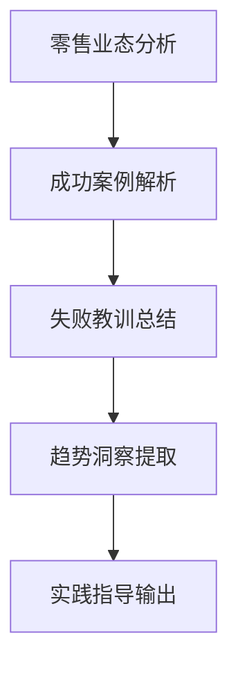

# 零售企业营销案例

## 📋 知识框架总览



---

## 🎯 核心理念

**零售企业营销案例研究** = 深度分析零售行业数字化转型过程中的营销创新实践，提炼新零售营销的成功模式和失败教训。

**核心价值**：通过零售营销案例学习，掌握新零售时代营销变革的核心规律和最佳实践

---

## 🏗️ 知识结构

### 第一层：认知基础

#### 1.1 零售营销变革特征

| 变革维度 | 传统零售 | 新零售营销 | 核心变化 | 成功要素 |
|----------|----------|------------|----------|----------|
| **购物体验** | 单一购买体验 | 全场景沉浸体验 | 从购买到体验 | 体验设计能力 |
| **渠道整合** | 线上线下割裂 | 全渠道无缝连接 | 渠道一体化 | 技术融合能力 |
| **数据应用** | 有限数据分析 | 大数据驱动决策 | 数据驱动营销 | AI算法能力 |
| **个性化服务** | 标准化服务 | 千人千面定制 | 个性化的规模化 | 用户画像精准度 |
| **供应链效率** | 传统供应链 | 智能供应链 | 效率革命 | 供应链数字化 |

#### 1.2 零售营销成功模型

**新零售营销模式矩阵**

```mermaid
graph TD
    A[新零售营销] --> B[数字化营销"]
    A --> C[场景化营销"]
    A --> D[社交化营销"]
    A --> E[智能化营销"
    
    B --> B1[线上线下一体化"]
    B --> B2[会员数字化管理"]
    B --> B3[全渠道库存管理"]
    
    C --> C1[物理空间再造"]
    C --> C2[生活场景营销"]
    C --> C3[沉浸式体验"]
    
    D --> D1[社交电商"]
    D --> D2[KOL合作营销"]
    D --> D3[用户分享传播"]
    
    E --> E1[AI推荐系统"]
    E --> E2[智能客服"]
    E --> E3[预测性库存"] "
```

---

### 第二层：理解深化

#### 2.1 成功案例分析

#### 案例1：小米新零售模式创新

**企业背景**：中国智能手机和智能家居品牌，新零售模式成功实践者

**新零售营销策略**：

**1. 线上线下融合**
```
小米之家 + 小米商城 + 小米有品 = 全渠道新零售生态
```

**成功要素**：
- **选址策略精准**：在一二线城市核心商圈开设小米之家
- **体验式设计**：门店设计强调产品体验和使用场景
- **价格统一透明**：线上线下同价，消除价格倒挂
- **库存一体化**：所有渠道共享库存，提高效率

**2. 粉丝经济营销**
- **米粉文化**：建立深度社群关系和粉丝文化
- **参与感营销**：让用户深度参与产品设计过程
- **口碑传播**：通过用户自然传播实现营销效果
- **品牌忠诚度**：建立超越销售的品牌感情

**3. 数据驱动运营**
- **实时数据监控**：实时监控各渠道的销售和库存数据
- **用户行为分析**：深度分析客户购买行为和偏好
- **精准营销**：基于数据的个性化推荐和营销
- **供应链优化**：依托数据优化供应链和库存管理

**营销成果**：
- **销售规模**：线上线下融合零售规模快速增长
- **效率提升**：零售效率实现质的提升
- **品牌价值**：品牌价值和用户体验全面提升

#### 案例2：星巴克数字化营销转型

**企业背景**：全球咖啡连锁品牌翘楚，数字化转型营销成功案例

**数字化营销实践**：

**1. 会员体系数字化**
- **数字化会员**：深度数字化会员服务和运营
- **移动支付应用**：移动端下单、支付、积分一体化
- **个性化推荐**：基于数据的个性化产品推荐
- **智能客服**：智能客服提升服务效率和体验

**2. 社交化营销实践**
- **微信营销**：深度整合微信生态和社交功能
- **UGC内容**：鼓励用户发布UGC内容和使用体验
- **社区建设**：线上线下结合的社区文化建设
- **情感营销**：通过咖啡文化建立品牌情感连接

**创新成果**：
- **数字化渗透**：数字化渠道销售占比不断提高
- **用户体验**：用户体验和便利性显著提升
- **品牌影响力**：品牌在年轻消费群体中影响力扩大

#### 2.2 失败案例分析

#### 案例3：某传统百货数字化转型失败

**失败背景**：某传统百货积极布局新零售却遭遇挫折

**失败原因分析**：
- **数字化转型激进**：转型步伐过激进，缺乏渐进式规划
- **线上线下冲突**：传统渠道和线上渠道利益冲突未解决
- **技术基础设施不足**：数字技术基础设施和能力建设不足
- **用户接受度低**：用户对数字化接受程度不及预期

**失败教训**：
- **数字化转型需要渐进式推进**：不能一蹴而就
- **需要循序渐进地改变企业文化**：数字化文化需要培育时间
- **技术与业务深度融合**：数字技术要与业务深度融合
- **用户体验至上**：数字化转型要坚持以用户为中心

---

### 第三层：应用实战

#### 3.1 零售营销转型框架

**新零售转型路径**

```mermaid
graph LR
    A[传统零售"] --> B[数字化改造"]
    B --> C[全渠道整合"]
    C --> D[智能化和个性化"]
    D --> E[场景化创新"]"
    
    A1[线下门店为主"] --> A
    B1[数字化基础设施"] --> B
    C1[线上线下融合"] --> C
    D1[AI+大数据应用"] --> D
    E1[场景体验创新"] --> E
```

#### 3.2 零售营销实践指南

**新零售营销核心要素**

| 要素类别 | 关键能力 | 实施要点 | 成功指标 | 评估周期 |
|----------|----------|----------|----------|----------|
| **数字化基础** | 数据收集+处理+应用 | 全链路数字化 | 数字化渗透率 | 月度 |
| **全渠道能力** | 渠道整合+库存统一 | 线上线下无缝体验 | 渠道销售占比 | 季度 |
| **用户体验** | 个性化+便利性+场景化 | 体验设计能力 | NPS评分 | 月度 |
| **供应链效率** | 智能预测+快速响应 | 供应链数字化 | 库存周转率 | 月度 |
| **数据运营** | AI+算法+预测 | 数据驱动决策 | 营销效果ROI | 月度 |

---

## 🎯 刻意练习计划

### 练习1：新零售转型案例深度分析
**任务**：深入分析某零售企业的新零售转型全过程
**输出**：转型分析报告+关键成功要素+关键失败教训+方法论提炼+实施指导
**评估**：分析深度+洞察准确性+方法论实用性+指导价值+学习运用

### 练习2：体验式零售营销创新实践
**任务**：设计并实施体验优化的新零售营销改进项目
**输出**：改进方案+实施过程+数据跟踪+效果评估+优化迭代+复制推广
**评估**：创新程度+用户体验+执行质量+效果达成+可持续性+规模化潜力

### 练习3：新零售数字化营销体系建设
**任务**：为新零售企业建立完整的数字化营销体系和能力
**输出**：体系设计+能力建设+工具平台+数据应用+运营管理+持续优化
**评估**：体系完整性+数字化能力+运营效率+学习能力+持续改进+业务影响

---

## 🧩 典型案例分析

### 综合案例：盒马新零售模式创新成功经验

**企业背景**：阿里巴巴旗下新零售标杆企业，新零售探索成功的典型代表

**新零售模式创新全景**：

**1. 商业模式创新**
```
生鲜超市 + 餐饮体验 + 电商配送 = 全新零售业态
```

**模式创新要素**：
- **业态融合**：超市+餐饮+配送的业态创新融合
- **前置仓模式**：依托商超的前置仓配送模式创新
- **数字化驱动**：AI等技术深度融入零售全流程
- **生态化布局**：与阿里生态深度融合形成协同

**2. 用户体验创新**
- **场景体验营销**：店内用餐+购买+配送一站式体验
- **新零售空间设计**：购物、餐饮、配送的空间场景化设计
- **数字化服务升级**：手机app点餐+到店配送+到家用餐全程数字化

**3. 供应链创新突破**
- **供应链数字化**：生鲜供应链全链路数字化管理
- **冷链物流能力**：完善的冷链物流配送网络建设
- **供应商深度合作**：与供应商深度合作保障供应链稳定

**成功要素深度剖析**：
- **技术驱动引领**：AI等技术深度融入零售创新的引领能力
- **模式创新突破**：商业模式创新实现了真正的差异化突破
- **用户体验至上**：一切以提升用户体验效率为中心的运营理念
- **生态化布局**：与阿里生态深度融合的生态系统打造能力

**关键成果展示**：
- **模式验证**：新零售模式在市场中得到较好验证
- **用户粘性**：用户粘性和消费频次显著提升
- **供应链效率**：供应链效率和商品损耗显著改善
- **商业价值**：创造了超越传统零售的商业价值

**成功启示**：
- 新零售的本质是体验、效率、成本的全面革命
- 技术要深度融入商业模式创新而非浅层应用
- 用户体验设计是新零售成功的核心要素
- 供应链数字化是零售效率提升的关键能力

---

## 🔗 知识连接

**核心关联模块**：
- [[01-快消品营销案例]] - 零售渠道快消品营销对比
- [[05-供应链营销案例]] - 零售供应链营销协同
- [[02-营销工具案例]] - 零售营销工具应用案例
- [[03-营销创新案例]] - 零售营销创新实践案例

**技能拓展路径**：
1. [[08-营销案例分析/01-消费类企业]] - 其他消费类企业案例对比
2. [[08-营销案例分析/02-工业类企业]] - 不同行业营销案例对比
3. [[08-营销案例分析/03-数字化营销]] - 零售数字化营销案例分析
4. [[08-营销案例分析/04-创新营销]] - 零售创新营销案例分析

---

## 📚 学习检查清单

**基础认知检查**：
- [ ] 理解新零售的核心特征和营销变革要点
- [ ] 掌握零售营销成功与失败的主要模式
- [ ] 能够识别新零售营销成功的关键要素

**深化理解检查**：
- [ ] 能够对成功案例进行深度分析和方法论提炼
- [ ] 掌握失败案例分析的方法和教训汲取技巧
- [ ] 理解零售营销创新发展的趋势和方向

**应用实践检查**：
- [ ] 能够进行零售营销案例的系统性分析
- [ ] 能够基于案例学习制定零售营销改进方案
- [ ] 能够设计零售营销创新的具体实践行动

**知识整合检查**：
- [ ] 能够将零售案例分析与其他营销理论与实践有机结合
- [ ] 能够在实际零售业务中建立持续学习的案例库和分析能力
- [ ] 能够基于案例分析指导零售营销的策略制定和执行优化

---

## 📝 总结反思

**核心学习收获**：
1. 新零售营销的核心是在保持线上便利性的同时重新定义线下的体验价值
2. 零售营销的成功本质上是体验、效率、成本平衡的艺术，技术要服务于提升这个平衡
3. 零售营销需要深度数字化和创新业态融合，但更关键的是要以用户体验为中心设计商业模式
4. 案例学习的关键是通过归纳分析找到成功案例的共同规律和关键要素，转化为自己企业的可执行方案

**实践建议**：
- 在选择零售营销案例进行学习时，要重点关注案例与自身企业的相似性和可比性
- 在分析案例时，要特别关注案例成功背后的团队能力、技术基础、资金投入等支撑条件
- 案例学习要与时俱进，及时跟踪零售营销的最新发展趋势和创新案例
