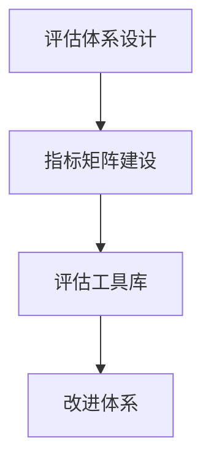

# 效果评估模板

## 📋 知识框架总览



---

## 🎯 核心理念

**营销效果评估模板** = 系统性营销ROI评估、绩效监控和持续优化的工具集与流程指南。

**核心价值**：数据驱动营销优化，确保营销投资产生真实商业价值

---

## 🏗️ 知识结构

### 第一层：评估框架

#### 1.1 评估指标体系

| 层面维度 | 核心指标 | 计算公式 | 行业基准参考 | 适用场景 |
|----------|----------|----------|-------------|----------|
| **传播层面** | 曝光量/覆盖率/到达率 | 实际曝光/目标人群 | 各行业5–15% | 品牌认知+覆盖 |
| **互动层面** | CTR/CVR/互动率/停留时长 | 点击数/曝光量 | CTR:1–5%,CVR:2–10% | 内容质量+用户体验 |
| **销售层面** | ROI/CPA/客单价/生命周期价值 | (收入–成本)/成本 | ROI>200% | 直接商业效果 |
| **品牌建设** | NPS/品牌认知度/净推荐值 | (推荐者–贬损者)/受访者总人数 | NPS>40较好 | 长期品牌资产 |

#### 1.2 效果评估层级与ROI金字塔

| 层级 | 衡量重点 | 关键指标组合 | 时间窗口 | 改进杠杆 |
|-------|----------|-------------|----------|----------|
| **战术层(月度/季报)** | 渠道/素材/触点效率 | CPA/CTR/CVR+质量分 | 1–3个月 | 创意+预算优化+AB测试 |
| **战役层(季度/半年报)** | Campaign表现+品牌力 | ROI+份额+心智 | 3–6个月 | 策略组合+差异化+信息架构 |
| **战略层(年报/年半报)** | 长期价值+市场地位 | CLV+品牌价值+市占率 | 6–24个月 | 品牌长期定位+客户关系+产品革新 |

---

### 第二层：评估工具库

#### 2.1 快速自检(周例会)模板表(15分钟法则)

| 周期维度 | 关注指标(周/双周) | 目标/阈值 | 本期表现 | 趋势(RGB) | 本周关键行动/调整 | 责任人 |
|----------|-----------------|-----------|----------|-----------|------------------|--------|
| **获客(Funnel)** | 新客/CAC(平均获客成本) | CAC<100元 | 120元 | 🔴恶化 | 加大高质量渠道投入 | 李四 |
| **留存(Retention)** | 7天/30天留存率 | 7天>30%,30天>15% | 26%/12% | 🟡波动 | 提升新客户Onboarding | 张三 |
| **收入(Revenue)** | 本周ARPU/总收入 | ARPU>200元 | 185/45K | 🟡波动 | 交叉销售+提价策略 | 王五 |
| **推荐(Referral)** | K-factor/口碑指数 | K>0.5 | 0.3 | 🔴恶化 | 会员转推+UGC激励 | 赵六 |

#### 2.2 ROI多维度矩阵(Excel/BI仪表盘输出表)

| 营销渠道/项目 | 投入成本(万元) | 收入贡献(万元) | ROI | 新客数 | CAC(元) | ARPU(元) | ROI+Brand Lift | 改进措施 |
|-------------|-------------|-------------|------|--------|---------|---------|---------------|----------|
| 抖音信息流 | ¥10 | ¥28 | 280% | 1850 | ¥54.1 | ¥151 | ✅+高(提升品牌关注度) | 扩大预算30% |
| 朋友圈原生 | ¥8 | ¥18 | 225% | 980 | ¥81.6 | ¥184 | ✅+中 | 优化素材+精准定向 |
| 小红书种草 | ¥6 | ¥8 | 133% | 320 | ¥187.5 | ¥250 | ✅+高 | 找更垂直KOL+长尾词 |
| 线下活动 | ¥15 | ¥32 | 213% | 5400 | ¥27.8 | ¥59 | ✅+高(面对面互动) | 复制至二三线城市 |

#### 2.3 影响与贡献度解耦(Attribution/归因)表

| 触点/漏斗环节 | 单独贡献(%) | 协同贡献(%) | 最终归因权重 | 实际成本 | 建议预算占比 |
|--------------|-------------|-------------|------------|----------|------------|
| 抖音信息流(首次接触) | 15% | 暂无 | 15% | ¥2 | 40% |
| 小红书N次曝光(复访/种草) | 25% | 10%(与抖音/微信打通) | 35% | ¥2 | 35% |
| 微信朋友圈→官网+购买 | 35% | 15% | 50% | ¥3 | 25% |

*注:协同效应若无法直接测量,可用对照组/时间序列等方法估算–并持续修正权重。*

---

### 第三层：执行与改进

#### 3.1 月度复盘与改进框架(“AAR–After Action Review”)

| 复盘四问 | 简要回答(KISS) | 改进建议 | 下期可度量目标 |
|----------|----------------|----------|-------------|
| **发生了什么**? | 收入较上月增15%;留存略降至12.5%;CPA微升7% |
| **为什么**? | 转化页优化+新用户引导流程有待完善 |
| **学到的**? | 短期收益与长期留存需并重;快速测试和迭代关键 |
| **下次如何改进**? | 增加A/B/C页面,A测U型引导,B测阶梯引导,C测短视频引导;留存目标回归15% |

#### 3.2 高阶精益(Lean)改进闭环

```mermaid
graph TD
    A[Plan计划] --> B[Do做"]
    B --> C[Check检查"]"
    C --> D[Act行动"]"
    
    A1[设定目标+假设+实验设计"] --> A
    B1[小规模实验+严密记录"] --> B
    C1[数据分析+假设验证"] --> C
    D1[总结(成功/失败)+放大/迭代"] --> D
    D1 --> A1"
```

---

## 🎯 刻意练习建议

- **练习1: 月度快速自检(15分钟周会)** – 每周15分钟练习汇总：上述“快速自检表(周例会)”;
  - 输出: 简短趋势分析(5–10句话)+本周关键动作(1–2条);
  - 进阶: 结合时间序列(例如Minitab/Excel自带)做置信区间预测。
- **练习2: “后验”归因复盘报告** – 选择一次营销成功/失败的campaign,使用内部+公开数据做多点归因分析;
  - 输出: 1–2页精简report: 贡献拆分+协同效应估算+下次预算分派建议。
- **练习3: 精益实验设计(14–30天)** – 设计一组A/B/C小实验(例如文案、落地页、定向人群),追踪关键漏斗(ROC–Rate of Conversion);
  - 输出: 实验设计(Hypothesis)+基线vs控制vs实验组数据+统计学显著性(P值)+下期实验假设。

---

## 🧩 应用示例

### 案例:《某快消品牌抖音ROAS绩效改进》

| 季度/月份 | 投入(万元) | GMV/GDP贡献(万元) | ROAS/ROI | 主要动作与假设 | 复盘与改进 |
|-----------|-----------|---------------|-----------|---------------|-----------|
| Q1 | ¥25 | ¥95 | 380% | 测试不同素材+人群 | 🔴 跑量不足+素材质量参差不齐 |
| Q2 | ¥35 | ¥145 | 414% | 加大精品素材+人群细化+出价升级 | 🟢 成功;Bid+15%,转化率+8% |
| Q3 | ¥50 | ¥228 | 456% | 全链路API归因+智能出价 | 🟢 进阶;Bid+10%,GMV+55% |
| Q4 | ¥45 | ¥218 | 484% | Holiday旺季+种草+复购闭环 | 🔴 竞对增长+成本上升;CPA+12% |

---

## 🔗 知识连接

- [[06-营销效果评估]] – 提供评估方法论根基
- [[06-营销效果评估/02-数据分析]] – 强化建模与可视化能力
- [[05-营销执行实施]] – 执行/监控/改进的执行载体

---

## 📚 检查清单

基础
- [ ] 掌握ROI/CPA/NPS等核心指标的计算和含义
- [ ] 能快速生成15分钟复盘:快速自检表(周例会)–趋势+行动

理解
- [ ] 能做出多维度ROI矩阵(Campaign/Channel)
- [ ] 初步运用A/B/C对照与归因权重估算

应用
- [ ] 与团队一起定期完成AAR复盘，制定并执行改进计划
- [ ] 能输出“Lean实验”:假设→记录→分析→总结→再实验

---

## 📝 要点总结

- 评估体系必须分层(战术/战役/战略)，指标与时间、用途对齐。
- 快速复盘(每周15分钟)是保持敏捷的最有效方式;“月度/季度”深度复盘则用于战略调优。
- ROI+Brand Lift(品牌提升)都需要量化;必要时借助MTA/IDFA等进阶模型–但需重视实用性。
- 形成PDCA闭环–Plan/Do/Check/Act;每周复盘=Check,每周行动=Plan+Do/Act。
