# 知识体系总结

## 营销知识体系概述

### 体系架构
本营销知识体系采用金字塔模型，从基础认知到高级应用，构建了完整的营销知识框架：

```mermaid
graph TD
    A[营销知识体系] --> B[01-营销总览]
    A --> C[02-营销基础认知]
    A --> D[03-营销理论框架]
    A --> E[04-营销策略制定]
    A --> F[05-营销执行实施]
    A --> G[06-营销效果评估]
    A --> H[07-营销创新趋势]
    A --> I[08-营销案例分析]
    A --> J[09-营销工具资源]
    A --> K[10-学习总结]
    
    B --> B1[知识地图]
    B --> B2[学习路径]
    B --> B3[核心概念]
    
    C --> C1[营销本质]
    C --> C2[发展历程]
    C --> C3[现代环境]
    C --> C4[思维模式]
    C --> C5[心理学基础]
    
    D --> D1[经典理论]
    D --> D2[战略理论]
    D --> D3[行为理论]
    
    E --> E1[市场分析]
    E --> E2[竞争策略]
    E --> E3[品牌策略]
    E --> E4[产品策略]
    
    F --> F1[数字营销]
    F --> F2[传统营销]
    F --> F3[客户管理]
    F --> F4[B2B营销]
    
    G --> G1[营销指标]
    G --> G2[数据分析]
    G --> G3[优化改进]
    
    H --> H1[新兴技术]
    H --> H2[新兴模式]
    H --> H3[未来趋势]
    H --> H4[全球化营销]
    
    I --> I1[成功案例]
    I --> I2[失败案例]
    I --> I3[行业案例]
    I --> I4[分析方法]
    
    J --> J1[营销工具]
    J --> J2[学习资源]
    J --> J3[模板工具]
    J --> J4[营销伦理]
    
    K --> K1[知识总结]
    K --> K2[学习心得]
    K --> K3[实践记录]
    K --> K4[学习计划]
```

### 知识层次
| 层次 | 内容 | 特点 | 学习目标 |
|------|------|------|----------|
| **基础层** | 营销基础认知 | 概念理解、思维建立 | 建立营销思维 |
| **理论层** | 营销理论框架 | 理论掌握、方法学习 | 掌握营销理论 |
| **策略层** | 营销策略制定 | 策略思维、规划能力 | 制定营销策略 |
| **执行层** | 营销执行实施 | 执行能力、操作技能 | 执行营销活动 |
| **评估层** | 营销效果评估 | 评估能力、优化思维 | 评估优化效果 |
| **创新层** | 营销创新趋势 | 创新思维、趋势把握 | 把握营销趋势 |
| **案例层** | 营销案例分析 | 案例分析、经验学习 | 学习营销经验 |
| **工具层** | 营销工具资源 | 工具使用、资源整合 | 掌握营销工具 |
| **总结层** | 学习总结反思 | 总结反思、持续改进 | 持续学习改进 |

## 核心知识点总结

### 营销基础认知
#### 营销本质
- **定义**：营销是创造、传播、传递和交换对顾客、客户、合作伙伴和整个社会有价值的产品、服务、信息和体验的活动
- **核心要素**：需求、产品、价值、交换、市场、关系
- **价值创造**：通过满足客户需求创造价值，实现价值交换

#### 营销发展历程
| 阶段 | 时间 | 特点 | 核心理念 |
|------|------|------|----------|
| **生产导向** | 19世纪末-20世纪初 | 以生产为中心 | 生产什么卖什么 |
| **产品导向** | 20世纪初-20世纪30年代 | 以产品为中心 | 产品好自然好卖 |
| **销售导向** | 20世纪30年代-50年代 | 以销售为中心 | 推销促进销售 |
| **市场导向** | 20世纪50年代-80年代 | 以市场为中心 | 满足市场需求 |
| **社会导向** | 20世纪80年代-90年代 | 以社会为中心 | 承担社会责任 |
| **关系导向** | 20世纪90年代-2000年 | 以关系为中心 | 建立客户关系 |
| **价值导向** | 2000年至今 | 以价值为中心 | 创造客户价值 |

#### 现代营销环境
- **宏观环境**：政治法律、经济、社会文化、技术、自然、人口
- **微观环境**：企业、供应商、营销中介、顾客、竞争者、公众
- **环境特点**：变化快速、不确定性、复杂性、动态性

### 营销理论框架
#### 经典营销理论
| 理论 | 内容 | 特点 | 应用 |
|------|------|------|------|
| **4P理论** | Product、Price、Place、Promotion | 产品导向、企业视角 | 传统营销组合 |
| **4C理论** | Customer、Cost、Convenience、Communication | 顾客导向、顾客视角 | 顾客价值营销 |
| **4R理论** | Relevance、Reaction、Relationship、Return | 关系导向、互动视角 | 关系营销 |

#### 战略营销理论
- **STP理论**：市场细分、目标市场选择、市场定位
- **竞争分析**：波特五力模型、竞争对手分析
- **定位理论**：心智定位、差异化定位
- **蓝海战略**：价值创新、四步动作框架

#### 消费者行为理论
- **决策过程**：需求识别、信息搜索、方案评估、购买决策、购后行为
- **心理分析**：认知、情感、意志、个性
- **细分理论**：地理、人口、心理、行为细分
- **洞察方法**：定性、定量、混合研究方法

### 营销策略制定
#### 市场分析
- **市场调研**：调研方法、数据收集、分析技术
- **市场细分**：细分标准、细分方法、细分评估
- **目标市场**：选择标准、选择策略、市场进入
- **机会分析**：机会识别、机会评估、机会利用

#### 竞争策略
- **竞争分析**：竞争对手识别、分析框架、竞争情报
- **差异化**：差异化维度、差异化策略、差异化实施
- **定价策略**：定价方法、定价策略、价格管理
- **定位策略**：定位方法、定位实施、定位维护

#### 品牌策略
- **品牌定位**：定位策略、定位实施、定位传播
- **品牌传播**：传播策略、传播渠道、传播内容
- **品牌管理**：品牌架构、品牌延伸、品牌保护
- **品牌价值**：价值评估、价值提升、价值实现

#### 产品策略
- **生命周期**：阶段特征、策略重点、管理要点
- **产品组合**：组合策略、组合优化、组合管理
- **新产品开发**：开发流程、开发策略、开发管理
- **产品创新**：创新类型、创新策略、创新管理

### 营销执行实施
#### 数字营销
- **社交媒体**：平台选择、内容策略、互动管理
- **搜索引擎**：SEO优化、SEM投放、搜索分析
- **内容营销**：内容策略、内容创作、内容分发
- **邮件营销**：邮件策略、邮件设计、邮件优化
- **移动营销**：移动策略、APP营销、移动优化
- **程序化广告**：投放策略、技术实现、效果优化

#### 传统营销
- **广告策略**：广告创意、媒体选择、投放策略
- **公关策略**：公关活动、媒体关系、危机公关
- **促销策略**：促销类型、促销设计、促销执行
- **渠道管理**：渠道设计、渠道管理、渠道优化
- **零售营销**：零售策略、店面管理、客户服务

#### 客户管理
- **客户关系**：关系建立、关系维护、关系深化
- **生命周期**：阶段管理、策略重点、价值提升
- **价值分析**：价值评估、价值细分、价值提升
- **忠诚度管理**：忠诚度建设、忠诚度维护、忠诚度提升

#### B2B营销
- **营销策略**：B2B特点、策略制定、策略实施
- **销售管理**：销售团队、销售流程、销售管理
- **渠道伙伴**：伙伴选择、伙伴管理、伙伴激励
- **客户开发**：客户识别、客户开发、客户维护

### 营销效果评估
#### 营销指标
- **KPI体系**：指标设计、指标管理、指标优化
- **ROI计算**：计算方法、计算模型、计算应用
- **效果评估**：评估方法、评估标准、评估应用
- **预算管理**：预算制定、预算控制、预算优化

#### 数据分析
- **营销数据**：数据收集、数据处理、数据分析
- **用户行为**：行为分析、行为预测、行为优化
- **市场趋势**：趋势分析、趋势预测、趋势应用
- **预测模型**：模型构建、模型应用、模型优化

#### 优化改进
- **A/B测试**：测试设计、测试执行、测试分析
- **优化策略**：优化方法、优化实施、优化效果
- **改进机制**：改进流程、改进方法、改进管理
- **实验设计**：实验方法、实验实施、实验分析

### 营销创新趋势
#### 新兴技术
- **AI营销**：智能推荐、智能客服、智能分析
- **大数据**：数据洞察、用户画像、预测分析
- **区块链**：透明营销、数据确权、智能合约
- **物联网**：智能设备、实时数据、个性化服务
- **虚拟现实**：沉浸体验、虚拟试穿、虚拟旅游

#### 新兴模式
- **私域流量**：流量运营、用户运营、价值变现
- **直播营销**：直播带货、直播互动、直播转化
- **短视频**：内容创作、平台运营、商业变现
- **社群营销**：社群建设、社群运营、社群变现
- **Influencer营销**：KOL合作、内容共创、影响力变现

#### 未来趋势
- **个性化**：深度个性化、实时个性化、全渠道个性化
- **智能化**：全面智能化、自动化营销、智能决策
- **体验化**：沉浸体验、全感官体验、情感体验
- **生态化**：营销生态、价值共创、生态协同

#### 全球化营销
- **市场进入**：进入策略、进入模式、进入时机
- **跨文化**：文化差异、文化适应、文化融合
- **全球品牌**：品牌全球化、品牌本地化、品牌管理
- **本地化**：产品本地化、营销本地化、服务本地化

## 学习方法总结

### 学习路径
#### 基础阶段
1. **建立认知**：理解营销本质、建立营销思维
2. **学习理论**：掌握经典理论、理解理论框架
3. **案例分析**：分析经典案例、学习成功经验

#### 进阶阶段
1. **策略制定**：学习策略制定、掌握规划方法
2. **执行实施**：学习执行方法、掌握操作技能
3. **效果评估**：学习评估方法、掌握优化技巧

#### 高级阶段
1. **创新应用**：学习创新趋势、掌握前沿技术
2. **工具使用**：掌握营销工具、提升工作效率
3. **实践应用**：理论联系实际、持续改进提升

### 学习技巧
#### 费曼学习法
- **概念理解**：用简单语言解释复杂概念
- **教学相长**：通过教学加深理解
- **查漏补缺**：发现知识盲点及时补充
- **简化表达**：用最简洁的方式表达核心思想

#### 刻意练习
- **目标明确**：设定具体学习目标
- **专注练习**：专注核心技能练习
- **及时反馈**：获得及时反馈和指导
- **持续改进**：基于反馈持续改进

#### 金字塔学习
- **结构清晰**：建立清晰的知识结构
- **层次分明**：从基础到高级层次分明
- **逻辑严密**：知识间逻辑关系严密
- **系统完整**：知识体系完整系统

### 实践应用
#### 理论学习
- **概念掌握**：深入理解核心概念
- **理论联系**：理解理论间的关系
- **案例验证**：通过案例验证理论
- **批判思考**：对理论进行批判思考

#### 实践操作
- **项目实践**：通过项目实践应用知识
- **工具使用**：熟练使用营销工具
- **效果评估**：评估实践效果
- **经验总结**：总结实践经验

#### 持续改进
- **反思总结**：定期反思总结学习
- **知识更新**：持续更新知识体系
- **技能提升**：不断提升技能水平
- **创新应用**：创新应用所学知识

## 知识应用指南

### 应用场景
#### 职业发展
- **营销专员**：基础理论、执行技能、工具使用
- **营销经理**：策略制定、团队管理、效果评估
- **营销总监**：战略规划、创新应用、趋势把握
- **营销专家**：理论创新、方法创新、工具创新

#### 行业应用
- **快消品**：品牌建设、渠道管理、促销策略
- **科技产品**：产品创新、技术营销、用户教育
- **服务业**：服务营销、客户关系、体验设计
- **B2B行业**：关系营销、解决方案、价值营销

#### 企业规模
- **初创企业**：基础营销、成本控制、快速验证
- **中小企业**：精准营销、效率提升、资源优化
- **大型企业**：品牌管理、渠道整合、创新驱动
- **跨国企业**：全球营销、本地化、文化适应

### 应用原则
#### 系统性原则
- **整体思维**：从整体角度思考营销问题
- **系统方法**：运用系统方法解决问题
- **协调统一**：各要素协调统一
- **动态平衡**：保持系统动态平衡

#### 创新性原则
- **思维创新**：创新营销思维
- **方法创新**：创新营销方法
- **工具创新**：创新营销工具
- **模式创新**：创新营销模式

#### 实用性原则
- **理论联系实际**：理论指导实践
- **问题导向**：以解决问题为导向
- **效果导向**：以效果为导向
- **持续改进**：持续改进优化

#### 伦理性原则
- **诚信营销**：诚信经营、诚实营销
- **社会责任**：承担社会责任
- **消费者权益**：保护消费者权益
- **可持续发展**：可持续发展营销

## 持续学习计划

### 学习目标
#### 短期目标（1-3个月）
- **基础巩固**：巩固营销基础知识
- **技能提升**：提升核心营销技能
- **工具掌握**：掌握常用营销工具
- **案例学习**：学习更多营销案例

#### 中期目标（3-12个月）
- **理论深化**：深化营销理论理解
- **实践应用**：在项目中应用所学
- **创新探索**：探索营销创新方法
- **经验积累**：积累营销实践经验

#### 长期目标（1-3年）
- **专业精通**：成为营销领域专家
- **理论创新**：在理论上有所创新
- **方法创新**：在方法上有所创新
- **影响力提升**：提升在行业中的影响力

### 学习资源
#### 书籍资源
- **经典教材**：营销管理、消费者行为、品牌管理
- **前沿著作**：数字营销、AI营销、创新营销
- **案例集**：营销案例集、成功案例、失败案例
- **工具书**：营销工具书、方法指南、操作手册

#### 在线资源
- **在线课程**：MOOC课程、专业培训、企业内训
- **行业报告**：行业分析报告、趋势报告、研究报告
- **专业网站**：营销专业网站、行业门户、知识平台
- **学术期刊**：营销学术期刊、行业期刊、研究报告

#### 实践资源
- **项目实践**：实际项目、模拟项目、案例分析
- **工具使用**：营销工具、分析工具、管理工具
- **网络社区**：专业社区、行业论坛、学习小组
- **导师指导**：行业导师、专业顾问、经验分享

### 学习方法
#### 主动学习
- **目标驱动**：设定明确学习目标
- **问题导向**：以问题为导向学习
- **实践结合**：理论学习与实践结合
- **反思总结**：定期反思总结学习

#### 协作学习
- **团队学习**：组建学习团队
- **经验分享**：分享学习经验
- **讨论交流**：讨论交流学习心得
- **互助支持**：相互支持帮助

#### 持续学习
- **终身学习**：树立终身学习理念
- **知识更新**：持续更新知识体系
- **技能提升**：不断提升技能水平
- **适应变化**：适应环境变化发展

---

**相关链接**：
- [[营销/10-学习总结/02-学习心得记录|学习心得记录]]
- [[03-实践应用记录|实践应用记录]]
- [[04-持续学习计划|持续学习计划]]
- [[01-营销知识地图|营销知识地图]]
