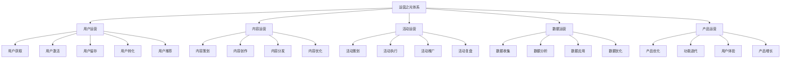
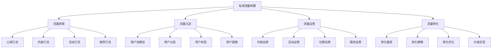
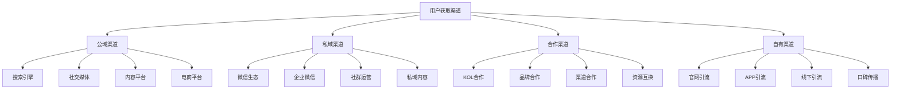
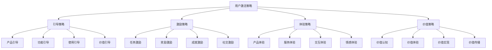
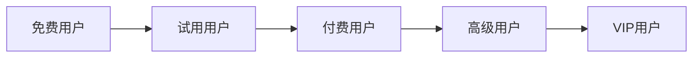
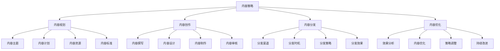
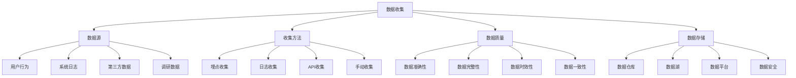

# 运营之光：私域运营体系知识地图

## 运营之光概述

### 定义与本质
**运营之光**：以用户为中心，通过系统性的运营策略和方法，构建私域流量池，实现用户价值最大化的运营体系。

### 运营体系框架


## 私域运营理论

### 私域流量理论
#### 1. 私域流量定义
**私域流量**：企业自主拥有的、可自由控制、可重复利用、可精准触达的用户流量。

#### 2. 私域流量特征
| 特征 | 描述 | 优势 | 应用价值 |
|------|------|------|----------|
| **自主性** | 企业自主拥有和控制 | 不受平台限制 | 运营自由度 |
| **可重复性** | 可重复触达和利用 | 降低获客成本 | 成本效益 |
| **精准性** | 可精准触达目标用户 | 提高转化效率 | 精准营销 |
| **持续性** | 可持续运营和维护 | 长期价值创造 | 价值最大化 |

#### 3. 私域流量构建


### 用户生命周期理论
#### 生命周期阶段
| 阶段 | 特征 | 目标 | 策略重点 | 关键指标 |
|------|------|------|----------|----------|
| **获客期** | 新用户获取 | 用户增长 | 渠道优化、内容营销 | 获客成本、转化率 |
| **激活期** | 用户首次体验 | 产品体验 | 引导流程、新手任务 | 激活率、完成率 |
| **留存期** | 用户持续使用 | 用户留存 | 内容运营、活动运营 | 留存率、活跃度 |
| **转化期** | 用户付费转化 | 商业变现 | 付费引导、价值传递 | 转化率、客单价 |
| **推荐期** | 用户主动推荐 | 用户增长 | 推荐机制、激励措施 | 推荐率、推荐价值 |

## 用户运营策略

### 1. 用户获取策略
#### 获取渠道


#### 获取策略
- **内容营销**：优质内容吸引用户
- **活动营销**：营销活动获取用户
- **推荐营销**：用户推荐获取新用户
- **合作营销**：合作伙伴推荐用户

### 2. 用户激活策略
#### 激活方法
| 方法类型 | 具体内容 | 实施要点 | 预期效果 |
|----------|----------|----------|----------|
| **新手引导** | 产品功能介绍、使用指导 | 简化流程、清晰指引 | 提高激活率 |
| **任务激励** | 新手任务、奖励机制 | 任务设计、奖励设置 | 促进完成 |
| **体验优化** | 产品体验、服务体验 | 体验设计、问题解决 | 提升满意度 |
| **价值传递** | 产品价值、服务价值 | 价值展示、价值实现 | 建立认知 |

#### 激活策略


### 3. 用户留存策略
#### 留存方法
- **内容留存**：优质内容吸引用户
- **活动留存**：定期活动活跃用户
- **社群留存**：社群运营维护用户
- **服务留存**：优质服务留住用户

#### 留存策略
- **个性化推荐**：个性化内容推荐
- **社交互动**：社交功能增强粘性
- **成长体系**：用户成长激励体系
- **会员权益**：会员专属权益

### 4. 用户转化策略
#### 转化路径


#### 转化策略
- **价值传递**：传递产品价值
- **试用体验**：提供试用机会
- **限时优惠**：限时优惠促进转化
- **个性化服务**：个性化服务提升价值

### 5. 用户推荐策略
#### 推荐机制
- **推荐奖励**：推荐新用户奖励
- **社交分享**：社交分享功能
- **口碑传播**：口碑传播机制
- **社群推荐**：社群推荐活动

## 内容运营策略

### 1. 内容策略
#### 内容类型
| 内容类型 | 特点 | 适用场景 | 制作要求 |
|----------|------|----------|----------|
| **教育内容** | 知识性、实用性 | 用户教育 | 专业、准确 |
| **娱乐内容** | 趣味性、互动性 | 用户活跃 | 有趣、互动 |
| **资讯内容** | 时效性、价值性 | 信息传递 | 及时、有价值 |
| **故事内容** | 情感性、共鸣性 | 情感连接 | 真实、感人 |

#### 内容策略


### 2. 内容创作
#### 创作原则
- **用户导向**：以用户需求为导向
- **价值导向**：创造用户价值
- **质量导向**：保证内容质量
- **创新导向**：持续内容创新

#### 创作方法
- **用户调研**：了解用户需求
- **竞品分析**：分析竞品内容
- **热点追踪**：追踪热点话题
- **数据驱动**：基于数据创作

### 3. 内容分发
#### 分发渠道
- **自有渠道**：官网、APP、社群
- **社交媒体**：微信、微博、抖音
- **内容平台**：知乎、小红书、B站
- **合作渠道**：合作伙伴渠道

#### 分发策略
- **多渠道分发**：全渠道内容分发
- **精准分发**：精准目标用户分发
- **时机优化**：优化分发时机
- **效果监测**：监测分发效果

## 活动运营策略

### 1. 活动策划
#### 活动类型
| 活动类型 | 特点 | 目标 | 实施要点 |
|----------|------|------|----------|
| **拉新活动** | 吸引新用户 | 用户增长 | 吸引力、参与度 |
| **促活活动** | 活跃现有用户 | 用户活跃 | 趣味性、互动性 |
| **留存活动** | 留住用户 | 用户留存 | 价值性、持续性 |
| **转化活动** | 促进付费 | 商业变现 | 优惠性、紧迫性 |

#### 活动策划
```mermaid
graph TD
    A[活动策划] --> B[目标设定]
    A --> C[活动设计]
    A --> D[资源准备]
    A --> E[执行计划]
    
    B --> B1[活动目标]
    B --> B2[目标用户]
    B --> B3[预期效果]
    B --> B4[成功指标
    
    C --> C1[活动主题]
    C --> C2[活动形式]
    C --> C3[活动规则]
    C --> C4[活动流程]
    
    D --> D1[人员准备]
    D --> D2[物料准备]
    D --> D3[技术准备]
    D --> D4[预算准备]
    
    E --> E1[时间安排]
    E --> E2[任务分工]
    E --> E3[风险控制]
    E --> E4[应急预案]
```

### 2. 活动执行
#### 执行要点
- **时间管理**：合理安排活动时间
- **人员管理**：有效管理执行人员
- **进度控制**：控制活动执行进度
- **质量控制**：保证活动执行质量

#### 执行策略
- **分阶段执行**：分阶段推进活动
- **实时监控**：实时监控活动进展
- **问题解决**：及时解决执行问题
- **效果跟踪**：跟踪活动执行效果

### 3. 活动复盘
#### 复盘内容
- **目标达成**：活动目标达成情况
- **执行过程**：活动执行过程分析
- **效果评估**：活动效果评估
- **经验总结**：活动经验总结

#### 复盘方法
- **数据对比**：活动前后数据对比
- **用户反馈**：收集用户反馈意见
- **团队讨论**：团队内部讨论分析
- **改进建议**：提出改进建议

## 数据运营策略

### 1. 数据收集
#### 收集类型
| 数据类型 | 内容 | 收集方法 | 应用价值 |
|----------|------|----------|----------|
| **用户数据** | 用户行为、用户属性 | 埋点、问卷 | 用户分析 |
| **内容数据** | 内容表现、内容效果 | 统计、分析 | 内容优化 |
| **活动数据** | 活动参与、活动效果 | 监测、统计 | 活动优化 |
| **业务数据** | 业务指标、业务表现 | 系统、报表 | 业务分析 |

#### 数据收集


### 2. 数据分析
#### 分析方法
- **描述性分析**：描述数据特征
- **诊断性分析**：分析问题原因
- **预测性分析**：预测未来趋势
- **规范性分析**：提供决策建议

#### 分析工具
- **Excel**：基础数据分析
- **Python**：高级数据分析
- **R语言**：统计分析
- **Tableau**：数据可视化

### 3. 数据应用
#### 应用场景
- **用户画像**：构建用户画像
- **个性化推荐**：个性化内容推荐
- **运营优化**：优化运营策略
- **决策支持**：支持业务决策

#### 应用策略
- **实时应用**：实时数据应用
- **预测应用**：预测性数据应用
- **优化应用**：优化性数据应用
- **创新应用**：创新性数据应用

## 产品运营策略

### 1. 产品优化
#### 优化维度
| 优化维度 | 内容 | 优化方法 | 预期效果 |
|----------|------|----------|----------|
| **功能优化** | 产品功能、用户体验 | 用户反馈、数据分析 | 功能完善 |
| **性能优化** | 产品性能、响应速度 | 技术优化、架构升级 | 性能提升 |
| **界面优化** | 用户界面、交互设计 | 设计优化、用户测试 | 体验提升 |
| **内容优化** | 产品内容、信息架构 | 内容优化、结构优化 | 内容质量 |

#### 优化策略
```mermaid
graph TD
    A[产品优化] --> B[用户反馈]
    A --> C[数据分析]
    A --> D[竞品分析]
    A --> E[技术升级]
    
    B --> B1[用户调研]
    B --> B2[用户访谈]
    B --> B3[用户测试]
    B --> B4[用户评价]
    
    C --> C1[使用数据]
    C --> C2[行为数据]
    C --> C3[性能数据]
    C --> C4[业务数据"]
    
    D --> D1[功能对比]
    D --> D2[体验对比"]
    D --> D3[价格对比"]
    D --> D4[策略对比"]
    
    E --> E1[技术架构"]
    E --> E2[技术栈升级"]
    E --> E3[性能优化"]
    E --> E4[安全升级"]
```

### 2. 功能迭代
#### 迭代原则
- **用户导向**：以用户需求为导向
- **数据驱动**：基于数据决策
- **快速迭代**：快速响应市场变化
- **持续改进**：持续优化产品

#### 迭代流程
- **需求收集**：收集用户需求
- **需求分析**：分析需求优先级
- **功能设计**：设计产品功能
- **开发实现**：开发产品功能
- **测试验证**：测试功能效果
- **发布上线**：发布新功能
- **效果评估**：评估功能效果

### 3. 用户体验
#### 体验要素
- **易用性**：产品易用程度
- **效率性**：使用效率
- **满意度**：用户满意度
- **忠诚度**：用户忠诚度

#### 体验优化
- **用户研究**：深入研究用户需求
- **原型设计**：设计产品原型
- **用户测试**：测试用户体验
- **迭代优化**：持续优化体验

## 运营之光实践

### 实施步骤
#### 1. 体系构建
```mermaid
graph LR
    A[现状分析] --> B[策略制定]
    B --> C[体系设计]
    C --> D[工具选择"]
    D --> E[团队建设"]
    E --> F[实施执行"]
```

#### 2. 运营执行
- **用户运营**：执行用户运营策略
- **内容运营**：执行内容运营策略
- **活动运营**：执行活动运营策略
- **数据运营**：执行数据运营策略
- **产品运营**：执行产品运营策略

#### 3. 效果评估
- **指标监测**：监测运营指标
- **效果评估**：评估运营效果
- **策略调整**：调整运营策略
- **持续优化**：持续优化改进

### 成功要素
#### 1. 内部要素
| 要素类型 | 具体内容 | 重要性 | 影响程度 |
|----------|----------|--------|----------|
| **团队能力** | 运营团队专业能力 | 高 | 直接影响 |
| **产品实力** | 产品功能和质量 | 高 | 直接影响 |
| **技术支撑** | 技术平台和工具 | 中 | 间接影响 |
| **资源投入** | 人力、财力、物力 | 中 | 间接影响 |

#### 2. 外部要素
- **市场环境**：市场竞争环境
- **用户需求**：用户需求变化
- **技术发展**：技术发展趋势
- **政策环境**：相关政策环境

## 运营之光案例

### 成功案例：完美日记私域运营
#### 运营策略
- **全渠道布局**：线上线下全渠道
- **内容营销**：优质内容营销
- **社群运营**：精细化社群运营
- **数据驱动**：数据驱动运营

#### 实施要点
- 全渠道用户获取
- 优质内容创作
- 精细化用户运营
- 数据化运营管理

#### 成功因素
- 强大的产品力
- 优质的内容力
- 精细的运营力
- 数据化的管理力

### 失败案例：私域运营失败
#### 问题分析
- 策略不清晰
- 执行不到位
- 数据不准确
- 效果不明显

#### 改进建议
- 明确运营策略
- 加强执行管理
- 提升数据质量
- 优化运营效果

## 运营之光趋势

### 数字化趋势
#### 趋势特征
- **智能化运营**：AI驱动的智能运营
- **自动化运营**：运营流程自动化
- **数据化运营**：数据驱动运营决策
- **个性化运营**：个性化用户运营

#### 实施要点
- AI技术应用
- 自动化工具
- 数据平台建设
- 个性化算法

### 生态化趋势
#### 趋势特征
- **生态化运营**：构建运营生态
- **平台化运营**：平台化运营模式
- **开放化运营**：开放化运营策略
- **协同化运营**：协同化运营机制

#### 实施要点
- 生态体系建设
- 平台化发展
- 开放化策略
- 协同化机制

## 实践应用

### 运营之光实施步骤
1. **现状分析**：分析运营现状
2. **策略制定**：制定运营策略
3. **体系设计**：设计运营体系
4. **工具选择**：选择运营工具
5. **团队建设**：建设运营团队
6. **实施执行**：执行运营策略
7. **效果评估**：评估运营效果
8. **持续优化**：持续优化改进

### 运营之光最佳实践
- **用户中心**：以用户为中心
- **数据驱动**：数据驱动决策
- **内容为王**：优质内容创造
- **持续创新**：持续创新改进
- **价值导向**：价值创造导向

---

**相关链接**：
- [[05-营销执行实施/01-数字营销/01-社交媒体营销|社交媒体营销]]
- [[05-营销执行实施/01-数字营销/02-内容营销|内容营销]]
- [[05-营销执行实施/01-数字营销/03-社群营销|社群营销]]
- [[05-营销执行实施/03-客户管理/01-客户关系管理|客户关系管理]]
- [[06-营销效果评估/02-数据分析/01-营销数据分析|营销数据分析]]