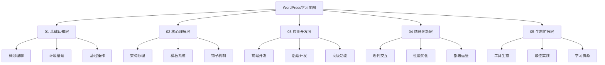

# WordPress学习地图

## 🎯 学习目标
通过系统化学习，掌握WordPress从基础到高级的完整知识体系，具备独立开发WordPress网站和插件的能力。

## 📊 学习路径总览

## 🗺️ 详细学习路径

### 第一阶段：基础认知层 (2-3周)
**目标**: 建立WordPress基础认知，掌握基本操作

| 模块 | 学习内容 | 时间 | 检查点 |
|------|----------|------|--------|
| [[01-基础认知层/01-概念理解/WordPress是什么|概念理解]] | WordPress概念、生态、发展历程 | 3天 | 能解释WordPress的核心价值 |
| [[01-基础认知层/02-环境搭建/本地开发环境|环境搭建]] | 本地环境、服务器部署、数据库配置 | 5天 | 成功搭建开发环境 |
| [[01-基础认知层/03-基础操作/仪表盘导航|基础操作]] | 仪表盘、内容管理、用户权限 | 7天 | 熟练使用后台管理 |

**里程碑**: 完成第一个WordPress网站搭建

### 第二阶段：核心理解层 (3-4周)
**目标**: 深入理解WordPress核心机制

| 模块 | 学习内容 | 时间 | 检查点 |
|------|----------|------|--------|
| [[02-核心理解层/01-架构原理/文件结构详解|架构原理]] | 文件结构、数据库、请求流程 | 7天 | 理解WordPress工作原理 |
| [[02-核心理解层/02-模板系统/模板层次结构|模板系统]] | 模板层次、循环机制、标签使用 | 7天 | 能修改和创建模板 |
| [[02-核心理解层/03-钩子机制/Actions钩子|钩子机制]] | Actions、Filters、自定义钩子 | 7天 | 掌握钩子系统使用 |

**里程碑**: 理解WordPress核心机制，能进行基础定制

### 第三阶段：应用开发层 (4-6周)
**目标**: 掌握WordPress开发技能

| 模块 | 学习内容 | 时间 | 检查点 |
|------|----------|------|--------|
| [[03-应用开发层/01-前端开发/主题开发基础|前端开发]] | 主题开发、模板定制、响应式设计 | 10天 | 开发自定义主题 |
| [[03-应用开发层/02-后端开发/插件开发基础|后端开发]] | 插件开发、CPT、自定义字段 | 10天 | 开发功能插件 |
| [[03-应用开发层/03-高级功能/Gutenberg区块开发|高级功能]] | Gutenberg、REST API、AJAX | 10天 | 掌握现代WordPress功能 |

**里程碑**: 具备独立开发WordPress主题和插件的能力

### 第四阶段：精通创新层 (4-5周)
**目标**: 掌握高级技术和性能优化

| 模块 | 学习内容 | 时间 | 检查点 |
|------|----------|------|--------|
| [[04-精通创新层/01-现代交互/Headless WordPress|现代交互]] | Headless、PWA、SPA集成 | 7天 | 实现现代Web应用 |
| [[04-精通创新层/02-性能优化/数据库优化|性能优化]] | 数据库优化、缓存策略、CDN | 7天 | 优化网站性能 |
| [[04-精通创新层/03-部署运维/服务器配置|部署运维]] | 服务器配置、自动化部署、监控 | 7天 | 掌握生产环境部署 |

**里程碑**: 能构建高性能、可扩展的WordPress应用

### 第五阶段：生态扩展层 (2-3周)
**目标**: 了解WordPress生态和最佳实践

| 模块 | 学习内容 | 时间 | 检查点 |
|------|----------|------|--------|
| [[05-生态扩展层/01-工具生态/开发工具|工具生态]] | 开发工具、插件生态、版本管理 | 5天 | 掌握开发工具链 |
| [[05-生态扩展层/02-最佳实践/代码规范|最佳实践]] | 代码规范、安全实践、团队协作 | 5天 | 遵循最佳实践 |
| [[05-生态扩展层/03-学习资源/官方文档|学习资源]] | 官方文档、社区资源、持续学习 | 3天 | 建立持续学习体系 |

**里程碑**: 成为WordPress开发专家

## 🎯 学习策略

### 费曼学习法应用
1. **概念学习**: 用简单语言解释复杂概念
2. **教学实践**: 向他人讲解所学知识
3. **知识简化**: 将复杂知识分解为简单概念
4. **回顾总结**: 定期回顾和总结学习内容

### 刻意练习方法
1. **目标明确**: 每个阶段都有明确的学习目标
2. **及时反馈**: 通过检查点和项目获得反馈
3. **持续改进**: 根据反馈调整学习策略
4. **挑战性任务**: 逐步增加学习难度

## 📚 学习资源导航

### 快速参考
- [[90-快速参考/函数速查表|函数速查表]]
- [[90-快速参考/模板标签速查|模板标签速查]]
- [[90-快速参考/钩子速查表|钩子速查表]]

### 故障排除
- [[91-故障排除/常见问题解决|常见问题解决]]
- [[91-故障排除/性能问题诊断|性能问题诊断]]

### 实战项目
- [[99-实战项目/01-博客网站项目|博客网站项目]]
- [[99-实战项目/02-企业官网项目|企业官网项目]]
- [[99-实战项目/03-电商网站项目|电商网站项目]]

## ⏰ 学习时间规划

| 阶段 | 总时间 | 每日学习时间 | 完成周期 |
|------|--------|--------------|----------|
| 基础认知层 | 2-3周 | 2-3小时 | 15-21天 |
| 核心理解层 | 3-4周 | 3-4小时 | 21-28天 |
| 应用开发层 | 4-6周 | 4-5小时 | 28-42天 |
| 精通创新层 | 4-5周 | 4-5小时 | 28-35天 |
| 生态扩展层 | 2-3周 | 2-3小时 | 14-21天 |

**总计**: 15-21周 (约4-5个月)

## 🎯 学习检查清单

### 基础认知层检查点
- [ ] 理解WordPress核心概念
- [ ] 成功搭建开发环境
- [ ] 熟练使用后台管理
- [ ] 完成基础网站搭建

### 核心理解层检查点
- [ ] 理解WordPress架构原理
- [ ] 掌握模板系统机制
- [ ] 熟练使用钩子系统
- [ ] 能进行基础定制开发

### 应用开发层检查点
- [ ] 开发自定义主题
- [ ] 开发功能插件
- [ ] 掌握现代WordPress功能
- [ ] 完成综合开发项目

### 精通创新层检查点
- [ ] 实现现代Web应用
- [ ] 优化网站性能
- [ ] 掌握生产环境部署
- [ ] 构建可扩展应用

### 生态扩展层检查点
- [ ] 掌握开发工具链
- [ ] 遵循最佳实践
- [ ] 建立持续学习体系
- [ ] 成为WordPress专家

## 🔗 相关链接

- [[学习检查清单|学习检查清单]]
- [[技能树|技能树]]
- [[项目实战|项目实战]]
- [[学习计划模板|学习计划模板]]

---

**下一步**: 开始[[01-基础认知层/01-概念理解/WordPress是什么|第一阶段学习]]
