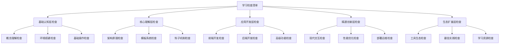

# WordPress学习检查清单

## 🎯 检查清单总览

通过系统化的检查清单，确保每个学习阶段都达到预期目标，为下一阶段学习打下坚实基础。

## 📊 检查清单结构

## 🌱 基础认知层检查清单

### 概念理解检查
- [ ] **WordPress核心概念**
  - [ ] 能解释什么是CMS
  - [ ] 理解WordPress的开源特性
  - [ ] 了解WordPress的发展历程
  - [ ] 掌握WordPress版本差异

- [ ] **WordPress生态理解**
  - [ ] 了解插件生态系统
  - [ ] 理解主题市场
  - [ ] 掌握社区资源
  - [ ] 了解商业应用

**检查方法**: 向他人解释WordPress的核心价值和应用场景

### 环境搭建检查
- [ ] **本地开发环境**
  - [ ] 成功安装XAMPP/MAMP
  - [ ] 完成WordPress安装
  - [ ] 配置数据库连接
  - [ ] 设置文件权限

- [ ] **服务器部署**
  - [ ] 选择合适的主机服务
  - [ ] 完成域名解析
  - [ ] 安装SSL证书
  - [ ] 配置基础安全设置

**检查方法**: 独立完成WordPress环境搭建

### 基础操作检查
- [ ] **后台管理**
  - [ ] 熟练使用仪表盘
  - [ ] 掌握用户权限管理
  - [ ] 能配置系统设置
  - [ ] 会管理插件和主题

- [ ] **内容管理**
  - [ ] 创建和编辑文章
  - [ ] 管理页面内容
  - [ ] 上传和管理媒体
  - [ ] 设置分类和标签

**检查方法**: 完成一个基础网站的搭建和内容管理

---

## 🌿 核心理解层检查清单

### 架构原理检查
- [ ] **文件结构理解**
  - [ ] 理解wp-admin目录作用
  - [ ] 掌握wp-includes核心文件
  - [ ] 了解wp-content自定义内容
  - [ ] 能修改wp-config.php配置

- [ ] **数据库结构理解**
  - [ ] 了解核心数据表结构
  - [ ] 理解数据表关系
  - [ ] 能进行基础数据库操作
  - [ ] 掌握备份恢复方法

**检查方法**: 能解释WordPress的工作原理和数据流程

### 模板系统检查
- [ ] **模板层次理解**
  - [ ] 掌握模板查找优先级
  - [ ] 理解条件标签使用
  - [ ] 能创建自定义模板
  - [ ] 掌握模板继承机制

- [ ] **循环机制理解**
  - [ ] 理解The Loop工作原理
  - [ ] 掌握WP_Query使用
  - [ ] 能编写自定义查询
  - [ ] 处理分页和导航

**检查方法**: 能修改和创建WordPress模板

### 钩子机制检查
- [ ] **Actions钩子**
  - [ ] 理解add_action函数
  - [ ] 掌握常用Actions
  - [ ] 能设置钩子优先级
  - [ ] 会创建自定义Actions

- [ ] **Filters钩子**
  - [ ] 理解add_filter函数
  - [ ] 掌握数据过滤修改
  - [ ] 能过滤输出内容
  - [ ] 会创建自定义Filters

**检查方法**: 能使用钩子系统扩展WordPress功能

---

## 🌳 应用开发层检查清单

### 前端开发检查
- [ ] **主题开发**
  - [ ] 掌握主题文件结构
  - [ ] 能开发自定义主题
  - [ ] 实现响应式设计
  - [ ] 集成现代前端技术

- [ ] **模板开发**
  - [ ] 创建页面模板
  - [ ] 开发归档模板
  - [ ] 设计单页模板
  - [ ] 实现404页面

**检查方法**: 完成一个自定义主题的开发

### 后端开发检查
- [ ] **插件开发**
  - [ ] 掌握插件文件结构
  - [ ] 能开发功能插件
  - [ ] 实现插件激活机制
  - [ ] 创建插件选项页面

- [ ] **自定义功能**
  - [ ] 创建自定义文章类型
  - [ ] 开发自定义分类法
  - [ ] 实现自定义字段
  - [ ] 开发短代码功能

**检查方法**: 完成一个功能插件的开发

### 高级功能检查
- [ ] **Gutenberg开发**
  - [ ] 注册自定义区块
  - [ ] 设置区块属性
  - [ ] 开发React组件
  - [ ] 实现区块样式

- [ ] **API开发**
  - [ ] 使用REST API
  - [ ] 创建自定义endpoint
  - [ ] 实现AJAX交互
  - [ ] 进行数据验证

**检查方法**: 完成一个包含现代功能的项目

---

## 🌲 精通创新层检查清单

### 现代交互检查
- [ ] **Headless WordPress**
  - [ ] 设计API架构
  - [ ] 集成前端框架
  - [ ] 实现数据同步
  - [ ] 优化性能表现

- [ ] **PWA开发**
  - [ ] 实现Service Worker
  - [ ] 添加离线功能
  - [ ] 集成推送通知
  - [ ] 支持应用安装

**检查方法**: 完成一个现代Web应用项目

### 性能优化检查
- [ ] **数据库优化**
  - [ ] 优化查询语句
  - [ ] 设置数据库索引
  - [ ] 实现缓存策略
  - [ ] 清理冗余数据

- [ ] **前端优化**
  - [ ] 优化图片资源
  - [ ] 压缩CSS/JS文件
  - [ ] 配置CDN服务
  - [ ] 实现懒加载

**检查方法**: 将网站性能提升到优秀水平

### 部署运维检查
- [ ] **服务器配置**
  - [ ] 配置Web服务器
  - [ ] 设置PHP环境
  - [ ] 优化数据库配置
  - [ ] 配置安全防护

- [ ] **自动化部署**
  - [ ] 建立CI/CD流程
  - [ ] 实现自动测试
  - [ ] 配置监控告警
  - [ ] 建立备份策略

**检查方法**: 完成生产环境的部署和运维

---

## 🌴 生态扩展层检查清单

### 工具生态检查
- [ ] **开发工具**
  - [ ] 掌握WP-CLI使用
  - [ ] 使用调试工具
  - [ ] 配置开发环境
  - [ ] 建立工作流程

- [ ] **版本管理**
  - [ ] 使用Git管理代码
  - [ ] 配置Composer依赖
  - [ ] 建立代码审查流程
  - [ ] 实现自动化部署

**检查方法**: 建立完整的开发工具链

### 最佳实践检查
- [ ] **代码规范**
  - [ ] 遵循WordPress编码标准
  - [ ] 实现代码审查
  - [ ] 建立测试流程
  - [ ] 优化代码质量

- [ ] **安全实践**
  - [ ] 实现数据验证
  - [ ] 防护安全漏洞
  - [ ] 建立权限控制
  - [ ] 配置安全监控

**检查方法**: 遵循WordPress开发最佳实践

### 学习资源检查
- [ ] **官方文档**
  - [ ] 深入学习Codex
  - [ ] 掌握Developer Handbook
  - [ ] 了解API文档
  - [ ] 跟踪版本更新

- [ ] **社区参与**
  - [ ] 参与社区讨论
  - [ ] 贡献开源项目
  - [ ] 分享技术经验
  - [ ] 建立技术网络

**检查方法**: 建立持续学习体系

---

## 🎯 检查方法说明

### 自我检查
1. **知识测试**: 通过问答测试知识掌握程度
2. **实践验证**: 通过实际操作验证技能水平
3. **项目评估**: 通过项目完成情况评估能力
4. **反思总结**: 通过反思总结学习成果

### 他人检查
1. **同行评价**: 获得同行的技术评价
2. **导师指导**: 接受导师的专业指导
3. **社区反馈**: 获得社区成员的反馈
4. **客户评价**: 收集项目客户的评价

### 工具检查
1. **在线测试**: 使用在线测试平台
2. **代码审查**: 通过代码审查工具
3. **性能测试**: 使用性能测试工具
4. **安全扫描**: 使用安全扫描工具

## 📊 检查结果记录

### 检查记录表

| 检查项目 | 完成状态 | 检查日期 | 检查方法 | 备注 |
|----------|----------|----------|----------|------|
| 概念理解 | ✅/❌ | YYYY-MM-DD | 自我检查 |  |
| 环境搭建 | ✅/❌ | YYYY-MM-DD | 实践验证 |  |
| 基础操作 | ✅/❌ | YYYY-MM-DD | 项目评估 |  |
| 架构原理 | ✅/❌ | YYYY-MM-DD | 知识测试 |  |
| 模板系统 | ✅/❌ | YYYY-MM-DD | 实践验证 |  |
| 钩子机制 | ✅/❌ | YYYY-MM-DD | 项目评估 |  |
| 前端开发 | ✅/❌ | YYYY-MM-DD | 代码审查 |  |
| 后端开发 | ✅/❌ | YYYY-MM-DD | 项目评估 |  |
| 高级功能 | ✅/❌ | YYYY-MM-DD | 实践验证 |  |
| 现代交互 | ✅/❌ | YYYY-MM-DD | 项目评估 |  |
| 性能优化 | ✅/❌ | YYYY-MM-DD | 工具测试 |  |
| 部署运维 | ✅/❌ | YYYY-MM-DD | 实践验证 |  |
| 工具生态 | ✅/❌ | YYYY-MM-DD | 自我检查 |  |
| 最佳实践 | ✅/❌ | YYYY-MM-DD | 同行评价 |  |
| 学习资源 | ✅/❌ | YYYY-MM-DD | 社区反馈 |  |

### 检查结果分析
1. **完成率统计**: 计算各阶段完成率
2. **薄弱环节识别**: 找出需要加强的领域
3. **学习计划调整**: 根据检查结果调整学习计划
4. **目标重新设定**: 根据实际情况重新设定目标

## 🔗 相关链接

- [[学习地图|学习地图]]
- [[技能树|技能树]]
- [[项目实战|项目实战]]
- [[学习计划模板|学习计划模板]]

---

**下一步**: 根据检查清单制定个人[[学习计划模板|学习计划]]
