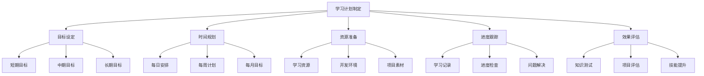

# WordPress学习计划模板

## 🎯 个人学习计划制定

基于你的学习目标、时间安排和学习风格，制定个性化的WordPress学习计划。

## 📊 学习计划结构



## 🎯 学习目标设定

### 短期目标 (1-3个月)
- [ ] **基础掌握**
  - [ ] 完成WordPress基础学习
  - [ ] 搭建个人博客网站
  - [ ] 掌握基础操作技能
  - [ ] 理解核心概念

- [ ] **技能提升**
  - [ ] 学会主题定制
  - [ ] 掌握插件使用
  - [ ] 完成第一个项目
  - [ ] 建立学习习惯

### 中期目标 (3-6个月)
- [ ] **开发能力**
  - [ ] 开发自定义主题
  - [ ] 创建功能插件
  - [ ] 掌握高级功能
  - [ ] 完成多个项目

- [ ] **技术深度**
  - [ ] 理解WordPress架构
  - [ ] 掌握性能优化
  - [ ] 学会安全防护
  - [ ] 建立技术体系

### 长期目标 (6-12个月)
- [ ] **专业水平**
  - [ ] 成为WordPress专家
  - [ ] 掌握现代技术栈
  - [ ] 具备架构设计能力
  - [ ] 建立个人品牌

- [ ] **职业发展**
  - [ ] 获得相关认证
  - [ ] 参与开源项目
  - [ ] 建立技术网络
  - [ ] 实现职业目标

## ⏰ 时间规划模板

### 每日学习安排

| 时间段 | 学习内容 | 时间长度 | 学习方式 |
|--------|----------|----------|----------|
| 早晨 | 理论学习 | 1小时 | 阅读文档、观看视频 |
| 上午 | 实践操作 | 2小时 | 动手练习、项目开发 |
| 下午 | 项目实战 | 2小时 | 完成项目、解决问题 |
| 晚上 | 总结复习 | 1小时 | 整理笔记、反思总结 |

**每日总计**: 6小时

### 每周学习计划

| 星期 | 学习重点 | 主要任务 | 检查点 |
|------|----------|----------|--------|
| 周一 | 理论学习 | 学习新概念、阅读文档 | 完成理论测试 |
| 周二 | 实践操作 | 动手练习、代码编写 | 完成实践作业 |
| 周三 | 项目开发 | 推进项目进度 | 项目里程碑 |
| 周四 | 问题解决 | 解决技术问题 | 问题解决记录 |
| 周五 | 技能提升 | 学习高级技术 | 技能测试 |
| 周六 | 项目实战 | 完成项目任务 | 项目评估 |
| 周日 | 总结复习 | 整理学习成果 | 周总结报告 |

### 每月学习目标

| 月份 | 学习阶段 | 主要目标 | 项目任务 |
|------|----------|----------|----------|
| 第1月 | 基础认知 | 掌握基础概念和操作 | 搭建个人博客 |
| 第2月 | 核心理解 | 理解WordPress机制 | 定制主题功能 |
| 第3月 | 应用开发 | 开发主题和插件 | 完成企业网站 |
| 第4月 | 高级功能 | 掌握现代技术 | 开发电商网站 |
| 第5月 | 性能优化 | 优化网站性能 | 性能优化项目 |
| 第6月 | 部署运维 | 掌握生产环境 | 部署大型项目 |

## 📚 学习资源准备

### 必备资源
- [ ] **开发环境**
  - [ ] 本地开发环境 (XAMPP/MAMP)
  - [ ] 代码编辑器 (VS Code/PhpStorm)
  - [ ] 版本控制工具 (Git)
  - [ ] 数据库管理工具

- [ ] **学习资料**
  - [ ] WordPress官方文档
  - [ ] 在线教程和视频
  - [ ] 技术书籍和电子书
  - [ ] 社区论坛和博客

- [ ] **项目素材**
  - [ ] 设计稿和原型
  - [ ] 测试数据和内容
  - [ ] 第三方服务和API
  - [ ] 部署和测试环境

### 推荐资源
- [ ] **官方资源**
  - [ ] [WordPress Codex](https://codex.wordpress.org/)
  - [ ] [WordPress Developer Handbook](https://developer.wordpress.org/)
  - [ ] [WordPress API Reference](https://developer.wordpress.org/reference/)
  - [ ] [WordPress Theme Development](https://developer.wordpress.org/themes/)

- [ ] **学习平台**
  - [ ] [WordPress.tv](https://wordpress.tv/)
  - [ ] [WPBeginner](https://www.wpbeginner.com/)
  - [ ] [Smashing Magazine](https://www.smashingmagazine.com/)
  - [ ] [Tuts+ WordPress](https://code.tutsplus.com/categories/wordpress)

- [ ] **开发工具**
  - [ ] [WP-CLI](https://wp-cli.org/)
  - [ ] [Query Monitor](https://wordpress.org/plugins/query-monitor/)
  - [ ] [Debug Bar](https://wordpress.org/plugins/debug-bar/)
  - [ ] [Local by Flywheel](https://localwp.com/)

## 📈 进度跟踪系统

### 学习记录表

| 日期 | 学习内容 | 学习时间 | 完成状态 | 学习成果 | 问题记录 |
|------|----------|----------|----------|----------|----------|
| YYYY-MM-DD | 主题开发基础 | 2小时 | ✅ | 完成基础主题 | 无 |
| YYYY-MM-DD | 插件开发 | 3小时 | ⚠️ | 部分完成 | 数据库操作问题 |
| YYYY-MM-DD | 性能优化 | 1.5小时 | ❌ | 未完成 | 时间不足 |

### 进度检查点

#### 每周检查
- [ ] **学习进度**
  - [ ] 完成计划学习内容
  - [ ] 达到预期学习目标
  - [ ] 解决技术问题
  - [ ] 更新学习记录

- [ ] **技能评估**
  - [ ] 理论知识掌握程度
  - [ ] 实践操作熟练度
  - [ ] 项目完成质量
  - [ ] 问题解决能力

#### 每月检查
- [ ] **整体评估**
  - [ ] 月度目标完成情况
  - [ ] 技能水平提升程度
  - [ ] 项目成果质量
  - [ ] 学习效率分析

- [ ] **计划调整**
  - [ ] 调整学习重点
  - [ ] 修改时间安排
  - [ ] 更新学习资源
  - [ ] 重新设定目标

## 🎯 学习效果评估

### 评估维度

#### 知识掌握度
- [ ] **理论理解**
  - [ ] 概念理解准确
  - [ ] 原理掌握深入
  - [ ] 知识体系完整
  - [ ] 应用场景明确

- [ ] **实践能力**
  - [ ] 操作技能熟练
  - [ ] 问题解决迅速
  - [ ] 代码质量良好
  - [ ] 项目完成度高

#### 技能提升度
- [ ] **技术技能**
  - [ ] 开发技能提升
  - [ ] 调试能力增强
  - [ ] 性能优化能力
  - [ ] 安全防护意识

- [ ] **软技能**
  - [ ] 学习能力提升
  - [ ] 问题分析能力
  - [ ] 沟通表达能力
  - [ ] 项目管理能力

### 评估方法

#### 自我评估
1. **知识测试**: 定期进行知识测试
2. **项目评估**: 评估项目完成质量
3. **技能测试**: 测试实际操作技能
4. **反思总结**: 反思学习过程和成果

#### 他人评估
1. **同行评价**: 获得同行技术评价
2. **导师指导**: 接受专业导师指导
3. **社区反馈**: 获得社区成员反馈
4. **客户评价**: 收集项目客户评价

## 🔄 学习计划调整

### 调整触发条件
- [ ] **进度滞后**
  - [ ] 连续3天未完成学习任务
  - [ ] 月度目标完成率低于80%
  - [ ] 项目进度严重滞后
  - [ ] 学习效率明显下降

- [ ] **目标变化**
  - [ ] 学习目标发生变化
  - [ ] 职业规划调整
  - [ ] 技术方向转变
  - [ ] 时间安排变化

### 调整策略
- [ ] **时间调整**
  - [ ] 增加学习时间
  - [ ] 调整学习时段
  - [ ] 优化时间分配
  - [ ] 提高学习效率

- [ ] **内容调整**
  - [ ] 调整学习重点
  - [ ] 修改学习顺序
  - [ ] 增加实践内容
  - [ ] 补充学习资源

- [ ] **方法调整**
  - [ ] 改变学习方式
  - [ ] 调整学习方法
  - [ ] 增加互动学习
  - [ ] 强化实践练习

## 📋 学习计划模板

### 个人学习计划表

```markdown
# 我的WordPress学习计划

## 基本信息
- 姓名: [你的姓名]
- 开始日期: [YYYY-MM-DD]
- 预计完成: [YYYY-MM-DD]
- 每日学习时间: [X]小时
- 学习目标: [你的学习目标]

## 学习目标
### 短期目标 (1-3个月)
- [ ] 目标1
- [ ] 目标2
- [ ] 目标3

### 中期目标 (3-6个月)
- [ ] 目标1
- [ ] 目标2
- [ ] 目标3

### 长期目标 (6-12个月)
- [ ] 目标1
- [ ] 目标2
- [ ] 目标3

## 时间安排
### 每日安排
- 早晨: [时间] - [学习内容]
- 上午: [时间] - [学习内容]
- 下午: [时间] - [学习内容]
- 晚上: [时间] - [学习内容]

### 每周计划
- 周一: [学习重点]
- 周二: [学习重点]
- 周三: [学习重点]
- 周四: [学习重点]
- 周五: [学习重点]
- 周六: [学习重点]
- 周日: [学习重点]

## 项目计划
### 项目1: [项目名称]
- 开始时间: [YYYY-MM-DD]
- 预计完成: [YYYY-MM-DD]
- 主要任务: [任务列表]
- 学习目标: [学习目标]

### 项目2: [项目名称]
- 开始时间: [YYYY-MM-DD]
- 预计完成: [YYYY-MM-DD]
- 主要任务: [任务列表]
- 学习目标: [学习目标]

## 检查点
### 第1周检查
- 检查日期: [YYYY-MM-DD]
- 完成情况: [完成情况]
- 问题记录: [问题记录]
- 调整计划: [调整计划]

### 第1月检查
- 检查日期: [YYYY-MM-DD]
- 完成情况: [完成情况]
- 问题记录: [问题记录]
- 调整计划: [调整计划]

## 学习资源
### 必备资源
- [ ] 资源1
- [ ] 资源2
- [ ] 资源3

### 推荐资源
- [ ] 资源1
- [ ] 资源2
- [ ] 资源3

## 评估标准
### 知识掌握
- [ ] 理论理解准确
- [ ] 实践操作熟练
- [ ] 问题解决迅速
- [ ] 项目完成度高

### 技能提升
- [ ] 开发技能提升
- [ ] 调试能力增强
- [ ] 性能优化能力
- [ ] 安全防护意识
```

## 🔗 相关链接

- [[学习地图|学习地图]]
- [[技能树|技能树]]
- [[项目实战|项目实战]]
- [[学习检查清单|学习检查清单]]

---

**下一步**: 根据模板制定个人学习计划，开始[[01-基础认知层/01-概念理解/WordPress是什么|第一阶段学习]]
