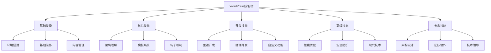
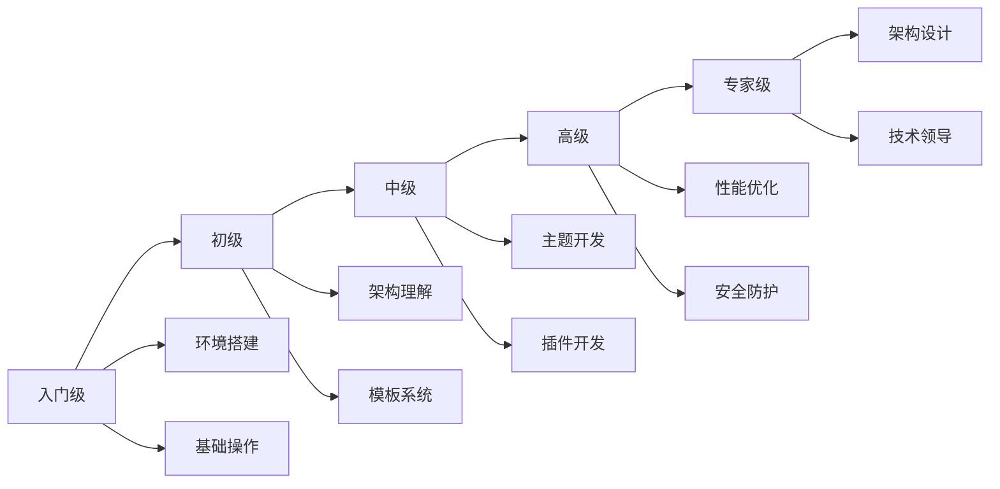

# WordPress技能树

## 🌳 技能树总览

## 📊 技能等级划分

| 等级 | 技能要求 | 时间投入 | 项目经验 |
|------|----------|----------|----------|
| 🌱 入门级 | 基础操作、环境搭建 | 1-2个月 | 1-2个项目 |
| 🌿 初级 | 模板修改、基础开发 | 3-4个月 | 3-5个项目 |
| 🌳 中级 | 主题插件开发 | 6-8个月 | 5-10个项目 |
| 🌲 高级 | 性能优化、架构设计 | 1-2年 | 10-20个项目 |
| 🌴 专家级 | 技术领导、创新应用 | 2-3年 | 20+个项目 |

## 🎯 详细技能树

### 🌱 入门级技能 (基础认知层)

#### 环境搭建技能
- [ ] **本地环境配置**
  - [ ] XAMPP/MAMP安装配置
  - [ ] WordPress安装部署
  - [ ] 数据库基础操作
  - [ ] 文件权限设置

- [ ] **服务器部署**
  - [ ] 虚拟主机选择
  - [ ] 域名解析配置
  - [ ] SSL证书安装
  - [ ] 基础安全设置

#### 基础操作技能
- [ ] **后台管理**
  - [ ] 仪表盘导航
  - [ ] 用户权限管理
  - [ ] 系统设置配置
  - [ ] 插件主题管理

- [ ] **内容管理**
  - [ ] 文章页面创建
  - [ ] 媒体库管理
  - [ ] 分类标签设置
  - [ ] 菜单导航配置

**检查标准**: 能独立搭建和配置WordPress网站

### 🌿 初级技能 (核心理解层)

#### 架构理解技能
- [ ] **文件结构理解**
  - [ ] wp-admin目录结构
  - [ ] wp-includes核心文件
  - [ ] wp-content自定义内容
  - [ ] 配置文件理解

- [ ] **数据库理解**
  - [ ] 核心数据表结构
  - [ ] 数据关系理解
  - [ ] 查询优化基础
  - [ ] 备份恢复操作

#### 模板系统技能
- [ ] **模板层次**
  - [ ] 模板查找优先级
  - [ ] 条件标签使用
  - [ ] 模板文件创建
  - [ ] 自定义模板

- [ ] **循环机制**
  - [ ] The Loop理解
  - [ ] WP_Query使用
  - [ ] 自定义查询
  - [ ] 分页处理

#### 钩子机制技能
- [ ] **Actions钩子**
  - [ ] add_action使用
  - [ ] 常用Actions理解
  - [ ] 钩子优先级
  - [ ] 自定义Actions

- [ ] **Filters钩子**
  - [ ] add_filter使用
  - [ ] 数据过滤修改
  - [ ] 输出内容过滤
  - [ ] 自定义Filters

**检查标准**: 理解WordPress核心机制，能进行基础定制

### 🌳 中级技能 (应用开发层)

#### 主题开发技能
- [ ] **主题结构**
  - [ ] 主题文件组织
  - [ ] 样式脚本管理
  - [ ] 响应式设计
  - [ ] 主题定制器

- [ ] **模板开发**
  - [ ] 自定义页面模板
  - [ ] 归档页面模板
  - [ ] 单页模板开发
  - [ ] 404页面设计

#### 插件开发技能
- [ ] **插件基础**
  - [ ] 插件文件结构
  - [ ] 插件激活机制
  - [ ] 选项页面开发
  - [ ] 数据库操作

- [ ] **自定义功能**
  - [ ] 自定义文章类型
  - [ ] 自定义分类法
  - [ ] 自定义字段
  - [ ] 短代码开发

#### 高级功能技能
- [ ] **Gutenberg开发**
  - [ ] 区块注册
  - [ ] 区块属性
  - [ ] React组件开发
  - [ ] 区块样式

- [ ] **API开发**
  - [ ] REST API使用
  - [ ] 自定义endpoint
  - [ ] AJAX交互
  - [ ] 数据验证

**检查标准**: 能独立开发主题和插件

### 🌲 高级技能 (精通创新层)

#### 性能优化技能
- [ ] **数据库优化**
  - [ ] 查询优化
  - [ ] 索引优化
  - [ ] 缓存策略
  - [ ] 数据清理

- [ ] **前端优化**
  - [ ] 图片优化
  - [ ] CSS/JS压缩
  - [ ] CDN配置
  - [ ] 懒加载实现

#### 安全防护技能
- [ ] **安全基础**
  - [ ] 数据验证
  - [ ] XSS防护
  - [ ] SQL注入防护
  - [ ] 权限控制

- [ ] **安全加固**
  - [ ] 登录安全
  - [ ] 文件权限
  - [ ] 防火墙配置
  - [ ] 安全监控

#### 现代技术技能
- [ ] **Headless WordPress**
  - [ ] API架构设计
  - [ ] 前端框架集成
  - [ ] 数据同步机制
  - [ ] 性能优化

- [ ] **PWA开发**
  - [ ] Service Worker
  - [ ] 离线功能
  - [ ] 推送通知
  - [ ] 应用安装

**检查标准**: 能构建高性能、安全的WordPress应用

### 🌴 专家级技能 (生态扩展层)

#### 架构设计技能
- [ ] **系统架构**
  - [ ] 微服务架构
  - [ ] 负载均衡
  - [ ] 数据库集群
  - [ ] 缓存架构

- [ ] **可扩展性设计**
  - [ ] 模块化设计
  - [ ] 插件架构
  - [ ] 主题框架
  - [ ] 开发规范

#### 团队协作技能
- [ ] **项目管理**
  - [ ] 需求分析
  - [ ] 技术方案设计
  - [ ] 进度控制
  - [ ] 质量保证

- [ ] **代码管理**
  - [ ] Git工作流
  - [ ] 代码审查
  - [ ] 持续集成
  - [ ] 自动化部署

#### 技术领导技能
- [ ] **技术决策**
  - [ ] 技术选型
  - [ ] 架构评估
  - [ ] 性能分析
  - [ ] 风险评估

- [ ] **知识传承**
  - [ ] 技术培训
  - [ ] 文档编写
  - [ ] 最佳实践
  - [ ] 社区贡献

**检查标准**: 能领导团队，设计大型WordPress项目

## 🎯 技能发展路径

### 学习路径建议

### 技能评估方法

#### 自我评估
1. **技能清单检查**: 对照技能树检查掌握程度
2. **项目经验回顾**: 分析已完成项目的技术难度
3. **问题解决能力**: 评估独立解决问题的能力
4. **学习速度**: 评估新技能的学习速度

#### 他人评估
1. **同行评价**: 获得同行的技术评价
2. **项目反馈**: 收集项目客户的反馈
3. **社区参与**: 参与技术社区讨论
4. **开源贡献**: 贡献开源项目

## 📈 技能提升策略

### 刻意练习方法
1. **目标设定**: 设定明确的技能提升目标
2. **专项训练**: 针对薄弱环节进行专项训练
3. **项目实践**: 通过实际项目巩固技能
4. **持续改进**: 根据反馈持续改进

### 学习资源利用
1. **官方文档**: 深入学习官方文档
2. **社区资源**: 参与社区讨论和学习
3. **在线课程**: 参加专业培训课程
4. **实践项目**: 通过项目实践提升技能

## 🔗 相关链接

- [[学习地图|学习地图]]
- [[项目实战|项目实战]]
- [[学习检查清单|学习检查清单]]
- [[学习计划模板|学习计划模板]]

---

**下一步**: 根据技能树制定个人[[学习计划模板|学习计划]]
