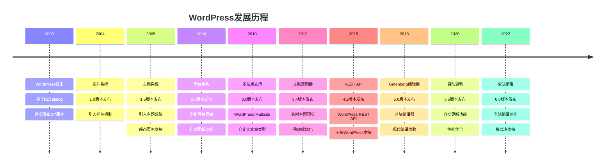
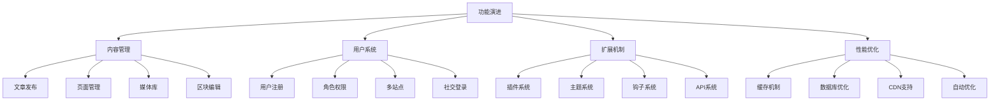

# WordPress发展历程

## 🕰️ 发展时间线

WordPress自2003年诞生以来，经历了从简单博客系统到功能强大的内容管理平台的演变过程。

## 📊 发展历程总览

## 🚀 重要版本里程碑

### 早期版本 (2003-2005)

#### WordPress 0.7 (2003年5月)
- **发布背景**: 基于b2/cafelog博客系统
- **核心特性**:
  - 基础博客功能
  - 文章发布系统
  - 评论系统
  - 用户管理

#### WordPress 1.0 (2004年1月)
- **重要特性**:
  - 插件系统引入
  - 主题系统基础
  - 永久链接支持
  - 搜索功能

#### WordPress 1.5 (2005年2月)
- **重要特性**:
  - 完整主题系统
  - 静态页面支持
  - 评论管理
  - 用户角色系统

### 发展期版本 (2006-2010)

#### WordPress 2.0 (2005年12月)
- **重要特性**:
  - 全新管理界面
  - 可视化编辑器
  - 图片上传功能
  - 数据库优化

#### WordPress 2.7 (2008年12月)
- **重要特性**:
  - 后台界面重构
  - 自动更新功能
  - 插件管理改进
  - 主题管理优化

#### WordPress 3.0 (2010年6月)
- **重要特性**:
  - WordPress Multisite
  - 自定义文章类型
  - 自定义分类法
  - 菜单系统

### 成熟期版本 (2011-2015)

#### WordPress 3.4 (2012年6月)
- **重要特性**:
  - 主题定制器
  - 实时预览
  - 移动端优化
  - 性能改进

#### WordPress 4.0 (2014年9月)
- **重要特性**:
  - 媒体库改进
  - 插件安装体验
  - 编辑器优化
  - 多语言支持

#### WordPress 4.2 (2015年4月)
- **重要特性**:
  - WordPress REST API
  - 无头WordPress支持
  - 表情符号支持
  - 安全改进

### 现代期版本 (2016-至今)

#### WordPress 5.0 (2018年12月)
- **重要特性**:
  - Gutenberg区块编辑器
  - 现代编辑体验
  - 区块系统
  - 响应式设计

#### WordPress 5.5 (2020年8月)
- **重要特性**:
  - 自动更新功能
  - 性能优化
  - 安全改进
  - 可访问性提升

#### WordPress 6.0 (2022年5月)
- **重要特性**:
  - 全站编辑功能
  - 模式库支持
  - 样式系统改进
  - 性能优化

## 📈 技术演进分析

### 架构演进
| 时期 | 架构特点 | 技术栈 | 主要改进 |
|------|----------|--------|----------|
| 早期 (2003-2005) | 简单MVC | PHP4, MySQL | 基础功能实现 |
| 发展期 (2006-2010) | 模块化设计 | PHP5, MySQL | 插件主题系统 |
| 成熟期 (2011-2015) | 面向对象 | PHP5.6+, MySQL | API系统 |
| 现代期 (2016-至今) | 现代架构 | PHP7.4+, MySQL8 | 无头架构支持 |

### 功能演进

## 🌟 重要技术突破

### 插件系统 (2004)
- **突破意义**: 开启了WordPress的可扩展性
- **技术实现**: 钩子系统 + 插件API
- **影响**: 形成了庞大的插件生态

### 主题系统 (2005)
- **突破意义**: 实现了外观与功能的分离
- **技术实现**: 模板层次 + 样式系统
- **影响**: 催生了主题开发产业

### REST API (2015)
- **突破意义**: 支持无头WordPress架构
- **技术实现**: RESTful API + JSON数据
- **影响**: 开启了现代Web应用开发

### Gutenberg编辑器 (2018)
- **突破意义**: 现代化编辑体验
- **技术实现**: React + 区块系统
- **影响**: 提升了内容创作效率

## 📊 用户增长趋势

### 全球使用统计
| 年份 | 网站数量 | 市场份额 | 增长率 |
|------|----------|----------|--------|
| 2010 | 32.5M | 13.1% | - |
| 2012 | 74.6M | 17.0% | 129% |
| 2014 | 74.6M | 23.3% | 0% |
| 2016 | 75.0M | 26.4% | 0.5% |
| 2018 | 60.0M | 30.0% | -20% |
| 2020 | 39.5M | 39.5% | -34% |
| 2022 | 43.2M | 43.2% | 9% |

### 技术采用趋势
- [ ] **PHP版本升级**
  - PHP 5.6 → PHP 7.4 → PHP 8.0+
  - 性能提升显著
  - 安全性增强

- [ ] **数据库优化**
  - MySQL 5.6 → MySQL 8.0
  - 查询性能提升
  - 新特性支持

- [ ] **前端技术**
  - jQuery → React/Vue
  - 现代JavaScript
  - 组件化开发

## 🎯 发展方向预测

### 短期发展 (2023-2025)
- [ ] **技术改进**
  - PHP 8.0+ 全面支持
  - 性能持续优化
  - 安全性增强
  - 可访问性提升

- [ ] **功能增强**
  - 全站编辑完善
  - 区块系统扩展
  - 模式库丰富
  - 主题系统改进

### 中期发展 (2025-2028)
- [ ] **架构升级**
  - 微服务架构
  - 容器化部署
  - 云原生支持
  - 边缘计算

- [ ] **技术融合**
  - AI集成
  - 机器学习
  - 自动化优化
  - 智能推荐

### 长期发展 (2028-2030)
- [ ] **平台化发展**
  - 无头CMS主流
  - 多平台支持
  - 跨设备体验
  - 全球化服务

- [ ] **生态完善**
  - 开发者工具链
  - 自动化部署
  - 智能运维
  - 生态治理

## 🔗 相关链接

### 发展历程
- [[01-基础认知层/01-概念理解/WordPress是什么|WordPress是什么]]
- [[01-基础认知层/01-概念理解/WordPress生态|WordPress生态]]
- [[01-基础认知层/01-概念理解/版本差异对比|版本差异对比]]

### 技术发展
- [[02-核心理解层/01-架构原理/文件结构详解|文件结构详解]]
- [[02-核心理解层/01-架构原理/数据库结构|数据库结构]]
- [[02-核心理解层/01-架构原理/请求处理流程|请求处理流程]]

### 现代技术
- [[04-精通创新层/01-现代交互/Headless WordPress|Headless WordPress]]
- [[04-精通创新层/01-现代交互/PWA开发|PWA开发]]
- [[04-精通创新层/01-现代交互/SPA集成|SPA集成]]

---

**下一步**: 了解[[01-基础认知层/01-概念理解/版本差异对比|版本差异对比]]
