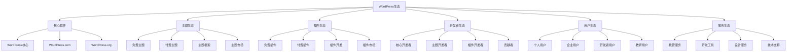
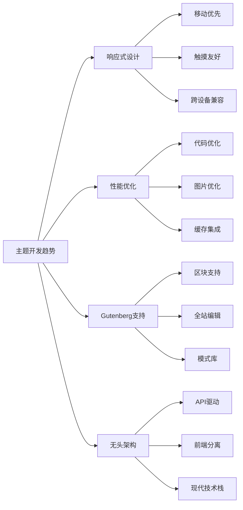
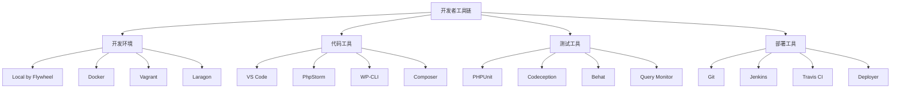

# WordPress生态

## 🌐 生态系统概述

WordPress生态系统是一个由核心软件、主题、插件、开发者、用户和第三方服务组成的庞大网络，共同推动WordPress平台的发展。

## 📊 生态系统结构

## 🎨 主题生态系统

### 主题类型分类
| 类型 | 特点 | 适用场景 | 代表作品 |
|------|------|----------|----------|
| 博客主题 | 内容展示为主 | 个人博客、新闻网站 | Twenty系列 |
| 企业主题 | 商务功能丰富 | 企业官网、产品展示 | Astra、GeneratePress |
| 电商主题 | 购物功能完善 | 在线商店、产品销售 | Storefront、Flatsome |
| 作品集主题 | 视觉展示突出 | 设计师、摄影师 | Portfolio、Photography |
| 多功能主题 | 功能全面 | 复杂网站、多用途 | Divi、Avada |

### 主题市场分析
- [ ] **官方主题库**
  - 免费主题数量: 8,000+
  - 质量审核严格
  - 定期更新维护
  - 社区支持完善

- [ ] **商业主题市场**
  - ThemeForest: 最大商业主题市场
  - Elegant Themes: Divi主题
  - StudioPress: Genesis框架
  - WPExplorer: 专业主题

- [ ] **主题框架**
  - Genesis Framework
  - Thesis Framework
  - Gantry Framework
  - Bootstrap Framework

### 主题开发趋势

## 🔌 插件生态系统

### 插件分类体系
- [ ] **功能分类**
  - 内容管理插件
  - 用户管理插件
  - 安全防护插件
  - 性能优化插件
  - SEO优化插件
  - 电商功能插件

- [ ] **技术分类**
  - PHP插件
  - JavaScript插件
  - CSS样式插件
  - 数据库插件
  - API集成插件

### 插件市场分析
| 市场 | 插件数量 | 特点 | 优势 |
|------|----------|------|------|
| WordPress.org | 60,000+ | 免费为主 | 官方审核、社区支持 |
| CodeCanyon | 10,000+ | 商业插件 | 质量保证、技术支持 |
| 开发者官网 | 数千 | 专业插件 | 定制服务、持续更新 |
| GitHub | 数万 | 开源插件 | 代码透明、社区贡献 |

### 热门插件类别
- [ ] **SEO优化**
  - Yoast SEO
  - RankMath
  - All in One SEO
  - SEOPress

- [ ] **性能优化**
  - WP Rocket
  - W3 Total Cache
  - WP Super Cache
  - Autoptimize

- [ ] **安全防护**
  - Wordfence
  - Sucuri
  - iThemes Security
  - All In One WP Security

- [ ] **电商功能**
  - WooCommerce
  - Easy Digital Downloads
  - WP eCommerce
  - MemberPress

## 👥 开发者生态系统

### 开发者类型
- [ ] **核心开发者**
  - WordPress核心贡献者
  - 核心功能开发
  - 安全漏洞修复
  - 版本发布管理

- [ ] **主题开发者**
  - 主题设计和开发
  - 用户体验优化
  - 响应式设计
  - 性能优化

- [ ] **插件开发者**
  - 功能插件开发
  - API集成开发
  - 第三方服务集成
  - 自定义功能开发

- [ ] **全栈开发者**
  - 前后端开发
  - 数据库设计
  - 服务器配置
  - 性能优化

### 开发者工具链

### 开发者社区
- [ ] **官方社区**
  - WordPress.org论坛
  - WordPress Slack
  - WordPress.tv
  - WordPress Codex

- [ ] **技术社区**
  - Stack Overflow
  - Reddit r/WordPress
  - GitHub
  - Dev.to

- [ ] **本地社区**
  - WordPress Meetup
  - WordCamp活动
  - 本地用户组
  - 技术分享会

## 🏢 服务生态系统

### 托管服务
| 服务类型 | 特点 | 代表服务 | 适用场景 |
|----------|------|----------|----------|
| 共享主机 | 成本低、易用 | Bluehost、SiteGround | 个人博客、小型网站 |
| VPS主机 | 性能好、可定制 | DigitalOcean、Linode | 中型网站、开发环境 |
| 专用主机 | 性能最佳、完全控制 | AWS、Google Cloud | 大型网站、企业应用 |
| 托管WordPress | 专业优化、自动更新 | WP Engine、Kinsta | 企业网站、高流量站点 |

### 开发服务
- [ ] **设计服务**
  - UI/UX设计
  - 品牌设计
  - 响应式设计
  - 用户体验优化

- [ ] **开发服务**
  - 主题定制开发
  - 插件定制开发
  - 功能集成开发
  - 性能优化服务

- [ ] **技术支持**
  - 故障排除
  - 安全加固
  - 性能优化
  - 维护服务

### 第三方服务
- [ ] **内容服务**
  - 内容管理系统
  - 媒体存储服务
  - CDN加速服务
  - 备份恢复服务

- [ ] **营销服务**
  - SEO优化服务
  - 社交媒体集成
  - 邮件营销服务
  - 分析统计服务

## 📈 生态系统发展趋势

### 技术趋势
- [ ] **现代化技术栈**
  - React/Vue.js集成
  - GraphQL API
  - 微服务架构
  - 容器化部署

- [ ] **性能优化**
  - 自动优化
  - 边缘计算
  - 智能缓存
  - 图片优化

- [ ] **安全增强**
  - 自动安全扫描
  - 威胁检测
  - 零信任架构
  - 合规性管理

### 商业模式趋势
- [ ] **SaaS化服务**
  - 托管WordPress服务
  - 无头CMS服务
  - 自动化工具服务
  - 智能优化服务

- [ ] **订阅制模式**
  - 主题订阅服务
  - 插件订阅服务
  - 技术支持订阅
  - 更新维护订阅

## 🎯 生态系统参与方式

### 用户参与
- [ ] **内容贡献**
  - 撰写教程文章
  - 分享使用经验
  - 参与社区讨论
  - 提供用户反馈

- [ ] **社区参与**
  - 参加WordCamp
  - 组织本地聚会
  - 参与在线讨论
  - 帮助新用户

### 开发者参与
- [ ] **代码贡献**
  - 核心代码贡献
  - 主题插件开发
  - 文档编写
  - 测试反馈

- [ ] **商业参与**
  - 主题插件销售
  - 定制开发服务
  - 技术支持服务
  - 培训咨询服务

### 企业参与
- [ ] **技术合作**
  - 技术标准制定
  - 产品集成合作
  - 市场推广合作
  - 人才培养合作

- [ ] **商业合作**
  - 托管服务提供
  - 开发工具提供
  - 设计服务提供
  - 营销服务提供

## 🔗 相关链接

### 生态系统
- [[01-基础认知层/01-概念理解/WordPress是什么|WordPress是什么]]
- [[01-基础认知层/01-概念理解/WordPress发展历程|WordPress发展历程]]
- [[01-基础认知层/01-概念理解/版本差异对比|版本差异对比]]

### 开发资源
- [[05-生态扩展层/01-工具生态/开发工具|开发工具]]
- [[05-生态扩展层/01-工具生态/插件生态|插件生态]]
- [[05-生态扩展层/01-工具生态/主题生态|主题生态]]

### 学习资源
- [[05-生态扩展层/03-学习资源/官方文档|官方文档]]
- [[05-生态扩展层/03-学习资源/社区资源|社区资源]]
- [[05-生态扩展层/03-学习资源/进阶学习|进阶学习]]

---

**下一步**: 了解[[01-基础认知层/01-概念理解/WordPress发展历程|WordPress发展历程]]
