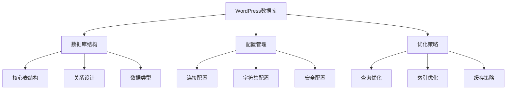
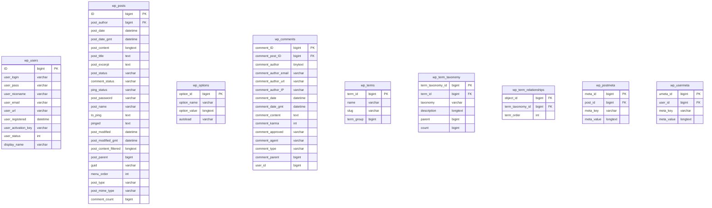
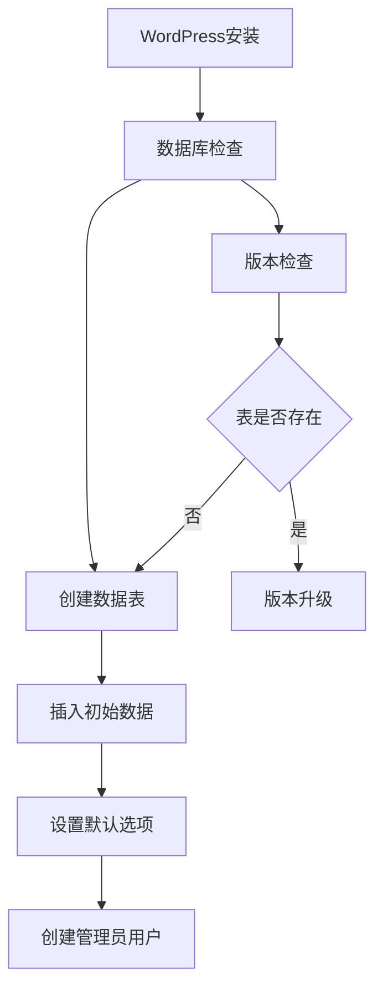
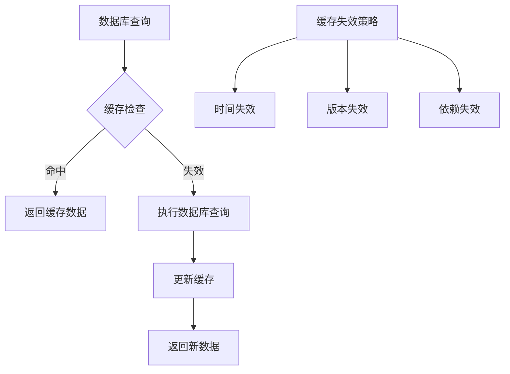

# WordPress数据库配置与管理

## 🎯 学习目标

> **认识 → 理解 → 应用**
> - **认识**：了解WordPress数据库的基本结构
> - **理解**：掌握数据库配置的原理和优化
> - **应用**：独立完成数据库的设计和优化

## 📋 知识地图



## 💡 数据库结构认知

### WordPress核心数据表



### 表关系说明

| 表名 | 主要字段 | 用途 | 关联表 |
|------|----------|------|--------|
| **wp_users** | ID, user_login, user_email | 用户基础信息 | wp_posts.author_id |
| **wp_posts** | ID, post_title, post_content | 文章/页面内容 | wp_postmeta, wp_comments |
| **wp_options** | option_name, option_value | 系统配置选项 | - |
| **wp_comments** | comment_ID, comment_post_ID | 评论信息 | wp_posts.ID |
| **wp_terms** | term_id, name, slug | 分类标签 | wp_term_taxonomy |
| **wp_term_taxonomy** | term_taxonomy_id, taxonomy | 分类法关系 | wp_term_relationships |
| **wp_postmeta** | meta_key, meta_value | 自定义字段 | wp_posts.ID |

## 🔧 数据库配置理解

### wp-config.php数据库配置

#### 基础连接配置

```php
// wp-config.php 数据库配置
define('DB_NAME', 'wordpress_db');          // 数据库名称
define('DB_USER', 'wordpress_user');        // 数据库用户名
define('DB_PASSWORD', 'secure_password');    // 数据库密码
define('DB_HOST', 'localhost');              // 数据库主机
define('DB_CHARSET', 'utf8mb4');             // 字符集
define('DB_COLLATE', 'utf8mb4_unicode_ci'); // 排序规则
```

#### 高级配置选项

```php
// 多数据库支持（主从分离）
define('DB_HOST', 'localhost');              // 主数据库
define('DB_WRITE_HOST', 'write-server.com'); // 写入数据库
define('DB_READ_HOST', 'read-server.com');   // 读取数据库

// 连接池配置
define('DB_MAX_CONNECTIONS', 100);           // 最大连接数
define('DB_PERSISTENT_CONNECTIONS', false);  // 持久连接

// 字符集配置
define('WP_CHARSET', 'UTF8');
define('WP_CACHE_KEY_SALT', 'unique_salt_string');

// 数据库表前缀（安全考虑）
$table_prefix = 'wp_';

// 强制SSL连接
define('DB_SSL_CA', '/path/to/ca-cert.pem');
define('DB_SSL_CERT', '/path/to/client-cert.pem');
define('DB_SSL_KEY', '/path/to/client-key.pem');
```

### 数据库初始化脚本

#### 创建WordPress数据库

```sql
-- 创建数据库和用户
CREATE DATABASE IF NOT EXISTS wordpress_db 
CHARACTER SET utf8mb4 COLLATE utf8mb4_unicode_ci;

-- 创建专用用户
CREATE USER 'wordpress_user'@'localhost' IDENTIFIED BY 'secure_password';

-- 授权权限
GRANT SELECT, INSERT, UPDATE, DELETE, CREATE, DROP, INDEX, ALTER, CREATE TEMPORARY TABLES 
ON wordpress_db.* TO 'wordpress_user'@'localhost';

-- 刷新权限
FLUSH PRIVILEGES;

-- 使用数据库
USE wordpress_db;
```

#### WordPress初始化SQL



### MySQL配置优化

#### my.cnf配置文件

```ini
# MySQL 8.0+ WordPress优化配置
[mysqld]
# 基础设置
default-authentication-plugin=mysql_native_password
default-storage-engine=InnoDB
character-set-server=utf8mb4
collation-server=utf8mb4_unicode_ci

# InnoDB引擎配置
innodb_buffer_pool_size=1G              # 内存缓冲池大小
innodb_log_file_size=256M               # 事务日志大小
innodb_flush_log_at_trx_commit=2         # 日志刷新频率
innodb_file_per_table=1                 # 每表独立表空间

# 查询缓存（MySQL 8.0已移除）
# query_cache_type=1
# query_cache_size=128M

# 连接配置
max_connections=200                      # 最大连接数
max_connect_errors=10                    # 最大连接错误数
connect_timeout=10                       # 连接超时

# 慢查询日志
slow_query_log=1
slow_query_log_file=/var/log/mysql/slow.log
long_query_time=1                        # 慢查询阈值（秒）

# 二进制日志
log-bin=mysql-bin
expire_logs_days=7                       # 日志保留天数
binlog_format=ROW

[mysql]
default-character-set=utf8mb4

[client]
default-character-set=utf8mb4
```

## 🚀 数据库优化应用

### 索引优化策略

#### 分析查询性能

```sql
-- 查看慢查询
SHOW VARIABLES LIKE '%slow%';
SHOW STATUS LIKE 'Slow_queries';

-- 分析表状态
EXPLAIN SELECT * FROM wp_posts WHERE post_status = 'publish';

-- 查看索引使用情况
SHOW INDEX FROM wp_posts;

-- 分析查询计划
EXPLAIN FORMAT=JSON 
SELECT p.* FROM wp_posts p 
WHERE p.post_status = 'publish' 
AND p.post_type = 'post'
ORDER BY p.post_date DESC 
LIMIT 10;
```

#### 关键索引优化

```sql
-- wp_posts表索引优化
ALTER TABLE wp_posts ADD INDEX idx_status_type_date (post_status, post_type, post_date);
ALTER TABLE wp_posts ADD INDEX idx_author_status (post_author, post_status);
ALTER TABLE wp_posts ADD INDEX idx_post_name (post_name);

-- wp_postmeta表索引优化
ALTER TABLE wp_postmeta ADD INDEX idx_post_meta_key (post_id, meta_key);
ALTER TABLE wp_postmeta ADD INDEX idx_meta_key_value (meta_key, meta_value(191));

-- wp_comments表索引优化
ALTER TABLE wp_comments ADD INDEX idx_post_approved_date (comment_post_ID, comment_approved, comment_date);

-- wp_options表索引优化
ALTER TABLE wp_options ADD INDEX idx_autoload_name (autoload, option_name);
```

### 查询优化技术

#### WordPress查询优化

```php
// 避免N+1查询问题
function get_posts_with_authors($posts) {
    $author_ids = wp_list_pluck($posts, 'post_author');
    $authors = get_users(array(
        'include' => $author_ids,
        'fields' => array('ID', 'display_name', 'user_nicename')
    ));
    
    foreach ($posts as &$post) {
        $post->author = wp_list_filter($authors, array('ID' => $post->post_author));
        $post->author = reset($post->author);
    }
    
    return $posts;
}

// 使用Transients缓存复杂查询
function get_popular_posts($days = 7, $limit = 10) {
    $cache_key = 'popular_posts_' . $days . '_' . $limit;
    $cached_posts = get_transient($cache_key);
    
    if (false === $cached_posts) {
        global $wpdb;
        
        $cached_posts = $wpdb->get_results($wpdb->prepare("
            SELECT p.ID, p.post_title, p.post_date, COUNT(c.comment_ID) as comment_count
            FROM {$wpdb->posts} p
            LEFT JOIN {$wpdb->comments} c ON p.ID = c.comment_post_ID
            WHERE p.post_status = 'publish'
            AND p.post_date > %s
            GROUP BY p.ID
            ORDER BY comment_count DESC
            LIMIT %d
        ", date('Y-m-d H:i:s', strtotime("-{$days} days")), $limit));
        
        set_transient($cache_key, $cached_posts, HOUR_IN_SECONDS);
    }
    
    return $cached_posts;
}
```

#### 数据库操作优化

```php
// 批量操作减少查询次数
function batch_update_postmeta($updates) {
    global $wpdb;
    
    $cases = array();
    $meta_ids = array();
    
    foreach ($updates as $meta_id => $new_value) {
        $meta_ids[] = $meta_id;
        $cases[] = "WHEN {$meta_id} THEN '" . esc_sql($new_value) . "'";
    }
    
    if (!empty($cases)) {
        $meta_ids_sql = implode(',', $meta_ids);
        $cases_sql = implode(' ', $cases);
        
        $wpdb->query("
            UPDATE {$wpdb->postmeta} 
            SET meta_value = CASE meta_id {$cases_sql} END
            WHERE meta_id IN ({$meta_ids_sql})
        ");
    }
}

// 使用prepared statements防止SQL注入
function get_posts_by_category($category_id, $limit = 10) {
    global $wpdb;
    
    return $wpdb->get_results($wpdb->prepare("
       SELECT p.*
        FROM {$wpdb->posts} p
        INNER JOIN {$wpdb->term_relationships} tr ON p.ID = tr.object_id
        INNER JOIN {$wpdb->term_taxonomy} tt ON tr.term_taxonomy_id = tt.term_taxonomy_id
        WHERE p.post_status = 'publish'
        AND p.post_type = 'post'
        AND tt.taxonomy = 'category'
        AND tt.term_id = %d
        ORDER BY p.post_date DESC
        LIMIT %d
    ", $category_id, $limit));
}
```

### 缓存策略实现

#### 数据库查询缓存



```php
// WordPress缓存系统集成
class WordPress_DB_Cache {
    private $cache_group = 'wordpress_db';
    private $default_expiration = 3600; // 1小时
    
    public function get($key) {
        return wp_cache_get($key, $this->cache_group);
    }
    
    public function set($key, $data, $expires = null) {
        $expires = $expires ?: $this->default_expiration;
        return wp_cache_set($key, $data, $this->cache_group, $expires);
    }
    
    public function delete($key) {
        return wp_cache_delete($key, $this->cache_group);
    }
    
    // 批量缓存设置
    public function set_multiple($items, $expires = null) {
        foreach ($items as $key => $data) {
            $this->set($key, $data, $expires);
        }
    }
}

// 缓存装饰器模式
function cached_query($query, $cache_key, $expires = 3600) {
    $cache = new WordPress_DB_Cache();
    
    $result = $cache->get($cache_key);
    if (false === $result) {
        global $wpdb;
        $result = $wpdb->get_results($query);
        $cache->set($cache_key, $result, $expires);
    }
    
    return $result;
}
```

## 📊 监控和维护

### 性能监控工具

| 工具 | 用途 | 安装方式 |
|------|------|----------|
| **Query Monitor** | SQL查询分析 | WordPress插件 |
| **New Relic** | 数据库性能监控 | 第三方服务 |
| **MySQLTuner** | 配置建议工具 | 命令行工具 |
| **pt-query-digest** | 慢查询分析 | Percona工具 |

### 维护脚本

#### 数据库清理脚本

```php
// 清理过期数据
function cleanup_expired_data() {
    global $wpdb;
    
    // 清理过期的自动草稿
    $wpdb->query("
        DELETE FROM {$wpdb->posts} 
        WHERE post_status = 'auto-draft' 
        AND post_date < DATE_SUB(NOW(), INTERVAL 30 DAY)
    ");
    
    // 清理垃圾评论
    $wpdb->query("
        DELETE FROM {$wpdb->comments} 
        WHERE comment_approved = 'spam' 
        AND comment_date_gmt < DATE_SUB(NOW(), INTERVAL 30 DAY)
    ");
    
    // 清理旧修订版本
    $wpdb->query("
        DELETE FROM {$wpdb->posts} 
        WHERE post_type = 'revision' 
        AND post_date < DATE_SUB(NOW(), INTERVAL 30 DAY)
    ");
    
    // 优化表
    $wpdb->get_results("OPTIMIZE TABLE {$wpdb->posts}");
    $wpdb->get_results("OPTIMIZE TABLE {$wpdb->comments}");
    $wpdb->get_results("OPTIMIZE TABLE {$wpdb->postmeta}");
}

// 定期执行清理
add_action('wp_scheduled_delete', 'cleanup_expired_data');
```

## 🎯 刻意练习项目

### 练习1：数据库设计分析
**目标**：分析WordPress数据库结构设计思路
**技能点**：ER图设计、关系模型、索引设计

### 练习2：查询性能优化
**目标**：优化slow query中的常见问题
**技能点**：EXPLAIN分析、索引优化、查询重写

### 练习3：缓存系统实现
**目标**：实现自定义数据库查询缓存
**技能点**：缓存策略、失效机制、性能测试

## 🔗 拓展学习链接

### 进阶主题
- [[请求处理流程]] - WordPress数据流程
- [[架构原理练习]] - 数据库实践练习
- [[性能优化]] - 整体性能优化策略

### 相关工具
- [[开发工具]] - 数据库开发工具
- [[故障排除]] - 数据库故障排除

### 实战项目
- [[后端开发项目]] - 后端开发实战
- [[性能优化项目]] - 性能优化实践

---

## 💬 知识检查

**理解检验**：
1. WordPress数据库中哪几个表是最核心的？
2. wp_options表的作用是什么？
3. 如何避免N+1查询问题？

**应用检验**：
1. 分析一个复杂查询的执行计划
2. 设计合适的索引优化查询性能
3. 实现数据库查询缓存系统

### 故障排除

#### 常见数据库问题

| 问题 | 原因 | 解决方案 |
|------|------|----------|
| **连接超时** | 连接数过多或配置错误 | 调整max_connections |
| **查询缓慢** | 缺少索引或查询写法不佳 | 添加索引，优化查询 |
| **字符集乱码** | 字符集配置不一致 | 统一utf8mb4字符集 |

**下一步学习**：[[服务器部署]] → 学习生产环境部署配置
