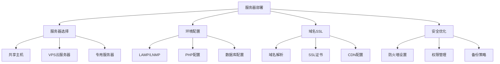
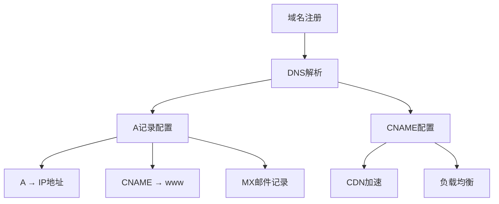
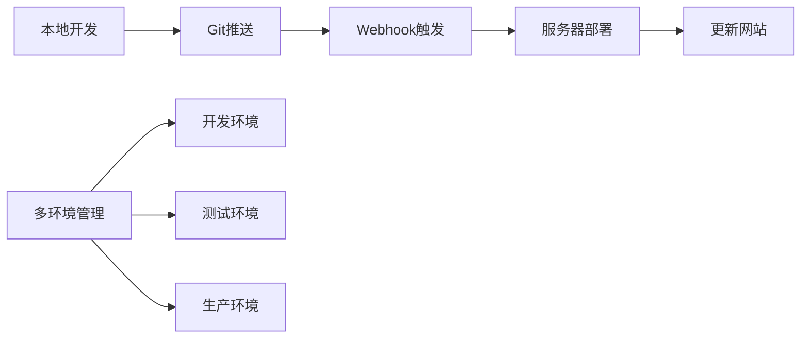
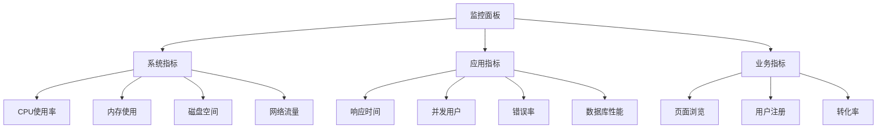

# WordPress服务器部署

## 🎯 学习目标

> **认识 → 理解 → 应用**
> - **认识**：了解生产环境部署的要素和流程
> - **理解**：掌握服务器配置和SSL证书管理
> - **应用**：独立完成WordPress站点上线部署

## 📋 知识地图



## 💡 服务器选择认知

### 主机类型对比

| 类型 | 配置 | 适用场景 | 价格 | 技术要求 |
|------|------|----------|------|----------|
| **共享主机** | 共享资源 | 个人博客、小企业 | 低 | 低 |
| **VPS主机** | 独立资源 | 中小型网站 | 中 | 中 |
| **云服务器** | 弹性扩展 | 大型网站、高并发 | 高 | 高 |
| **专用服务器** | 独享硬件 | 企业级应用 | 很高 | 很高 |

### 主流云服务商对比

| 服务商 | 特点 | WordPress支持 | 价格优势 |
|--------|------|----------------|----------|
| **阿里云** | 国内访问快、性价比高 | WordPress专属主机 | 中等 |
| **腾讯云** | 质量稳定、安全可靠 | 一键部署 | 中等 |
| **AWS** | 功能强大、全球部署 | 丰富生态 | 较高 |
| **DigitalOcean** | 开发者友好、价格透明 | 简单易用 | 较低 |

## 🔧 环境配置理解

### LNMP环境搭建

#### Nginx配置文件

```nginx
# /etc/nginx/sites-available/wordpress
server {
    listen 80;
    server_name yourdomain.com www.yourdomain.com;
    
    # 重定向到HTTPS
    return 301 https://$server_name$request_uri;
}

server {
    listen 443 ssl http2;
    server_name yourdomain.com www.yourdomain.com;
    
    # SSL证书配置
    ssl_certificate /etc/ssl/certs/yourdomain.crt;
    ssl_certificate_key /etc/ssl/private/yourdomain.key;
    
    # SSL优化配置
    ssl_ciphers ECDHE-RSA-AES256-GCM-SHA384:ECDHE-RSA-CHACHA20-POLY1305:ECDHE-RSA-AES256-SHA384;
    ssl_prefer_server_ciphers on;
    ssl_protocols TLSv1.2 TLSv1.3;
    ssl_session_cache shared:SSL:10m;
    ssl_session_timeout 10m;
    
    # HSTS安全头
    add_header Strict-Transport-Security "max-age=31536000; includeSubDomains" always;
    
    # 网站根目录
    root /var/www/wordpress;
    index index.php index.html index.htm;
    
    # WordPress URL重写
    location / {
        try_files $uri $uri/ /index.php?$args;
    }
    
    # PHP-FPM配置
    location ~ \.php$ {
        include snippets/fastcgi-php.conf;
        fastcgi_pass unix:/run/php/php8.1-fpm.sock;
        fastcgi_param SCRIPT_FILENAME $document_root$fastcgi_script_name;
        include fastcgi_params;
    }
    
    # 静态文件缓存
    location ~* \.(css|js|png|jpg|jpeg|gif|ico|svg|woff|woff2|ttf|eot)$ {
        expires 1y;
        add_header Cache-Control "public, immutable";
        access_log off;
    }
    
    # 安全配置
    location ~ /\. {
        deny all;
        access_log off;
        log_not_found off;
    }
    
    location ~ /(wp-admin|wp-login) {
        limit_req zone=login burst=10 nodelay;
    }
    
    # WP-Config保护
    location ~ /wp-config.php {
        deny all;
    }
    
    # 上传目录保护
    location ~ /wp-content/uploads {
        location ~ \.(php|phtml)$ {
            deny all;
        }
    }
}
```

#### PHP-FPM配置优化

```ini
# /etc/php/8.1/fpm/pool.d/wordpress.conf
[wordpress]
user = www-data
group = www-data

listen = /run/php/php8.1-fpm-wordpress.sock
listen.owner = www-data
listen.group = www-data
listen.mode = 0660

pm = dynamic
pm.max_children = 50
pm.start_servers = 5
pm.min_spare_servers = 5
pm.max_spare_servers = 10
pm.max_requests = 1000

pm.process_idle_timeout = 10s
pm.status_path = /fpm-status
ping.path = /fpm-ping

slowlog = /var/log/php8.1-fpm-slow.log
request_slowlog_timeout = 5s
```

### 数据库配置优化

#### MySQL 8.0生产环境配置

```ini
# /etc/mysql/mysql.conf.d/wordpress.cnf
[mysqld]
# 基础设置
default-authentication-plugin=mysql_native_password
default-storage-engine=InnoDB
character-set-server=utf8mb4
collation-server=utf8mb4_unicode_ci

# InnoDB优化
innodb_buffer_pool_size=2G                    # 根据内存调整
innodb_log_file_size=512M
innodb_flush_log_at_trx_commit=2
innodb_file_per_table=1

# 连接配置
max_connections=300
max_connect_errors=1000000
wait_timeout=600
interactive_timeout=600

# MySQL安全设置
local_infile=0
symbolic-links=0

# 慢查询日志
slow_query_log=1
slow_query_log_file=/var/log/mysql/mysql-slow.log
long_query_time=1
log_queries_not_using_indexes=1

# 二进制日志
log-bin=mysql-bin
expire_logs_days=14
binlog_format=ROW
sync_binlog=1

[mysql]
default-character-set=utf8mb4

[client]
default-character-set=utf8mb4
```

## 🚀 域名和SSL应用

### 域名解析配置



#### DNS记录配置示例

```dns
# A记录 - 指向服务器IP
yourdomain.com.    300    IN    A        1.2.3.4
www.yourdomain.com. 300   IN    CNAME    yourdomain.com.

# CNAME - CDN加速
api.yourdomain.com. 300   IN    CNAME    cdn.example.com.

# MX记录 - 邮件服务
yourdomain.com.     300   IN    MX   10   mail.yourdomain.com.

# TXT记录 - 域名验证
yourdomain.com.     300   IN    TXT       "google-site-verification=xxx"
```

### SSL证书配置

#### Let's Encrypt免费证书

```bash
# 安装Certbot
sudo apt update
sudo apt install certbot python3-certbot-nginx

# 申请证书
sudo certbot --nginx -d yourdomain.com -d www.yourdomain.com

# 自动续期
sudo crontab -e
# 添加以下行
0 12 * * * /usr/bin/certbot renew --quiet
```

#### Cloudflare CDN+SSL配置

```json
// Cloudflare SSL设置
{
  "ssl_mode": "full",
  "edge_certificates": {
    "type": "signed",
    "validation_method": "http"
  },
  "always_use_https": true,
  "hsts_enabled": true,
  "min_tls_version": "1.2"
}
```

## 📊 安全优化应用

### 服务器安全加固

#### 防火墙配置

```bash
# UFW防火墙配置
sudo ufw enable
sudo ufw default deny incoming
sudo ufw default allow outgoing

# 允许SSH和HTTP/HTTPS
sudo ufw allow ssh
sudo ufw allow 80/tcp
sudo ufw allow 443/tcp

# WordPress特定端口
sudo ufw allow 21/tcp    # FTP
sudo ufw allow 22/tcp    # SFTP
sudo ufw deny 3306/tcp   # MySQL
```

#### Fail2Ban入侵防护

```ini
# /etc/fail2ban/jail.local
[DEFAULT]
bantime = 3600
findtime = 600
maxretry = 5

[ssh]
enabled = true
port = ssh
filter = sshd
logpath = /var/log/auth.log

[wp-login]
enabled = true
filter = wp-login
port = http,https
logpath = /var/log/nginx/access.log

[wp-admin]
enabled = true
filter = wp-admin
port = http,https
logpath = /var/log/nginx/access.log
```

### WordPress安全配置

#### wp-config.php安全设置

```php
// wp-config.php 生产环境安全配置
// 数据库配置
define('DB_NAME', 'your_db_name');
define('DB_USER', 'your_db_user');
define('DB_PASSWORD', 'very_secure_password');
define('DB_HOST', 'localhost');

// WordPress安全密钥
define('AUTH_KEY',         'your-auth-key');
define('SECURE_AUTH_KEY',  'your-secure-auth-key');
define('LOGGED_IN_KEY',    'your-logged-in-key');
define('NONCE_KEY',        'your-nonce-key');

// 禁用调试模式
define('WP_DEBUG', false);
define('WP_DEBUG_LOG', false);
define('WP_DEBUG_DISPLAY', false);

// 安全设置
define('DISALLOW_FILE_EDIT', true);       // 禁用文件编辑
define('FORCE_SSL_ADMIN', true);          // 强制SSL管理后台
define('WP_POST_REVISIONS', 3);           // 限制修订版本数量

// 缓存设置
define('WP_CACHE', true);

// 内存限制
ini_set('memory_limit', '256M');

// 文件权限
define('FS_METHOD', 'direct');
```

#### .htaccess安全配置

```apache
# WordPress安全.htaccess
# BEGIN WordPress
RewriteEngine On
RewriteRule .* - [E=HTTP_AUTHORIZATION:%{HTTP:Authorization}]
RewriteBase /
RewriteRule ^index\.php$ - [L]
RewriteCond %{REQUEST_FILENAME} !-f
RewriteCond %{REQUEST_FILENAME} !-d
RewriteRule . /index.php [L]
# END WordPress

# 安全配置
# 禁止访问敏感文件
<Files ~ ".*\.[Hh][Tt][Aa]">
    deny from all
</Files>
<Files wp-config.php>
    deny from all
</Files>
<Files .htaccess>
    deny from all
</Files>

# 禁止目录浏览
Options -Indexes

# 防止热链接
RewriteEngine on
RewriteCond %{HTTP_REFERER} !^$
RewriteCond %{HTTP_REFERER} !^http(s)?://(www\.)?yourdomain.com [NC]
RewriteRule \.(jpg|jpeg|png|gif)$ - [NC,F,L]
```

## 🔄 自动化部署应用

### Git部署工作流



#### GitHub Actions自动部署

```yaml
# .github/workflows/deploy.yml
name: Deploy WordPress

on:
  push:
    branches: [ main ]

jobs:
  deploy:
    runs-on: ubuntu-latest
    
    steps:
    - name: Checkout code
      uses: actions/checkout@v2
    
    - name: Deploy to server
      uses: appleboy/ssh-action@v0.1.3
      with:
        host: ${{ secrets.HOST }}
        username: ${{ secrets.USERNAME }}
        key: ${{ secrets.SSH_KEY }}
        script: |
          cd /var/www/wordpress
          git pull origin main
          composer install --no-dev --optimize-autoloader
          wp core update-db --patch
          wp cli update-db
    
    - name: Clear cache
      uses: appleboy/ssh-action@v0.1.3
      with:
        host: ${{ secrets.HOST }}
        username: ${{ secrets.USERNAME }}
        key: ${{ secrets.SSH_KEY }}
        script: |
          wp cache flush
```

### Docker化部署

```yaml
# docker-compose.prod.yml
version: '3.8'

services:
  wordpress:
    image: wordpress:latest
    restart: always
    environment:
      WORDPRESS_DB_HOST: mysql:3306
      WORDPRESS_DB_NAME: wordpress
      WORDPRESS_DB_USER: wordpress
      WORDPRESS_DB_PASSWORD: ${DB_PASSWORD}
    volumes:
      - wordpress_data:/var/www/html
      - ./wp-config.php:/var/www/html/wp-config.php
    ports:
      - "80:80"
      - "443:443"
    depends_on:
      - mysql

  mysql:
    image: mysql:8.0
    restart: always
    environment:
      MYSQL_ROOT_PASSWORD: ${ROOT_PASSWORD}
      MYSQL_DATABASE: wordpress
      MYSQL_USER: wordpress
      MYSQL_PASSWORD: ${DB_PASSWORD}
    volumes:
      - mysql_data:/var/lib/mysql

  nginx:
    image: nginx:alpine
    restart: always
    ports:
      - "80:80"
      - "443:443"
    volumes:
      - ./nginx.conf:/etc/nginx/nginx.conf
      - ./ssl:/etc/nginx/ssl
    depends_on:
      - wordpress

volumes:
  wordpress_data:
  mysql_data:
```

## 📊 监控和维护

### 性能监控部署

#### Server Monitoring Dashboard



#### 监控脚本配置

```bash
#!/bin/bash
# 服务器监控脚本

# CPU使用率监控
cpu_usage=$(top -bn1 | grep "Cpu(s)" | awk '{print $2}' | awk -F'%' '{print $1}')

# 内存使用率监控
mem_usage=$(free | grep Mem | awk '{printf("%.2f%%", $3/$2 * 100.0)}')

# 磁盘使用率监控
disk_usage=$(df -h | grep '/dev/sda1' | awk '{print $5}')

# 服务健康检查
nginx_status=$(systemctl is-active nginx)
mysql_status=$(systemctl is-active mysql)
php_status=$(systemctl is-active php8.1-fpm)

# 日志记录
echo "$(date): CPU:$cpu_usage, MEM:$mem_usage, DISK:$disk_usage" >> /var/log/server_monitor.log

# 告警发送
if (( $(echo "$cpu_usage > 90" | bc -l) )); then
    curl -X POST "https://api.example.com/alerts" \
         -H "Content-Type: application/json" \
         -d '{"type":"cpu","value":"'$cpu_usage'%","status":"critical"}'
fi
```

## 🎯 刻意练习项目

### 练习1：全栈部署
**目标**：从零搭建WordPress生产环境
**技能点**：服务器配置、域名解析、SSL证书

### 练习2：安全加固
**目标**：实现服务器和WordPress安全防护
**技能点**：防火墙配置、入侵检测、漏洞防护

### 练习3：自动化运维
**目标**：建立自动化部署和监控系统
**技能点**：CI/CD流程、监控告警、自动备份

## 🔗 拓展学习链接

### 进阶主题
- [[环境配置最佳实践]] - 生产环境最佳实践
- [[监控告警]] - 高级监控技术
- [[备份策略]] - 数据备份恢复

### 相关工具
- [[开发工具]] - 部署和运维工具
- [[故障排除]] - 部署故障排除

### 实战项目
- [[部署运维项目]] - 部署运维实战
- [[企业官网项目]] - 企业级部署案例

---

## 💬 知识检查

**理解检验**：
1. LNMP和LAMP环境各有什么优缺点？
2. SSL证书的作用和重要性是什么？
3. 生产环境中哪些安全措施是必须的？

**应用检验**：
1. 完服务器环境搭建和域名配置
2. 配置SSL证书和安全防护
3. 建立自动化部署流程

### 故障排除

#### 常见部署问题

| 问题 | 原因 | 解决方案 |
|------|------|----------|
| **500错误** | PHP配置错误或权限问题 | 检查PHP日志，修复权限 |
| **SSL证书失败** | 证书配置错误或过期 | 重新申请证书，检查配置 |
| **数据库连接失败** | 配置错误或网络问题 | 验证数据库配置和网络连通性 |

**下一步学习**：[[环境问题排查]] → 学习环境故障诊断和解决
