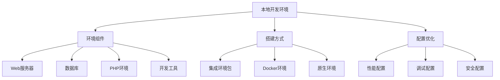
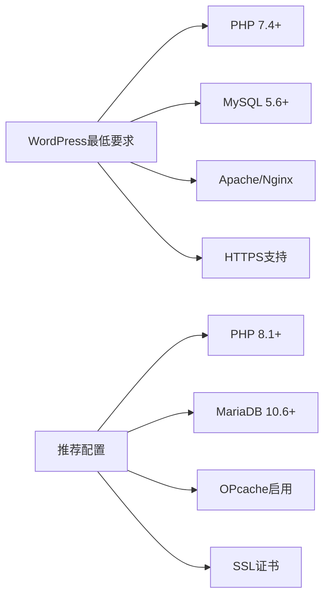
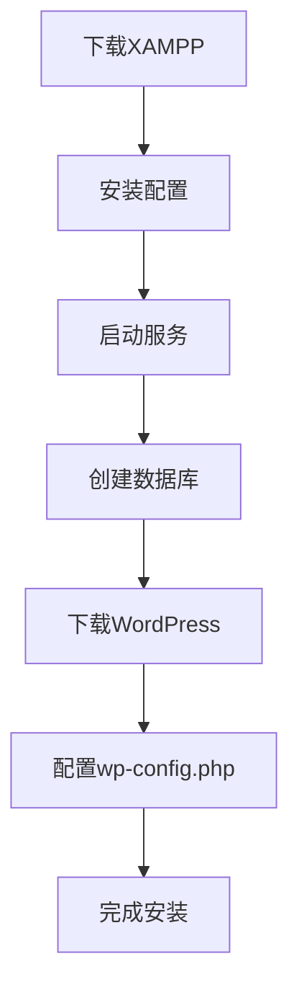
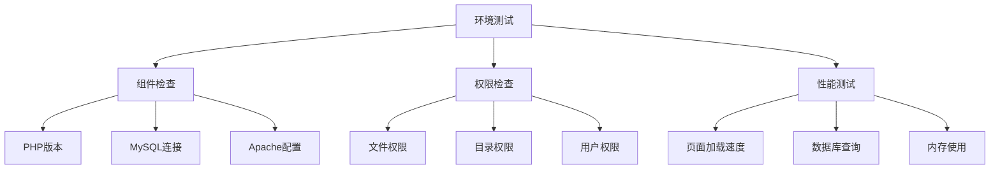
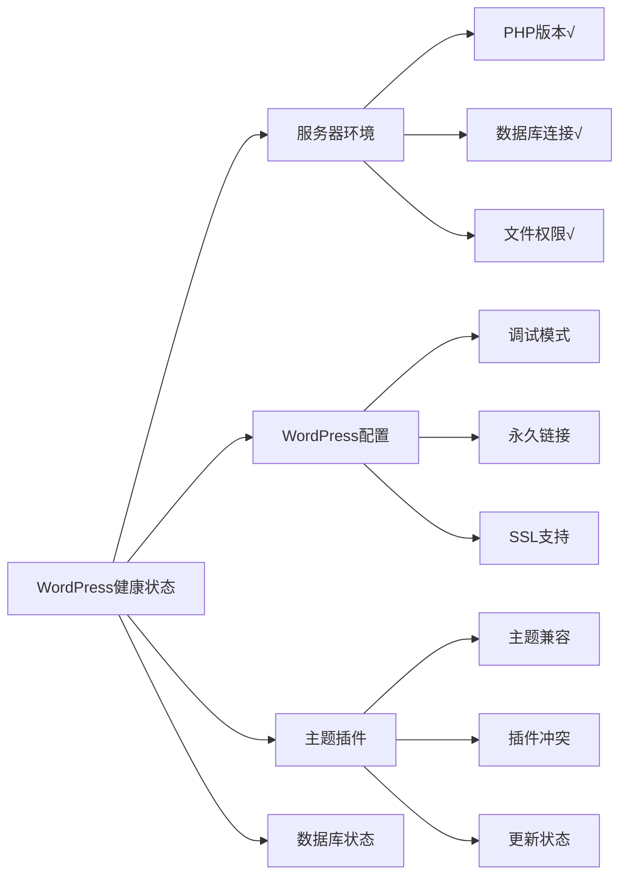

# WordPress本地开发环境搭建

## 🎯 学习目标

> **认识 → 理解 → 应用**
> - **认识**：了解本地开发环境的组件和作用
> - **理解**：掌握环境搭建的原理和配置
> - **应用**：独立完成WordPress本地开发环境配置

## 📋 知识地图



## 💡 环境组件认知

### 核心组件对比

| 组件 | 作用 | 常见选择 | 备注 |
|------|------|----------|------|
| **Web服务器** | 处理HTTP请求 | Apache / Nginx | WordPress推荐Apache |
| **数据库** | 存储数据 | MySQL / MariaDB | MariaDB是MySQL分支 |
| **PHP** | 运行WordPress | PHP 8.0+ | 支持最新WordPress |
| **开发工具** | 代码编写调试 | VS Code / PhpStorm | 支持PHP和前端开发 |

### WordPress系统要求



## 🔧 环境搭建理解

### 方案1：集成环境包（推荐新手）

#### XAMPP环境搭建



**详细步骤**：

1. **下载和安装XAMPP**
   ```bash
   # Windows
   https://www.apachefriends.org/download.html
   
   # macOS
   brew install --cask xampp
   
   # Linux (Ubuntu/Debian)
   wget https://sourceforge.net/projects/xampp/files/XAMPP%20Linux/latest/download
   ```

2. **启动Apache和MySQL**
   ```bash
   # XAMPP控制面板启动或命令行
   sudo /opt/lampp/lampp start
   ```

3. **创建WordPress数据库**
   ```sql
   -- 通过phpMyAdmin或命令行
   CREATE DATABASE wordpress_local;
   CREATE USER 'wp_user'@'localhost' IDENTIFIED BY 'secure_password';
   GRANT ALL PRIVILEGES ON wordpress_local.* TO 'wp_user'@'localhost';
   FLUSH PRIVILEGES;
   ```

4. **配置WordPress**
   ```php
   // wp-config.php
   define('DB_NAME', 'wordpress_local');
   define('DB_USER', 'wp_user');
   define('DB_PASSWORD', 'secure_password');
   define('DB_HOST', 'localhost');
   
   // 调试模式（仅开发环境）
   define('WP_DEBUG', true);
   define('WP_DEBUG_LOG', true);
   define('WP_DEBUG_DISPLAY', false);
   ```

#### 其他集成环境包对比

| 环境包 | 操作系统 | 特点 | 适用场景 |
|--------|----------|------|----------|
| **XAMPP** | Windows/Mac/Linux | 简单易用，功能全面 | 新手学习 |
| **MAMP** | Mac | Mac优化，性能好 | Mac开发者 |
| **Laragon** | Windows | 轻量快速，现代化 | Windows开发者 |
| **Local by Flywheel** | Windows/Mac | Docker技术，独立站点 | 专业开发 |

### 方案2：Docker环境（推荐专业开发）

#### Docker Compose配置

```yaml
# docker-compose.yml
version: '3.8'

services:
  wordpress:
    image: wordpress:latest
    ports:
      - "8080:80"
    environment:
      WORDPRESS_DB_HOST: mysql:3306
      WORDPRESS_DB_NAME: wordpress
      WORDPRESS_DB_USER: wordpress
      WORDPRESS_DB_PASSWORD: wordpress
    volumes:
      - ./wordpress:/var/www/html
      - ./uploads:/var/www/html/wp-content/uploads
    depends_on:
      - mysql
    restart: unless-stopped

  mysql:
    image: mysql:8.0
    environment:
      MYSQL_DATABASE: wordpress
      MYSQL_USER: wordpress
      MYSQL_PASSWORD: wordpress
      MYSQL_ROOT_PASSWORD: rootpassword
    volumes:
      - mysql_data:/var/lib/mysql
    restart: unless-stopped

  phpmyadmin:
    image: phpmyadmin/phpmyadmin
    ports:
      - "8081:80"
    environment:
      PMA_HOST: mysql
      PMA_USER: wordpress
      PMA_PASSWORD: wordpress
    depends_on:
      - mysql
    restart: unless-stopped

volumes:
  mysql_data:
```

**启动命令**：
```bash
# 启动环境
docker-compose up -d

# 停止环境
docker-compose down

# 查看日志
docker-compose logs wordpress
```

### 方案3：原生环境配置

#### Linux (Ubuntu/Debian)

```bash
# 1. 安装LAMP栈
sudo apt update
sudo apt install apache2 mysql-server php php-mysql php-cli php-curl php-gd php-imagick php-mbstring php-xml php-zip libapache2-mod-php

# 2. 配置Apache虚拟主机
sudo nano /etc/apache2/sites-available/wordpress.local.conf
```

```apache
<VirtualHost *:80>
    ServerName wordpress.local
    DocumentRoot /var/www/wordpress
    
    <Directory /var/www/wordpress>
        AllowOverride All
        Require all granted
    </Directory>
    
    ErrorLog ${APACHE_LOG_DIR}/wordpress_error.log
    CustomLog ${APACHE_LOG_DIR}/wordpress_access.log combined
</VirtualHost>
```

```bash
# 3. 启用站点和模块
sudo a2ensite wordpress.local
sudo a2enmod rewrite
sudo systemctl restart apache2

# 4. 配置hosts文件
echo "127.0.0.1 wordpress.local" | sudo tee -a /etc/hosts
```

## 🚀 配置优化应用

### PHP配置优化

#### php.ini开发环境设置

```ini
# 性能配置
memory_limit = 256M
max_execution_time = 300
max_input_time = 300
post_max_size = 64M
upload_max_filesize = 64M

# 错误报告
display_errors = On
log_errors = On
error_log = /var/log/php/error.log

# 扩展模块
extension=mysqli
extension=pdo_mysql
extension=gd
extension=zip
extension=curl
extension=mbstring
extension=xml

# Opcache优化
opcache.enable=1
opcache.memory_consumption=128
opcache.max_accelerated_files=4000
opcache.revalidate_freq=60
```

#### MySQL配置优化

```ini
# my.cnf 开发环境配置
[mysqld]
# 基础设置
default-storage-engine = InnoDB
collation-server = utf8mb4_unicode_ci
character-set-server = utf8mb4

# 性能设置
innodb_buffer_pool_size = 256M
innodb_log_file_size = 32M
query_cache_type = 1
query_cache_size = 32M

# 开发便利
log_slow_queries = /var/log/mysql/mysql-slow.log
long_query_time = 1
```

### 调试环境配置

#### WordPress调试设置

```php
// wp-config.php 开发配置
// 数据库连接
define('DB_NAME', 'your_db_name');
define('DB_USER', 'your_db_user');
define('DB_PASSWORD', 'your_db_password');
define('DB_HOST', 'localhost');

// WordPress设置
define('WP_DEBUG', true);
define('WP_DEBUG_LOG', true);
define('WP_DEBUG_DISPLAY', false);
define('SCRIPT_DEBUG', true);

// 开发便利
define('WP_LOCAL_DEV', true);
define('SAVEQUERIES', true);

// 禁用缓存（开发环境）
define('WP_CACHE', false);

// 内存限制
ini_set('memory_limit', '256M');

// 错误报告
error_reporting(E_ALL);
ini_set('display_errors', 1);
```

#### 调试工具配置

| 工具 | 作用 | 安装方式 |
|------|------|----------|
| **Query Monitor** | SQL查询监控 | 插件安装 |
| **Debug Bar** | 调试信息显示 | 插件安装 |
| **Xdebug** | PHP调试插件 | 服务器配置 |
| **Chrome扩展** | 前端网络监控 | 浏览器安装 |

### 开发工具配置

#### VS Code WordPress配置

```json
// .vscode/settings.json
{
    "php.suggest.basic": false,
    "php.validate.executablePath": "/usr/bin/php",
    "files.associations": {
        "*.php": "php"
    },
    "emmet.includeLanguages": {
        "php": "html"
    },
    "wordpresstoolbox.formatOnSave": true,
    "wordpresstoolbox.formatProvider": "phpcbf",
    "wordpresstoolbox.phpcs": {
        "enable": true,
                        "executablePath": "vendor/bin/phpcs",
                        "standard": "WordPress",
                        "autoFixOnSave": true
    }
}
```

## 📊 环境测试验证

### 系统健康检查



#### PHP环境信息检查

```php
<?php
// phpinfo.php - 临时环境检查文件
echo "PHP版本: " . phpversion() . "<br>";
echo "MySQL支持: " . (extension_loaded('mysqli') ? '是' : '否') . "<br>";
echo "GD库支持: " . (extension_loaded('gd') ? '是' : '否') . "<br>";
echo "内存限制: " . ini_get('memory_limit') . "<br>";
echo "最大上传: " . ini_get('upload_max_filesize') . "<br>";
echo "最大POST: " . ini_get('post_max_size') . "<br>";
?>
```

#### WordPress系统状态



## 🎯 刻意练习项目

### 练习1：多环境管理
**目标**：设置开发/测试/生产环境
**技能点**：环境隔离、配置管理、版本控制

### 练习2：性能基准测试
**目标**：测试不同环境配置的性能差异
**技能点**：性能监控、配置优化、基准测试

### 练习3：自动化部署
**目标**：实现代码从开发环境到生产的自动部署
**技能点**：CI/CD、版本控制、自动化脚本

## 🔗 拓展学习链接

### 进阶主题
- [[服务器部署]] - 生产环境部署
- [[数据库配置]] - 数据库优化配置
- [[环境配置最佳实践]] - 最佳实践指南

### 相关工具
- [[开发工具]] - 开发工具链配置
- [[版本管理]] - Git版本控制

### 实战项目
- [[学习检查清单]] - 验证技能掌握程度
- [[项目实战]] - 实际项目应用

---

## 💬 知识检查

**理解检验**：
1. XAMPP、Docker、原生环境三种方式各有什么优缺点？
2. WordPress系统的最低要求是什么？
3. 开发环境中应该如何配置调试选项？

**应用检验**：
1. 使用Docker搭建独立的WordPress开发环境
2. 配置PHP调试环境和相关工具
3. 测试环境的完整性和性能

### 故障排除

#### 常见问题解决

| 问题 | 原因 | 解决方案 |
|------|------|----------|
| **500错误** | PHP语法错误或配置问题 | 检查错误日志，修复代码 |
| **数据库连接失败** | 配置错误或服务未启动 | 验证数据库配置和服务状态 |
| **文件权限问题** | 权限设置不正确 | `chmod -R 755 wp-content` |

**下一步学习**：[[数据库配置]] → 深入学习数据库配置和管理
