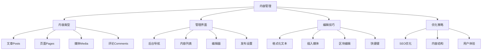
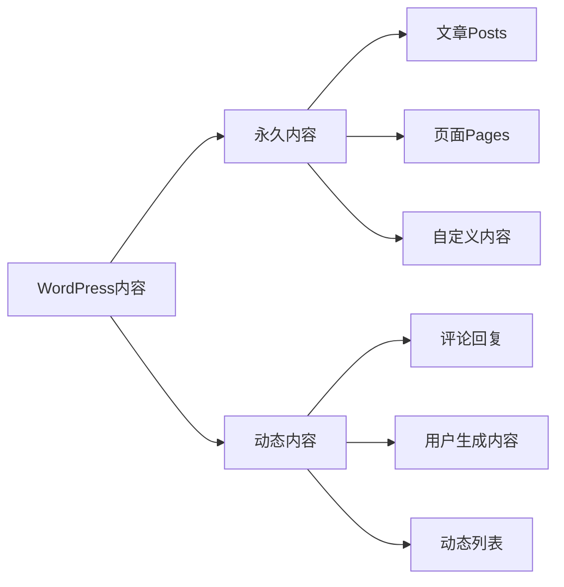
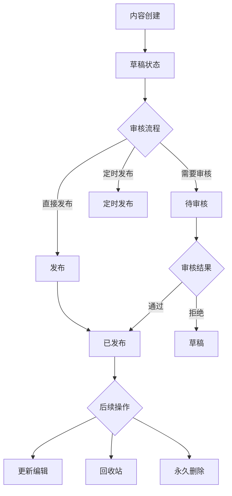
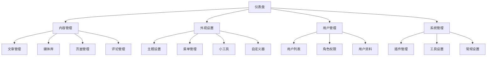
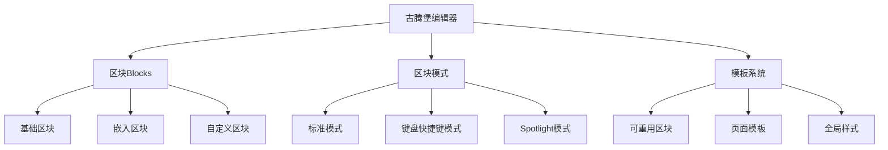
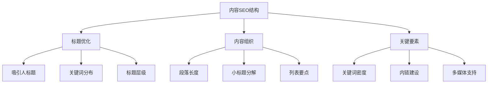
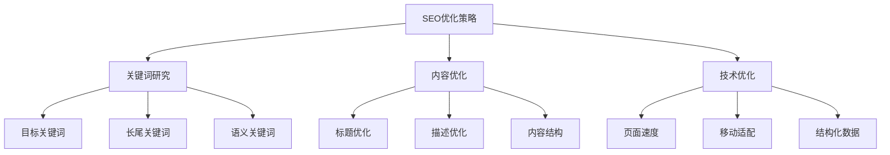

# WordPress内容管理基础

## 🎯 学习目标

> **认识 → 理解 → 应用**
> - **认识**：了解WordPress内容类型和管理界面
> - **理解**：掌握内容的创建、编辑、发布流程
> - **应用**：高效管理和优化网站内容

## 📋 知识地图



## 💡 内容类型认知

### WordPress内容体系



### 内容类型对比

| 类型 | 用途 | 特点 | SEO价值 | 社交分享 |
|------|------|------|---------|----------|
| **文章** | 博客内容、新闻发布 | 有时效性、支持分类标签 | 高 | 支持 |
| **页面** | 静态页面、公司介绍 | 永久性、层级结构 | 中 | 一般 |
| **媒体** | 图片、视频、文档 | 多媒体内容、下载资源 | 低 | 支持 |
| **评论** | 用户互动、SEO内容 | 用户生成、社区价值 | 中 | 无 |

### 内容状态管理



## 🔧 管理界面理解

### 后台导航结构

#### 主要管理区域



### 内容管理界面详解

#### 文章/页面列表界面

| 功能 | 描述 | 操作要点 |
|------|------|----------|
| **筛选器** | 按状态、日期、分类筛选 | 下拉选择条件 |
| **批量操作** | 批量编辑、删除、移动 | Shift+点击多选 |
| **快速编辑** | 快速修改标题、日期等 | 鼠标悬停显示 |
| **查看统计** | 阅读量、评论数统计 | 数值显示 |

#### 编辑器功能对比

| 编辑器类型 | 特点 | 适用场景 | 优缺点 |
|-----------|------|----------|--------|
| **经典编辑器** | 简单易用、WYSIWYG | 基础内容编辑 | 功能有限 |
| **古腾堡编辑器** | 区块化、可视化 | 现代内容创作 | 学习曲线陡峭 |
| **Elementor** | 拖拽式页面构建 | 页面设计 | 第三方插件 |

## 🚀 编辑技巧应用

### Gutenberg区块编辑器

#### 核心概念理解



#### 常用区块类型

| 区块类型 | 功能 | 快捷键 | 使用频率 |
|----------|------|--------|----------|
| **段落** | 文本内容 | `/para` | ⭐⭐⭐⭐⭐ |
| **标题** | 各级标题 | `/heading` | ⭐⭐⭐⭐⭐ |
| **图片** | 图片插入 | `/image` | ⭐⭐⭐⭐ |
| **列表** | 有序/无序列表 | `/list` | ⭐⭐⭐⭐ |
| **引用** | 引用内容 | `/quote` | ⭐⭐⭐ |
| **按钮** | CTA按钮 | `/button` | ⭐⭐⭐ |
| **列** | 多列布局 | `/columns` | ⭐⭐⭐ |
| **分隔符** | 内容分割 | `/separator` | ⭐⭐ |

### 内容格式化技巧

#### 文本格式化最佳实践

```html
<!-- 标题层级结构 -->
## 主标题 (H2)
### 二级标题 (H3)
#### 三级标题 (H4)

<!-- 列表优化 -->
**优点：**
- 提高可读性
- 便于扫描
- SEO友好

**步骤：**
1. 明确目标
2. 制定计划
3. 执行实施
4. 效果评估

<!-- 引用和强调 -->
> 重要信息或引用内容

**重要提醒**：需要特别注意的操作

*斜体强调*：次要重要信息
```

#### SEO友好的内容结构



### 快捷键和效率技巧

#### 编辑器快捷键

| 功能 | Windows快捷键 | Mac快捷键 | 描述 |
|------|----------------|-----------|------|
| **保存草稿** | Ctrl+S | Cmd+S | 快速保存 |
| **预览** | Ctrl+Shift+P | Cmd+Shift+P | 预览效果 |
| **发布** | Ctrl+Shift+P | Cmd+Option+P | 发布内容 |
| **插入链接** | Ctrl+K | Cmd+K | 创建链接 |
| **加粗** | Ctrl+B | Cmd+B | 文本加粗 |
| **斜体** | Ctrl+I | Cmd+I | 文本斜体 |
| **撤销** | Ctrl+Z | Cmd+Z | 撤销操作 |
| **重做** | Ctrl+Y | Cmd+Y | 恢复操作 |

#### 批量操作技巧

```php
// 批量更新文章状态示例
// functions.php 中添加批量操作钩子
add_action('admin_action_bulk_update_status', 'handle_bulk_status_update');

function handle_bulk_status_update() {
    if (!current_user_can('edit_posts')) {
        wp_die('权限不足');
    }
    
    $post_ids = $_POST['post'];
    $new_status = sanitize_text_field($_POST['bulk_action']);
    
    foreach ($post_ids as $post_id) {
        wp_update_post(array(
            'ID' => $post_id,
            'post_status' => $new_status
        ));
    }
    
    wp_redirect(admin_url('edit.php'));
    exit();
}
```

## 📊 内容优化策略

### SEO内容优化

#### 关键词优化策略



#### 内容质量评估

| 评估维度 | 标准 | 检查方法 |
|----------|------|----------|
| **原创性** | 原创内容比例>80% | 人工检查+工具检测 |
| **相关性** | 关键词与内容匹配 | SEO工具分析 |
| **完整性** | 信息全面准确 | 人工评估 |
| **可读性** | 易读易懂 | Flesch可读性指标 |
| **时效性** | 信息更新及时 | 时间戳验证 |

### 用户体验优化

#### 内容结构设计

```html
<!-- 用户友好的内容设计 -->

<!-- 1. 引人注目的开头 -->
<h1>解决WordPress性能问题的10种方法</h1>
<p class="lead">本文将介绍最有效的WordPress优化技巧...</p>

<!-- 2. 清晰的内容导航 -->
<div class="table-of-contents">
  <h3>目录</h3>
  <ul>
    <li><a href="#cache">1. 缓存优化</a></li>
    <li><a href="#images">2. 图片优化</a></li>
    <li><a href="#database">3. 数据库优化</a></li>
  </ul>
</div>

<!-- 3. 丰富的视觉元素 -->

<style>
.sidebar-highlight {
  background: #f0f8ff;
  border-left: 4px solid #0073aa;
  padding: 15px;
  margin: 20px 0;
}

.key-stat {
  font-size: 2em;
  font-weight: bold;
  color: #2271b1;
}
</style>

<!-- 4. 实用的操作指导 -->
<div class="step-guide">
  <h4>步骤1：安装缓存插件</h4>
  <ol>
    <li>进入插件管理页面</li>
    <li>搜索"W3 Total Cache"</li>
    <li>安装并激活插件</li>
  </ol>
</div>

<!-- 5. 总结和行动建议 -->
<div class="conclusion">
  <h3>总结</h3>
  <p>通过以上10种方法，你的WordPress站点性能将显著提升...</p>
  <a href="#action-plan" class="cta-button">立即开始优化</a>
</div>
```

## 🎯 刻意练习项目

### 练习1：内容创作效率
**目标**：使用快捷键和区块提升编辑效率
**技能点**：快捷键掌握、区块使用、格式化技巧

### 练习2：SEO内容优化
**目标**：创建SEO友好的优质内容
**技能点**：关键词研究、标题优化、内链建设

### 练习3：多媒体内容
**目标**：制作图文并茂的优质内容
**技能点**：图片优化、视频嵌入、交互元素

## 🔗 拓展学习链接

### 进阶主题
- [[分类标签管理]] - 内容分类体系
- [[用户权限管理]] - 内容权限控制
- [[基础操作练习]] - 实际操作练习

### 相关工具
- [[开发工具]] - 内容管理工具
- [[模板文件详解]] - 内容显示模板

### 实战项目
- [[前端开发项目]] - 前端内容展示
- [[博客网站项目]] - 个人博客实战

---

## 💬 知识检查

**理解检验**：
1. 文章和页面的主要区别是什么？
2. Gutenberg编辑器的核心优势是什么？
3. 如何评估内容的质量和SEO效果？

**应用检验**：
1. 创建一篇完整的博文并优化SEO
2. 设计用户友好的内容结构
3. 掌握编辑器的快捷键和效率技巧

### 故障排除

#### 常见内容问题

| 问题 | 原因 | 解决方案 |
|------|------|----------|
| **编辑内容丢失** | 浏览器刷新或网络问题 | 自动保存功能保护 |
| **格式显示错乱** | CSS冲突或编码问题 | 检查主题兼容性 |
| **图片上传失败** | 权限设置或大小限制 | 检查文件权限和PHP限制 |

**下一步学习**：[[分类标签管理]] → 学习内容分类和组织方法
