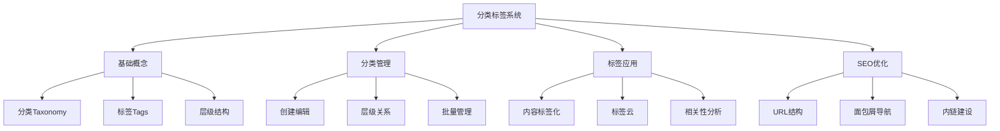
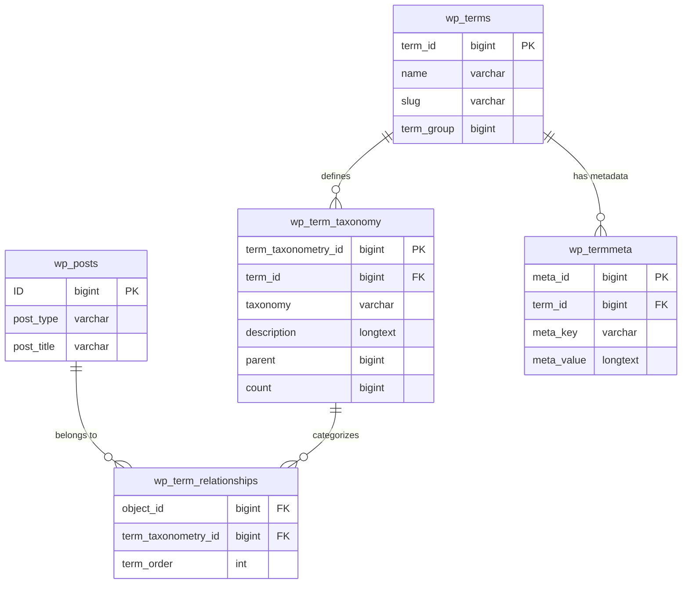
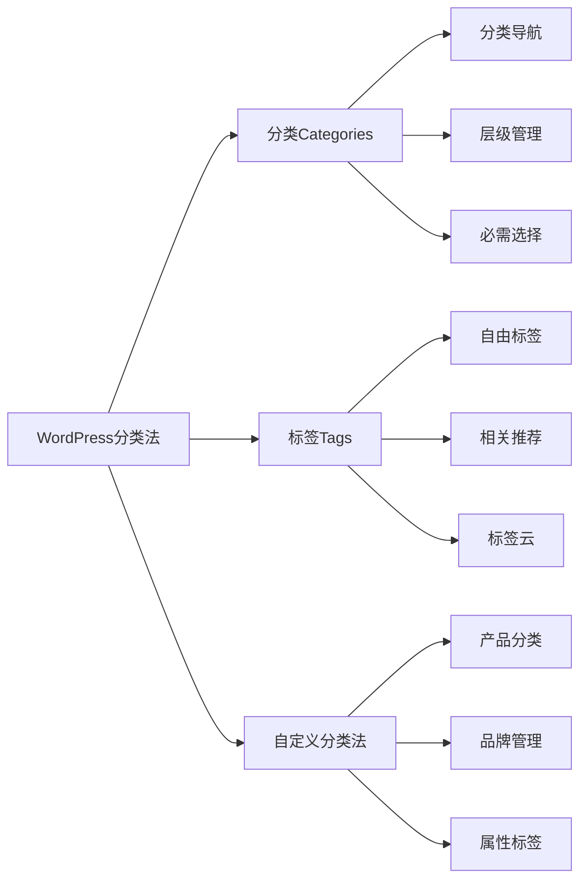
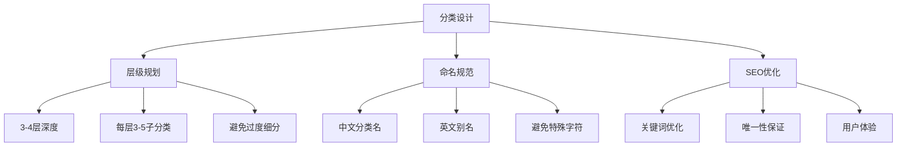
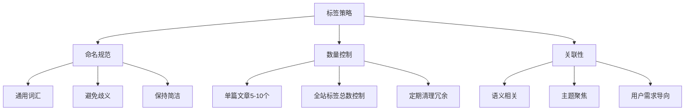

# WordPress分类与标签管理

## 🎯 学习目标

> **认识 → 理解 → 应用**
> - **认识**：了解分类和标签的作用机制
> - **理解**：掌握分类系统的设计和优化
> - **应用**：建立高效的网站内容分类体系

## 📋 知识地图



## 💡 基础概念认知

### 分类系统架构



### 分类vs标签对比

| 属性 | 分类 (Categories) | 标签 (Tags) | 自定义分类法 |
|------|-------------------|-------------|--------------|
| **层级结构** | 支持父子层级 | 扁平结构 | 可设置层级 |
| **必需性** | 必须选择 | 可选 | 可设置必需 |
| **数量限制** | 建议1-3个 | 建议5-10个 | 自定义规则 |
| **SEO权重** | 较高 | 中等 | 视情况而定 |
| **URL结构** | `/category/name/` | `/tag/name/` | `/taxonomy/name/` |

### WordPress内置分类法



## 🔧 分类管理理解

### 分类创建与管理

#### 后台分类管理界面

| 功能区域 | 操作 | 说明 |
|----------|------|------|
| **添加新分类** | 分类名称、别名、描述 | 创建顶级分类 |
| **父级分类** | 选择上级分类 | 建立层级关系 |
| **别名设置** | URL友好标识 | SEO优化考虑 |
| **描述内容** | 分类说明文字 | 可包含HTML |

#### 分类创建最佳实践



#### 分类创建示例

```php
// 通过代码创建分类
function create_default_categories() {
    $categories = array(
        '技术文章' => array(
            'slug' => 'tech',
            'description' => '技术类文章分类',
            'parent' => 0
        ),
        'WordPress' => array(
            'slug' => 'wordpress',
            'description' => 'WordPress相关教程和技巧',
            'parent' => 'tech'  // 假设tech的term_id
        ),
        '前端开发' => array(
            'slug' => 'frontend',
            'description' => 'HTML、CSS、JavaScript相关',
            'parent' => 'tech'
        )
    );
    
    foreach ($categories as $name => $args) {
        if (!term_exists($name, 'category')) {
            wp_insert_term($name, 'category', array(
                'slug' => $args['slug'],
                'description' => $args['description']
            ));
        }
    }
}
add_action('init', 'create_default_categories');
```

### 层级结构设计

#### 合理的分层设计方案

```
博客主题分类 (举例：技术博客)
├── 编程语言
│   ├── JavaScript
│   │   ├── ES6+
│   │   └── Node.js
│   ├── PHP
│   │   ├── WordPress
│   │   └── Laravel
│   └── Python
├── 开发工具
│   ├── 代码编辑器
│   ├── 版本控制
│   └── 测试工具
└── 行业趋势
    ├── Web开发
    ├── 移动开发
    └── 人工智能
```

#### 层级关系管理

```php
// 获取分类层级关系
function get_category_hierarchy($parent = 0) {
    $categories = get_categories(array(
        'parent' => $parent,
        'hide_empty' => false
    ));
    
    $result = array();
    foreach ($categories as $category) {
        $category_data = array(
            'id' => $category->term_id,
            'name' => $category->name,
            'slug' => $category->slug,
            'count' => $category->count,
            'children' => get_category_hierarchy($category->term_id)
        );
        $result[] = $category_data;
    }
    
    return $result;
}

// 在前端显示分类树
function display_category_tree($categories, $level = 0) {
    $indent = str_repeat('&nbsp;&nbsp;&nbsp;&nbsp;', $level);
    
    echo '<ul class="category-tree">';
    foreach ($categories as $category) {
        echo '<li>' . $indent;
        echo '<a href="' . get_category_link($category['id']) . '">';
        echo $category['name'] . ' (' . $category['count'] . ')';
        echo '</a>';
        
        if (!empty($category['children'])) {
            display_category_tree($category['children'], $level + 1);
        }
        echo '</li>';
    }
    echo '</ul>';
}
```

## 🚀 标签应用理解

### 标签策略设计

#### 标签创建原则



#### 标签自动建议实现

```php
// 标签自动完成功能
function auto_suggest_tags($term) {
    $tags = get_tags(array(
        'search' => $term,
        'number' => 10,
        'orderby' => 'count',
        'order' => 'DESC'
    ));
    
    $suggestions = array();
    foreach ($tags as $tag) {
        $suggestions[] = array(
            'label' => $tag->name . ' (' . $tag->count . ')',
            'value' => $tag->name,
            'slug' => $tag->slug
        );
    }
    
    return $suggestions;
}

// AJAX处理标签建议
add_action('wp_ajax_suggest_tags', 'handle_tag_suggestions');
add_action('wp_ajax_nopriv_suggest_tags', 'handle_tag_suggestions');

function handle_tag_suggestions() {
    check_ajax_referer('tag_nonce');
    
    $term = sanitize_text_field($_POST['term']);
    $suggestions = auto_suggest_tags($term);
    
    wp_send_json_success($suggestions);
}
```

### 标签聚合应用

#### 标签云生成

```php
// 生成自适应标签云
function generate_tag_cloud($args = array()) {
    $defaults = array(
        'smallest' => 8,
        'largest' => 22,
        'unit' => 'pt',
        'number' => 45,
        'orderby' => 'count',
        'order' => 'DESC'
    );
    
    $args = wp_parse_args($args, $defaults);
    
    $tags = get_tags($args);
    
    if (empty($tags)) {
        return false;
    }
    
    // 计算标签权重的范围
    $min_count = min(wp_list_pluck($tags, 'count'));
    $max_count = max(wp_list_pluck($tags, 'count'));
    $spread = $max_count - $min_count;
    
    if ($spread <= 0) {
        $spread = 1;
    }
    
    $cloud = '<div class="tag-cloud">';
    foreach ($tags as $tag) {
        $size = $args['smallest'] + 
                (($tag->count - $min_count) / $spread) * 
                ($args['largest'] - $args['smallest']);
        
        $cloud .= sprintf(
            '<a href="%s" style="font-size:%s%s">%s (%d)</a>',
            get_tag_link($tag->term_id),
            $size,
            $args['unit'],
            $tag->name,
            $tag->count
        );
    }
    $cloud .= '</div>';
    
    return $cloud;
}
```

#### 相关标签推荐

```php
// 基于标签的相关性推荐
function get_related_by_tags($post_id, $limit = 5) {
    $tags = wp_get_post_tags($post_id);
    
    if (empty($tags)) {
        return array();
    }
    
    $tag_ids = wp_list_pluck($tags, 'term_id');
    
    $related_posts = get_posts(array(
        'post_type' => 'post',
        'post__not_in' => array($post_id),
        'posts_per_page' => $limit,
        'tax_query' => array(
            array(
                'taxonomy' => 'post_tag',
                'field' => 'term_id',
                'terms' => $tag_ids,
                'operator' => 'IN'
            )
        )
    ));
    
    return $related_posts;
}

// 在single.php中使用
function display_related_posts() {
    global $post;
    
    $related = get_related_by_tags($post->ID);
    
    if (!empty($related)) {
        echo '<div class="related-posts">';
        echo '<h3>相关文章</h3>';
        echo '<ul>';
        
        foreach ($related as $related_post) {
            echo '<li>';
            echo '<a href="' . get_permalink($related_post->ID) . '">';
            echo $related_post->post_title;
            echo '</a>';
            echo '</li>';
        }
        
        echo '</ul>';
        echo '</div>';
    }
}
```

## 📊 SEO优化应用

### URL结构优化

#### 分类/标签URL重写

```php
// 自定义分类法URL结构
function custom_taxonomy_permalinks() {
    // 重写规则示例：/blog/category/name/ 而不是 /category/name/
    add_rewrite_rule(
        '^blog/category/([^/]+)/?$',
        'index.php?category_name=$matches[1]',
        'top'
    );
}
add_action('init', 'custom_taxonomy_permalinks');

// 在主题中使用自定义URL格式
function custom_category_link($termlink, $term, $taxonomy) {
    if ($taxonomy === 'category') {
        $termlink = home_url('/blog/category/' . $term->slug . '/');
    }
    return $termlink;
}
add_filter('term_link', 'custom_category_link', 10, 3);
```

#### 面包屑导航优化

```php
// SEO友好的面包屑导航
function generate_breadcrumbs() {
    global $post;
    
    $breadcrumbs = array();
    $breadcrumbs[] = '<a href="' . home_url() . '">首页</a>';
    
    if (is_category()) {
        $category = get_queried_object();
        $breadcrumbs[] = '<span class="separator"> > </span>';
        $breadcrumbs[] = '<span class="current">' . $category->name . '</span>';
    } elseif (is_tag()) {
        $tag = get_queried_object();
        $breadcrumbs[] = '<span class="separator"> > </span>';
        $breadcrumbs[] = '<span class="current">标签: ' . $tag->name . '</span>';
    } elseif (is_single()) {
        // 添加分类面包屑
        $categories = get_the_category();
        if (!empty($categories)) {
            $breadcrumbs[] = '<span class="separator"> > </span>';
            $breadcrumbs[] = '<a href="' . get_category_link($categories[0]->term_id) . '">' . $categories[0]->name . '</a>';
        }
        
        $breadcrumbs[] = '<span class="separator"> > </span>';
        $breadcrumbs[] = '<span class="current">' . get_the_title() . '</span>';
    }
    
    return implode('', $breadcrumbs);
}
```

### 分类页面SEO

#### 分类页面优化模板

```php
// archive.php 分类页面优化
function optimize_category_page($query) {
    if (!is_admin() && $query->is_main_query() && is_category()) {
        // 设置每页显示数量
        $query->set('posts_per_page', 12);
        
        // 按最新日期排序
        $query->set('orderby', 'date');
        $query->set('order', 'DESC');
        
        // 排除特定文章类型
        $query->set('post_type', 'post');
    }
}
add_action('pre_get_posts', 'optimize_category_page');

// 分类页面meta优化
function category_meta_optimization() {
    if (is_category()) {
        $category = get_queried_object();
        
        echo '<meta name="description" content="' . $category->description . '">';
        echo '<title>' . $category->name . ' - ' . get_bloginfo('name') . '</title>';
        
        // 分页信息
        $page = get_query_var('paged');
        if ($page > 1) {
            echo '<title>' . $category->name . ' 第' . $page . '页 - ' . get_bloginfo('name') . '</title>';
        }
        
        // 结构化数据
        echo '<script type="application/ld+json">';
        echo json_encode(array(
            '@context' => 'https://schema.org',
            '@type' => 'CollectionPage',
            'name' => $category->name,
            'description' => $category->description,
            'url' => get_category_link($category->term_id),
            'mainEntity' => array(
                '@type' => 'ItemList',
                'itemListElement' => array()
            )
        ));
        echo '</script>';
    }
}
add_action('wp_head', 'category_meta_optimization');
```

## 🎯 刻意练习项目

### 练习1：分类体系设计
**目标**：为一个技术博客设计合理的分类结构
**技能点**：分类设计、层级规划、SEO优化

### 练习2：标签策略制定
**目标**：建立高效的标签管理系统
**技能点**：标签规范化、自动化建议、相关性分析

### 练习3：分类页面优化
**目标**：优化分类页面的用户体验和SEO
**技能点**：URL重写、面包屑导航、结构化数据

## 🔗 拓展学习链接

### 进阶主题
- [[自定义分类法]] - 创建专用分类系统
- [[用户权限管理]] - 内容权限控制
- [[基础操作练习]] - 实际管理操作

### 相关工具
- [[模板文件详解]] - 分类页面模板
- [[钩子机制]] - 分类管理钩子

### 实战项目
- [[前端开发项目]] - 分类展示前端
- [[企业官网项目]] - 企业内容分类

---

## 💬 知识检查

**理解检验**：
1. 分类和标签在设计上有什么本质区别？
2. 如何设计合理的分类层级结构？
3. 标签的数量应该如何控制和管理？

**应用检验**：
1. 为不同主题的网站设计分类体系
2. 实现智能标签推荐功能
3. 优化分类页面的SEO效果

### 故障排除

#### 常见分类问题

| 问题 | 原因 | 解决方案 |
|------|------|----------|
| **分类URL 404** | 永久链接设置问题 | 更新重写规则 |
| **分类页面错误** | 缓存或插件冲突 | 清缓存查插件 |
| **标签过多混乱** | 缺乏管理策略 | 制定标签规范 |

**下一步学习**：[[用户权限管理]] → 学习用户角色和内容权限控制
