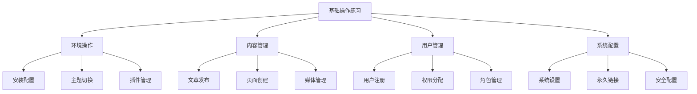
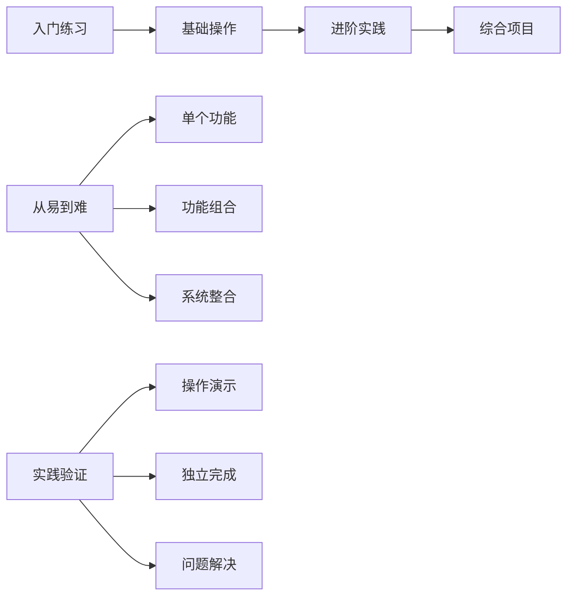
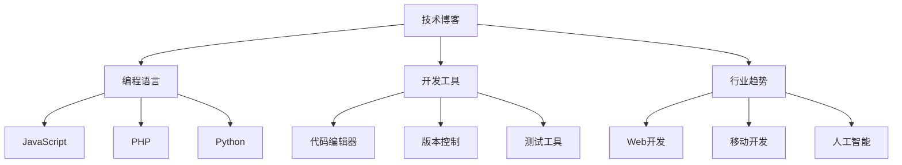

# WordPress基础操作练习

## 🎯 学习目标

> **认识 → 理解 → 应用**
> - **认识**：通过实践掌握WordPress基础操作
> - **理解**：理解操作背后的原理和最佳实践
> - **应用**：建立完整的WordPress使用技能

## 📋 知识地图



## 💡 练习设计理念

### 学习路径设计



## 🔧 练习一：环境搭建实践

### 🎯 练习目标
独立完成WordPress开发环境搭建

### 📝 练习步骤

#### 步骤1：环境准备（15分钟）

**任务描述**：
- 下载并安装XAMPP或MAMP
- 启动Apache和MySQL服务
- 验证环境运行状态

**验收标准**：
- [ ] Apache服务正常运行
- [ ] MySQL服务正常运行
- [ ] phpMyAdmin可以访问

**操作提示**：
```bash
# 检查服务状态
sudo /opt/lampp/lampp status

# 访问phpMyAdmin
http://localhost/phpmyadmin
```

#### 步骤2：数据库创建（10分钟）

**任务描述**：
- 创建WordPress专用数据库
- 创建数据库用户
- 测试数据库连接

**SQL语句示例**：
```sql
-- 创建数据库
CREATE DATABASE wp_learning CHARACTER SET utf8mb4 COLLATE utf8mb4_unicode_ci;

-- 创建用户
CREATE USER 'wp_user'@'localhost' IDENTIFIED BY 'secure_password';

-- 授权权限
GRANT ALL PRIVILEGES ON wp_learning.* TO 'wp_user'@'localhost';
FLUSH PRIVILEGES;
```

**验收标准**：
- [ ] 数据库创建成功
- [ ] 用户可以连接数据库
- [ ] 权限设置正确

#### 步骤3：WordPress安装（20分钟）

**任务描述**：
- 下载最新版WordPress
- 解压到htdocs目录
- 启动安装向导

**安装配置**：
```php
// wp-config.php关键配置
define('DB_NAME', 'wp_learning');
define('DB_USER', 'wp_user');  
define('DB_PASSWORD', 'secure_password');
define('DB_HOST', 'localhost');
define('DB_CHARSET', 'utf8mb4');
define('DB_COLLATE', 'utf8mb4_unicode_ci');

$table_prefix = 'wp_';
```

**验收标准**：
- [ ] WordPress安装成功
- [ ] 可以访问后台管理
- [ ] 仪表盘显示正常

### 📊 练习评估

| 评估项目 | 优秀(9-10分) | 良好(7-8分) | 及格(6分) | 待改进(<6分) |
|----------|-------------|-------------|-----------|-------------|
| **环境搭建** | 独立完成，无错误 | 基本完成，有小问题 | 需要帮助完成 | 无法独立完成 |
| **问题解决** | 快速定位并解决 | 能基本处理问题 | 问题解决较慢 | 不能解决 |  
| **时间控制** | 超时完成 | 按时完成 | 略有超时 | 严重超时 |

---

## 🔧 练习二：内容管理综合实践

### 🎯 练习目标
掌握WordPress内容管理的完整流程

### 📝 练习步骤

#### 步骤1：分类体系设计（20分钟）

**任务描述**：
设计并创建一个技术博客的分类体系

**设计要求**：


**操作要求**：
- 创建3级分类结构
- 设置分类描述和SEO信息
- 配置分类显示顺序

**验收标准**：
- [ ] 分类层级结构清晰
- [ ] 分类描述完整
- [ ] 分类别名SEO友好

#### 步骤2：文章创作实践（30分钟）

**任务描述**：
使用Gutenberg编辑器创建高质量技术文章

**文章要求**：
| 项目 | 具体要求 |
|------|----------|
| **标题** | 吸引人、包含关键词 |
| **分类** | 选择合适的分类 |
| **标签** | 5-8个相关标签 |
| **内容** | 1000字以上，结构清晰 |
| **媒体** | 至少2张图片 |
| **SEO** | 优化meta描述 |

**文章结构示例**：
```
标题：WordPress插件开发从入门到精通

摘要：
本文将从零开始，教会你如何开发WordPress插件...

目录：
1. 开发环境搭建
2. 基础插件结构
3. API使用技巧
4. 发布和推广

结语：
通过本文的学习...

相关文章：
- [链接1]
- [链接2]
```

**验收标准**：
- [ ] 文章内容丰富完整
- [ ] 格式排版美观
- [ ] 图片整合恰当
- [ ] SEO信息完整

#### 步骤3：页面管理系统（20分钟）

**任务描述**：
创建企业官网的核心页面

**页面结构设计**：
```
网站导航结构：
├── 首页 (/)
├── 关于我们 (/about)
├── 服务项目 (/services)
│   ├── Web开发
│   ├── 移动应用
│   └── SEO优化
├── 解决方案 (/solutions)
│   ├── 小型企业
│   ├── 中型企业
│   └── 大型企业
├── 成功案例 (/portfolio)
├── 新闻资讯 (/blog)
└── 联系我们 (/contact)
```

**页面创建要求**：
- 每个页面包含独特内容
- 设置页面属性（模板、父级页）
- 配置页面SEO信息
- 创建页面菜单结构

**验收标准**：
- [ ] 所有页面创建完成
- [ ] 菜单结构合理
- [ ] 页面内容质量高

### 📊 练习评估

| 评估项目 | 优秀(9-10分) | 良好(7-8分) | 及格(6分) | 待改进(<6分) |
|----------|-------------|-------------|-----------|-------------|
| **分类设计** | 结构合理，SEO友好 | 结构基本合理 | 结构简单 | 结构混乱 |
| **内容质量** | 高质量原创内容 | 内容基本满足要求 | 内容一般 | 内容质量差 |
| **技术应用** | 熟练掌握所有功能 | 基本掌握主要功能 | 掌握基本功能 | 功能掌握不足 |

---

## 🔧 练习三：用户权限管理实践

### 🎯 练习目标
建立完善的用户角色和权限管理体系

### 📝 练习步骤

#### 步骤1：角色体系设计（25分钟）

**任务描述**：
为技术博客设计适合的用户角色体系

**角色设计要求**：

| 角色名称 | 权限范围 | 目标用户 | 核心功能 |
|----------|----------|----------|----------|
| **内容管理员** | 内容全权管理 | 编辑团队负责人 | 审核、发布、管理内容 |
| **技术作者** | 技术文章创作 | 技术专家 | 创建、编辑技术文章 |
| **普通作者** | 基础内容创作 | 一般作者 | 创建文章（需审核） |
| **社区管理员** | 用户互动管理 | 客服人员 | 管理评论、用户互动 |
| **VIP会员** | 高级功能访问 | 付费用户 | 访问付费内容 |

**操作任务**：
- 创建自定义用户角色
- 配置角色权限
- 测试角色功能

**代码示例**：
```php
// functions.php中添加
function create_custom_blog_roles() {
    // 内容管理员
    add_role('content_admin', '内容管理员', array(
        'read' => true,
        'edit_posts' => true,
        'edit_others_posts' => true,
        'edit_published_posts' => true,
        'publish_posts' => true,
        'delete_posts' => true,
        'delete_others_posts' => true,
        'delete_published_posts' => true,
        'edit_pages' => true,
        'manage_categories' => true,
        'manage_post_tags' => true,
        'moderate_comments' => true,
        'upload_files' => true,
    ));
    
    // 技术作者
    add_role('tech_author', '技术作者', array(
        'read' => true,
        'edit_posts' => true,
        'publish_posts' => true,
        'delete_posts' => true,
        'upload_files' => true,
        'manage_post_tags' => true,
    ));
    
    // VIP会员
    add_role('vip_member', 'VIP会员', array(
        'read' => true,
        'read_vip_content' => true, // 自定义权限
    ));
}
add_action('init', 'create_custom_blog_roles');
```

**验收标准**：
- [ ] 自定义角色创建成功
- [ ] 权限配置合理
- [ ] 角色功能测试通过

#### 步骤2：用户注册优化（20分钟）

**任务描述**：
创建用户友好的注册流程

**注册表单设计**：

```html
<!-- 注册表单增强 -->
<form method="post" action="<?php echo site_url('wp-login.php?action=register', 'login_post') ?>">
    <p>
        <label for="user_role">申请角色：</label>
        <select name="user_role" id="user_role" required>
            <option value="">请选择申请角色</option>
            <option value="tech_author">技术作者</option>
            <option value="contributor">普通作者</option>
            <option value="subscriber">订阅者</option>
        </select>
    </p>
    
    <p>
        <label for="real_name">真实姓名：</label>
        <input type="text" name="real_name" id="real_name" required>
    </p>
    
    <p>
        <label for="bio">个人简介：</label>
        <textarea name="bio" id="bio" rows="3" placeholder="请简述您的专业背景..."></textarea>
    </p>
    
    <p>
        <label for="github">GitHub地址：</label>
        <input type="url" name="github" id="github" placeholder="https://github.com/username">
    </p>
    
    <button type="submit">注册</button>
</form>
```

**后端处理代码**：
```php
// 保存自定义注册信息
function save_custom_registration_data($user_id) {
    if (isset($_POST['user_role']) && !empty($_POST['user_role'])) {
        $role = sanitize_text_field($_POST['user_role']);
        $allowed_roles = array('tech_author', 'contributor', 'subscriber');
        
        if (in_array($role, $allowed_roles)) {
            $user = new WP_User($user_id);
            $user->set_role($role);
        }
    }
    
    // 保存其他自定义字段
    $meta_fields = array('real_name', 'bio', 'github');
    foreach ($meta_fields as $field) {
        if (isset($_POST[$field])) {
            update_user_meta($user_id, $field, sanitize_text_field($_POST[$field]));
        }
    }
}
add_action('user_register', 'save_custom_registration_data');
```

**验收标准**：
- [ ] 注册表单功能完整
- [ ] 用户信息保存正确
- [ ] 角色分配自动完成

#### 步骤3：权限验证测试（15分钟）

**任务描述**：
测试不同角色的权限限制

**测试清单**：

| 测试项目 | 技术作者 | 普通作者 | VIP会员 |
|----------|----------|----------|----------|
| **发表文章** | ✅ | ⚠️需审核 | ❌ |
| **直接发布** | ✅ | ❌ | ❌ |
| **上传媒体** | ✅ | ✅ | ❌ |
| **查看VIP内容** | ✅ | ❌ | ✅ |
| **管理分类** | ❌ | ❌ | ❌ |
| **管理评论** | ❌ | ❌ | ❌ |

**测试代码示例**：
```php
// 权限测试函数
function test_user_permissions() {
    $current_user = wp_get_current_user();
    
    echo "<h3>当前用户: {$current_user->display_name}</h3>";
    echo "<p>角色: " . implode(', ', $current_user->roles) . "</p>";
    
    $permissions = array(
        'edit_posts' => current_user_can('edit_posts'),
        'publish_posts' => current_user_can('publish_posts'),
        'delete_posts' => current_user_can('delete_posts'),
        'upload_files' => current_user_can('upload_files'),
        'manage_categories' => current_user_can('manage_categories'),
        'moderate_comments' => current_user_can('moderate_comments'),
    );
    
    echo "<ul>";
    foreach ($permissions as $permission => $has_permission) {
        $status = $has_permission ? '✅' : '❌';
        echo "<li>{$permission}: {$status}</li>";
    }
    echo "</ul>";
}

// VIP内容访问控制
function vip_content_access_control() {
    if (current_user_can('read_vip_content') || current_user_can('teck_author')) {
        // 显示VIP内容
        echo "<div class='vip-content'>这里是VIP专享内容...</div>";
    } else {
        // 显示升级提示
        echo "<div class='upgrade-promote'>升级为VIP会员即可查看此内容</div>";
    }
}
```

**验收标准**：
- [ ] 所有权限测试通过
- [ ] 权限限制正确实施
- [ ] VIP内容访问控制有效

### 📊 练习评估

| 评估项目 | 优秀(9-10分) | 良好(7-8分) | 及格(6分) | 待改进(<6分) |
|----------|-------------|-------------|-----------|-------------|
| **角色设计** | 角色合理，权限清晰 | 基本满足需求 | 角色过于简单 | 角色设计混乱 |
| **权限控制** | 权限控制精确 | 基本权限控制 | 权限控制一般 | 权限控制缺失 |
| **用户体验** | 注册流程顺畅 | 注册流程基本流畅 | 注册流程一般 | 注册流程复杂 |

---

## 🔧 练习四：系统配置综合实践

### 🎯 练习目标
掌握WordPress系统配置和优化

### 📝 练习步骤

#### 步骤1：永久链接优化（15分钟）

**任务描述**：
配置SEO友好的URL结构

**URL结构选择**：

| URL类型 | 格式示例 | SEO价值 | 适用场景 |
|---------|----------|--------- etc|
| **朴素链接** | `/?p=123` | 很低 | 开发测试 |
| **标准链接** | `/index.php/year/month/day/post-name/` | 低 | 临时使用 |
| **月日型** | `/2012/12/19/sample-post/` | 中等 | 时间敏感内容 |
| **日期型** | `/2012/12/sample-post/` | 中等 | 按月归档 |
| **自定义** | `/blog/%postname%/` | 高 | 文章内容 |
| **文章名** | `/sample-post/` | 很高 | SEO优化站点 |

**推荐配置**：
```
# .htaccess配置
RewriteRule ^blog/([^/]+)/?$ /index.php?name=$1 [QSA,L]

# WordPress设置
自定义结构：/blog/%postname%/
```

**分类/标签URL优化**：
```php
// functions.php - 自定义分类URL
function custom_category_url($termlink, $term) {
    if ($term->taxonomy === 'category') {
        return home_url("/blog/category/{$term->slug}/");
    }
    return $termlink;
}
add_filter('term_link', 'custom_category_url', 10, 3);

// 重写规则
function add_custom_rewrite_rules() {
    add_rewrite_rule('^blog/category/([^/]+)/?$', 'index.php?category_name=$1', 'top');
}
add_action('init', 'add_custom_rewrite_rules');
```

**验收标准**：
- [ ] URL结构SEO友好
- [ ] 分类/标签URL优化
- [ ] 链接测试正常访问

#### 步骤2：性能优化配置（20分钟）

**任务描述**：
实施WordPress性能基础优化

**wp-config.php优化**：
```php
// wp-config.php性能优化配置

// 缓存优化
define('WP_CACHE', true);

// 内存限制
ini_set('memory_limit', '256M');

// 数据库查询优化  
define('SAVEQUERIES', false);

// 压缩输出
if (extension_loaded('zlib')):
    ob_start('ob_gzhandler');
endif;

// 禁用编辑器
define('DISALLOW_FILE_EDIT', true);

// 垃圾回收时间
define('EMPTY_TRASH_DAYS', 7);

// 缓存过期时间
if (!defined('WP_CACHE_EXPIRE')) {
    define('WP_CACHE_EXPIRE', 1800);
}
```

**主题优化代码**：
```php
// functions.php性能优化

// 移除无用功能
remove_action('wp_head', 'wp_generator');
remove_action('wp_head', 'wlwmanifest_link');
remove_action('wp_head', 'rsd_link');

// 优化脚本加载
function optimize_scripts_loading() {
    // 移除jQuery和WordPress默认脚本（如果主题不需要）
    if (!is_admin()) {
        wp_deregister_script('jquery');
        wp_dequeue_script('wp-embed');
    }
}
add_action('wp_enqueue_scripts', 'optimize_scripts_loading');

// 启用Gzip压缩
add_action('after_setup_theme', 'enable_gzip');

function enable_gzip() {
    if (!ob_get_level()) {
        ob_start('ob_gzhandler');
    }
}

// 图片懒加载
function add_lazy_loading($content) {
    $content = preg_replace('//','', $content);
    $content = preg_replace('/
    order allow,deny
    deny from all
</files>

# 保护.htaccess
<files .htaccess>
    order allow,deny
    deny from all
</files>

# 限制XML-RPC
<files xmlrpc.php>
    order allow,deny
    deny from all
</files>

# 防止SQL注入和XSS攻击
<IfModule mod_rewrite.c>
    RewriteEngine On
    RewriteCond %{REQUEST_METHOD} ^TRACE
    RewriteRule ^(.*)$ - [F,L]
</IfModule>

# 设置安全头
<IfModule mod_headers.c>
    Header always set X-Frame-Options DENY
    Header always set X-Content-Type-Options nosniff
    Header always set X-XSS-Protection "1; mode=block"
    Header always set Strict-Transport-Security "max-age=31536000; includeSubDomains"
</IfModule>
```

**安全代码实践**：
```php
// functions.php安全增强

// 隐藏WordPress版本信息
function remove_wp_version_info() {
    return '';
}
add_filter('the_generator', 'remove_wp_version_info');

// 清理登录界面
function cleanup_login_page() {
    remove_action('login_head', 'wp_shake_js', 12);
    add_action('login_head', 'remove_wp_shake_js');
}
add_action('login_enqueue_scripts', 'cleanup_login_page');

// 限制登录尝试次数
function limit_login_attempts() {
    $ip = $_SERVER['REMOTE_ADDR'];
    $key = 'login_attempts_' . $ip;
    $attempts = get_transient($key) ?: 0;
    
    if ($attempts >= 5) {
        wp_die('登录失败次数过多，请稍后再试。');
    }
}
add_action('wp_login_failed', function() {
    $ip = $_SERVER['REMOTE_ADDR'];
    $key = 'login_attempts_' . $ip;
    $attempts = get_transient($key) ?: 0;
    set_transient($key, $attempts + 1, 900); // 15分钟
});

// 强制SSL
define('FORCE_SSL_ADMIN', true);

// 自定义登录URL
function custom_login_url() {
    return home_url('/my-secure-login/', 'login');
}
add_filter('login_url', 'custom_login_url');
```

**验收标准**：
- [ ] 文件权限设置正确
- [ ] 安全配置实施到位
- [ ] 安全测试通过

### 📊 练习评估

| 评估项目 | 优秀(9-10分) | 良好(7-8分) | 及格(6分) | 待改进(<6分) |
|----------|-------------|-------------|-----------|-------------|
| **URL优化** | 完全SEO友好 | URL基本合理 | URL可接受 | URL有优化空间 |
| **性能优化** | 显著性能提升 | 性能有所提升 | 基本优化 | 优化不明显 |
| **安全配置** | 安全配置完善 | 基本安全措施 | 简单安全措施 | 安全措施不足 |

---

## 🎯 综合项目练习

### 📝 项目：搭建个人技术博客

### 🎯 项目目标
运用所学知识，建立一个完整的个人技术博客网站

### 📋 项目要求

#### 功能要求（必需）

| 功能模块 | 具体要求 | 权重分数 |
|----------|----------|----------|
| **环境搭建** | 独立完成LAMP环境搭建 | 10分 |
| **站点配置** | SEO友好的URL结构 | 15分 |
| **分类设计** | 3级分类体系，至少20个分类 | 15分 |
| **内容创作** | 至少10篇高质量技术文章 | 20分 |
| **用户管理** | 创建至少2个自定义角色 | 10分 |
| **页面创建** | 关于、联系、服务等关键页面 | 10分 |
| **媒体优化** | 图片压缩、CDN配置（模拟） | 10分 |
| **安全配置** | 基础安全措施实施 | 10分 |

#### 高质量要求（加分项）

| 加分项目 | 具体要求 | 加分分数 |
|----------|----------|----------|
| **主题定制** | 简单的CSS自定义 | +10分 |
| **插件集成** | 集成至少3个实用插件 | +10分 |
| **SEO优化** | 完整的SEO配置 | +10分 |
| **响应式设计** | 移动端适配 | +10分 |
| **性能优化** | 页面加载速度优化 | +10分 |

### 📊 项目交付要求

#### 交付清单

1. **技术文档**（20分）
   - 环境搭建步骤记录
   - 配置说明文档
   - 问题解决记录

2. **网站演示**（30分）
   - 完整网站功能演示
   - 后台管理界面展示
   - 用户权限测试演示

3. **代码提交**（20分）
   - 自定义主题文件代码
   - functions.php功能代码
   - 配置文件备份

4. **总结报告**（30分）
   - 学习心得总结
   - 遇到的问题和解决方案
   - 技术技能提升情况
   - 未来改进方向

#### 评估标准

| 考核维度 | 具体评估点 | 评分标准 |
|----------|------------|----------|
| **技术能力** | 能否独立完成各项任务 | 独立完成90%以上功能=9-10分 |
| **问题解决** | 遇到问题的处理能力 | 快速定位并解决=9-10分 |
| **工程质量** | 代码质量和项目规范 | 代码整洁，结构清楚=9-10分 |
| **学习效果** | 通过项目体现的学习成果 | 系统掌握基础技能=9-10分 |

## 📚 学习资源与工具

### 🔗 拓展学习链接

#### 进阶主题
- [[架构原理练习]] - 深入技术原理
- [[模板开发练习]] - 前端开发实践
- [[钩子机制练习]] - 高级开发技巧

#### 实战项目
- [[博客网站项目]] - 实战项目指导
- [[企业官网项目]] - 商业化开发
- [[学习检查清单]] - 技能验证

### 🛠️ 推荐工具

#### 开发工具
- **VS Code**: WordPress开发插件
- **Xdebug**: PHP调试工具
- **Git**: 版本控制管理

#### 在线工具
- **GTmetrix**: 性能测试
- **PageSpeed Insights**: SEO分析
- **WebPageTest**: 详细性能分析

---

## 💬 练习总结

### ✅ 技能检验清单

**基础环境**：
- [ ] 能够独立搭建WordPress开发环境
- [ ] 理解数据库配置和连接原理
- [ ] 掌握WordPress安装和基础配置

**内容管理**：
- [ ] 熟练使用Gutenberg编辑器
- [ ] 掌握分类标签的使用策略
- [ ] 能够设计和实施内容分类体系

**用户权限**：
- [ ] 理解WordPress用户角色机制
- [ ] 能够创建和管理自定义角色
- [ ] 掌握权限验证和控制方法

**系统优化**：
- [ ] 能够配置SEO友好的URL结构
- [ ] 掌握基础的性能优化技巧
- [ ] 了解WordPress安全最佳实践

### 🚀 下一步学习

完成基础操作练习后，建议进入：

1. **核心理解层** - 学习WordPress的技术原理
2. **应用开发层** - 开始主题和插件开发
3. **实战项目** - 通过真实项目巩固技能

记住：**理论与实践相结合，持续练习才是王道！**
