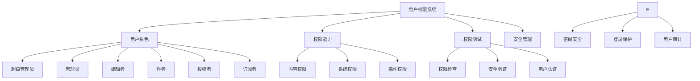
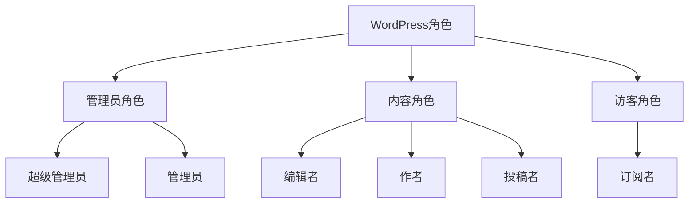
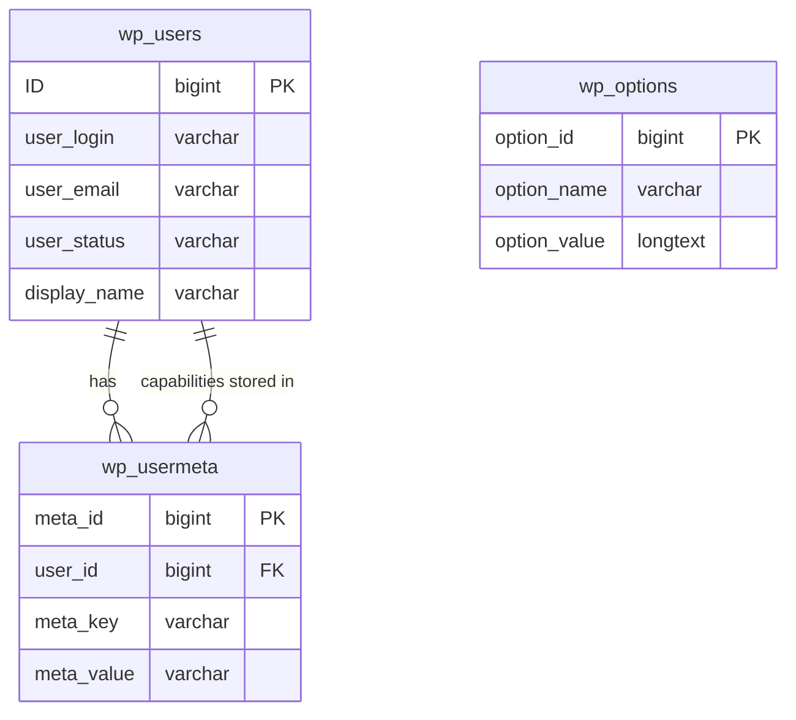

# WordPress用户权限管理

## 🎯 学习目标

> **认识 → 理解 → 应用**
> - **认识**：了解WordPress用户角色和权限系统
> - **理解**：掌握权限分配和用户管理原理
> - **应用**：设计符合业务需求的用户权限体系

## 📋 知识地图



## 💡 用户角色认知

### WordPress内置角色体系



### 角色权限对比表

| 权限功能 | 订阅者 | 投稿者 | 作者 | 编辑者 | 管理员 |
|----------|--------|--------|------|--------|--------|
| **发布内容** | ❌ | ⚠️ | ✅ | ✅ | ✅ |
| **编辑文章** | ❌ | 自己 | 自己 | 全部 | 全部 |
| **管理页面** | ❌ | ❌ | ❌ | ✅ | ✅ |
| **管理用户** | ❌ | ❌ | ❌ | ❌ | ✅ |
| **管理插件** | ❌ | ❌ | ❌ | ❌ | ✅ |
| **管理主题** | ❌ | ❌ | ❌ | ❌ | ✅ |
| **管理设置** | ❌ | ❌ | ❌ | ❌ | ✅ |
| **上传媒体** | ❌ | ❌ | ✅ | ✅ | ✅ |

### 角色详细信息

#### 各角色核心特征

| 角色 | 目标用户 | 核心权限 | 限制条件 | 适用场景 |
|------|----------|----------|----------|----------|
| **超级管理员** | 网络管理员 | 所有权限+网络设置 | 只在Multisite网络 | 多站点管理 |
| **管理员** | 网站所有者 | 全站管理权限 | 不能修改超级管理员 | 单站管理 |
| **编辑者** | 内容经理 | 内容管理权限 | 不能管理用户和插件 | 内容编辑团队 |
| **作者** | 博客作者 | 发布和管理自己的文章 | 不能管理其他用户内容 | 个人博主 |
| **投稿者** | 客座作者 | 创建文章但需审核 | 不能直接发布 | 多作者网站 |
| **订阅者** | 网站用户 | 仅评论和管理资料 | 基本用户权限 | 会员网站 |

## 🔧 权限系统理解

### WordPress权限机制

#### Capability vs Role关系



#### 权限存储机制

| 数据类型 | 存储位置 | 格式 | 示例 |
|----------|----------|------|------|
| **用户角色** | `wp_usermeta` | serialize数组 | `a:1:{s:8:"administrator";b:1;}` |
| **自定义权限** | `wp_usermeta` | serialize数组 | `a:1:{s:12:"custom_cap";b:1;}` |
| **角色定义** | `wp_options` | serialize数组 | `wp_user_roles` 选项 |

### 权限检查机制

#### 权限检查函数使用

```php
// 基础权限检查
if (current_user_can('edit_posts')) {
    echo "用户可以编辑文章";
}

// 特定对象权限检查
if (current_user_can('edit_post', $post_id)) {
    // 用户能否编辑特定文章
}

// 多权限检查
if (current_user_can('edit_posts') && current_user_can('publish_posts')) {
    echo "用户可以编辑和发布文章";
}

// 角色检查
if (current_user_can('administrator')) {
    echo "当前用户是管理员";
}

// 获取当前用户信息
$current_user = wp_get_current_user();
if ($current_user->exists()) {
    echo "用户ID: " . $current_user->ID;
    echo "用户名: " . $current_user->user_login;
    echo "用户角色: " . implode(', ', $current_user->roles);
}
```

#### 权限高级检查

```php
// 自定义权限检查函数
function check_custom_permission($capability, $object_id = null) {
    // 检查用户是否登录
    if (!is_user_logged_in()) {
        return false;
    }
    
    $user = wp_get_current_user();
    
    // 管理员拥有所有权限
    if (current_user_can('administrator')) {
        return true;
    }
    
    // 根据具体权限检查
    switch ($capability) {
        case 'edit_own_posts':
            return current_user_can('edit_posts') && 
                   ($object_id ? current_user_can('edit_post', $object_id) : true);
        
        case 'manage_content':
            return current_user_can('edit_posts') || 
                   current_user_can('edit_pages');
        
        default:
            return current_user_can($capability);
    }
}

// 在模板中使用
if (check_custom_permission('edit_own_posts', get_the_ID())) {
    echo '<a href="' . get_edit_post_link() . '">编辑</a>';
}
```

## 🚀 用户管理应用

### 自定义角色创建

#### 角色创建实例

```php
// 创建自定义角色
function create_custom_roles() {
    // 内容经理角色
    add_role('content_manager', '内容经理', array(
        'read' => true,                    // 基本阅读权限
        'edit_posts' => true,             // 编辑文章
        'edit_others_posts' => true,       // 编辑他人文章
        'edit_published_posts' => true,   // 编辑已发布文章
        'publish_posts' => true,          // 发布文章
        'delete_posts' => true,            // 删除文章
        'delete_others_posts' => true,     // 删除他人文章
        'delete_published_posts' => true,  // 删除已发布文章
        'edit_pages' => true,              // 编辑页面
        'edit_others_pages' => true,        // 编辑他人页面
        'edit_published_pages' => true,     // 编辑已发布页面
        'publish_pages' => true,            // 发布页面
        'delete_pages' => true,             // 删除页面
        'delete_others_pages' => true,      // 删除他人页面
        'delete_published_pages' => true,   // 删除已发布页面
        'upload_files' => true,             // 上传文件
        'manage_categories' => true,       // 管理分类
    ));
    
    // SEO专家角色
    add_role('seo_expert', 'SEO专家', array(
        'read' => true,
        'edit_posts' => true,
        'edit_others_posts' => true,
        'edit_published_posts' => true,
        'publish_posts' => true,
        'upload_files' => true,
        'manage_categories' => true,
        'manage_post_tags' => true,        // 管理标签
    ));
    
    // 客户服务代表
    add_role('customer_support', '客服代表', array(
        'read' => true,
        'upload_files' => true,
        // 自定义权限
        'reply_comments' => true,           // 回复评论
        'view_orders' => true,              // 查看订单（如果安装WooCommerce）
    ));
}
add_action('init', 'create_custom_roles');

// 移除默认角色（可选）
function remove_default_roles() {
    if (get_role('subscriber')) {
        remove_role('subscriber');
    }
}
add_action('init', 'remove_default_roles');
```

### 权限管理界面

#### 用户列表增强

```php
// 在用户列表中添加角色列
function add_role_column($columns) {
    $columns['role'] = '角色';
    $columns['custom_role'] = '自定义角色';
    return $columns;
}
add_filter('manage_users_columns', 'add_role_column');

function show_role_column_content($value, $column_name, $user_id) {
    $user = get_userdata($user_id);
    
    if ($column_name === 'role') {
        return translate_user_role($user->roles[0] ?? '');
    }
    
    if ($column_name === 'custom_role') {
        $custom_role = get_user_meta($user_id, 'custom_role', true);
        return $custom_role ? esc_html($custom_role) : '—';
    }
    
    return $value;
}
add_filter('manage_users_custom_column', 'show_role_column_content', 10, 3);
```

#### 批量用户操作

```php
// 用户批量操作 - 角色修改
function add_bulk_role_actions($actions) {
    $actions['change_role_editor'] = '修改为编辑者';
    $actions['change_role_author'] = '修改为作者';
    $actions['deactivate_users'] = '停用用户';
    
    return $actions;
}
add_filter('bulk_actions-users', 'add_bulk_role_actions');

// 处理批量操作
function handle_bulk_role_actions($redirect_to, $doaction, $user_ids) {
    if ($doaction === 'change_role_editor') {
        foreach ($user_ids as $user_id) {
            $user = new WP_User($user_id);
            $user->set_role('editor');
        }
    } elseif ($doaction === 'change_role_author') {
        foreach ($user_ids as $user_id) {
            $user = new WP_User($user_id);
            $user->set_role('author');
        }
    } elseif ($doaction === 'deactivate_users') {
        foreach ($user_ids as $user_id) {
            update_user_meta($user_id, 'user_status', 'inactive');
        }
    }
    
    return $redirect_to;
}
add_filter('handle_bulk_actions-users', 'handle_bulk_role_actions', 10, 3);
```

### 用户注册和角色分配

#### 自定义注册表单

```php
// 注册时选择角色
function add_role_selection_to_registration() {
    ?>
    <p>
        <label for="user_role">申请角色：</label>
        <select name="user_role" id="user_role" required>
            <option value="">请选择角色</option>
            <option value="subscriber">订阅者</option>
            <option value="contributor">投稿者</option>
        </select>
    </p>
    <p>
        <label for="user_description">个人简介：</label>
        <textarea name="user_description" id="user_description" rows="3"></textarea>
    </p>
    <?php
}
add_action('register_form', 'add_role_selection_to_registration');

// 保存注册时选择 Role
function save_registration_role($user_id) {
    if (isset($_POST['user_role']) && !empty($_POST['user_role'])) {
        $role = sanitize_text_field($_POST['user_role']);
        
        // 验证角色是否可用
        $allowed_roles = array('subscriber', 'contributor');
        if (in_array($role, $allowed_roles)) {
            $user = new WP_User($user_id);
            $user->set_role($role);
        }
    }
    
    if (isset($_POST['user_description'])) {
        update_user_meta($user_id, 'description', sanitize_textarea_field($_POST['user_description']));
    }
}
add_action('user_register', 'save_registration_role');
```

## 📊 安全管理应用

### 登录安全机制

#### 强密码策略

```php
// 密码强度检查
function check_password_strength($errors, $user, $password) {
    $strength = wp_check_password_strength($password);
    
    if ($strength === 'weak') {
        $errors->add('password_weak', '密码强度太弱，请使用更强的密码');
    }
    
    // 自定义密码规则
    if (strlen($password) < 8) {
        $errors->add('password_length', '密码长度至少8位');
    }
    
    if (!preg_match('/[A-Z]/', $password)) {
        $errors->add('password_uppercase', '密码必须包含大写字母');
    }
    
    if (!preg_match('/[0-9]/', $password)) {
        $errors->add('password_number', '密码必须包含数字');
    }
    
    if (!preg_match('/[^A-Za-z0-9]/', $password)) {
        $errors->add('password_special', '密码必须包含特殊字符');
    }
    
    return $errors;
}
add_filter('registration_errors', 'check_password_strength', 10, 3);

// 强制用户更新密码
function check_password_age($user_id) {
    $last_password_change = get_user_meta($user_id, 'last_password_change', true);
    
    if (!$last_password_change) {
        // 新用户，记录当前时间
        update_user_meta($user_id, 'last_password_change', current_time('timestamp'));
    } else {
        // 检查密码使用时间（90天）
        $password_age = current_time('timestamp') - $last_password_change;
        $max_age = 90 * DAY_IN_SECONDS;
        
        if ($password_age > $max_age) {
            add_action('admin_notices', 'show_password_expiry_notice');
        }
    }
}
add_action('set_current_user', 'check_password_age');
```

#### 登录限制和IP监控

```php
// 登录失败限制
function limit_login_attempts() {
    $ip = get_client_ip();
    $attempts = get_transient('login_attempts_' . $ip);
    
    if ($attempts && $attempts >= 5) {
        add_filter('authenticate', 'block_user_login', 10, 3);
        wp_die('登录失败次数过多，请稍后再试');
    }
}
add_action('wp_login_failed', 'increment_login_attempts');
add_action('wp_login', 'clear_login_attempts');

function increment_login_attempts() {
    $ip = get_client_ip();
    $attempts = get_transient('login_attempts_' . $ip) ?: 0;
    set_transient('login_attempts_' . $ip, $attempts + 1, HOUR_IN_SECONDS);
}

function clear_login_attempts() {
    $ip = get_client_ip();
    delete_transient('login_attempts_' . $ip);
}

function get_client_ip() {
    $ip_keys = array('HTTP_CLIENT_IP', 'HTTP_X_FORWARDED_FOR', 'REMOTE_ADDR');
    foreach ($ip_keys as $key) {
        if (!empty($_SERVER[$key])) {
            return $_SERVER[$key];
        }
    }
    return 'unknown';
}
```

### 用户审计日志

#### 操作日志记录

```php
// 用户操作审计日志
function log_user_action($action, $details = '') {
    $current_user_id = get_current_user_id();
    
    if (!$current_user_id) {
        return;
    }
    
    $log_entry = array(
        'user_id' => $current_user_id,
        'action' => $action,
        'details' => $details,
        'ip_address' => get_client_ip(),
        'user_agent' => $_SERVER['HTTP_USER_AGENT'] ?? '',
        'timestamp' => current_time('timestamp'),
        'blog_id' => get_current_blog_id()
    );
    
    $logs = get_option('user_audit_logs', array());
    $logs[] = $log_entry;
    
    // 只保留最近1000条记录
    if (count($logs) > 1000) {
        $logs = array_slice($logs, -1000);
    }
    
    update_option('user_audit_logs', $logs);
}

// 监听重要操作
add_action('save_post', function($post_id, $post) {
    $author_id = $post->post_author;
    $action = ($post->post_status === 'new') ? '创建' : '更新';
    log_user_action("文章{$action}", "文章ID: {$post_id}, 标题: {$post->post_title}");
}, 10, 2);

add_action('delete_post', function($post_id) {
    $post = get_post($post_id);
    log_user_action("删除文章", "文章ID: {$post_id}, 标题: {$post->post_title}");
});

add_action('create_category', function($term_id) {
    log_user_action("创建分类", "分类ID: {$term_id}");
});

// 审计日志查看界面
function add_audit_log_page() {
    add_users_page(
        '用户审计日志',
        '审计日志',
        'manage_options',
        'user-audit-logs',
        'display_audit_logs'
    );
}
add_action('admin_menu', 'add_audit_log_page');

function display_audit_logs() {
    $logs = get option('user_audit_logs', array());
    $logs = array_reverse($logs); // 最新记录在前
    
    echo '<div class="wrap">';
    echo '<h1>用户审计日志</h1>';
    
    echo '<table class="widefat fixed striped">';
    echo '<thead><tr>';
    echo '<th>时间</th><th>用户</th><th>操作</th><th>详情</th><th>IP地址</th>';
    echo '</tr></thead>';
    echo '<tbody>';
    
    foreach (array_slice($logs, 0, 100) as $log) {
        $user = get_userdata($log['user_id']);
        echo '<tr>';
        echo '<td>' . date('Y-m-d H:i:s', $log['timestamp']) . '</td>';
        echo '<td>' . ($user ? $user->display_name : '未知用户') . '</td>';
        echo '<td>' . esc_html($log['action']) . '</td>';
        echo '<td>' . esc_html($log['details']) . '</td>';
        echo '<td>' . esc_html($log['ip_address']) . '</td>';
        echo '</tr>';
    }
    
    echo '</tbody></table>';
    echo '</div>';
}
```

## 🎯 刻意练习项目

### 练习1：自定义角色设计
**目标**：根据业务需求创建专用用户角色
**技能点**：角色创建、权限分配、用户界面

### 练习2：权限安全检查
**目标**：实现完善的用户权限验证机制
**技能点**：权限验证、安全检查、审计日志

### 练习3：用户管理优化
**目标**：优化用户注册和管理流程
**技能点**：注册流程、批量操作、用户体验

## 🔗 拓展学习链接

### 进阶主题
- [[用户权限系统]] - 高级权限控制
- [[基础操作练习]] - 用户管理实践
- [[安全防护]] - 网站安全防护

### 相关工具
- [[开发工具]] - 用户管理工具
- [[故障排除]] - 权限问题诊断

### 实战项目
- [[会员系统项目]] - 会员权限管理
- [[企业官网项目]] - 企业用户管理

---

## 💬 知识检查

**理解检验**：
1. WordPress默认有多少个用户角色，各自权限如何？
2. 如何检查和验证用户权限？
3. 用户权限数据是如何存储和管理的？

**应用检验**：
1. 为特定业务场景创建自定义用户角色
2. 实现用户操作的审计日志功能
3. 设计安全的用户注册和权限管理流程

### 故障排除

#### 常见权限问题

| 问题 | 原因 | 解决方案 |
|------|------|----------|
| **无法访问后台** | 角色权限不足 | 检查用户角色和权限 |
| **操作被拒绝** | 缺少必要权限 | 检查capability要求 |
| **权限冲突** | 插件权限冲突 | 检查插件权限设置 |

**下一步学习**：[[基础操作练习]] → 综合练习用户权限管理技能
