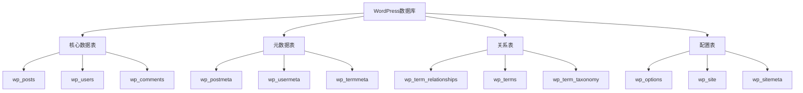
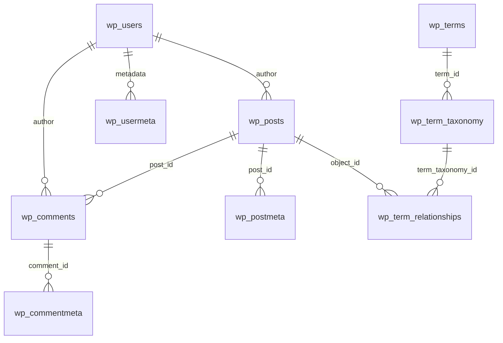
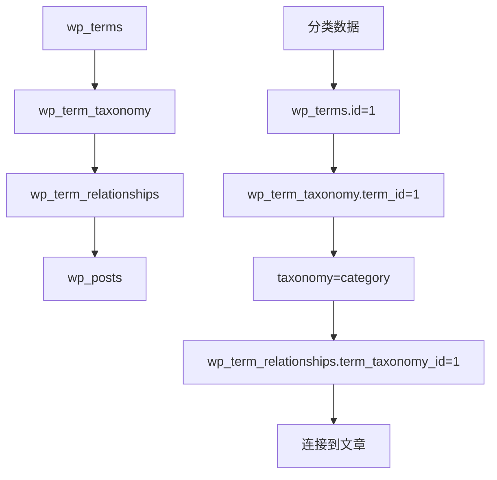

# WordPress数据库结构深度解析

## 🎯 学习目标

> **认识 → 理解 → 应用**
> - **认识**：了解WordPress数据库表的组织结构
> - **理解**：理解数据表间的关系和查询机制
> - **应用**：掌握数据库优化和自定义查询技巧

## 📋 知识地图



## 💡 数据库架构认知

### WordPress数据库总体设计



### 数据表分类详解

| 表分类 | 作用 | 主要表 | 数量 |
|--------|------|--------|------|
| **内容核心** | 存储网站核心内容 | posts, users | 2个 |
| **内容扩展** | 存储元数据信息 | postmeta, usermeta | 2个 |
| **分类系统** | 管理系统分类标签 | terms, term_taxonomy, term_relationships | 3个 |
| **配置存储** | 存储系统配置 | options, comments | 2个 |
| **多站点** | 网络级别的设置 | site, sitemeta | 2个(多站点) |

## 🔧 核心表结构理解

### wp_posts表深度解析

#### 表结构详解

```sql
-- wp_posts表结构
CREATE TABLE wp_posts (
  ID bigint(20) unsigned NOT NULL AUTO_INCREMENT PRIMARY KEY,
  post_author bigint(20) unsigned NOT NULL DEFAULT '0',
  post_date datetime NOT NULL DEFAULT '0000-00-00 00:00:00',
  post_date_gmt datetime NOT NULL DEFAULT '0000-00-00 00:00:00',
  post_content longtext NOT NULL,
  post_title text NOT NULL,
  post_excerpt text NOT NULL,
  post_status varchar(20) NOT NULL DEFAULT 'publish',
  comment_status varchar(20) NOT NULL DEFAULT 'open',
  ping_status varchar(20) NOT NULL DEFAULT 'open',
  post_password varchar(255) NOT NULL DEFAULT '',
  post_name varchar(200) NOT NULL DEFAULT '',
  to_ping text NOT NULL,
  pinged text NOT NULL,
  post_modified datetime NOT NULL DEFAULT '0000-00-00 00:00:00',
  post_modified_gmt datetime NOT NULL DEFAULT '0000-00-00 00:00:00',
  post_content_filtered longtext NOT NULL,
  post_parent bigint(20) unsigned NOT NULL DEFAULT '0',
  guid varchar(255) NOT NULL DEFAULT '',
  menu_order int(11) NOT NULL DEFAULT '0',
  post_type varchar(20) NOT NULL DEFAULT 'post',
  post_mime_type varchar(100) NOT NULL DEFAULT '',
  comment_count bigint(20) NOT NULL DEFAULT '0',
  KEY type_status_date (post_type,post_status,post_date,ID),
  KEY post_parent (post_parent),
  KEY post_author (post_author),
  KEY post_name (post_name)
) ENGINE=MyISAM DEFAULT CHARSET=utf8mb4 COLLATE=utf8mb4_unicode_ci;
```

#### 关键技术字段分析

| 字段 | 数据类型 | 作用 | 索引策略 | 优化建议 |
|------|----------|------|----------|----------|
| **ID** | bigint(20) | 主键，唯一标识 | PRIMARY KEY | 确保完整性 |
| **post_author** | bigint(20) | 作者用户ID | FOREIGN KEY | 查询优化必备 |
| **post_date** | datetime | 发布时间 | INDEX | 时间范围查询 |
| **post_content** | longtext | 内容主体 | FULLTEXT | 全文搜索支持 |
| **post_status** | varchar(20) | 状态管理 | INDEX | 状态筛选关键 |
| **post_type** | varchar(20) | 内容类型 | INDEX | CPT查询依据 |
| **post_name** | varchar(200) | URL别名 | UNIQUE | SEO友好URL |

#### wp_posts查询优化策略

```php
// 高效查询WordPress内容
class OptimizedPostsQuery {
    
    // 1. 基于状态的优化查询
    public function get_published_posts($args = array()) {
        global $wpdb;
        
        $defaults = array(
            'limit' => 10,
            'offset' => 0,
            'orderby' => 'post_date',
            'order' => 'DESC'
        );
        
        $args = wp_parse_args($args, $defaults);
        
        $query = $wpdb->prepare("
            SELECT p.ID, p.post_title, p.post_content, p.post_date, 
                   u.display_name as author, 
                   p.comment_count
            FROM {$wpdb->posts} p
            LEFT JOIN {$wpdb->users} u ON p.post_author = u.ID
            WHERE p.post_status = 'publish' 
              AND p.post_type = 'post'
            ORDER BY p.{$args['orderby']} {$args['order']}
            LIMIT %d OFFSET %d
        ", $args['limit'], $args['offset']);
        
        return $wpdb->get_results($query);
    }
    
    // 2. 全文搜索优化查询
    public function search_posts_content($search_term, $limit = 10) {
        global $wpdb;
        
        $search_term = '%' . $wpdb->esc_like($search_term) . '%';
        
        $query = $wpdb->prepare("
            SELECT p.ID, p.post_title, p.post_excerpt,
                   MATCH(p.post_title, p.post_content) AGAINST(%s IN BOOLEAN MODE) as relevance
            FROM {$wpdb->posts} p
            WHERE p.post_status = 'publish'
              AND p.post_type = 'post'
              AND MATCH(p.post_title, p.post_content) AGAINST(%s IN BOOLEAN MODE)
            ORDER BY relevance DESC
            LIMIT %d
        ", $search_term, $search_term, $limit);
        
        return $wpdb->get_results($query);
    }
    
    // 3. 统计分析查询
    public function get_post_statistics() {
        global $wpdb;
        
        $stats = $wpdb->get_row("
            SELECT 
                COUNT(*) as total_posts,
                COUNT(CASE WHEN post_status = 'publish' THEN 1 END) as published_posts,
                COUNT(CASE WHEN post_status = 'draft' THEN 1 END) as draft_posts,
                COUNT(CASE WHEN post_type = 'post' THEN 1 END) as blog_posts,
                COUNT(CASE WHEN post_type = 'page' THEN 1 END) as pages
            FROM {$wpdb->posts}
        ", ARRAY_A);
        
        return $stats;
    }
}
```

### wp_users表用户系统

#### 用户表结构分析

```sql
-- wp_users表结构优化
CREATE TABLE wp_users (
  ID bigint(20) unsigned NOT NULL AUTO_INCREMENT PRIMARY KEY,
  user_login varchar(60) NOT NULL DEFAULT '',
  user_pass varchar(255) NOT NULL DEFAULT '',
  user_nicename varchar(50) NOT NULL DEFAULT '',
  user_email varchar(100) NOT NULL DEFAULT '',
  user_url varchar(100) NOT NULL DEFAULT '',
  user_registered datetime NOT NULL DEFAULT '0000-00-00 00:00:00',
  user_activation_key varchar(255) NOT NULL DEFAULT '',
  user_status int(11) NOT NULL DEFAULT '0',
  display_name varchar(250) NOT NULL DEFAULT '',
  UNIQUE KEY user_login_key (user_login),
  UNIQUE KEY user_email (user_email),
  KEY user_nicename (user_nicename)
) ENGINE=MyISAM DEFAULT CHARSET=utf8mb4 COLLATE=utf8mb4_unicode_ci;
```

#### 用户权限机制

```php
// WordPress用户权限机制深度解析
class WordPressUserCapability {
    
    // 1. 用户权限验证
    public function check_user_capability($capability, $user_id = null) {
        $user_id = $user_id ?: get_current_user_id();
        
        if (!$user_id) {
            return false;
        }
        
        // 超级管理员拥有所有权限
        if (is_super_admin($user_id)) {
            return true;
        }
        
        // 检查用户角色权限
        $user = get_userdata($user_id);
        $roles = $user->roles;
        
        foreach ($roles as $role) {
            if ($this->role_has_capability($role, $capability)) {
                return true;
            }
        }
        
        return false;
    }
    
    // 2. 角色权限映射
    public function role_has_capability($role, $capability) {
        $role_capabilities = get_role($role);
        
        if ($role_capabilities && $role_capabilities->has_cap($capability)) {
            return true;
        }
        
        return false;
    }
    
    // 3. 用户元数据管理
    public function get_user_extended_meta($user_id) {
        global $wpdb;
        
        $user_metas = $wpdb->get_results($wpdb->prepare("
            SELECT meta_key, meta_value 
            FROM {$wpdb->usermeta} 
            WHERE user_id = %d 
            AND meta_key NOT LIKE %s
            ORDER BY meta_key
        ", $user_id, '%' . $wpdb->esc_like('wp_capabilities') . '%'));
        
        $formatted_metas = array();
        foreach ($user_metas as $meta) {
            $formatted_metas[$meta->meta_key] = maybe_unserialize($meta->meta_value);
        }
        
        return $formatted_metas;
    }
}
```

### wp_comments表评论系统

#### 评论表结构

```sql
-- wp_comments表结构
CREATE TABLE wp_comments (
  comment_ID bigint(20) unsigned NOT NULL AUTO_INCREMENT PRIMARY KEY,
  comment_post_ID bigint(20) unsigned NOT NULL DEFAULT '0',
  comment_author tinytext NOT NULL,
  comment_author_email varchar(100) NOT NULL DEFAULT '',
  comment_author_url varchar(200) NOT NULL DEFAULT '',
  comment_author_IP varchar(100) NOT NULL DEFAULT '',
  comment_date datetime NOT NULL DEFAULT '0000-00-00 00:00:00',
  comment_date_gmt datetime NOT NULL DEFAULT '0000-00-00 00:00:00',
  comment_content text NOT NULL,
  comment_karma int(11) NOT NULL DEFAULT '0',
  comment_approved varchar(20) NOT NULL DEFAULT '1',
  comment_agent varchar(255) NOT NULL DEFAULT '',
  comment_type varchar(20) NOT NULL DEFAULT 'comment',
  comment_parent bigint(20) unsigned NOT NULL DEFAULT '0',
  user_id bigint(20) unsigned NOT NULL DEFAULT '0',
  KEY comment_post_ID (comment_post_ID),
  KEY comment_approved_date_gmt (comment_approved,comment_date_gmt),
  KEY comment_date_gmt (comment_date_gmt),
  KEY comment_parent (comment_parent),
  KEY comment_author_email (comment_author_email(10))
) ENGINE=MyISAM DEFAULT CHARSET=utf8mb4 COLLATE=utf8mb4_unicode_ci;
```

#### 评论系统查询优化

```php
// 评论系统查询优化类
class OptimizedCommentsQuery {
    
    // 1. 获取文章评论树
    public function get_comments_tree($post_id) {
        global $wpdb;
        
        $comments = $wpdb->get_results($wpdb->prepare("
            SELECT c.*, u.display_name as user_name
            FROM {$wpdb->comments} c
            LEFT JOIN {$wpdb->users} u ON c.user_id = u.ID
            WHERE c.comment_post_ID = %d
              AND c.comment_approved = '1'
              AND c.comment_type = 'comment'
            ORDER BY c.comment_date_gmt ASC
        ", $post_id));
        
        return $this->build_comment_tree($comments);
    }
    
    // 2. 构建评论树结构
    private function build_comment_tree($comments) {
        $tree = array();
        $comment_map = array();
        
        // 将评论按ID索引
        foreach ($comments as $comment) {
            $comment_map[$comment->comment_ID] = $comment;
            $comment->replies = array();
        }
        
        // 构建父子关系
        foreach ($comments as $comment) {
            if ($comment->comment_parent == 0) {
                $tree[] = $comment;
            } else {
                if (isset($comment_map[$comment->comment_parent])) {
                    $comment_map[$comment->comment_parent]->replies[] = $comment;
                }
            }
        }
        
        return $tree;
    }
    
    // 3. 评论统计查询
    public function get_comment_statistics($time_period = 30) {
        global $wpdb;
        
        $since_date = date('Y-m-d H:i:s', strtotime("-{$time_period} days"));
        
        $stats = $wpdb->get_row($wpdb->prepare("
            SELECT 
                COUNT(*) as total_comments,
                COUNT(CASE WHEN comment_approved = '1' THEN 1 END) as approved_comments,
                COUNT(CASE WHEN comment_approved = '0' THEN 1 END) as pending_comments,
                COUNT(CASE WHEN comment_approved = 'spam' THEN 1 END) as spam_comments,
                COUNT(DISTINCT comment_post_ID) as posts_with_comments,
                AVG(CASE WHEN comment_approved = '1' THEN comment_karma END) as avg_comment_karma
            FROM {$wpdb->comments}
            WHERE comment_date_gmt >= %s
        ", $since_date), ARRAY_A);
        
        return $stats;
    }
}
```

## 🚀 关系表系统应用

### 分类标签系统结构

#### term系列表关系



#### 分类关系查询实现

```php
// 分类关系系统解析
class TaxonomyRelationshipManager {
    
    // 1. 获取文章的所有分类信息
    public function get_post_taxonomies($post_id) {
        global $wpdb;
        
        $taxonomies = $wpdb->get_results($wpdb->prepare("
            SELECT t.term_id, t.name, t.slug, tt.taxonomy, tt.description, tt.count
            FROM {$wpdb->terms} t
            INNER JOIN {$wpdb->term_taxonomy} tt ON t.term_id = tt.term_id
            INNER JOIN {$wpdb->term_relationships} tr ON tt.term_taxonomy_id = tr.term_taxonomy_id
            WHERE tr.object_id = %d
            ORDER BY tt.taxonomy, t.name
        ", $post_id));
        
        // 按taxonomy分组
        $grouped_taxonomies = array();
        foreach ($taxonomies as $taxonomy) {
            $grouped_taxonomies[$taxonomy->taxonomy][] = $taxonomy;
        }
        
        return $grouped_taxonomies;
    }
    
    // 2. 分类层级查询优化
    public function get_category_hierarchy($parent_id = 0) {
        global $wpdb;
        
        $categories = $wpdb->get_results($wpdb->prepare("
            SELECT t.term_id, t.name, t.slug, tt.parent, tt.count
            FROM {$wpdb->terms} t
            INNER JOIN {$wpdb->term_taxonomy} tt ON t.term_id = tt.term_id
            WHERE tt.taxonomy = 'category' 
              AND tt.parent = %d
            ORDER BY t.name ASC
        ", $parent_id));
        
        // 递归获取子分类
        foreach ($categories as &$category) {
            $category->children = $this->get_category_hierarchy($category->term_id);
        }
        
        return $categories;
    }
    
    // 3. 标签云生成优化
    public function generate_tag_cloud_data($limit = 45) {
        global $wpdb;
        
        $tags = $wpdb->get_results($wpdb->prepare("
            SELECT t.term_id, t.name, t.slug, tt.count
            FROM {$wpdb->terms} t
            INNER JOIN {$wpdb->term_taxonomy} tt ON t.term_id = tt.term_id
            WHERE tt.taxonomy = 'post_tag'
              AND tt.count > 0
            ORDER BY tt.count DESC, t.name ASC
            LIMIT %d
        ", $limit));
        
        // 计算权重范围
        $counts = wp_list_pluck($tags, 'count');
        $min_count = min($counts);
        $max_count = max($counts);
        $range = $max_count - $min_count;
        
        $tag_cloud = array();
        foreach ($tags as $tag) {
            $weight = $range > 0 ? ($tag->count - $min_count) / $range : 0;
            $tag_cloud[] = array(
                'term' => $tag,
                'weight' => $weight,
                'percentage' => round($weight * 100, 2)
            );
        }
        
        return $tag_cloud;
    }
}
```

### wp_options表配置系统

#### options表结构分析

```sql
-- wp_options表结构
CREATE TABLE wp_options (
  option_id bigint(20) unsigned NOT NULL AUTO_INCREMENT PRIMARY KEY,
  option_name varchar(191) NOT NULL DEFAULT '',
  option_value longtext NOT NULL,
  autoload varchar(20) NOT NULL DEFAULT 'yes',
  UNIQUE KEY option_name (option_name),
  KEY autoload (autoload)
) ENGINE=MyISAM DEFAULT CHARSET=utf8mb4 COLLATE=utf8mb4_unicode_ci;
```

#### WordPress配置管理

```php
// WordPress配置管理系统
class WordPressConfigManager {
    
    // 1. 批量获取配置信息
    public function get_multi_options($option_names) {
        global $wpdb;
        
        $placeholders = implode(',', array_fill(0, count($option_names), '%s'));
        
        $query = $wpdb->prepare("
            SELECT option_name, option_value 
            FROM {$wpdb->options} 
            WHERE option_name IN ({$placeholders})
            AND autoload = 'yes'
        ", $option_names);
        
        $options = $wpdb->get_results($query, OBJECT);
        
        $formatted_options = array();
        foreach ($options as $option) {
            $formatted_options[$option->option_name] = maybe_unserialize($option->option_value);
        }
        
        return $formatted_options;
    }
    
    // 2. 性能配置分析
    public function analyze_performance_options() {
        global $wpdb;
        
        $perf_options = array(
            'active_plugins' => '插件分析',
            'theme_mods_' => '主题选项',
            '_transient_' => '缓存数据',
            '_site_transient_' => '站点缓存'
        );
        
        $analysis = array();
        foreach ($perf_options as $option_prefix => $description) {
            $size_query = $wpdb->prepare("
                SELECT 
                    COUNT(*) as count,
                    SUM(LENGTH(option_value)) as total_size,
                    AVG(LENGTH(option_value)) as avg_size
                FROM {$wpdb->options} 
                WHERE option_name LIKE %s
            ", '%' . $wpdb->esc_like($option_prefix) . '%');
            
            $stats = $wpdb->get_row($size_query, ARRAY_A);
            $analysis[$option_prefix] = array(
                'description' => $description,
                'count' => $stats['count'],
                'total_size' => $stats['total_size'],
                'avg_size' => round($stats['avg_size'], 2)
            );
        }
        
        return $analysis;
    }
    
    // 3. 配置清理方法
    public function cleanup_expired_options() {
        global $wpdb;
        
        // 清理过期的自定义字段
        $expired_options = $wpdb->get_results("
            SELECT option_id 
            FROM {$wpdb->options} 
            WHERE option_name LIKE '_site_transient_timeout_%'
              AND option_value < UNIX_TIMESTAMP()
        ");
        
        foreach ($expired_options as $option) {
            $option_name = str_replace('_site_transient_timeout_', '', 
                $wpdb->get_var($wpdb->prepare("
                    SELECT option_name FROM {$wpdb->options} WHERE option_id = %d
                ", $option->option_id)));
            
            // 删除对应的缓存数据
            delete_site_transient($option_name);
        }
        
        return count($expired_options);
    }
}
```

## 📊 数据库优化策略

### 索引优化实践

```sql
-- WordPress数据库索引优化

-- 1. wp_posts表索引优化
ALTER TABLE wp_posts 
ADD INDEX idx_post_type_status_date (post_type, post_status, post_date),
ADD INDEX idx_post_author_status (post_author, post_status),
ADD INDEX idx_post_name_status (post_name, post_status),
ADD FULLTEXT idx_post_content_title (post_title, post_content);

-- 2. wp_comments表索引优化
ALTER TABLE wp_comments
ADD INDEX idx_post_approved_date (comment_post_ID, comment_approved, comment_date_gmt),
ADD INDEX idx_author_email_date (comment_author_email, comment_date_gmt);

-- 3. wp_term_relationships表索引优化
ALTER TABLE wp_term_relationships
ADD INDEX idx_object_term_order (object_id, term_taxonomy_id, term_order);

-- 4. wp_options表索引优化
ALTER TABLE wp_options
ADD INDEX idx_option_name_autoload (option_name, autoload);
```

### 查询优化实践

```php
// WordPress查询优化最佳实践
class WordPressQueryOptimizer {
    
    // 1. 高效分页查询
    public function paginate_posts($page = 1, $per_page = 10) {
        global $wpdb;
        
        $offset = ($page - 1) * $per_page;
        
        // 使用优化的分页查询
        $query = $wpdb->prepare("
            SELECT SQL_CALC_FOUND_ROWS p.*, u.display_name as author
            FROM {$wpdb->posts} p
            LEFT JOIN {$wpdb->users} u ON p.post_author = u.ID
            WHERE p.post_status = 'publish' 
              AND p.post_type = 'post'
            ORDER BY p.post_date DESC
            LIMIT %d OFFSET %d
        ", $per_page, $offset);
        
        $posts = $wpdb->get_results($query);
        $total = $wpdb->get_var("SELECT FOUND_ROWS()");
        
        return array(
            'posts' => $posts,
            'total' => $total,
            'pages' => ceil($total / $per_page),
            'current_page' => $page
        );
    }
    
    // 2. 缓存查询结果
    public function get_cached_query_results($cache_key, $sql, $args = array(), $expiration = 3600) {
        global $wpdb;
        
        $cached_result = wp_cache_get($cache_key, 'query_cache');
        
        if (false === $cached_result) {
            if (!empty($args)) {
                $sql = $wpdb->prepare($sql, $args);
            }
            $cached_result = $wpdb->get_results($sql);
            wp_cache_set($cache_key, $cached_result, 'query_cache', $expiration);
        }
        
        return $cached_result;
    }
    
    // 3. 减少不必要的查询
    public function bulk_load_post_meta($post_ids) {
        global $wpdb;
        
        $placeholders = implode(',', array_fill(0, count($post_ids), '%d'));
        
        $meta_data = $wpdb->get_results($wpdb->prepare("
            SELECT post_id, meta_key, meta_value 
            FROM {$wpdb->postmeta} 
            WHERE post_id IN ({$placeholders})
            ORDER BY post_id, meta_key
        ", $post_ids));
        
        // 按post_id组织数据
        $organized_meta = array();
        foreach ($meta_data as $meta) {
            $organized_meta[$meta->post_id][$meta->meta_key] = 
                maybe_unserialize($meta->meta_value);
        }
        
        return $organized_meta;
    }
}
```

## 🎯 刻意练习项目

### 练习1：数据库设计分析
**目标**：深入分析WordPress数据库设计思路和优化方案
**技能点**：ER图设计、范式优化、索引设计

### 练习2：自定义查询优化
**目标**：编写高效的WordPress自定义查询
**技能点**：SQL优化、缓存策略、性能调优

### 练习3：数据一致性维护
**目标**：建立数据库备份和维护机制
**技能点**：数据备份、容错机制、性能监控

## 🔗 拓展学习链接

### 进阶主题
- [[请求处理流程]] - 数据库查询的生命周期
- [[核心配置文件]] - wp-config.php深度配置
- [[架构原理练习]] - 综合架构理解

### 相关技术
- [[模板系统]] - 数据在模板中的应用
- [[钩子机制]] - 数据库操作的钩子系统
- [[性能优化]] - 数据库性能优化策略

### 实战项目
- [[后端开发项目]] - 数据库开发实战
- [[性能优化项目]] - 数据库优化实践

---

## 💬 知识检查

**理解检验**：
1. WordPress数据库中最核心的4张表是什么？它们的关系如何？
2. wp_posts表中的post_type字段有什么重要作用？
3. 如何通过数据库查询获取一个分类下的所有文章？

**应用检验**：
1. 能够编写高效的WordPress自定义查询
2. 理解数据库索引的作用和优化方法
3. 掌握WordPress数据库的性能优化技巧

### 故障排除

#### 常见数据库问题

| 问题 | 原因 | 解决方案 |
|------|------|----------|
| **慢查询** | 缺少索引或查询写法不佳 | 优化索引，重写查询 |
| **内存不足** | 一次性加载大量数据 | 实施分页和缓存 |
| **数据冗余** | 无效数据积累 | 定期清理和优化 |

**下一步学习**：[[请求处理流程]] → 理解WordPress的数据请求生命周期
