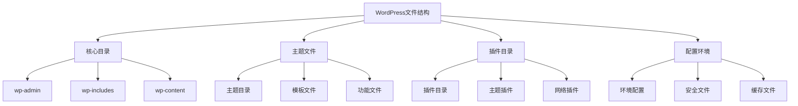
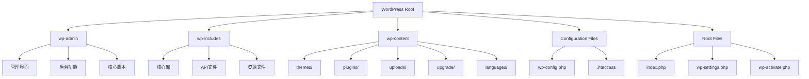
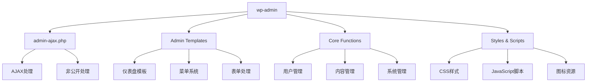
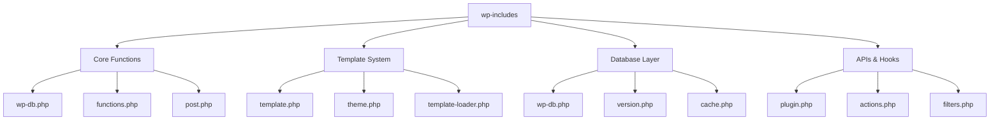
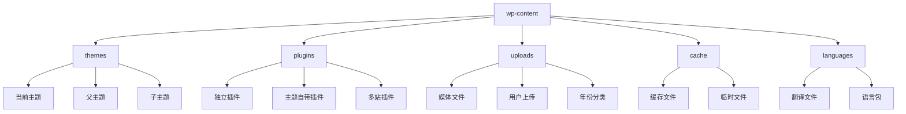

# WordPress文件结构详解

## 🎯 学习目标

> **认识 → 理解 → 应用**
> - **认识**：了解WordPress的文件目录结构和作用
> - **理解**：理解核心文件的工作原理和调用关系
> - **应用**：能够安全地修改配置文件和处理文件操作

## 📋 知识地图



## 💡 核心目录认知

### WordPress标准文件树



### 目录功能对比表

| 目录/文件 | 功能 | 权限 | 是否核心 | 修改风险 |
|-----------|------|------|----------|----------|
| **wp-admin** | 后台管理 | 755 | ✅ | ⚠️ 中风险 |
| **wp-includes** | 核心功能 | 755 | ✅ | ⚠️ 高风险 |
| **wp-content** | 用户内容 | 755 | ❌ | ✅ 低风险 |
| **wp-config.php** | 文件配置 | 600 | ✅ | ⚠️ 极高风险 |
| **index.php** | 主入口 | 644 | ✅ | ⚠️ 高风险 |

## 🔧 wp-admin架构理解

### 后台管理结构



### 关键后台文件解析

| 文件类型 | 典型文件 | 功能说明 | 重要程度 |
|----------|----------|----------|----------|
| **入口文件** | `admin.php` | 后台主入口 | ⭐⭐⭐⭐⭐ |
| **AJAX处理** | `admin-ajax.php` | AJAX请求处理 | ⭐⭐⭐⭐ |
| **菜单系统** | `menu.php` | 后台菜单构建 | ⭐⭐⭐⭐ |
| **用户相关** | `user.php` | 用户管理功能 | ⭐⭐⭐⭐ |
| **内容管理** | `post.php` | 文章页面管理 | ⭐⭐⭐⭐⭐ |
| **上传处理** | `async-upload.php` | 文件上传处理 | ⭐⭐⭐⭐ |

### WP-Admin初始化流程

```php
// wp-admin调用链路解析
<?php
// 1. index.php (根目录)
define('WP_USE_THEMES', false);
require('./wp-blog-header.php');

// 2. wp-blog-header.php
require_once('./wp-load.php');
require_once('./wp-config.php');
require_once(ABSPATH . WPINC . '/wp-settings.php');

// 3. wp-load.php
if (file_exists('./wp-config.php')) {
    include_once('./wp-config.php');
}

// 4. wp-config.php (用户配置文件)
define('DB_NAME', 'your_db_name');
define('DB_USER', 'your_db_user');
define('DB_PASSWORD', 'your_password');
define('DB_HOST', 'localhost');
define('DB_CHARSET', 'utf8mb4');

$table_prefix = 'wp_';

// 5. wp-settings.php (WordPress核心设置)
require_wp_db();
wp_cache_global_groups();
wp_start_object_cache();

// 6. wp-admin相关加载
if (is_admin() && !wp_doing_ajax()) {
    require_once(ABSPATH . 'wp-admin/includes/admin.php');
    require_once(ABSPATH . 'wp-admin/admin.php');
}
?>
```

## 🚀 wp-includes深度理解

### 核心库架构



### WP-Includes核心文件分析

#### wp-db.php数据库层

```php
// wp-db.php核心原理解析
class wpdb {
    public $last_query;                     // 最后执行的查询
    public $last_result;                   // 最后查询结果
    public $col_info;                      // 列信息
    public $num_rows;                      // 行数
    
    // 数据库连接参数
    var $dbh;                             // 数据库句柄
    var $dbuser;                          // 数据库用户名
    
    function __construct($dbuser, $dbpassword, $dbname, $dbhost) {
        $this->init_charset = 'utf8';
        $this->db_connect();
    }
    
    // 执行查询的核心方法
    function query($query) {
        if (!$this->db_connect()) {
            return false;
        }
        
        // 查询缓存机制
        if (defined('DOING_UPGRADE') || defined('DOING_AJAX')) {
            $result = $this->db_query($query);
        } else {
            $result = $this->_query($query);
        }
        
        if (is_wp_error($result)) {
            return false;
        }
        
        return $this->last_result = $result;
    }
    
    // 预处理语句执行
    function prepare($query, ...$args) {
        if (is_null($query)) {
            return null;
        }
        
        // SQL注入防护
        $args = array_map(array($this, 'escape_by_ref'), $args);
        return vsprintf($query, $args);
    }
}
```

#### functions.php核心功能

```php
// wp-includes/functions.php核心功能解析

// 1. WordPress常量定义
function wp_initial_constants() {
    global $blog_id, $current_blog, $current_site;
    
    if (defined('WP_MEMORY_LIMIT')) {
        // 内存限制设置
        ini_set('memory_limit', WP_MEMORY_LIMIT);
    }
    
    // ABSPATH绝对路径
    if (!defined('ABSPATH')) {
        define('ABSPATH', dirname(__FILE__) . '/');
    }
    
    // WPINC目录常量
    if (!defined('WPINC')) {
        define('WPINC', 'wp-includes');
    }
}

// 2. WordPress环境加载
function wp_load_translations() {
    global $locale, $wp_locale;
    
    if (defined('WPLANG')) {
        $locale = WPLANG;
    }
    
    if (empty($locale)) {
        $locale = 'en_US';
    }
    
    unload_textdomain('default');
    load_textdomain('default', WP_LANG_DIR . "/$locale.mo");
    
    $wp_locale = new WP_Locale();
}

// 3. 核心函数包装
function wp_cache_get($key, $group = 'default') {
    global $wp_object_cache;
    
    if (!wp_using_ext_object_cache()) {
        return $wp_object_cache->get($key, $group);
    }
    
    return wp_cache_get($key, $group);
}
```

### template.php模板系统

```php
// wp-includes/template.php核心模板函数解析

// 1. 主查询处理
function wp() {
    global $wp, $wp_query, $wp_the_query;
    
    $wp->parse_request();
    
    // 查询参数处理
    $wp_query->parse_query($wp->query_vars);
    
    // 实际查询执行
    $wp_query->query($wp_query->query_vars);
}

// 2. 模板加载
function get_template($template) {
    $template = locate_template($template);
    
    if ($template) {
        load_template($template);
    }
}

// 3. 条件标签
function is_front_page() {
    global $wp_query;
    
    if ($wp_query->is_front_page()) {
        return true;
    }
    
    return false;
}

// 4. The Loop机制
function have_posts() {
    global $wp_query;
    return $wp_query->have_posts();
}

function the_post() {
    global $wp_query;
    $wp_query->the_post();
}
```

## 📊 wp-content结构应用

### wp-content目录架构



### 主题目录结构详解

#### 标准主题目录

```
them-name/
├── style.css              # 主题样式表
├── index.php              # 主模板文件
├── header.php             # 头部模板
├── footer.php             # 页脚模板
├── sidebar.php             # 侧边栏模板
├── functions.php           # 主题功能文件
├── screenshot.png         # 主题截图
├── readme.txt             # 主题说明
├── assets/                # 资源文件
│   ├── css/
│   ├── js/
│   └── images/
├── templates/             # 自定义模板
│   ├── page-custom.php
│   └── single-product.php
└── template-parts/        # 模板组件
    ├── post/
    └── header/
```

#### 主题文件安全操作

```php
// 安全修改主题文件的基本方法

// 1. 检查文件是否存在并拥有写权限
function check_file_permissions($file_path) {
    if (!file_exists($file_path)) {
        return new WP_Error('file_not_found', '文件不存在');
    }
    
    if (!is_writable($file_path)) {
        return new WP_Error('file_not_writable', '文件不可写');
    }
    
    return true;
}

// 2. 备份文件操作
function backup_file_before_edit($file_path) {
    $backup_path = $file_path . '.backup.' . date('YmdHis');
    
    if (!copy($file_path, $backup_path)) {
        return new WP_Error('backup_failed', '文件备份失败');
    }
    
    return $backup_path;
}

// 3. 安全文件编辑
function safe_file_edit($file_path, $new_content) {
    // 检查权限
    $permission_check = check_file_permissions($file_path);
    if (is_wp_error($permission_check)) {
        return $permission_check;
    }
    
    // 备份文件
    $backup_file = backup_file_before_edit($file_path);
    if (is_wp_error($backup_file)) {
        return $backup_file;
    }
    
    // 保存文件
    if (file_put_contents($file_path, $new_content, LOCK_EX) === false) {
        return new WP_Error('save_failed', '文件保存失败');
    }
    
    return array(
        'success' => true,
        'backup_file' => $backup_file
    );
}
```

### 插件目录管理

```php
// 插件目录结构解析和操作

// 1. 获取插件信息
function get_plugin_info($plugin_file) {
    if (!file_exists($plugin_file)) {
        return false;
    }
    
    $plugin_data = get_file_data($plugin_file, array(
        'Name' => 'Plugin Name',
        'PluginURI' => 'Plugin URI',
        'Version' => 'Version',
        'Description' => 'Description',
        'Author' => 'Author',
        'AuthorURI' => 'Author URI',
        'TextDomain' => 'Text Domain',
        'DomainPath' => 'Domain Path',
        'Network' => 'Network',
        'RequiresWP' => 'Requires at least',
        'TestedWP' => 'Tested up to',
        'RequiresPHP' => 'Requires PHP'
    ), 'plugin');
    
    return $plugin_data;
}

// 2. 插件激活检查
function is_plugin_active($plugin) {
    return in_array($plugin, (array) get_option('active_plugins', array())) || 
           is_plugin_active_for_network($plugin);
}

// 3. 安全删除插件
function safe_delete_plugin($plugin_file) {
    if (!current_user_can('delete_plugins')) {
        return new WP_Error('insufficient_permissions', '权限不足');
    }
    
    // 检查插件是否正在运行
    if (is_plugin_active($plugin_file)) {
        deactivate_plugins($plugin_file);
    }
    
    // 删除插件文件
    $plugin_dir = wp_parse_dir_list(dirname($plugin_file));
    
    if (remove_dir($plugin_dir)) {
        return true;
    } else {
        return new WP_Error('deletion_failed', '插件删除失败');
    }
}
```

## 🔒 配置文件安全理解

### wp-config.php关键配置

```php
<?php
/**
 * WordPress配置文件 - 生产环境安全配置
 * wp-config.php文件详解
 */

// 数据库配置
define('DB_NAME', 'your_database_name');
define('DB_USER', 'your_database_user');
define('DB_PASSWORD', 'complex_password_here');
define('DB_HOST', 'localhost');
define('DB_CHARSET', 'utf8mb4');
define('DB_COLLATE', 'utf8mb4_unicode_ci');

// WordPress安全密钥 - 从WordPress.org获取
define('AUTH_KEY', 'your-unique-auth-key-here');
define('SECURE_AUTH_KEY', 'your-unique-secure-auth-key-here');
define('LOGGED_IN_KEY', 'your-unique-logged-in-key-here');
define('NONCE_KEY', 'your-unique-nonce-key-here');

// 加密密钥
define('AUTH_SALT', 'your-unique-auth-salt-here');
define('SECURE_AUTH_SALT', 'your-unique-secure-auth-salt-here');
define('LOGGED_IN_SALT', 'your-unique-logged-in-salt-here');
define('NONCE_SALT', 'your-unique-nonce-salt-here');

// WordPress表前缀
$table_prefix = 'wp_';

// 绝对路径常量
if (!defined('ABSPATH')) {
    define('ABSPATH', dirname(__FILE__) . '/');
}

// 开发环境配置
define('WP_DEBUG', false);                    // 生产环境关闭
define('WP_DEBUG_LOG', false);                // 关闭调试日志
define('WP_DEBUG_DISPLAY', false);            // 不显示调试信息
define('SCRIPT_DEBUG', false);                // 使用压缩版脚本

// 性能优化配置
define('WP_CACHE', true);                     // 启用缓存
define('COMPRESS_CSS', true);                 // 压缩CSS
define('COMPRESS_SCRIPTS', true);             // 压缩JavaScript
define('CONCATENATE_SCRIPTS', true);          // 合并脚本

// 安全配置
define('DISALLOW_FILE_EDIT', true);           // 禁用文件编辑
define('DISALLOW_FILE_MODS', true);          // 禁用文件修改
define('AUTOMATIC_UPDATER_DISABLED', true);   // 禁用自动更新

// 多站点配置
define('WP_ALLOW_MULTISITE', true);           // 启用多站点（可选）

// 内存限制
ini_set('memory_limit', '256M');

// 执行时间限制
ini_set('max_execution_time', 300);

// WordPress加载要求
require_once(ABSPATH . 'wp-settings.php');
?>
```

### .htaccess安全配置

```apache
# WordPress安全.htaccess配置

# BEGIN WordPress
RewriteEngine On
RewriteRule .* - [E=HTTP_AUTHORIZATION:%{HTTP:Authorization}]
RewriteBase /
RewriteRule ^index\.php$ - [L]
RewriteCond %{REQUEST_FILENAME} !-f
RewriteCond %{REQUEST_FILENAME} !-d
RewriteRule . /index.php [L]
# END WordPress

# 安全配置段
# BEGIN Security

# 禁止浏览目录
Options -Indexes

# 保护敏感文件
<Files "wp-config.php">
    Order allow,deny
    Deny from all
</Files>

<Files ".htaccess">
    Order allow,deny
    Deny from all
</Files>

<Files "readme.html">
    Order allow,deny
    Deny from all
</Files>

# 防止XML-RPC攻击
<LocationMatch "/xmlrpc.php">
    Order deny,allow
    Deny from all
</LocationMatch>

# 防止admin目录被访问
<LocationMatch "/wp-admin">
    Order deny,allow
    Allow from 192.168.1.0/24
    Allow from YOUR.IP.ADDRESS
</LocationMatch>

# 防止SQL注入
<IfModule mod_rewrite.c>
    RewriteCond %{QUERY_STRING} concat.*\(.*select.*\(.*\) [NC,OR]
    RewriteCond %{QUERY_STRING} union.*select.*\( [NC,OR]
    RewriteCond %{QUERY_STRING} union.*all.*select.* [NC,OR]
    RewriteCond %{QUERY_STRING} GLOBALS(=|\[|\%[0-9A-Z]{0,2}) [NC,OR]
    RewriteCond %{QUERY_STRING} (<|%3C).*script.*(>|%3E) [NC,OR]
    RewriteCond %{QUERY_STRING} (<|%3C).*iframe.*(>|%3E) [NC,OR]
    RewriteCond %{QUERY_STRING} (<|%3C).*object.*(>|%3E) [NC,OR]
    RewriteCond %{QUERY_STRING} (<|%3C).*embed.*(>|%3E) [NC]
    RewriteRule ^(.*)$ - [F,L]
</IfModule>

# 设置安全响应头
<IfModule mod_headers.c>
    Header always set X-Frame-Options "SAMEORIGIN"
    Header always set X-Content-Type-Options "nosniff"
    Header always set X-XSS-Protection "1; mode=block"
    Header always set Referrer-Policy "strict-origin-when-cross-organizational"
    Header always set Strict-Transport-Security "max-age=31536000; includeSubDomains"
</IfModule>

# 限制文件上传类型
<FilesMatch "\.(exe|phtml|php|php3|php4|php5|pl|py|jsp|asp|sh|cgi)$">
    Order allow,deny
    Deny from all
</FilesMatch>

# END Security
```

## 🎯 刻意练习项目

### 练习1：文件结构分析
**目标**：深入分析WordPress核心文件的作用和调用关系
**技能点**：文件分析、函数追踪、架构理解

### 练习2：安全配置实施
**目标**：安全地配置WordPress文件和目录权限
**技能点**：文件权限、安全配置、最佳实践

### 练习3：自定义主题开发
**目标**：从零创建符合规范的WordPress主题
**技能点**：主题开发、文件结构、功能实现

## 🔗 拓展学习链接

### 进阶主题
- [[数据库结构]] - WordPress数据存储机制
- [[请求处理流程]] - WordPress请求生命期
- [[文件结构详解]] - 深入文件系统研究

### 相关技术
- [[钩子机制]] - 插件和主题扩展机制
- [[模板系统]] - 前端显示原理
- [[架构原理练习]] - 综合架构实践

### 实战项目
- [[主题开发基础]] - 主题开发实战
- [[插件开发基础]] - 插件开发项目

---

## 💬 知识检查

**理解检验**：
1. WordPress三大核心目录的主要功能是什么？
2. wp-config.php文件的作用和关键配置项有哪些？
3. 如何安全地修改WordPress文件而不破坏核心功能？

**应用检验**：
1. 能够正确识别和修改WordPress配置文件
2. 理解文件间的调用关系和依赖关系
3. 独立完成基础的WordPress文件结构调整

### 故障排除

#### 常见文件问题

| 问题 | 原因 | 解决方案 |
|------|------|----------|
| **白屏错误** | PHP语法错误或内存耗尽 | 检查PHP错误日志 |
| **权限错误** | 文件权限设置不正确 | 修正文件和目录权限 |
| **配置错误** | wp-config.php配置错误 | 检查数据库配置和常量设置 |

**下一步学习**：[[数据库结构]] → 深入理解WordPress数据存储机制
