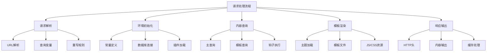
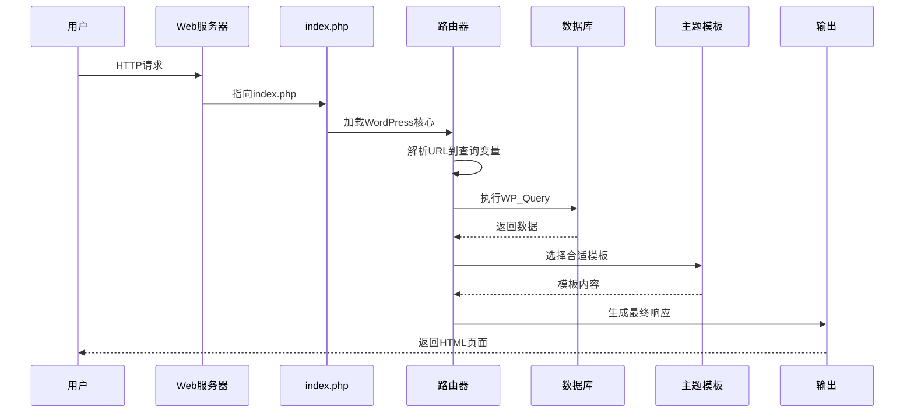

# WordPress请求处理流程详解

## 🎯 学习目标

> **认识 → 理解 → 应用**
> - **认识**：了解WordPress从请求到响应的完整流程
> - **理解**：理解核心组件的作用和调用关系
> - **应用**：掌握调试和性能优化技巧

## 📋 知识地图



## 💡 请求流程认知

### WordPress请求生命周期



### 核心处理阶段对比

| 阶段 | 主要文件 | 功能 | 执行时间占比 | 优化重点 |
|------|----------|------|-------------|----------|
| **请求入口** | index.php | 请求分派 | 5% | 缓存优化 |
| **环境初始化** | wp-load.php, wp-config.php | 环境设置 | 10% | 常量优化 |
| **路由解析** | wp-includes/class-wp.php | URL解析 | 15% | 重写规则 |
| **数据库查询** | wp-includes/query.php | 内容查询 | 40% | 查询优化 |
| **主题渲染** | wp-includes/template-loader.php | 模板渲染 | 25% | 资源优化 |
| **响应输出** | wp-includes/functions.php | 内容输出 | 5% | 压缩输出 |

## 🔧 请求解析理解

### URL解析机制

#### WordPress重写系统

```php
// WordPress URL重写机制解析
class WordPressURLRewriter {
    
    // 1. URL模式匹配
    public function parse_request($request) {
        global $wpdb, $wp_query;
        
        // 移除查询字符串
        $request = rtrim($request, '/');
        
        // 应用重写规则
        $rewrite_rules = $this->get_rewrite_rules();
        $query_vars = $this->match_rewrite_rules($request, $rewrite_rules);
        
        // 设置查询变量
        $wp_query->query_vars = array_merge(
            $wp_query->query_vars,
            $query_vars
        );
        
        return $query_vars;
    }
    
    // 2. 重写规则匹配
    public function match_rewrite_rules($request, $rules) {
        foreach ($rules as $pattern => $query_string) {
            if (preg_match("#^{$pattern}#", $request, $matches)) {
                // 解析查询变量
                parse_str($query_string, $query_vars);
                
                // 应用捕获组
                for ($i = 1; $i <= count($matches) - 1; $i++) {
                    $query_vars = str_replace("%{$i}", $matches[$i], $query_vars);
                }
                
                return $query_vars;
            }
        }
        
        return array();
    }
    
    // 3. 常见URL模式解析
    public function get_url_patterns() {
        return array(
            'blog/archive/([0-9]{4})/([0-9]{1,2})/([0-9]{1,2})/?' => 'year=%1&monthnum=%2&day=%3',
            'blog/category/([^/]+)/?' => 'category_name=%1',
            'blog/tag/([^/]+)/?' => 'tag=%1',
            'blog/author/([^/]+)/?' => 'author_name=%1',
            'blog/([^/]+)/?' => 'name=%1',
            'blog/page/([0-9]+)/?' => 'page=%1'
        );
    }
}
```

### 查询变量处理

```php
// WordPress查询变量处理机制
class WordPressQueryVariables {
    
    // 1. 查询变量注册
    public function register_query_vars($query_vars) {
        $custom_vars = array(
            'custom_page',
            'product_id',
            'category_filter',
            'price_range'
        );
        
        return array_merge($query_vars, $custom_vars);
    }
    
    // 2. 查询变量解析
    public function parse_query_vars($wp_query) {
        global $wpdb;
        
        // 处理自定义查询变量
        if (isset($wp_query->query_vars['custom_page'])) {
            $this->handle_custom_page_query($wp_query);
        }
        
        if (isset($wp_query->query_vars['product_id'])) {
            $this->handle_product_query($wp_query);
        }
        
        if (isset($wp_query->query_vars['category_filter'])) {
            $this->handle_category_filter($wp_query);
        }
        
        return $ wp_query;
    }
    
    // 3. 自定义查询处理
    private function handle_custom_page_query($wp_query) {
        $custom_page = $wp_query->get('custom_page');
        
        // 设置查询条件
        $wp_query->set('post_type', 'custom_post');
        $wp_query->set('meta_key', 'page_identifier');
        $wp_query->set('meta_value', $custom_page);
        
        // 设置模板
        add_filter('template_include', function($template) {
            $custom_template = locate_template('custom-page.php');
            return $custom_template ?: $template;
        });
    }
}
add_action('init', array('WordPressQueryVariables', 'register_query_vars'));
add_action('parse_query', array('WordPressQueryVariables', 'parse_query_vars'));
```

## 🚀 环境初始化理解

### WordPress启动序列

#### 启动文件调用链

```php
// WordPress启动序列详解
class WordPressBootSequence {
    
    public function boot_wordpress() {
        // 1. index.php (入口文件)
        $this->define_constants();           // 定义常量
        $this->load_wp_config();             // 加载配置
        $this->load_wp_cache();              // 加载缓存
        
        // 2. wp-load.php (核心加载)
        $this->setup_database();             // 设置数据库
        $this->load_plugins();               // 加载插件
        $this->load_themes();                // 加载主题
        
        // 3. wp-settings.php (设置初始化)
        $this->initialize_user();            // 初始化用户
        $this->setup_query();                // 设置查询对象
        $this->init_theme();                 // 初始化主题
        
        // 4. WordPress完全加载
        do_action('wp_loaded');
        
        // 5. 处理请求
        $this->handle_request();
    }
    
    // 常量定义阶段
    public function define_constants() {
        // 核心路径常量
        if (!defined('ABSPATH')) {
            define('ABSPATH', dirname(__FILE__) . '/');
        }
        
        if (!defined('WPINC')) {
            define('WPINC', 'wp-includes');
        }
        
        // 内容目录常量
        if (!defined('WP_CONTENT_DIR')) {
            define('WP_CONTENT_DIR', ABSPATH . 'wp-content');
        }
        
        if (!defined('WP_CONTENT_URL')) {
            define('WP_CONTENT_URL', site_url('/wp-content'));
        }
        
        // 插件目录常量
        if (!defined('WP_PLUGIN_DIR')) {
            define('WP_PLUGIN_DIR', WP_CONTENT_DIR . '/plugins');
        }
        
        // 缓存常量
        if (!defined('WP_CACHE')) {
            define('WP_CACHE', false);
        }
        
        // 调试常量
        if (defined('WP_DEBUG') && WP_DEBUG) {
            ini_set('display_errors', 1);
            error_reporting(E_ALL);
        }
    }
    
    // 数据库连接阶段
    public function setup_database() {
        global $wpdb;
        
        // 连接数据库
        require_once(ABSPATH . WPINC . '/wp-db.php');
        
        $wpdb = new wpdb(
            DB_USER, DB_PASSWORD, DB_NAME, DB_HOST
        );
        
        // 设置字符集
        $wpdb->set_charset($wpdb->db, DB_CHARSET, DB_COLLATE);
        
        // 检查数据库连接
        if ($wpdb->last_error) {
            wp_die($wpdb->last_error);
        }
    }
}
```

### 插件和主题加载

```php
// WordPress核心组件加载机制
class WordPressCoreLoader {
    
    // 1. 插件加载序列
    public function load_plugins() {
        global $wp_plugins;
        
        // 获取激活的插件列表
        $active_plugins = get_option('active_plugins');
        $mu_plugins = get_mu_plugins();
        
        // 加载必需插件(MU插件)
        foreach ($mu_plugins as $plugin_file => $plugin_data) {
            if (file_exists(WPMU_PLUGIN_DIR . "/{$plugin_file}")) {
                require_once(WPMU_PLUGIN_DIR . "/{$plugin_file}");
                $wp_plugins['muplugins'][$plugin_file] = $plugin_data;
            }
        }
        
        // 加载普通插件
        foreach ($active_plugins as $plugin_file) {
            if (file_exists(WP_PLUGIN_DIR . "/{$plugin_file}")) {
                require_once(WP_PLUGIN_DIR . "/{$plugin_file}");
                $wp_plugins['plugins'][$plugin_file] = get_plugin_data(WP_PLUGIN_DIR . "/{$plugin_file}");
            }
        }
        
        // 执行插件钩子
        do_action('plugins_loaded');
    }
    
    // 2. 主题加载机制
    public function load_current_theme() {
        // 获取当前主题信息
        $theme_name = get_option('stylesheet');
        $status = function_exists('wp_get_environment_type') ? 
            wp_get_environment_type() : 'production';
        
        // 验证主题
        $theme_instance = wp_get_theme($theme_name);
        if (!$theme_instance->exists()) {
            wp_die(sprintf(__('主题 %s 不存在'), $theme_name));
        }
        
        // 加载主题functions.php
        if ($theme_instance->get_file_path('functions.php')) {
            require_once($theme_instance->get_file_path('functions.php'));
        }
        
        // 加载子主题
        if ($theme_instance->get_stylesheet() !== $theme_instance->get_template()) {
            $parent_functions = $theme_instance->get_template_directory() . '/functions.php';
            if (file_exists($parent_functions)) {
                require_once($parent_functions);
            }
        }
        
        return $theme_instance;
    }
    
    // 3. 用户会话初始化
    public function initialize_user_session($wp_config) {
        // 启动会话
        if (!session_id()) {
            session_start();
        }
        
        // WordPress用户认证
        require_once(ABSPATH . WPINC . '/pluggable.php');
        
        // 初始化用户对象
        if (!function_exists('wp_get_current_user')) {
            require_once(ABSPATH . WPINC . '/user.php');
        }
        
        wp_get_current_user();
        
        // 执行用户相关钩子
        do_action('init');
        do_action('wp_loaded');
    }
}
```

## 📊 查询执行分析

### WP_Query执行流程

#### WordPress主查询机制

```php
// WP_Query查询执行详解
class WordPressMainQuery {
    
    // 1. 查询构建和执行
    public function execute_main_query() {
        global $wp_query;
        
        // 创建查询对象
        $wp_query = new WP_Query();
        
        // 解析查询变量
        $this->parse_query_vars($wp_query);
        
        // 构建查询语句
        $sql_query = $this->build_query_sql($wp_query);
        
        // 执行数据库查询
        $query_result = $this->execute_database_query($sql_query);
        
        // 处理查询结果
        $this->setup_postdata($query_result);
        
        // 执行查询钩子
        do_action_ref_array('posts_selection', array(&$this->posts, &$this->wp_query));
        
        return $query_result;
    }
    
    // 2. 查询变量解析
    public function parse_query_vars($wp_query) {
        $query_vars = $wp_query->query_vars;
        
        // 处理排序参数
        if (isset($query_vars['orderby'])) {
            $this->parse_orderby($query_vars['orderby'], $wp_query);
        }
        
        // 处理分页参数
        if (isset($query_vars['posts_per_page'])) {
            $wp_query->set('posts_per_page', intval($query_vars['posts_per_page']));
        }
        
        // 处理日期范围
        if (isset($query_vars['date_query'])) {
            $this->parse_date_query($query_vars['date_query'], $wp_query);
        }
        
        // 处理meta_query
        if (isset($query_vars['meta_query'])) {
            $this->parse_meta_query($query_vars['meta_query"], $wp_query);
        }
        
        // 处理tax_query
        if (isset($query_vars['tax_query'])) {
            $this->parse_tax_query($query_vars['tax_query'], $wp_query);
        }
    }
    
    // 3. SQL查询构建
    public function build_query_sql($wp_query) {
        global $wpdb;
        
        $parts = array();
        
        // SELECT子句
        $parts['fields'] = "
            SELECT {$wpdb->posts}.*
        ";
        
        // FROM子句
        $parts['from'] = "
            FROM {$wpdb->posts}
        ";
        
        // JOIN子句
        $joins = $this->get_required_joins($wp_query);
        $parts['join'] = !empty($joins) ? implode(' ', $joins) : '';
        
        // WHERE子句
        $where_clauses = $this->get_where_clauses($wp_query);
        $parts['where'] = "
            WHERE 1=1" . (!empty($where_clauses) ? ' ' . implode(' ', $where_clauses) : '') . "
        ";
        
        // GROUP BY子句
        $groupby = $this->get_groupby_clause($wp_query);
        $parts['groupby'] = !empty($groupby) ? "GROUP BY {$groupby}" : '';
        
        // ORDER BY子句
        $orderby = $this->get_orderby_clause($wp_query);
        $parts['orderby'] = !empty($orderby) ? "ORDER BY {$orderby}" : '';
        
        // LIMIT子句
        $limits = $this->get_limit_clause($wp_query);
        $parts['limits'] = !empty($limits) ? $limits : '';
        
        return implode(' ', $parts);
    }
}
```

### 模板选择机制

```php
// WordPress模板选择机制
class WordPressTemplateLoader {
    
    // 1. 模板层次结构解析
    public function get_template_hierarchy($template_name) {
        $template_types = array();
        
        // 根据查询类型选择模板
        if (is_404()) {
            $template_types[] = '404.php';
        } elseif (is_search()) {
            $template_types[] = 'search.php';
        } elseif (is_front_page()) {
            $template_types[] = 'front-page.php';
            $template_types[] = 'home.php';
        } elseif (is_home()) {
            $template_types[] = 'home.php';
            $template_types[] = 'index.php';
        } elseif (is_author()) {
            $template_types[] = 'author-' . get_queried_object()->user_nicename . '.php';
            $template_types[] = 'author-' . get_queried_object_id() . '.php';
            $template_types[] = 'author.php';
        } elseif (is_category()) {
            $template_types[] = 'category-' . get_queried_object()->slug . '.php';
            $template_types[] = 'category-' . get_queried_object_id() . '.php';
            $template_types[] = 'category.php';
        } elseif (is_tag()) {
            $template_types[] = 'tag-' . get_queried_object()->slug . '.php';
            $template_types[] = 'tag-' . get_queried_object_id() . '.php';
            $template_types[] = 'tag.php';
        } elseif (is_tax()) {
            $taxonomy = get_query_var('taxonomy');
            $slug = get_query_var('term');
            
            $template_types[] = "taxonomy-{$taxonomy}-{$slug}.php";
            $template_types[] = "taxonomy-{$taxonomy}.php";
            $template_types[] = 'taxonomy.php';
        } elseif (is_single()) {
            $post = get_queried_object();
            $template_types[] = "single-{$post->post_type}.php";
            $template_types[] = 'single.php';
        } elseif (is_page()) {
            $post = get_queried_object();
            $template_types[] = "page-{$post->post_name}.php";
            $template_types[] = "page-{$post->ID}.php";
            $template_types[] = 'page.php';
        } elseif (is_archive()) {
            $template_types[] = 'archive.php';
        }
        
        $template_types[] = 'index.php';
        
        return $template_types;
    }
    
    // 2. 模板文件定位
    public function locate_template($template_names) {
        if (!is_array($template_names)) {
            $template_names = array($template_names);
        }
        
        $template_locations = array();
        
        // 主题目录
        $template_locations[] = STYLESHEETPATH;
        $template_locations[] = TEMPLATEPATH;
        
        // 子主题目录优先
        rsort($template_locations);
        
        foreach ($template_names as $template_name) {
            foreach ($template_locations as $location) {
                $template_path = $location . '/' . $template_name;
                if (file_exists($template_path)) {
                    return $template_path;
                }
            }
        }
        
        return false;
    }
    
    // 3. 模板加载处理
    public function load_template($template_path, $require_once = true) {
        global $posts, $post, $wp_did_header, $wp_query, $wp_rewrite, $wpdb, $wp_version, $comments, $comment, $user_ID;
        
        // 定义全局变量用于模板
        if (is_array($wp_query->query_vars)) {
            extract($wp_query->query_vars, EXTR_SKIP);
        }
        
        // 设置当前位置ID
        if (!$wp_query->is_taxonomy && !$wp_query->is_domain_mapping) {
            $current_post_id = (is_singular()) ? get_queried_object_id() : false;
            if ($current_post_id) {
                $wp_query->queried_object_id = $current_post_id;
            }
        }
        
        // 加载模板
        if ($require_once) {
            require_once($template_path);
        } else {
            require($template_path);
        }
    }
}
```

## 🎯 响应输出应用

### HTTP响应处理

```php
// WordPress HTTP响应处理
class WordPressResponseHandler {
    
    // 1. HTTP头设置
    public function send_http_headers() {
        // 设置状态码
        if (!headers_sent()) {
            status_header(200);
        }
        
        // 设置Content-Type
        if (!headers_sent()) {
            header('Content-Type: text/html; charset=' . get_option('blog_charset'));
        }
        
        // 设置缓存控制
        if (is_singular() && !is_admin() && !is_user_logged_in()) {
            $cache_max_age = 3600; // 1小时
            header('Cache-Control: public, max-age=' . $cache_max_age);
            header('Last-Modified: ' . gmdate('D, d M Y H:i:s', current_time('timestamp')) . ' GMT');
        }
        
        // 设置安全头
        header('X-Frame-Options: SAMEORIGIN');
        header('X-Content-Type-Options: nosniff');
        
        // 执行自定义头钩子
        do_action('send_headers');
    }
    
    // 2. 内容压缩处理
    public function compress_output() {
        if (extension_loaded('zlib') && !headers_sent()) {
            // 检查浏览器是否支持gzip
            $encoding = $this->get_gzip_encoding();
            
            if ($encoding) {
                // 开始输出缓冲区压缩
                ob_start(function($buffer) {
                    return $this->compress_buffer($buffer);
                });
                
                // 设置压缩头
                header('Content-Encoding: ' . $encoding);
                header('Vary: Accept-Encoding');
            }
        }
    }
    
    // 3. 输出结束处理
    public function finish_request() {
        // 刷新输出缓冲区
        if (ob_get_level()) {
            ob_end_flush();
        }
        
        // 设置当前时间
        update_option('timeout_incr', time());
        
        // 执行关闭钩子
        do_action('shutdown');
        
        // 关闭MySQL连接
        wp_cache_close();
        
        // 完成请求
        if (function_exists('fastcgi_finish_request')) {
            fastcgi_finish_request();
        }
    }
}
```

## 🎯 刻意练习项目

### 练习1：请求流程跟踪
**目标**：通过调试工具跟踪WordPress完整的请求处理过程
**技能点**：调试技术、性能分析、问题定位

### 练习2：自定义URL处理
**目标**：实现自定义的URL重写和查询变量处理
**技能点**：重写规则、查询解析、功能实现

### 练习3：性能优化实践
**目标**：优化WordPress请求处理性能
**技能点**：缓存策略、查询优化、资源压缩

## 🔗 拓展学习链接

### 进阶主题
- [[钩子机制]] - WordPress钩子系统深度解析
- [[模板系统]] - 模板层次和选择机制
- [[架构原理练习]] - 综合架构实践

### 相关技术
- [[数据库结构]] - 数据库查询在请求中的作用
- [[性能优化]] - 请求处理性能优化

### 实战项目
- [[前端开发基础]] - 请求流程在前端应用
- [[API开发]] - REST API请求处理机制

---

## 💬 知识检查

**理解检验**：
1. WordPress从接收到HTTP请求到输出HTML的完整流程是什么？
2. WP_Query是如何构建和执行数据库查询的？
3. WordPress的模板选择机制是怎样的？

**应用检验**：
1. 能够跟踪和调试WordPress请求处理流程
2. 理解如何优化请求处理性能
3. 掌握自定义URL和查询变量的处理方法

### 故障排除

#### 常见请求问题

| 问题 | 原因 | 解决方案 |
|------|------|----------|
| **白屏错误** | PHP致命错误或内存耗尽 | 检查错误日志和内存限制 |
| **404错误** | 重写规则未生效 | 检查.htaccess和永久链接设置 |
| **慢响应** | 查询过多或缓存失效 | 优化查询和启用缓存 |

**下一步学习**：[[钩子机制]] → 深入理解WordPress的扩展机制
