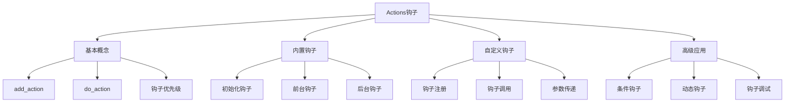
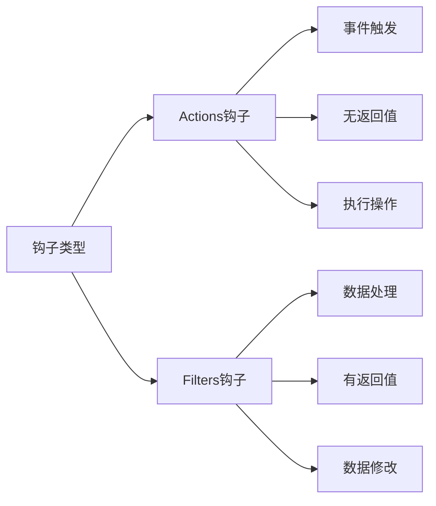

# WordPress Actions钩子详解

## 🎯 学习目标

> **认识 → 理解 → 应用**
> - **认识**：了解Actions钩子的概念和作用机制
> - **理解**：掌握Actions钩子的生命周期和执行原理
> - **应用**：能够熟练使用和创建自定义Actions钩子

## 📋 知识地图



## 💡 Actions钩子认知

### Actions vs Functions基础对比



### Actions钩子机制原理

| 属性 | Actions钩子 | 说明 | 示例 |
|------|-------------|------|------|
| **目的** | 在特定时机执行代码 | 事件驱动的编程模式 | 页面加载时执行脚本 |
| **执行方式** | 按优先级顺序执行 | 先进先出原则 | `wp_head`在页面头部执行 |
| **返回值** | 无返回值期待 | 只执行操作，不修改数据 | `wp_logout`只执行登出操作 |
| **参数** | 零个或多个参数 | 参数用于向钩子传递信息 | `save_post($post_id, $post)` |

## 🔧 Actions钩子理解

### WordPress内置Actions钩子详析

#### 初始化阶段钩子

```php
<?php
/**
 * WordPress初始化阶段Actions钩子解析
 * functions.php中的完整实现案例
 */

// 1. WordPress完全加载后执行
add_action('init', 'my_theme_init_function');
function my_theme_init_function() {
    // 注册自定义文章类型
    register_post_type('my_custom_post', array(
        'labels' => array(
            'name' => __('自定义文章', 'textdomain'),
            'singular_name' => __('自定义文章', 'textdomain'),
        ),
        'public' => true,
        'has_archive' => true,
        'supports' => array('title', 'editor', 'thumbnail'),
    ));
    
    // 注册自定义分类法
    register_taxonomy('my_taxonomy', 'my_custom_post', array(
        'labels' => array(
            'name' => __('我的分类法', 'textdomain'),
            'singular_name' => __('分类', 'textdomain'),
        ),
        'hierarchical' => true,
        'show_ui' => true,
    ));
}

// 2. 插件加载完成后执行
add_action('plugins_loaded', 'my_theme_load_textdomain');
function my_theme_load_textdomain() {
    load_theme_textdomain('textdomain', get_template_directory() . '/languages');
}

// 3. 主题设置完成后执行
add_action('after_setup_theme', 'my_theme_setup');
function my_theme_setup() {
    // 添加主题支持
    add_theme_support('post-thumbnails');
    add_theme_support('custom-logo');
    add_theme_support('html5', array('comment-list', 'comment-form'));
    
    // 注册导航菜单
    register_nav_menus(array(
        'primary' => __('主导航', 'textdomain'),
        'footer' => __('页脚菜单', 'textdomain'),
    ));
}

// 4. 小工具系统初始化
add_action('widgets_init', 'my_theme_widgets_init');
function my_theme_widgets_init() {
    register_sidebar(array(
        'name' => __('主侧边栏', 'textdomain'),
        'id' => 'sidebar-1',
        'description' => __('主侧边栏区域', 'textdomain'),
        'before_widget' => '<div id="%1$s" class="widget %2$s">',
        'after_widget' => '</div>',
        'before_title' => '<h3 class="widget-title">',
        'after_title' => '</h3>',
    ));
}
?>
```

#### 前台显示钩子

```php
<?php
/**
 * 前台显示相关Actions钩子
 * 控制页面内容的输出和渲染
 */

// 1. HTML头部钩子组
add_action('wp_head', 'my_theme_custom_head_content');
function my_theme_custom_head_content() {
    ?>
    <!-- 自定义meta标签 -->
    <meta name="viewport" content="width=device-width, initial-scale=1.0">
    <meta name="robots" content="index,follow">
    
    <!-- Open Graph标签 -->
    <?php if (is_single()) : ?>
    <meta property="og:title" content="<?php the_title(); ?>">
    <meta property="og:type" content="article">
    <meta property="og:url" content="<?php the_permalink(); ?>">
    <meta property="og:site_name" content="<?php bloginfo('name'); ?>">
    <?php endif; ?>
    
    <!-- 自定义样式 -->
    <style>
        .custom-header-style {
            background: linear-gradient(135deg, #667eea 0%, #764ba2 100%);
        }
    </style>
    <?php
}

// 2. 页面内容钩子
add_action('wp_body_open', 'my_theme_body_open_content');
function my_theme_body_open_content() {
    echo '<div id="wp-body-open-hook">自定义内容</div>';
}

// 3. 页面开始钩子
add_action('get_header', 'my_theme_before_header');
function my_theme_before_header() {
    echo '<!--- 页面开始标记 --->';
}

// 4. 页面结束钩子
add_action('get_footer', 'my_theme_before_footer');
function my_theme_before_footer() {
    ?>
    <div class="call-to-action-banner">
        <h3>需要帮助？</h3>
        <p>联系我们的专业团队</p>
        <a href="/contact" class="cta-button">立即联系</a>
    </div>
    <?php
}

// 5. 文章内容前钩子
add_action('the_post', 'my_theme_the_post_action');
function my_theme_the_post_action() {
    global $post;
    // 增加文章浏览次数
    update_post_meta($post->ID, 'view_count', 
        (int)get_post_meta($post->ID, 'view_count', true) + 1);
}

// 6. 单篇文章前钩子
add_action('single_post_rendered', 'my_theme_single_post_action');
function my_theme_single_post_action() {
    ?>
    <div class="post-action-bar">
        <button class="share-button" onclick="sharePost()">分享</button>
        <button class="like-button" onclick="likePost()">点赞</button>
    </div>
    <?php
}
?>
```

#### 后台管理钩子

```php
<?php
/**
 * WordPress后台管理Actions钩子
 * 影响管理界面的功能和表现
 */

// 1. 管理页面初始化
add_action('admin_init', 'my_theme_admin_init');
function my_theme_admin_init() {
    // 注册设置
    register_setting('my_theme_settings', 'my_theme_options');
    
    // 添加设置字段
    add_settings_section(
        'my_theme_section',
        '主题设置',
        'my_theme_section_callback',
        'my_theme_settings'
    );
    
    add_settings_field(
        'my_theme_field',
        '自定义字段',
        'my_theme_field_callback',
        'my_theme_settings',
        'my_theme_section'
    );
}

// 2. 管理菜单添加
add_action('admin_menu', 'my_theme_add_admin_menu');
function my_theme_add_admin_menu() {
    add_menu_page(
        '主题设置',           // 页面标题
        '主题选项',           // 菜单标题
        'manage_options',    // 权限
        'my_theme_settings', // 菜单slug
        'my_theme_settings_page', // 回调函数
        'dashicons-admin-customizer', // 图标
        30                    // 位置
    );
}

// 3. 管理页面头部添加内容
add_action('admin_head', 'my_theme_admin_head');
function my_theme_admin_head() {
    ?>
    <style>
        .my-theme-admin-style {
            background: #f1f1f1;
            padding: 15px;
            border-radius: 5px;
        }
    </style>
    <?php
}

// 4. 管理页面页脚
add_action('admin_footer', 'my_theme_admin_footer');
function my_theme_admin_footer() {
    ?>
    <script>
        jQuery(document).ready(function($) {
            console.log('主题管理页面脚本已加载');
        });
    </script>
    <?php
}

// 5. 用户注销钩子
add_action('wp_logout', 'my_theme_user_logout_action');
function my_theme_user_logout_action() {
    // 记录用户注销时间
    update_user_meta(get_current_user_id(), 'last_logout', current_time('mysql'));
    
    // 清理用户的临时数据
    delete_user_meta(get_current_user_id(), 'theme_temp_data');
    
    // 发送注销通知（可选）
    wp_mail(
        get_option('admin_email'),
        '用户注销通知',
        '用户 ' . wp_get_current_user()->display_name . ' 已注销'
    );
}
?>
```

### Actions钩子优先级详解

```php
<?php
/**
 * Actions钩子优先级解析
 * 理解钩子执行顺序的重要性
 */

// 系统钩子优先级解析
class ActionsPriorityDemo {
    
    public static function init() {
        // 1. 基础优先级（默认10）
        add_action('init', 'my_function_basic', 10);
        
        // 2. 最高优先级（数值越小优先级越高）
        add_action('init', 'my_function_priority_5', 5);
        
        // 3. 低优先级（后执行）
        add_action('init', 'my_function_priority_20', 20);
        
        // 4. 动态优先级
        $dynamic_priority = is_admin() ? 5 : 15;
        add_action('init', 'my_function_dynamic', $dynamic_priority);
        
        // 5. 条件优先级
        if (current_user_can('administrator')) {
            add_action('init', 'my_function_admin_only', 5);
        }
    }
    
    public static function demonstrate_priority_execution() {
        echo "<pre>";
        echo "钩子执行顺序演示:\n";
        echo "1. priority_5() - 优先级5，最先执行\n";
        echo "2. priority_10() - 优先级10，默认执行\n";
        echo "3. priority_20() - 优先级20，最后执行\n";
        echo "</pre>";
    }
}

// 优先级函数实现
function my_function_priority_5() {
    error_log('执行：优先级5的函数');
}

function my_function_basic() {
    error_log('执行：默认优先级10的函数');
}

function my_function_priority_20() {
    error_log('执行：优先级20的函数');
}

function my_function_dynamic() {
    error_log('执行：动态优先级的函数');
}

function my_function_admin_only() {
    error_log('执行：仅管理员可见的函数');
}

ActionsPriorityDemo::init();
ActionsPriorityDemo::demonstrate_priority_execution();
?>
```

## 🚀 Actions钩子应用

### 自定义Actions钩子创建

```php
<?php
/**
 * 自定义Actions钩子创建实例
 * 完全可重用的钩子系统实现
 */

class CustomActionsCreator {
    
    private static $hooks = array();
    
    /**
     * 注册自定义Actions钩子
     */
    public static function register_action($hook_name, $callback, $priority = 10, $accepted_args = 1) {
        if (!isset(self::$hooks[$hook_name])) {
            self::$hooks[$hook_name] = array();
        }
        
        self::$hooks[$hook_name][] = array(
            'callback' => $callback,
            'priority' => $priority,
            'accepted_args' => $accepted_args
        );
        
        // 按优先级排序
        usort(self::$hooks[$hook_name], function($a, $b) {
            return $a['priority'] - $b['priority'];
        });
    }
    
    /**
     * 触发Actions钩子
     */
    public static function do_action($hook_name, ...$args) {
        if (!isset(self::$hooks[$hook_name])) {
            return;
        }
        
        foreach (self::$hooks[$hook_name] as $hook) {
            if (is_callable($hook['callback'])) {
                call_user_func_array($hook['callback'], array_slice($args, 0, $hook['accepted_args']));
            }
        }
    }
    
    /**
     * 检查钩子是否已注册
     */
    public static function has_action($hook_name, $callback = false) {
        if (!isset(self::$hooks[$hook_name])) {
            return false;
        }
        
        if ($callback === false) {
            return !empty(self::$hooks[$hook_name]);
        }
        
        foreach (self::$hooks[$hook_name] as $hook) {
            if ($hook['callback'] === $callback) {
                return true;
            }
        }
        
        return false;
    }
}

// 使用示例：电商网站订单处理钩子
class EcommerceOrderHooks {
    
    public static function register_order_hooks() {
        // 1. 订单创建时
        CustomActionsCreator::register_action('order_created', 'send_order_confirmation', 10, 1);
        CustomActionsCreator::register_action('order_created', 'update_inventory', 20, 1);
        CustomActionsCreator::register_action('order_created', 'log_order_activity', 5, 1);
        
        // 2. 订单支付完成时
        CustomActionsCreator::register_action('order_paid', 'send_payment_confirmation', 10, 1);
        CustomActionsCreator::register_action('order_paid', 'process_shipping', 20, 1);
        CustomActionsCreator::register_action('order_paid', 'give_customer_points', 30, 1);
        
        // 3. 订单发货时
        CustomActionsCreator::register_action('order_shipped', 'send_tracking_info', 10, 1);
        CustomActionsCreator::register_action('order_shipped', 'update_order_status', 20, 1);
    }
    
    // 订单处理函数
    public static function create_order($order_data) {
        $order_id = wp_insert_post(array(
            'post_type' => 'shop_order',
            'post_status' => 'publish',
            'meta_input' => array(
                'order_total' => $order_data['total'],
                'order_status' => 'pending'
            )
        ));
        
        // 触发订单创建钩子
        CustomActionsCreator::do_action('order_created', $ofder_id, $order_data);
        
        return $order_id;
    }
}

// 钩子回调函数实现
function send_order_confirmation($order_id) {
    $order = get_post($order_id);
    $customer_email = get_post_meta($order_id, 'customer_email', true);
    
    wp_mail($customer_email, '订单确认', '您的订单已成功创建，订单号：' . $order_id);
}

function update_inventory($order_id) {
    $products = get_post_meta($order_id, 'order_products', true);
    foreach ($products as $product) {
        // 减少库存
        $current_stock = get_post_meta($product['id'], 'stock_quantity', true);
        update_post_meta($product['id'], 'stock_quantity', $current_stock - $product['quantity']);
    }
}

function log_order_activity($order_id) {
    error_log('订单创建：订单ID ' . $order_id . ' 于 ' . current_time('mysql'));
}

// 初始化钩子系统
EcommerceOrderHooks::register_order_hooks();
```

### 条件钩子应用

```php
<?php
/**
 * 条件Actions钩子应用
 * 根据特定条件执行不同的钩子
 */

class ConditionalActionsHub {
    
    /**
     * 页面类型条件钩子
     */
    public static function register_page_type_hooks() {
        // 首页专用钩子
        add_action('template_redirect', function() {
            if (is_front_page()) {
                do_action('my_theme_front_page_load');
            }
        });
        
        // 文章页专用钩子
        add_action('template_redirect', function() {
            if (is_single()) {
                do_action('my_theme_single_post_load', get_the_ID());
            }
        });
        
        // 页面专用钩子
        add_action('template_redirect', function() {
            if (is_page()) {
                do_action('my_theme_page_load', get_the_ID());
            }
        });
        
        // 分类页专用钩子
        add_action('template_redirect', function() {
            if (is_category()) {
                do_action('my_theme_category_page_load', get_queried_object());
            }
        });
    }
    
    /**
     * 用户权限条件钩子
     */
    public static function register_user_role_hooks() {
        add_action('init', function() {
            if (current_user_can('administrator')) {
                do_action('my_theme_admin_init');
            }
            
            if (current_user_can('editor')) {
                do_action('my_theme_editor_init');
            }
            
            if (current_user_can('subscriber')) {
                do_action('my_theme_subscriber_init');
            }
        });
    }
    
    /**
     * 设备类型条件钩子
     */
    public static function register_device_type_hooks() {
        add_action('wp_head', function() {
            if (wp_is_mobile()) {
                do_action('my_theme_mobile_head');
            } else {
                do_action('my_theme_desktop_head');
            }
        });
    }
}

// 条件钩子的具体实现
add_action('my_theme_front_page_load', function() {
    // 首页特色功能
    echo '<script>console.log("首页特殊脚本已加载");</scripts>';
});

add_action('my_theme_single_post_load', function($post_id) {
    // 文章页特殊处理
    update_post_meta($post_id, 'single_page_loaded_at', current_time('mysql'));
});

add_action('my_theme_admin_init', function() {
    // 管理员专用功能
    add_action('admin_menu', 'add_admin_only_menu');
});

// 注册所有条件钩子
ConditionalActionsHub::register_page_type_hooks();
ConditionalActionsHub::register_user_role_hooks();
ConditionalActionsHub::register_device_type_hooks();
```

## 📊 Actions钩子调试与优化

### 钩子调试技巧

```php
<?php
/**
 * Actions钩子调试和性能分析
 * 开发环境下的钩子监控系统
 */

class ActionsDebugger {
    
    private static $hook_logs = array();
    private static $hook_performance = array();
    
    /**
     * 开始监控所有Actions钩子
     */
    public static function start_monitoring() {
        if (!defined('WP_DEBUG') || !WP_DEBUG) {
            return;
        }
        
        add_action('all', function($tag, ...$args) {
            self::$hook_logs[$tag][] = array(
                'time' => microtime(true),
                'args' => $args,
                'memory' => memory_get_usage(true),
                'caller' => debug_backtrace(DEBUG_BACKTRACE_IGNORE_ARGS, 3)[2]
            );
        });
        
        // 添加性能监控完成钩子
        add_action('wp_footer', array(__CLASS__, 'display_hook_debug_info'));
        add_action('admin_footer', array(__CLASS__, 'display_hook_debug_info'));
    }
    
    /**
     * 显示钩子调试信息
     */
    public static function display_hook_debug_info() {
        if (!current_user_can('administrator')) {
            return;
        }
        
        ?>
        <div id="actions-debug-info" style="
            position: fixed;
            top: 50px;
            right: 20px;
            width: 300px;
            background: #fff;
            border: 1px solid #ccc;
            padding: 10px;
            z-index: 9999;
            font-size: 12px;
            max-height: 400px;
            overflow-y: auto;
        ">
            <h4>Actions钩子调试信息</h4>
            <?php
            $total_hooks = array_sum(array_map('count', self::$hook_logs));
            echo "<p>总钩子执行次数: $total_hooks</p>";
            echo "<p>活跃钩子数量: " . count(self::$hook_logs) . "</p>";
            
            foreach (self::$hook_logs as $hook => $calls) {
                echo "<details>";
                echo "<summary>$hook (" . count($calls) . " 次)</summary>";
                echo "<pre>" . print_r($calls, true) . "</pre>";
                echo "</details>";
            }
            ?>
        </div>
        <?php
    }
    
    /**
     * Hook性能分析
     */
    public static function analyze_hook_performance() {
        $analysis = array();
        
        foreach (self::$hook_logs as $hook => $calls) {
            $total_time = 0;
            $total_memory = 0;
            
            foreach ($calls as $index => $call) {
                if ($index > 0) {
                    $total_time += $call['time'] - self::$hook_logs[$hook][$index - 1]['time'];
                }
                $total_memory += $call['memory'];
            }
            
            $analysis[$hook] = array(
                'call_count' => count($calls),
                'avg_time' => count($calls) > 1 ? $total_time / (count($calls) - 1) : 0,
                'avg_memory' => $total_memory / count($calls),
                'total_memory' => $total_memory
            );
        }
        
        return $analysis;
    }
    
    /**
     * 移除不必要的钩子
     */
    public static function optimize_hooks() {
        // 移除WordPress核心中不必要的钩子
        remove_action('wp_head', 'wp_generator');
        remove_action('wp_head', 'wlwmanifest_link');
        remove_action('wp_head', 'rsd_link');
        remove_action('wp_head', 'wp_shortlink_wp_head');
        remove_action('wp_head', 'adjacent_posts_rel_link_wp_head');
        
        // 条件移除Emoji支持（如果不是必需的）
        remove_action('wp_head', 'print_emoji_detection_script', 7);
        remove_action('admin_print_scripts', 'print_emoji_detection_script');
        remove_action('wp_print_styles', 'print_emoji_styles');
        remove_action('admin_print_styles', 'print_emoji_styles');
        
        // 移除Embeds支持
        remove_action('wp_head', 'wp_oembed_add_discovery_links');
        remove_action('wp_head', 'wp_oembed_add_host_js');
    }
}

// 开发环境启动监控
if (defined('WP_DEBUG') && WP_DEBUG) {
    ActionsDebugger::start_monitoring();
    ActionsDebugger::optimize_hooks();
}
?>
```

## 🎯 刻意练习项目

### 练习1：电商钩子系统设计
**目标**：设计一个完整的电商订单处理钩子系统
**技能点**：自定义钩子、事件驱动、系统设计

```php
// 练习要点实现
class EcommerceHookProject {
    
    // 1. 定义订单生命周期钩子
    public function register_order_lifecycle_hooks() {
        // 订单创建 -> 支付 -> 发货 -> 确认收货 -> 评价
    }
    
    // 2. 实现钩子优先级管理
    public function manage_hook_priorities() {
        // 支付必须优先于库存修改
        // 物流跟踪必须优先于客户通知
    }
    
    // 3. 设计钩子插件化架构
    public function design_plugin_hook_system() {
        // 让第三方开发者可以轻松扩展订单功能
    }
}
```

### 练习2：内容发布工作流
**目标**：创建文章发布的自动化工作流
**技能点**：条件钩子、用户权限、内容管理

### 练习3：钩子调试工具
**目标**：开发专业的钩子调试和分析工具
**技能点**：性能监控、调试技术、开发者工具

## 🔗 拓展学习链接

### 进阶主题
**相关技术**
- [[Filters钩子]] - 与之对应的Filters钩子系统
- [[钩子优先级]] - 钩子执行顺序的深度管理
- [[自定义钩子]] - 创建高级自定义钩子

**实战应用**
- [[钩子机制练习]] - 综合钩子开发实践
- [[插件开发基础]] - 钩子在插件中的应用
- [[性能优化]] - 钩子系统性能优化

### 核心技术
- [[主题开发基础]] - 主题中钩子的应用
- [[后端开发项目]] - 钩子在业务逻辑中的应用

---

## 💬 知识检查

**理解检验**：
1. Actions钩子和Filters钩子的本质区别是什么？
2. 钩子优先级如何影响执行顺序？
3. 在什么情况下需要创建自定义Actions钩子？

**应用检验**：
1. 能够设计完整的钩子系统来管理业务流程
2. 理解如何调试和优化钩子性能
3. 掌握高级钩子技巧如动态钩子和条件钩子

### 故障排除

#### 常见钩子问题

| 问题 | 原因 | 解决方案 |
|------|------|----------|
| **钩子不执行** | 钩子未正确注册或条件不满足 | 检查钩子名称、优先级和注册方式 |
| **性能问题** | 钩子过多或优先级混乱 | 优化钩子数量和优先级，移除不必要钩子 |
| **钩子冲突** | 多个插件使用相同钩子 | 调整优先级或修改钩子名称 |

**下一步学习**：[[Filters钩子]] → 深入学习数据过滤和修改机制
