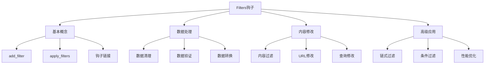
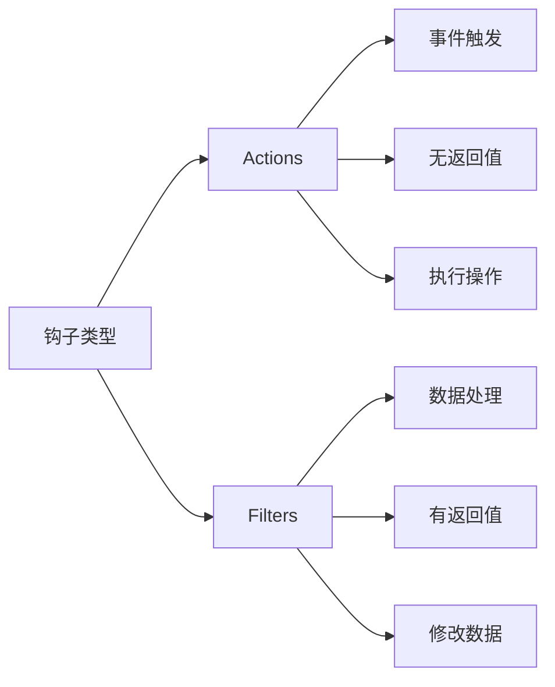

# WordPress Filters钩子详解

## 🎯 学习目标

> **认识 → 理解 → 应用**
> - **认识**：了解Filters钩子的概念和数据修改机制
> - **理解**：掌握Filters钩子的工作顺序和数据处理原理
> - **应用**：能够熟练使用和创建自定义Filters钩子

## 📋 知识地图



## 💡 Filters钩子认知

### Actions vs Filters核心对比



### Filters钩子工作机制

| 属性 | Filters钩子 | 说明 | 示例 |
|------|-------------|------|------|
| **目的** | 修改和过滤数据 | 在不改变核心逻辑的情况下修改输出 | 修改文章标题、内容格式 |
| **执行方式** | 链式处理数据 | 按优先级依次处理数据 | 原始数据→过滤1→过滤2→最终输出 |
| **返回值** | 必须返回数据 | 必须返回处理后的数据 | `return $processed_data;` |
| **参数** | 至少一个参数 | 第一个参数是要修改的数据 | `apply_filters('the_title', $raw_title)` |

## 🔧 Filters钩子理解

### WordPress内置Filters详析

#### 内容显示Filters

```php
<?php
/**
 * WordPress内容显示Filters钩子使用指南
 * 修改页面输出和内容显示
 */

// 1. 文章标题过滤
function customize_post_title($original_title, $post_id = null) {
    if (is_single()) {
        return $original_title . ' | ' . get_bloginfo('name');
    }
    return $original_title;
}
add_filter('the_title', 'customize_post_title', 10, 2);

// 2. 文章内容过滤
function enhance_content_with_share_buttons($content) {
    if (is_single()) {
        $share_html = '
        <div class="social-share-buttons">
            <h4>分享这篇文章：</h4>
            <div class="share-buttons">
                <a href="#" class="share-facebook">Facebook</a>
                <a href="#" class="share-twitter">Twitter</a>
                <a href="#" class="share-weibo">微博</a>
            </div>
        </div>';
        
        // 在内容末尾添加分享按钮
        return $content . $share_html;
    }
    return $content;
}
add_filter('the_content', 'enhance_content_with_share_buttons');

// 3. 文章摘要过滤
function customize_excerpt($excerpt) {
    if (is_home() || is_archive()) {
        // 添加"阅读更多"链接
        $excerpt .= '<p><a href="' . get_permalink() . '" class="read-more">阅读全文 →</a></p>';
    }
    return $excerpt;
}
add_filter('the_excerpt', 'customize_excerpt');

// 4. 页面标题过滤
function seo_optimized_title($title, $sep, $seplocation) {
    global $page, $paged;
    
    if (is_feed()) {
        return $title;
    }
    
    // 添加页面附加信息
    $site_description = get_bloginfo('description', 'display');
    $desc_sep = '';
    
    if ($site_description && (is_home() || is_front_page())) {
        $title .= " {$desc_sep} {$site_description}";
    }
    
    // 添加分页信息
    if (($paged >= 2 || $page >= 2) && !is_404()) {
        $title .= " {$sep} " . sprintf(__('第%s页'), max($paged, $page));
    }
    
    return $title;
}
add_filter('wp_title', 'seo_optimized_title', 10, 3);

// 5. 导航菜单过滤
function add_menu_markup($nav_menu, $args) {
    // 为导航菜单添加自定义类和ID
    $nav_menu = str_replace(' class="nav-menu"', ' class="nav-menu custom-nav" id="main-nav"', $nav_menu);
    
    // 添加菜单包装器
    if (!empty($nav_menu)) {
        $nav_menu = '<div class="menu-wrapper">' . $nav_menu . '</div>';
    }
    
    return $nav_menu;
}
add_filter('wp_nav_menu', 'add_menu_markup', 10, 2);
```

### 查询和数据库Filters

```php
<?php
/**
 * WordPress查询Filters钩子应用
 * 修改数据库查询和内容检索
 */

// 1. 修改查询条件
function modify_main_query($query) {
    if (!is_admin() && $query->is_main_query()) {
        if (is_category()) {
            // 分类页面只显示特定文章类型
            $query->set('post_type', array('post', 'custom_post_type'));
            $query->set('meta_key', 'featured');
            $query->set('meta_value', 'yes');
        }
    }
}
add_filter('pre_get_posts', 'modify_main_query');

// 2. 修改WHERE子句
function add_custom_where($where) {
    if (is_search()) {
        global $wpdb;
        // 确保搜索结果按自定义字段排序
        $where .= " OR EXISTS (
            SELECT * FROM {$wpdb->postmeta} 
            WHERE {$wpdb->postmeta}.post_id = {$wpdb->posts}.ID 
            AND {$wpdb->postmeta}.meta_key = 'custom_search_field' 
            AND {$wpdb->postmeta}.meta_value LIKE '%{$wpdb->_real_escape($_GET['s'])}%'
        )";
    }
    return $where;
}
add_filter('posts_where', 'add_custom_where');

// 3. 修改ORDER BY子句
function custom_posts_orderby($orderby) {
    if (is_category('featured')) {
        // 特色分类按自定义字段排序
        global $wpdb;
        $orderby = "{$wpdb->postmeta}.meta_value DESC, {$wpdb->posts}.post_date DESC";
    }
    return $orderby;
}
add_filter('posts_orderby', 'custom_posts_orderby');

// 4. 修改JOIN子句
function add_meta_join($join) {
    global $wpdb;
    if (is_category('featured')) {
        $join .= " LEFT JOIN {$wpdb->postmeta} ON ({$wpdb->posts}.ID = {$wpdb->postmeta}.post_id AND {$wpdb->postmeta}.meta_key = 'featured_rating')";
    }
    return $join;
}
add_filter('posts_join', 'add_meta_join');

// 5. 限制查询数量
function limit_search_results($query) {
    if (!is_admin() && is_search() && $query->is_main_query()) {
        $query->set('posts_per_page', 10);
    }
}
add_filter('pre_get_posts', 'limit_search_results');
```

### URL和链接Filters

```php
<?php
/**
 * WordPress链接和URL处理
 * 自定义各种链接的生成规则
 */

// 1. 自定义文章类型链接
function custom_post_type_permalink($post_link, $post) {
    if ($post->post_type === 'my_custom_post') {
        return home_url('/my-custom/' . $post->ID . '/');
    }
    return $post_link;
}
add_filter('post_type_link', 'custom_post_type_permalink', 10, 2);

// 2. 分类链接自定义
function custom_category_link($termlink, $term, $taxonomy) {
    if ($taxonomy === 'category') {
        // 添加年月日结构：/category/年/月/日/category-slug/
        $year = date('Y');
        $month = date('m');
        $day = date('d');
        return home_url("/category/{$year}/{$month}/{$day}/{$term->slug}/");
    }
    return $termlink;
}
add_filter('category_link', 'custom_category_link', 10, 3);

// 3. 附件链接修改
function custom_attachment_link($link, $attachment_id) {
    $attachment = get_post($attachment_id);
    if ($attachment && $attachment->post_type === 'attachment') {
        // 直接返回文件URL而不是附件页面
        $file_url = wp_get_attachment_url($attachment_id);
        return $file_url;
    }
    return $link;
}
add_filter('attachment_link', 'custom_attachment_link', 10, 2);

// 4. 作者页面链接
function custom_author_link($link, $author_id, $author_nicename) {
    return home_url("/author/profile/{$author_nicename}/");
}
add_filter('author_link', 'custom_author_link', 10, 3);

// 5. 评论链接修改
function custom_comment_link($link, $comment) {
    $comment_id = $comment->comment_ID;
    $post_id = $comment->comment_post_ID;
    $post_link = get_permalink($post_id);
    
    return $post_link . "#comment-{$comment_id}";
}
add_filter('get_comment_link', 'custom_comment_link', 10, 2);
```

## 🚀 Filters钩子应用

### 内容安全和清理Filters

```php
<?php
/**
 * 内容安全和数据清理Filters
 * 防止恶意内容和不安全数据
 */

// 1. 内容清理和安全过滤
function sanitize_user_content($content) {
    // 移除危险的HTML标签
    $content = wp_strip_all_tags($content, '<p><br><strong><em><a><ul><ol><li>');
    
    // 清理JavaScript
    $content = preg_replace('/<script\b[^<]*(?:(?!<\/script>)<[^<]*)*<\/script>/mi', '', $content);
    
    // 清理iframe（除非是可信源）
    $content = preg_replace('/<iframe\b[^>]*src="(?!https:\/\/(www\.)?(youtube\.com|vimeo\.com))[^"]*"[^>]*>.*?<\/iframe>/mi', '', $content);
    
    // 添加rel="noopener noreferrer"到外部链接
    $content = preg_replace('/<a([^>]*)\bhref=["\']https?:\/\/[^\/\s"\']+["\']([^>]*)>/', '<a$1href="$2" rel="noopener noreferrer nofollow"', $content);
    
    return $content;
}
add_filter('the_content', 'sanitize_user_content');
add_filter('the_excerpt', 'sanitize_user_content');

// 2. 用户数据清理
function sanitize_user_data($user_data, $context) {
    switch ($context) {
        case 'display_name':
            return sanitize_text_field($user_data);
        case 'user_email':
            return sanitize_email($user_data);
        case 'user_url':
            return esc_url_raw($user_data);
        case 'description':
            return wp_strip_all_tags($user_data);
        default:
            return $user_data;
    }
}

// 应用用户数据清理
add_filter('the_author', 'sanitize_text_field');
add_filter('author_email', 'sanitize_email');
add_filter('author_url', 'esc_url_raw');

// 3. 评论内容过滤
function clean_comment_content($comment_content) {
    // 移除HTML标签（保留必要的）
    $allowed_tags = array(
        'p' => array(),
        'br' => array(),
        'strong' => array(),
        'em' => array(),
        'a' => array('href' => array(), 'title' => array()),
    );
    
    $comment_content = wp_kses($comment_content, $allowed_tags);
    
    // 限制链接数量
    $link_count = preg_match_all('/<a /', $comment_content);
    if ($link_count > 3) {
        $comment_content = preg_replace('/<a[^>]*>/', '', $comment_content, $link_count - 3);
    }
    
    return $comment_content;
}
add_filter('pre_comment_content', 'clean_comment_content');
```

### 性能和SEO优化Filters

```php
<?php
/**
 * 性能和SEO优化Filters
 * 提升网站性能和搜索引擎优化
 */

// 1. 图片懒加载优化
function lazy_load_images($content) {
    // 为图片添加懒加载属性和占位符
    $content = preg_replace(
        '/]+)src=["\']([^"\']+)["\']([^>]*)>/',
        '',
        $content
    );
    
    return $content;
}
add_filter('the_content', 'lazy_load_images');

// 2. Minify HTML输出
function minify_html_output($content) {
    if (is_admin() || is_feed() || is_preview()) {
        return $content;
    }
    
    // 移除多余的空白字符
    $content = preg_replace('/\s+/', ' ', $content);
    $content = preg_replace('/>\s+</', '><', $content);
    $content = str_replace(array("\r", "\n", "\t"), '', $content);
    
    return $content;
}
add_filter('the_content', 'minify_html_output');
add_filter('get_search_form', 'minify_html_output');
add_filter('get_the_excerpt', 'minify_html_output');

// 3. SEO友好的URL结构
function seo_friendly_urls($url, $post) {
    // 确保URL不包含特殊字符
    $url = sanitize_title(basename($url));
    
    // 对分类页面添加SEO结构
    if (is_category()) {
        $category = get_queried_object();
        return home_url("/category/seo-{$category->slug}/");
    }
    
    return $url;
}
add_filter('post_link', 'seo_friendly_urls', 10, 2);

// 4. 自动生成文章meta描述
function auto_generate_meta_description($meta_description) {
    if (is_single() && empty($meta_description)) {
        global $post;
        
        // 使用文章摘要或前150个字符
        $content = wp_strip_all_tags(get_the_excerpt() ?: $post->post_content);
        $meta_description = wp_trim_words($content, 25, '...');
        
        // 添加网站名称
        $meta_description .= ' - ' . get_bloginfo('name');
    }
    
    return $meta_description;
}
add_filter('wp_head', function() {
    add_filter('gettext', 'auto_generate_meta_description');
});

// 5. 缓存友好的查询参数清理
function cache_friendly_query_params($query_string) {
    // 移除影响缓存的查询参数
    $cache_busting_params = array('nocache', 'version', 'v', 'cb');
    
    foreach ($cache_busting_params as $param) {
        $query_string = preg_replace("/&{$param}=[^&]*/", '', $query_string);
    }
    
    return $query_string;
}
add_filter('query_string', 'cache_friendly_query_params');
```

### 高级自定义Filters

```php
<?php
/**
 * 高级自定义Filters应用
 * 创建复杂的过滤器和数据处理逻辑
 */

// 1. 多条件链式过滤器
function create_content_processing_pipeline($content) {
    // 第一层：基础清理
    $content = apply_filters('raw_content_processing', $content);
    
    // 第二层：格式化处理
    if (apply_filters('enable_content_formatting', true)) {
        $content = apply_filters('content_formatting', $content);
    }
    
    // 第三层：增强功能
    if (is_single()) {
        $content = apply_filters('single_post_enhancement', $content);
    }
    
    // 第四层：SEO优化
    $content = apply_filters('seo_content_enhancement', $content);
    
    return $content;
}
add_filter('the_content', 'create_content_processing_pipeline', 5);

// 2. 条件过滤器注册
class ConditionalFilterManager {
    
    private static $filters = array();
    
    /**
     * 注册条件过滤器
     */
    public static function register_conditional_filter($filter_name, $callback, $conditions, $priority = 10) {
        self::$filters[$filter_name] = array(
            'callback' => $callback,
            'conditions' => $conditions,
            'priority' => $priority
        );
        
        add_filter($filter_name, array(__CLASS__, 'conditional_filter_handler'), $priority, PHP_INT_MAX);
    }
    
    /**
     * 条件过滤器处理器
     */
    public static function conditional_filter_handler($data, ...$args) {
        $current_filter = current_filter();
        
        if (!isset(self::$filters[$current_filter])) {
            return $data;
        }
        
        $filter_config = self::$filters[$current_filter];
        
        // 检查条件
        if (self::check_conditions($filter_config['conditions'])) {
            return call_user_func_array($filter_config['callback'], array($data, ...$args));
        }
        
        return $data;
    }
    
    /**
     * 检查过滤条件
     */
    private static function check_conditions($conditions) {
        if (empty($conditions)) {
            return true;
        }
        
        foreach ($conditions as $condition) {
            switch ($condition['type']) {
                case 'user_logged_in':
                    if ($condition['required'] !== is_user_logged_in()) {
                        return false;
                    }
                    break;
                    
                case 'user_capability':
                    if ($condition['required'] !== current_user_can($condition['capability'])) {
                        return false;
                    }
                    break;
                    
                case 'post_type':
                    if ($condition['required'] !== is_singular($condition['post_type'])) {
                        return false;
                    }
                    break;
                    
                case 'template':
                    if ($condition['required'] !== (get_page_template_slug() === $condition['template'])) {
                        return false;
                    }
                    break;
            }
        }
        
        return true;
    }
}

// 使用条件过滤器的例子
ConditionalFilterManager::register_conditional_filter(
    'the_content',
    function($content) {
        return $content . '<div class="admin-only-content">这是管理员专用内容</div>';
    },
    array(
        array('type' => 'user_capability', 'required' => true, 'capability' => 'manage_options')
    )
);

// 3. 性能优化的过滤器链
function optimized_filter_chain($data, $filter_stack) {
    foreach ($filter_stack as $filter_config) {
        // 检查是否需要执行
        if (!$filter_config['should_execute']) {
            continue;
        }
        
        // 执行过滤器
        $data = call_user_func_array($filter_config['callback'], array($data, ...$filter_config['args']));
        
        // 检查是否应该终止链式处理
        if (isset($filter_config['terminate_on']) && $filter_config['terminate_on']($data)) {
            break;
        }
    }
    
    return $data;
}

// 4. 动态过滤器注册/移除
class DynamicFilterManager {
    
    public static function register_temporary_filter($filter_name, $callback, $duration = 3600, $priority = 10) {
        $expiration_time = time() + $duration;
        
        // 存储临时过滤器配置
        $temp_filters = get_option('temp_filters', array());
        $temp_filters[$filter_name] = array(
            'callback' => $callback,
            'expires' => $expiration_time,
            'priority' => $priority
        );
        update_option('temp_filters', $temp_filters);
        
        // 注册过滤器
        add_filter($filter_name, $callback, $priority);
    }
    
    public static function cleanup_expired_filters() {
        $temp_filters = get_option('temp_filters', array());
        
        foreach ($temp_filters as $filter_name => $config) {
            if (time() > $config['expires']) {
                remove_filter($filter_name, $config['callback'], $config['priority']);
                unset($temp_filters[$filter_name]);
            }
        }
        
        update_option('temp_filters', $temp_filters);
    }
}

// 定期清理过期过滤器
add_action('wp_scheduled_delete', array('DynamicFilterManager', 'cleanup_expired_filters'));
```

## 📊 Filters钩子调试和性能

### 过滤器性能监控

```php
<?php
/**
 * 过滤器性能调试类
 * 监控和分析过滤器执行性能
 */
class FilterPerformanceMonitor {
    
    private static $performance_data = array();
    private static $enabled = false;
    
    /**
     * 启用性能监控
     */
    public static function enable_monitoring() {
        if (!defined('WP_DEBUG') || !WP_DEBUG) {
            return;
        }
        
        self::$enabled = true;
        
        // 监控所有filter钩子
        add_filter('all', function($tag, ...$args) {
            if (strpos($tag, 'filter') !== false) {
                self::start_monitoring($tag, $args);
            }
        });
        
        add_filter('all', function($tag, ...$args) {
            if (strpos($tag, 'filter') !== false) {
                self::end_monitoring($tag);
            }
        }, 999);
    }
    
    /**
     * 开始监控
     */
    private static function start_monitoring($filter_name, $args) {
        self::$performance_data[$filter_name] = array(
            'start_time' => microtime(true),
            'start_memory' => memory_get_usage(true),
            'args_count' => count($args)
        );
    }
    
    /**
     * 结束监控
     */
    private static function end_monitoring($filter_name) {
        if (!isset(self::$performance_data[$filter_name])) {
            return;
        }
        
        $end_time = microtime(true);
        $end_memory = memory_get_usage(true);
        
        self::$performance_data[$filter_name]['execution_time'] = 
            $end_time - self::$performance_data[$filter_name]['start_time'];
            
        self::$performance_data[$filter_name]['memory_usage'] = 
            $end_memory - self::$performance_data[$filter_name]['start_memory'];
    }
    
    /**
     * 获取性能报告
     */
    public static function get_performance_report() {
        if (!self::$enabled) {
            return 'Performance monitoring is disabled';
        }
        
        $header = '<h3>Filter Performance Report</h3>';
        $content = '<table border="1"><tr><th>Filter Name</th><th>Execution Time</th><th>Memory Usage</th><th>Args Count</th></tr>';
        
        foreach (self::$performance_data as $filter => $data) {
            $content .= sprintf(
                '<tr><td>%s</td><td>%.4fs</td><td>%s</td><td>%d</td></tr>',
                $filter,
                $data['execution_time'],
                size_format($data['memory_usage']),
                $data['args_count']
            );
        }
        
        $content .= '</table>';
        
        return $header . $content;
    }
    
    /**
     * 清理性能数据
     */
    public static function clear_performance_data() {
        self::$performance_data = array();
    }
}

// 开发环境下启用监控
if (defined('WP_DEBUG') && WP_DEBUG && current_user_can('administrator')) {
    FilterPerformanceMonitor::enable_monitoring();
    
    // 在管理页面显示性能报告
    add_action('admin_footer', function() {
        echo '<div class="filter-performance-report">';
        echo FilterPerformanceMonitor::get_performance_report();
        echo '</div>';
    });
}
?>
```

## 🎯 刻意练习项目

### 练习1：内容处理管道
**目标**：创建复杂的文章内容处理流程
**技能点**：过滤器链接、条件处理、数据处理链

### 练习2：SEO优化过滤器系统
**目标**：建立自动SEO优化系统
**技能点**：动态元数据、URL优化、内容增强

### 练习3：多站点内容过滤
**目标**：在多站点网络中实现统一的过滤规则
**技能点**：网络过滤器、权限控制、数据同步

## 🔗 拓展学习链接

### 进阶主题
- **相关技术**
- [[Actions钩子]] - WordPress事件处理机制
- [[钩子优先级]] - 钩子执行顺序管理
- [[自定义钩子]] - 创建高级自定义钩子系统

**实战应用**
- [[功能开发基础]] - Filters在功能开发中的应用
- [[性能优化]] - Filters钩子系统性能优化
- [[钩子机制练习]] - 综合钩子开发实战

### 核心技术
- [[主题开发基础]] - Filters在主题中的应用
- [[插件开发基础]] - Filters在插件中的应用

---

## 💬 知识检查

**理解检验**：
1. Filters钩子和Actions钩子在工作机制上有什么根本区别？
2. WordPress中哪些数据类型通过Filters处理？举出5个例子。
3. 如何处理过滤器链的性能优化问题？

**应用检验**：
1. 能够设计完整的过滤器处理管道来管理内容输出
2. 理解如何调试和监控过滤器性能问题
3. 掌握高级过滤器技巧如条件过滤和动态注册

### 故障排除

#### 常见Filters问题

| 问题 | 原因 | 解决方案 |
|------|------|----------|
| **数据未正确修改** | 过滤器未返回修改后的数据 | 确保函数有return语句并返回处理后的数据 |
| **过滤器冲突** | 多个过滤器修改同一数据 | 调整优先级或合并功能逻辑 |
| **性能问题** | 过滤器执行过于频繁 | 添加条件判断，使用缓存机制 |
| **无限循环** | 过滤器递归调用自身 | 避免在过滤器内调用相同过滤器 |

**下一步学习**：[[钩子优先级]] → 深入学习钩子执行顺序的管理技巧
