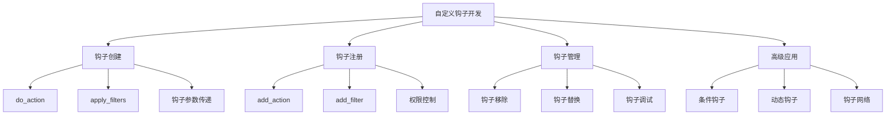
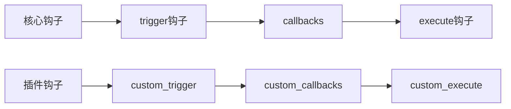

# WordPress自定义钩子开发

## 🎯 学习目标

> **认识 → 理解 → 应用**
> - **认识**：了解自定义钩子的价值和创建方法
> - **理解**：掌握钩子创建的最佳实践和扩展机制  
> - **应用**：能够设计和实现完整的自定义钩子系统

## 📋 知识地图



## 💡 自定义钩子认知

### 钩子创建原理对比



### WordPress钩子API详解

| 函数类型 | 用途 | 参数 | 返回值 | 示例 |
|----------|------|------|--------|------|
| **do_action()** | 触发Actions钩子 | `$hook_name, ...$args` | `void` | `do_action('custom_hook', $data)` |
| **apply_filters()** | 处理Filters钩子 | `$hook_name, $value, ...$args` | `mixed` | `apply_filters('custom_filter', $data)` |
| **add_action()** | 注册Actions回调 | `$hook, $callback, $priority, $args` | `true` | `add_action('custom_hook', 'func')` |
| **add_filter()** | 注册Filters回调 | `$hook, $callback, $priority, $args` | `true` | `add_filter('custom_filter', 'func')` |
| **has_action()** | 检查Actions钩子 | `$hook, $callback` | `false|\|int` | `has_action('custom_hook')` |
| **has_filter()** | 检查Filters钩子 | `$hook, $callback` | `false|\|int` | `has_filter('custom_filter')` |

## 🔧 自定义Actions钩子理解

### 生命周期钩子创建

```php
<?php
/**
 * 用户生命周期自定义钩子系统
 * 创建完整的用户行为跟踪钩子
 */

class User_Lifecycle_Hooks {
    
    /**
     * 初始化用户钩子系统
     */
    public static function init() {
        // 注册钩子触发点
        self::register_hook_triggers();
        
        // 注册默认回调
        self::register_default_callbacks();
    }
    
    /**
     * 注册钩子触发点
     */
    private static function register_hook_triggers() {
        // 用户注册前的钩子
        add_action('user_register', function($user_id) {
            $user_data = get_userdata($user_id);
            
            // 触发自定义钩子
            do_action('custom_user_pre_register', $user_id, $user_data);
            
            // 记录注册来源
            $source = $_POST['register_source'] ?? 'default';
            do_action('custom_user_register_source', $user_id, $source);
        });
        
        // 用户登录钩子
        add_action('wp_login', function($user_login, $user) {
            // 更新最后登录时间
            update_user_meta($user->ID, 'last_login', current_time('mysql'));
            
            // 触发登录后钩子
            do_action('custom_user_post_login', $user->ID, $user_login);
            
            // 检查是否是可疑登录
            $login_ip = $_SERVER['REMOTE_ADDR'];
            self::check_suspicious_login($user->ID, $login_ip);
        }, 10, 2);
        
        // 用户注销钩子
        add_action('wp_logout', function() {
            do_action('custom_user_logout', get_current_user_id());
        });
        
        // 用户资料更新钩子
        add_action('profile_update', function($user_id, $old_user_data, $userdata) {
            $changed_fields = self::get_changed_fields($old_user_data, $userdata);
            
            do_action('custom_user_profile_updated', $user_id, $changed_fields);
            
            // 如果邮箱改变，触发验证
            if (isset($changed_fields['user_email'])) {
                do_action('custom_user_email_changed', $user_id, $old_user_data->user_email, $userdata['user_email']);
            }
        }, 10, 3);
    }
    
    /**
     * 注册默认回调函数
     */
    private static function register_default_callbacks() {
        // 用户注册通知回调
        add_action('custom_user_post_register', function($user_id, $source) {
            // 发送欢迎邮件
            $user = get_userdata($user_id);
            $subject = '欢迎注册！';
            $message = "欢迎 {$user->display_name}！\n\n您的账户已成功创建。\n\n请访问以下链接激活您的账户：\n" . wp_login_url();
            
            wp_mail($user->user_email, $subject, $message);
            
            // 记录注册统计
            self::track_registration_stats($source);
        }, 10, 2);
        
        // 登录通知回调
        add_action('custom_user_post_login', function($user_id, $username) {
            // 记录登录日志
            error_log("User {$username} (ID: {$user_id}) logged in at " . current_time('Y-m-d H:i:s'));
            
            // 更新用户统计
            $login_count = get_user_meta($user_id, 'login_count', true) ?: 0;
            update_user_meta($user_id, 'login_count', $login_count + 1);
            
            // 检查是否需要密码更新提醒
            $last_password_change = get_user_meta($user_id, 'last_password_change', true);
            if (!$last_password_change || (time() - strtotime($last_password_change)) > 90 * 24 * 60 * 60) {
                do_action('custom_user_password_expired_warning', $user_id);
            }
        }, 10, 2);
        
        // 邮箱变更回调
        add_action('custom_user_email_changed', function($user_id, $old_email, $new_email) {
            // 发送确认邮件到新邮箱
            $confirm_key = wp_generate_password(20, false);
            update_user_meta($user_id, '_email_confirm_key', $confirm_key);
            
            $confirm_url = add_query_arg(array(
                'action' => 'confirm_email_change',
                'key' => $confirm_key,
                'user_id' => $user_id
            ), home_url());
            
            $subject = '请确认邮箱地址变更';
            $message = "您请求更改邮箱地址。\n\n请点击以下链接确认新邮箱地址：\n{$confirm_url}\n\n此链接24小时内有效。";
            
            wp_mail($new_email, $subject, $message);
        }, 10, 3);
    }
    
    /**
     * 检查可疑登录
     */
    private static function check_suspicious_login($user_id, $login_ip) {
        $previous_ips = get_user_meta($user_id, 'login_ips', true) ?: array();
        
        // 检查是否是新IP地址
        if (!in_array($login_ip, $previous_ips)) {
            do_action('custom_user_new_ip_login', $user_id, $login_ip, $previous_ips);
            
            // 记录新IP
            $previous_ips[] = $login_ip;
            if (count($previous_ips) > 10) {
                $previous_ips = array_slice($previous_ips, -10); // 只保留最近10个IP
            }
            update_user_meta($user_id, 'login_ips', $previous_ips);
        }
    }
    
    /**
     * 获取用户资料变更字段
     */
    private static function get_changed_fields($old_data, $new_data) {
        $changed_fields = array();
        
        $fields_to_check = array('display_name', 'user_email', 'first_name', 'last_name');
        
        foreach ($fields_to_check as $field) {
            $old_value = $old_data->$field ?? '';
            $new_value = $new_data[$field] ?? '';
            
            if ($old_value !== $new_value) {
                $changed_fields[$field] = array(
                    'old' => $old_value,
                    'new' => $new_value
                );
            }
        }
        
        return $changed_fields;
    }
    
    /**
     * 记录注册统计
     */
    private static function track_registration_stats($source) {
        $stats = get_option('user_registration_stats', array());
        
        if (!isset($stats[$source])) {
            $stats[$source] = 0;
        }
        $stats[$source]++;
        
        update_option('user_registration_stats', $stats);
    }
}

// 初始化用户生命周期钩子
User_Lifecycle_Hooks::init();
?>
```

### 条件钩子系统

```php
<?php
/**
 * 条件钩子系统实现
 * 基于环境和条件的智能钩子触发
 */

class Conditional_Hook_Manager {
    
    private static $registered_hooks = array();
    
    /**
     * 注册条件钩子
     */
    public static function register_conditional_hook($hook_name, $callback, $conditions = array(), $priority = 10) {
        $hook_id = self::generate_hook_id($hook_name, $callback);
        
        self::$registered_hooks[$hook_id] = array(
            'hook_name' => $hook_name,
            'callback' => $callback,
            'conditions' => $conditions,
            'priority' => $priority,
            'enabled' => true
        );
        
        // 注册到WordPress钩子系统
        add_action($hook_name, function() use ($hook_id) {
            self::execute_conditional_hook($hook_id, func_get_args());
        }, $priority, PHP_INT_MAX);
    }
    
    /**
     * 执行条件钩子
     */
    private static function execute_conditional_hook($hook_id, $args) {
        $hook_config = self::$registered_hooks[$hook_id];
        
        if (!$hook_config['enabled']) {
            return;
        }
        
        // 检查所有条件
        if (self::check_all_conditions($hook_config['conditions'], $args)) {
            call_user_func_array($hook_config['callback'], $args);
        }
    }
    
    /**
     * 检查钩子条件
     */
    private static function check_all_conditions($conditions, $args) {
        foreach ($conditions as $condition) {
            $type = $condition['type'];
            $value = $condition['value'];
            $operator = $condition['operator'] ?? '===';
            
            switch ($type) {
                case 'user_role':
                    $current_user = wp_get_current_user();
                    $user_role = $current_user->roles[0] ?? '';
                    if (!self::compare_values($user_role, $value, $operator)) {
                        return false;
                    }
                    break;
                    
                case 'user_capability':
                    if (!self::compare_values(current_user_can($value), true, $operator)) {
                        return false;
                    }
                    break;
                    
                case 'post_type':
                    global $post;
                    $post_type = $post->post_type ?? '';
                    if (!self::compare_values($post_type, $value, $operator)) {
                        return false;
                    }
                    break;
                    
                case 'template':
                    $template = get_page_template_slug();
                    if (!self::compare_values($template, $value, $operator)) {
                        return false;
                    }
                    break;
                    
                case 'time':
                    $current_hour = (int) current_time('H');
                    $time_range = explode('-', $value);
                    if (count($time_range) === 2) {
                        $start_hour = (int) $time_range[0];
                        $end_hour = (int) $time_range[1];
                        
                        if (!($current_hour >= $start_hour && $current_hour <= $end_hour)) {
                            return false;
                        }
                    }
                    break;
                    
                case 'day_of_week':
                    $day_of_week = (int) current_time('w'); // 0 = Sunday
                    $allowed_days = explode(',', $value);
                    $allowed_days = array_map('trim', $allowed_days);
                    
                    if (!in_array((string)$day_of_week, $allowed_days)) {
                        return false;
                    }
                    break;
                    
                case 'browser':
                    $user_agent = $_SERVER['HTTP_USER_AGENT'] ?? '';
                    $browser = self::detect_browser($user_agent);
                    
                    if (!self::compare_values($browser, $value, $operator)) {
                        return false;
                    }
                    break;
                    
                case 'mobile':
                    if (!self::compare_values(wp_is_mobile(), $value === 'true', $operator)) {
                        return false;
                    }
                    break;
                    
                case 'custom_function':
                    if (function_exists($value)) {
                        $function_result = call_user_func($value);
                        if (!self::compare_values($function_result, true, $operator)) {
                            return false;
                        }
                    }
                    break;
            }
        }
        
        return true;
    }
    
    /**
     * 值比较函数
     */
    private static function compare_values($actual, $expected, $operator) {
        switch ($operator) {
            case '===':
                return $actual === $expected;
            case '!==':
                return $actual !== $expected;
            case '==':
                return $actual == $expected;
            case '!=':
                return $actual != $expected;
            case 'contains':
                return strpos($actual, $expected) !== false;
            case 'not_contains':
                return strpos($actual, $expected) === false;
            case 'regex':
                return preg_match($expected, $actual);
            default:
                return $actual === $expected;
        }
    }
    
    /**
     * 检测浏览器
     */
    private static function detect_browser($user_agent) {
        if (strpos($user_agent, 'Chrome') !== false) return 'chrome';
        if (strpos($user_agent, 'Firefox') !== false) return 'firefox';
        if (strpos($user_agent, 'Safari') !== false) return 'safari';
        if (strpos($user_agent, 'Edge') !== false) return 'edge';
        if (strpos($user_agent, 'Opera') !== false) return 'opera';
        return 'unknown';
    }
    
    /**
     * 生成钩子ID
     */
    private static function generate_hook_id($hook_name, $callback) {
        if (is_string($callback)) {
            return md5($hook_name . '_' . $callback);
        } elseif (is_array($callback)) {
            return md5($hook_name . '_' . implode('_', $callback));
        } else {
            return md5($hook_name . '_' . spl_object_hash($callback));
        }
    }
    
    /**
     * 启用/禁用钩子
     */
    public static function toggle_hook($hook_id, $enabled) {
        if (isset(self::$registered_hooks[$hook_id])) {
            self::$registered_hooks[$hook_id]['enabled'] = $enabled;
        }
    }
    
    /**
     * 获取注册的钩子列表
     */
    public static function get_registered_hooks() {
        return self::$registered_hooks;
    }
}

// 使用示例
Conditional_Hook_Manager::register_conditional_hook(
    'admin_notices',
    function() {
        echo '<div class="notice notice-info"><p>这条通知只对管理员在上午显示</p></div>';
    },
    array(
        array('type' => 'user_role', 'value' => 'administrator'),
        array('type' => 'time', 'value' => '6-12')
    )
);
?>
```

## 🚀 高级自定义钩子应用

### 钩子网络系统

```php
<?php
/**
 * WordPress钩子网络系统
 * 创建复杂的钩子依赖和执行链
 */

class Hook_Network_Manager {
    
    private static $hook_graph = array();
    private static $execution_order = array();
    
    /**
     * 添加钩子节点到网络
     */
    public static function add_hook_node($hook_name, $callback, $dependencies = array(), $priority = 10) {
        $node_id = self::create_node_id($hook_name, $callback);
        
        self::$hook_graph[$node_id] = array(
            'hook_name' => $hook_name,
            'callback' => $callback,
            'priority' => $priority,
            'dependencies' => $dependencies,
            'executed' => false,
            'execution_time' => 0
        );
        
        // 注册到WordPress钩子系统
        add_action($hook_name, function() use ($node_id) {
            self::execute_hook_node($node_id, func_get_args());
        }, $priority);
    }
    
    /**
     * 执行钩子节点
     */
    private static function execute_hook_node($node_id, $args) {
        $node = self::$hook_graph[$node_id];
        
        // 检查依赖
        if (!self::check_dependencies($node['dependencies'])) {
            error_log("Hook network: Dependencies not met for node {$node_id}");
            return;
        }
        
        $start_time = microtime(true);
        
        try {
            // 执行回调
            call_user_func_array($node['callback'], $args);
            
            self::$hook_graph[$node_id]['executed'] = true;
            self::$execution_order[] = $node_id;
            
        } catch (Exception $e) {
            error_log("Hook network: Error executing {$node_id}: " . $e->getMessage());
            
            // 触发错误钩子
            do_action('hook_network_error', $node_id, $e->getMessage(), $args);
        }
        
        self::$hook_graph[$node_id]['execution_time'] = microtime(true) - $start_time;
        
        // 触发成功钩子
        do_action('hook_network_success', $node_id, $args);
    }
    
    /**
     * 检查依赖条件
     */
    private static function check_dependencies($dependencies) {
        foreach ($dependencies as $dependency) {
            if (is_string($dependency)) {
                // 检查其他钩子是否已执行
                if (!self::is_hook_executed($dependency)) {
                    return false;
                }
            } elseif (is_array($dependency)) {
                $condition_type = $dependency['type'];
                $condition_value = $dependency['value'];
                
                switch ($condition_type) {
                    case 'user_role':
                        if (!current_user_can($condition_value)) {
                            return false;
                        }
                        break;
                        
                    case 'php_function':
                        if (!call_user_func($condition_value)) {
                            return false;
                        }
                        break;
                        
                    case 'option_exists':
                        if (!get_option($condition_value)) {
                            return false;
                        }
                        break;
                }
            }
        }
        
        return true;
    }
    
    /**
     * 跟踪钩子执行状态
     */
    private static function is_hook_executed($hook_name) {
        foreach (self::$hook_graph as $node_id => $node) {
            if ($node['hook_name'] === $hook_name && $node['executed']) {
                return true;
            }
        }
        
        return did_action($hook_name) > 0;
    }
    
    /**
     * 创建节点ID
     */
    private static function create_node_id($hook_name, $callback) {
        $callback_string = is_string($callback) ? $callback : 
                          (is_array($callback) ? implode('_', $callback) : 
                          spl_object_hash($callback));
        
        return md5($hook_name . '_' . $callback_string);
    }
    
    /**
     * 分析钩子网络执行图
     */
    public static function get_execution_graph() {
        $graph = array(
            'nodes' => array(),
            'edges' => array(),
            'statistics' => array(
                'total_nodes' => count(self::$hook_graph),
                'executed_nodes' => 0,
                'total_execution_time' => 0,
                'average_execution_time' => 0
            )
        );
        
        foreach (self::$hook_graph as $node_id => $node) {
            $graph['nodes'][$node_id] = array(
                'id' => $node_id,
                'label' => $node['hook_name'],
                'executed' => $node['executed'],
                'execution_time' => $node['execution_time'],
                'dependencies' => $node['dependencies']
            );
            
            if ($node['executed']) {
                $graph['statistics']['executed_nodes']++;
                $graph['statistics']['total_execution_time'] += $node['execution_time'];
                
                // 添加依赖边
                foreach ($node['dependencies'] as $dep) {
                    if (is_string($dep)) {
                        $graph['edges'][] = array(
                            'from' => $dep,
                            'to' => $node_id,
                            'type' => 'dependency'
                        );
                    }
                }
            }
        }
        
        $graph['statistics']['average_execution_time'] = 
            $graph['statistics']['executed_nodes'] > 0 ?
            $graph['statistics']['total_execution_time'] / $graph['statistics']['executed_nodes'] : 0;
        
        return $graph;
    }
    
    /**
     * 优化钩子网络执行顺序
     */
    public static function optimize_execution_order() {
        // 拓扑排序算法优化执行顺序
        $visited = array();
        $temp_mark = array();
        $sorted_order = array();
        
        foreach (self::$hook_graph as $node_id => $node) {
            if (!isset($visited[$node_id])) {
                if (self::topological_sort_visit($node_id, $visited, $temp_mark, $sorted_order)) {
                    return false; // 检测到循环依赖
                }
            }
        }
        
        return array_reverse($sorted_order);
    }
    
    /**
     * 拓扑排序访问函数
     */
    private static function topological_sort_visit($node_id, &$visited, &$temp_mark, &$sorted_order) {
        $visited[$node_id] = true;
        $temp_mark[$node_id] = true;
        
        $node = self::$hook_graph[$node_id];
        foreach ($node['dependencies'] as $dependency) {
            $dep_node_id = null;
            
            // 找到对应的依赖节点ID
            foreach (self::$hook_graph as $id => $graph_node) {
                if ($graph_node['hook_name'] === $dependency) {
                    $dep_node_id = $id;
                    break;
                }
            }
            
            if ($dep_node_id && isset($temp_mark[$dep_node_id]) && $temp_mark[$dep_node_id]) {
                return true; // 检测到循环
            }
            
            if ($dep_node_id && !isset($visited[$dep_node_id])) {
                if (self::topological_sort_visit($dep_node_id, $visited, $temp_mark, $sorted_order)) {
                    return true;
                }
            }
        }
        
        $temp_mark[$node_id] = false;
        $sorted_order[] = $node_id;
        
        return false;
    }
}

// 示例：创建订单处理钩子网络
Hook_Network_Manager::add_hook_node(
    'woocommerce_new_order',
    'validate_order_data',
    array(),
    10
);

Hook_Network_Manager::add_hook_node(
    'order_validated',
    'calculate_order_totals',
    array('validate_order_data'),
    10
);

Hook_Network_Manager::add_hook_node(
    'order_calculated',
    'process_payment',
    array('calculate_order_totals'),
    10
);

Hook_Network_Manager::add_hook_node(
    'payment_processed',
    'update_inventory',
    array('process_payment'),
    10
);

Hook_Network_Manager::add_hook_node(
    'payment_processed',
    'send_confirmation_email',
    array('process_payment'),
    20
);

// 触发钩子网络
do_action('woocommerce_new_order', $order_data);
?>
```

## 📊 钩子调试和管理

### 钩子调试管理工具

```php
<?php
/**
 * 自定义钩子调试和管理工具
 * 全面的钩子开发和维护支持
 */

class Custom_Hook_Debugger {
    
    private static $hook_log = array();
    private static $debug_mode = false;
    
    /**
     * 启用钩子调试模式
     */
    public static function enable_debug_mode() {
        self::$debug_mode = true;
        
        // 监听所有钩子执行
        add_action('all', array(__CLASS__, 'log_hook_execution'), 1);
        
        // 添加管理页面
        add_action('admin_menu', array(__CLASS__, 'add_debug_admin_page'));
        
        // 添加Ajax处理
        add_action('wp_ajax_hook_debug_clear', array(__CLASS__, 'clear_hook_log'));
        add_action('wp_ajax_hook_debug_export', array(__CLASS__, 'export_hook_log'));
    }
    
    /**
     * 记录钩子执行
     */
    public static function log_hook_execution($hook_name) {
        if (!self::$debug_mode) {
            return;
        }
        
        $start_time = microtime(true);
        $args_count = func_num_args() - 1; // 减去第一个参数（钩子名）
        
        // 等待钩子执行完成
        add_action('all', function($current_hook) use ($hook_name, $start_time, $args_count) {
            if ($current_hook === $hook_name) {
                // 获取当前执行的回调函数信息
                global $wp_filter;
                $callbacks = $wp_filter[$hook_name]->callbacks ?? array();
                
                self::$hook_log[] = array(
                    'timestamp' => current_time('Y-m-d H:i:s'),
                    'hook_name' => $hook_name,
                    'execution_time' => microtime(true) - $start_time,
                    'args_count' => $args_count,
                    'callbacks_registered' => count($callbacks),
                    'memory_usage' => memory_get_usage(true),
                    'backtrace' => debug_backtrace(DEBUG_BACKTRACE_IGNORE_ARGS, 5)
                );
            }
        }, 999);
    }
    
    /**
     * 添加调试管理页面
     */
    public static function add_debug_admin_page() {
        add_submenu_page(
            'tools.php',
            '钩子调试器',
            '钩子调试器',
            'manage_options',
            'hook-debugger',
            array(__CLASS__, 'admin_page_content')
        );
    }
    
    /**
     * 管理页面内容
     */
    public static function admin_page_content() {
        // 处理Ajax请求
        if (isset($_POST['action'])) {
            self::handle_admin_action($_POST['action']);
        }
        
        $hook_stats = self::get_hook_statistics();
        ?>
        <div class="wrap">
            <h1>自定义钩子调试器</h1>
            
            <div class="debug-controls">
                <button onclick="toggleDebugMode()">切换调试模式</button>
                <button onclick="clearHookLog()">清除日志</button>
                <button onclick="exportHookLog()">导出日志</button>
            </div>
            
            <h2>钩子执行统计</h2>
            <table class="wp-list-table widefat fixed striped">
                <thead>
                    <tr>
                        <th>钩子名称</th>
                        <th>执行次数</th>
                        <th>平均时间 (ms)</th>
                        <th>总时间 (ms)</th>
                        <th>注册回调数</th>
                    </tr>
                </thead>
                <tbody>
                    <?php foreach ($hook_stats as $hook_name => $stats): ?>
                    <tr>
                        <td><code><?php echo esc_html($hook_name); ?></code></td>
                        <td><?php echo $stats['count']; ?></td>
                        <td><?php echo round($stats['avg_time'] * 1000, 2); ?></td>
                        <td><?php echo round($stats['total_time'] * 1000, 2); ?></td>
                        <td><?php echo $stats['avg_callbacks']; ?></td>
                    </tr>
                    <?php endforeach; ?>
                </tbody>
            </table>
            
            <h2>最近执行记录</h2>
            <table class="wp-list-table widefat fixed striped">
                <thead>
                    <tr>
                        <th>时间</th>
                        <th>钩子名称</th>
                        <th>执行时间 (ms)</th>
                        <th>参数数量</th>
                        <th>内存使用</th>
                    </tr>
                </thead>
                <tbody>
                    <?php foreach (array_slice(self::$hook_log, -50) as $log_entry): ?>
                    <tr>
                        <td><?php echo esc_html($log_entry['timestamp']); ?></td>
                        <td><code><?php echo esc_html($log_entry['hook_name']); ?></code></td>
                        <td><?php echo round($log_entry['execution_time'] * 1000, 2); ?></td>
                        <td><?php echo $log_entry['args_count']; ?></td>
                        <td><?php echo size_format($log_entry['memory_usage']); ?></td>
                    </tr>
                    <?php endforeach; ?>
                </tbody>
            </table>
            
            <script>
                function toggleDebugMode() {
                    // JavaScript切换调试模式
                    fetch(ajaxurl, {
                        method: 'POST',
                        headers: {'Content-Type': 'application/x-www-form-urlencoded'},
                        body: 'action=toggle_debug_mode&nonce=<?php echo wp_create_nonce('debug_mode_toggle'); ?>'
                    });
                }
                
                function clearHookLog() {
                    if (confirm('确定要清除所有钩子日志吗？')) {
                        fetch(ajaxurl, {
                            method: 'POST',
                            headers: {'Content-Type': 'application/x-www-form-urlencoded'},
                            body: 'action=clear_hook_log&nonce=<?php echo wp_create_nonce('hook_debug_clear'); ?>'
                        }).then(() => location.reload());
                    }
                }
                
                function exportHookLog() {
                    window.open(ajaxurl + '?action=export_hook_log&nonce=<?php echo wp_create_nonce('hook_debug_export'); ?>');
                }
            </script>
        </div>
        <?php
    }
    
    /**
     * 处理管理操作
     */
    private static function handle_admin_action($action) {
        switch ($action) {
            case 'clear_hook_log':
                self::$hook_log = array();
                update_option('custom_hook_debug_log', array());
                break;
                
            case 'export_hook_log':
                $export_data = array(
                    'export_date' => current_time('Y-m-d H:i:s'),
                    'hook_count' => count(self::$hook_log),
                    'hooks' => self::$hook_log
                );
                
                header('Content-Type: application/json');
                header('Content-Disposition: attachment; filename="hook_debug_log_' . date('Y-m-d_H-i') . '.json"');
                echo json_encode($export_data, JSON_PRETTY_PRINT);
                exit;
        }
    }
    
    /**
     * 获取钩子统计信息
     */
    private static function get_hook_statistics() {
        $stats = array();
        
        foreach (self::$hook_log as $log_entry) {
            $hook_name = $log_entry['hook_name'];
            
            if (!isset($stats[$hook_name])) {
                $stats[$hook_name] = array(
                    'count' => 0,
                    'total_time' => 0,
                    'total_callbacks' => 0
                );
            }
            
            $stats[$hook_name]['count']++;
            $stats[$hook_name]['total_time'] += $log_entry['execution_time'];
            $stats[$hook_name]['total_callbacks'] += $log_entry['callbacks_registered'];
        }
        
        // 计算平均值
        foreach ($stats as $hook_name => &$stat) {
            $stat['avg_time'] = $stat['total_time'] / $stat['count'];
            $stat['avg_callbacks'] = $stat['total_callbacks'] / $stat['count'];
        }
        
        // 按平均执行时间排序
        uasort($stats, function($a, $b) {
            return $b['avg_time'] <=> $a['avg_time'];
        });
        
        return $stats;
    }
    
    /**
     * 清除钩子日志
     */
    public static function clear_hook_log() {
        self::$hook_log = array();
        wp_die('钩子日志已清除');
    }
    
    /**
     * 导出钩子日志
     */
    public static function export_hook_log() {
        $export_data = array(
            'export_date' => current_time('Y-m-d H:i:s'),
            'total_hooks' => count(self::$hook_log),
            'hook_log' => self::$hook_log
        );
        
        wp_send_json_success($export_data);
    }
}

// 在WordPress调试模式下启用
if (defined('WP_DEBUG') && WP_DEBUG && current_user_can('manage_options')) {
    Custom_Hook_Debugger::enable_debug_mode();
}
?>
```

## 🎯 刻意练习项目

### 练习1：电商钩子系统
**目标**：创建完整的电商生命周期钩子链
**技能点**：钩子依赖、条件触发、状态管理

### 练习2：内容管理钩子网络
**目标**：建立内容发布和管理的钩子系统
**技能点**：钩子网络、异步处理、缓存集成

### 练习3：用户行为钩子分析
**目标**：开发用户行为追踪钩子系统
**技能点**：钩子链跟踪、性能优化、数据分析

## 🔗 拓展学习链接

### 进阶主题
- [[Actions钩子]] - 自定义Actions钩子机制
- [[Filters钩子]] - 自定义Filters钩子机制
- [[钩子优先级]] - 钩子优先级管理策略

### 相关技术
- [[性能优化]] - 钩子系统性能调优
- [[安全防护]] - 钩子安全最佳实践
- [[钩子机制练习]] - 综合钩子开发实战

### 实战应用
- [[插件开发基础]] - 钩子在插件开发中的应用
- [[API开发]] - 钩子在API开发中的应用

---

## 💬 知识检查

**理解检验**：
1. WordPress自定义钩子的创建原理是什么？
2. 如何设计钩子的依赖关系和执行顺序？
3. 调试自定义钩子系统需要关注哪些方面？

**应用检验**：
1. 能够设计复杂的钩子网络系统
2. 理解钩子条件触发和智能管理
3. 掌握钩子调试和性能监控技术

### 故障排除

#### 常见自定义钩子问题

| 问题 | 原因 | 解决方案 |
|------|------|----------|
| **钩子不触发** | 触发点注册错误 | 检查do_action/apply_filters调用的时机 |
| **依赖失败** | 依赖钩子未执行 | 检查钩子执行顺序和优先级 |
| **性能问题** | 钩子过多或复杂性高 | 优化钩子逻辑，使用缓存和异步处理 |

**下一步学习**：[[钩子机制练习]] → 综合钩子开发实战演练
