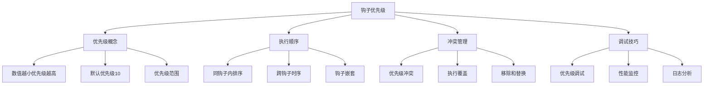
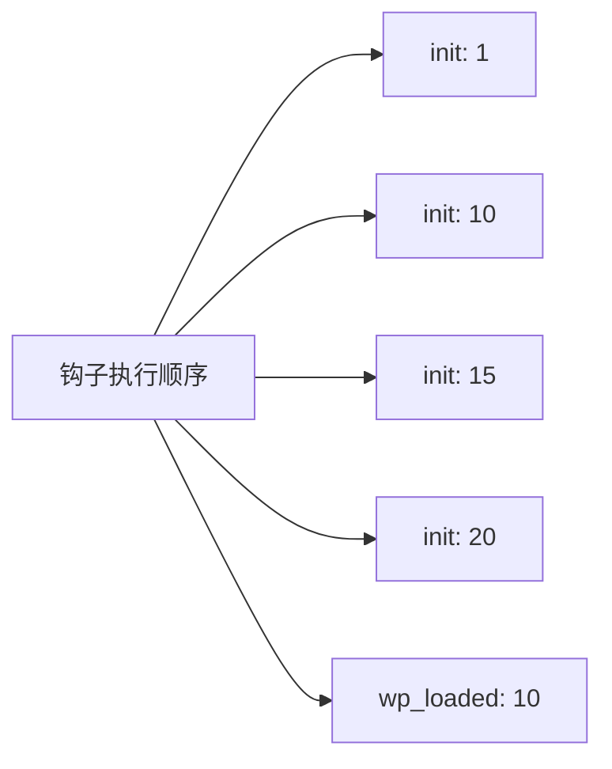

# WordPress钩子优先级管理

## 🎯 学习目标

> **认识 → 理解 → 应用**
> - **认识**：了解WordPress钩子优先级的概念和作用
> - **理解**：掌握钩子优先级的影响机制和调整策略  
> - **应用**：能够设计合理的钩子优先级和执行顺序

## 📋 知识地图



## 💡 钩子优先级认知

### 优先级基本规则

| 优先级范围 | 执行顺序 | 使用场景 | 示例 |
|------------|----------|----------|------|
| **1-9** | 最高优先级 | 核心系统、安全相关 | `add_action('init', 'core_function', 1)` |
| **10** | 默认优先级 | 标准插件、主题功能 | `add_action('init', 'standard_function')` |
| **11-19** | 高优先级 | 功能增强、布局修改 | `add_action('init', 'enhancement', 15)` |
| **20-99** | 中等优先级 | 内容处理、用户功能 | `add_action('init', 'content_process', 50)` |
| **100+** | 低优先级 | 清理、日志、分析 | `add_action('init', 'cleanup', 999)` |

### WordPress内置钩子优先级举例



### Actions钩子优先级详解

```php
<?php
/**
 * WordPress Actions钩子优先级详解
 * 控制Actions钩子的执行顺序
 */

// 1. 核心系统钩子（优先级1）
add_action('init', function() {
    echo "1. 核心初始化（优先级1）\n";
}, 1);

// 2. 插件标准钩子（优先级10，默认）
add_action('init', function() {
    echo "2. 插件标准初始化（优先级10）\n";
}, 10);

// 3. 主题增强钩子（优先级15）
add_action('init', function() {
    echo "3. 主题功能增强（优先级15）\n";
}, 15);

// 4. 内容处理钩子（优先级25）
add_action('init', function() {
    echo "4. 内容处理（优先级25）\n";
}, 25);

// 5. 用户功能钩子（优先级100）
add_action('init', function() {
    echo "5. 用户功能（优先级100）\n";
}, 100);

// 6. 清理钩子（优先级999）
add_action('init', function() {
    echo "6. 清理操作（优先级999）\n";
}, 999);
```

### Filters钩子优先级详解

```php
<?php
/**
 * WordPress Filters钩子优先级详解  
 * 数据传递和过滤的链式处理
 */

// 1. 原始数据清理（优先级1）
add_filter('the_content', function($content) {
    // 移除危险标签
    $content = wp_strip_all_tags($content, '<p><br><strong><em><a>');
    echo "1. 数据清理：移除危险标签\n";
    return $content;
}, 1);

// 2. 格式标准化（优先级5）
add_filter('the_content', function($content) {
    // 转换换行符
    $content = nl2br($content);
    echo "2. 格式标准化：转换换行符\n";
    return $content;
}, 5);

// 3. SEO优化（优先级10，默认）
add_filter('the_content', function($content) {
    // 添加关键词链接
    $keywords = get_option('site_keywords', '');
    if ($keywords) {
        $content = str_replace($keywords, '<span class="keyword">' . $keywords . '</span>', $content);
    }
    echo "3. SEO优化：添加关键词链接\n";
    return $content;
}, 10);

// 4. 功能增强（优先级20）
add_filter('the_content', function($content) {
    // 添加社交分享按钮
    $share_html = '<div class="social-share">分享按钮</div>';
    $content .= $share_html;
    echo "4. 功能增强：添加分享按钮\n";
    return $content;
}, 20);

// 5. 缓存处理（优先级较低）
add_filter('the_content', function($content) {
    // 标记为已处理
    $content = '<!-- processed -->' . $content;
    echo "5. 缓存处理：标记内容\n";
    return $content;
}, 999);
```

## 🔧 优先级冲突管理

### 钩子冲突判断

```php
<?php
/**
 * 钩子优先级冲突检测和管理
 * 解决钩子执行顺序冲突
 */

class Hook_Priority_Manager {
    
    private static $hook_registry = array();
    
    /**
     * 注册钩子优先级
     */
    public static function register_hook($hook, $callback, $priority, $source = '') {
        $key = $hook . '_' . $priority;
        
        if (isset(self::$hook_registry[$key])) {
            // 检测到优先级冲突
            self::log_conflict($hook, $priority, $callback, $source);
            
            // 自动调整优先级
            $new_priority = self::resolve_conflict($hook, $priority);
            
            self::$hook_registry[$new_priority] = array(
                'hook' => $hook,
                'callback' => $callback,
                'priority' => $new_priority,
                'source' => $source,
                'conflict_resolved' => true
            );
            
            return $new_priority;
        }
        
        self::$hook_registry[$key] = array(
            'hook' => $hook,
            'callback' => $callback,
            'priority' => $priority,
            'source' => $source
        );
        
        return $priority;
    }
    
    /**
     * 检测当前钩子注册情况
     */
    public static function detect_current_hooks() {
        global $wp_filter;
        
        foreach ($wp_filter as $hook_name => $priorities) {
            echo "<h3>钩子: {$hook_name}</h3>\n";
            
            // 按优先级排序
            $sorted_priorities = ksort($priorities->callbacks);
            
            foreach ($priorities->callbacks as $priority => $callbacks) {
                echo "<strong>优先级 {$priority}:</strong><br>\n";
                
                foreach ($callbacks as $callback_name => $callback_data) {
                    $callback_info = self::get_callback_info($callback_data);
                    echo "- {$callback_info}<br>\n";
                }
            }
        }
    }
    
    /**
     * 获取回调函数信息
     */
    private static function get_callback_info($callback_data) {
        if (is_string($callback_data['function'])) {
            return "Function: " . $callback_data['function'];
        } elseif (is_array($callback_data['function'])) {
            if (is_object($callback_data['function'][0])) {
                return "Method: " . get_class($callback_data['function'][0]) . "::" . $callback_data['function'][1];
            } else {
                return "Static Method: " . implode("::", $callback_data['function']);
            }
        } elseif ($callback_data['function'] instanceof Closure) {
            return "Closure at " . $callback_data['function']->__debugInfo()['file'] ?? 'unknown';
        }
        
        return "Unknown callback type";
    }
    
    /**
     * 记录优先级冲突
     */
    private static function log_conflict($hook, $priority, $callback, $source) {
        $conflict_info = array(
            'hook' => $hook,
            'priority' => $priority,
            'callback' => $callback,
            'source' => $source,
            'time' => current_time('Y-m-d H:i:s')
        );
        
        // 记录到error log
        error_log('Hook Priority Conflict: ' . json_encode($conflict_info));
        
        // 存储到数据库（可选）
        add_option('hook_conflicts', json_encode($conflict_info));
    }
    
    /**
     * 自动解决冲突
     */
    private static function resolve_conflict($hook, $priority) {
        // 策略1：后注册的自动降优先级
        return $priority + 1;
        
        // 策略2：基于钩子名称确定优先级
        // $priority_map = self::get_hook_priority_map();
        // return $priority_map[$hook] ?? $priority + 1;
    }
    
    /**
     * 动态调整优先级
     */
    public static function adjust_priority($hook, $callback, $old_priority, $new_priority) {
        // 移除旧优先级
        remove_action($hook, $callback, $old_priority);
        
        // 添加新优先级
        add_action($hook, $callback, $new_priority);
        
        // 更新注册信息
        $key = $hook . '_' . $old_priority;
        if (isset(self::$hook_registry[$key])) {
            unset(self::$hook_registry[$key]);
            self::$hook_registry[$hook . '_' . $new_priority] = $key;
        }
    }
}
```

### 优先级调试工具

```php
<?php
/**
 * 钩子优先级调试工具
 * 实时监控和分析钩子执行
 */

class Hook_Debugger {
    
    private static $execution_log = array();
    private static $performance_data = array();
    
    /**
     * 启用钩子调试
     */
    public static function enable_debugging() {
        if (!current_user_can('manage_options')) {
            return;
        }
        
        // 在所有钩子执行前后添加调试
        add_action('all', array(__CLASS__, 'debug_hook_pre'), 1);
        add_action('all', array(__CLASS__, 'debug_hook_post'), 999);
        
        // 在admin页面显示调试信息
        add_action('admin_notices', array(__CLASS__, 'show_debug_info'));
        
        // 添加admin页面
        add_action('admin_menu', array(__CLASS__, 'add_debug_page'));
    }
    
    /**
     * 钩子执行前调试
     */
    public static function debug_hook_pre($hook_name) {
        if (!isset(self::$execution_log[$hook_name])) {
            self::$execution_log[$hook_name] = array();
        }
        
        self::$execution_log[$hook_name]['start_time'] = microtime(true);
        self::$execution_log[$hook_name]['start_memory'] = memory_get_usage();
        
        // 记录注册的回调函数数量
        global $wp_filter;
        if (isset($wp_filter[$hook_name])) {
            $callback_count = count($wp_filter[$hook_name]->callbacks);
            self::$execution_log[$hook_name]['callback_count'] = $callback_count;
        }
    }
    
    /**
     * 钩子执行后调试
     */
    public static function debug_hook_post($hook_name) {
        if (!isset(self::$execution_log[$hook_name])) {
            return;
        }
        
        $end_time = microtime(true);
        $end_memory = memory_get_usage();
        
        $execution_data = array(
            'hook_name' => $hook_name,
            'execution_time' => $end_time - self::$execution_log[$hook_name]['start_time'],
            'memory_delta' => $end_memory - self::$execution_log[$hook_name]['start_memory'],
            'callback_count' => self::$execution_log[$hook_name]['callback_count'] ?? 0,
            'peak_memory' => memory_get_peak_usage(),
            'timestamp' => current_time('Y-m-d H:i:s')
        );
        
        self::$performance_data[] = $execution_data;
        
        // 限制数据大小，避免内存爆炸
        if (count(self::$performance_data) > 1000) {
            self::$performance_data = array_slice(self::$performance_data, -500);
        }
    }
    
    /**
     * 显示调试信息
     */
    public static function show_debug_info() {
        if (!current_user_can('manage_options')) {
            return;
        }
        
        // 检查是否启用调试模式
        if (!defined('WP_DEBUG_HOOKS') || !WP_DEBUG_HOOKS) {
            echo '<div class="notice notice-info"><p>要启用钩子调试，请在wp-config.php中添加：<code>define("WP_DEBUG_HOOKS", true);</code></p></div>';
            return;
        }
        
        // 显示最近执行的钩子
        $recent_hooks = array_slice(self::$performance_data, -20);
        
        echo '<div class="notice notice-info"><p><strong>最近执行的钩子 (最近20个)：</strong></p>';
        echo '<table border="1" style="border-collapse: collapse; width: 100%;">';
        echo '<tr><th>钩子名称</th><th>执行时间(s)</th><th>内存变化</th><th>回调数量</th></tr>';
        
        foreach (array_reverse($recent_hooks) as $hook_data) {
            echo sprintf(
                '<tr><td>%s</td><td>%.6f</td><td>%s</td><td>%d</td></tr>',
                $hook_data['hook_name'],
                $hook_data['execution_time'],
                size_format($hook_data['memory_delta']),
                $hook_data['callback_count']
            );
        }
        
        echo '</table></div>';
    }
    
    /**
     * 添加调试管理页面
     */
    public static function add_debug_page() {
        add_submenu_page(
            'tools.php',
            '钩子调试',
            '钩子调试',
            'manage_options',
            'hook-debug',
            array(__CLASS__, 'debug_page_content')
        );
    }
    
    /**
     * 调试页面内容
     */
    public static function debug_page_content() {
        ?>
        <div class="wrap">
            <h1>WordPress 钩子执行分析</h1>
            
            <h2>性能统计</h2>
            <?php self::show_performance_stats(); ?>
            
            <h2>优先级分析</h2>
            <?php self::show_priority_analysis(); ?>
            
            <h2>冲突检测</h2>
            <?php Hook_Priority_Manager::detect_current_hooks(); ?>
            
            <style>
                .hook-debug-table { border-collapse: collapse; width: 100%; }
                .hook-debug-table th, .hook-debug-table td { border: 1px solid #ddd; padding: 8px; text-align: left; }
                .hook-debug-table th { background-color: #f2f2f2; }
                .performance-good { background-color: #d4edda; }
                .performance-warning { background-color: #ffeaa7; }
                .performance-critical { background-color: #fab1a0; }
            </style>
        </div>
        <?php
    }
    
    /**
     * 显示性能统计
     */
    private static function show_performance_stats() {
        $total_hooks = count(self::$performance_data);
        $average_time = 0;
        $max_time = 0;
        $slow_hooks = array();
        
        if ($total_hooks > 0) {
            $total_time = array_sum(array_column(self::$performance_data, 'execution_time'));
            $average_time = $total_time / $total_hooks;
            $max_time = max(array_column(self::$performance_data, 'execution_time'));
            
            // 找出耗时最长的钩子
            foreach (self::$performance_data as $hook_data) {
                if ($hook_data['execution_time'] > $average_time * 2) {
                    $slow_hooks[] = $hook_data;
                }
            }
        }
        
        echo "<p><strong>总钩子数：</strong>{$total_hooks}</p>";
        echo "<p><strong>平均执行时间：</strong>" . round($average_time * 1000, 2) . "ms</p>";
        echo "<p><strong>最长执行时间：</strong>" . round($max_time * 1000, 2) . "ms</p>";
        
        if (!empty($slow_hooks)) {
            echo "<h3>性能警告钩子</h3>";
            echo "<table class='hook-debug-table'>";
            echo "<tr><th>钩子名称</th><th>执行时间(ms)</th><th>内存变化</th><th>回调数量</th></tr>";
            
            foreach ($slow_hooks as $slow_hook) {
                $class = $slow_hook['execution_time'] > $average_time * 5 ? 'performance-critical' : 'performance-warning';
                echo sprintf(
                    '<tr class="%s"><td>%s</td><td>%.2f</td><td>%s</td><td>%d</td></tr>',
                    $class,
                    $slow_hook['hook_name'],
                    $slow_hook['execution_time'] * 1000,
                    size_format($slow_hook['memory_delta']),
                    $slow_hook['callback_count']
                );
            }
            echo "</table>";
        }
    }
    
    /**
     * 显示优先级分析
     */
    private static function show_priority_analysis() {
        $priority_stats = array();
        
        foreach (self::$performance_data as $hook_data) {
            $hook_name = $hook_data['hook_name'];
            if (!isset($priority_stats[$hook_name])) {
                $priority_stats[$hook_name] = array(
                    'execution_count' => 0,
                    'total_time' => 0,
                    'avg_time' => 0
                );
            }
            
            $priority_stats[$hook_name]['execution_count']++;
            $priority_stats[$hook_name]['total_time'] += $hook_data['execution_time'];
        }
        
        // 计算平均时间
        foreach ($priority_stats as $hook_name => &$stats) {
            $stats['avg_time'] = $stats['total_time'] / $stats['execution_count'];
        }
        
        // 按平均执行时间排序
        uasort($priority_stats, function($a, $b) {
            return $b['avg_time'] <=> $a['avg_time'];
        });
        
        echo "<table class='hook-debug-table'>";
        echo "<tr><th>钩子名称</th><th>执行次数</th><th>总时间(ms)</th><th>平均时间(ms)</th></tr>";
        
        foreach ($priority_stats as $hook_name => $stats) {
            echo sprintf(
                '<tr><td>%s</td><td>%d</td><td>%.2f</td><td>%.2f</td></tr>',
                $hook_name,
                $stats['execution_count'],
                $stats['total_time'] * 1000,
                $stats['avg_time'] * 1000
            );
        }
        echo "</table>";
    }
}

// 在WordPress调试模式下启用
if (defined('WP_DEBUG') && WP_DEBUG) {
    Hook_Debugger::enable_debugging();
}
?>
```

## 🚀 优先级最佳实践

### 钩子设计原则

```php
<?php
/**
 * WordPress钩子优先级最佳实践
 * 基于场景的优先级设计指南
 */

class Hook_Priority_Best_Practices {
    
    /**
     * 基于项目阶段的优先级规划
     */
    public static function get_priority_system() {
        return array(
            // 基础设施阶段（优先级1-9）
            'infrastructure' => array(
                'priority_range' => array(1, 9),
                'hooks' => array('muplugins_loaded', 'plugins_loaded', 'init'),
                'purpose' => '核心功能和安全检查',
                'example' => 'database_cleanup, security_check'
            ),
            
            // 插件集成阶段（优先级10-19）
            'plugin_integration' => array(
                'priority_range' => array(10, 19), 
                'hooks' => array('init', 'wp_loaded', 'template_redirect'),
                'purpose' => '功能插件和第三方集成',
                'example' => 'seo_plugin_init, analytics_setup'
            ),
            
            // 主题功能阶段（优先级20-29）
            'theme_functionality' => array(
                'priority_range' => array(20, 29),
                'hooks' => array('wp_head', 'template_redirect', 'wp_enqueue_scripts'),
                'purpose' => '主题特定功能和样式处理',
                'example' => 'theme_css_enqueue, layout_customization'
            ),
            
            // 内容处理阶段（优先级30-79）
            'content_processing' => array(
                'priority_range' => array(30, 79),
                'hooks' => array('the_content', 'the_excerpt', 'the_title'),
                'purpose' => '内容修改和增强功能',
                'example' => 'auto_link_tags, content_filter'
            ),
            
            // 用户交互阶段（优先级80-99）
            'user_interaction' => array(
                'priority_range' => array(80, 99),
                'hooks' => array('wp_footer', 'login_init', 'user_register'),
                'purpose' => '用户功能和行为分析',
                'example' => 'track_user_behavior, send_notification'
            ),
            
            // 清理和优化阶段（优先级100+）
            'cleanup_optimization' => array(
                'priority_range' => array(100, 999),
                'hooks' => array('shutdown', 'wp_footer', 'admin_footer'),
                'purpose' => '缓存清理和性能优化',
                'example' => 'clear_cache, update_statistics'
            )
        );
    }
    
    /**
     * 动态优先级分配
     */
    public static function assign_dynamic_priority($hook, $callback, $function_type) {
        $priority_map = self::get_priority_system();
        
        switch ($function_type) {
            case 'security':
                return 1; // 最高优先级
                
            case 'core_function':
                return 5;
                
            case 'plugin_function':
                return 10 + rand(0, 9); // 随机分布避免冲突
                
            case 'theme_function':
                return 20 + rand(0, 9);
                
            case 'content_filter':
                return 50 + rand(0, 29);
                
            case 'user_action':
                return 80 + rand(0, 19);
                
            case 'cleanup':
            default:
                return 100 + rand(0, 899); // 低优先级
        }
    }
    
    /**
     * 钩子依赖关系管理
     */
    public static function register_dependent_hook($hook, $callback, $dependencies = array()) {
        // 检查依赖是否满足
        foreach ($dependencies as $dependency) {
            if (!did_action($dependency)) {
                // 如果依赖未执行，则延迟注册
                add_action($dependency, function() use ($hook, $callback, $dependencies) {
                    self::validate_and_register($hook, $callback, $dependencies);
                });
                return;
            }
        }
        
        self::validate_and_register($hook, $callback, $dependencies);
    }
    
    /**
     * 验证并注册钩子
     */
    private static function validate_and_register($hook, $callback, $dependencies) {
        // 检查回调函数是否存在
        if (!is_callable($callback)) {
            error_log("Failed to register hook '{$hook}': Callback is not callable");
            return false;
        }
        
        // 检查是否具备权限
        if (is_admin() && !current_user_can('manage_options')) {
            return false;
        }
        
        // 注册钩子
        add_action($hook, $callback);
        
        error_log("Successfully registered dependent hook '{$hook}'");
        return true;
    }
}
```

### 性能优化钩子管理

```php
<?php
/**
 * 钩子性能优化策略
 * 根据优先级进行性能调优
 */

class Hook_Performance_Optimizer {
    
    /**
     * 智能优先级分布
     */
    public static function optimize_execution_order($hook_name) {
        global $wp_filter;
        
        if (!isset($wp_filter[$hook_name])) {
            return;
        }
        
        $callbacks = $wp_filter[$hook_name]->callbacks;
        
        // 按执行时间对优先级进行优化排序
        $optimized_priorities = array();
        
        foreach ($callbacks as $priority => $callback_group) {
            // 估算执行成本
            $cost = self::estimate_execution_cost($callback_group);
            
            $optimized_priorities[$priority] = array(
                'callbacks' => $callback_group,
                'cost' => $cost,
                'original_priority' => $priority
            );
        }
        
        // 按成本调整为优化优先级
        uasort($optimized_priorities, function($a, $b) {
            return $a['cost'] <=> $b['cost'];
        });
        
        // 应用优化（可选）
        self::apply_optimization($hook_name, $optimized_priorities);
    }
    
    /**
     * 估算执行成本
     */
    private static function estimate_execution_cost($callback_group) {
        $total_cost = 0;
        
        foreach ($callback_group as $callback_name => $callback_data) {
            $cost = self::estimate_callback_complexity($callback_data['function']);
            $total_cost += $cost;
        }
        
        return $total_cost;
    }
    
    /**
     * 估算回调函数复杂度
     */
    private static function estimate_callback_complexity($callback) {
        if (is_string($callback)) {
            // 字符串函数名：检查是否为核心函数
            if (function_exists($callback)) {
                $reflection = new ReflectionFunction($callback);
                return $reflection->getNumberOfParameters(); // 粗略估算
            }
            return 1;
        } elseif (is_array($callback)) {
            // 类方法：基于方法名估算
            return 2;
        } elseif ($callback instanceof Closure) {
            // 闭包：默认为中等复杂度
            return 1.5;
        }
        
        return 1; // 默认成本
    }
    
    /**
     * 应用优化策略
     */
    private static function apply_optimization($hook_name, $optimized_priorities) {
        // 在开发环境下记录优化建议
        if (defined('WP_DEBUG') && WP_DEBUG) {
            $optimization_log = sprintf(
                "Hook optimization suggestion for '%s':\n%s",
                $hook_name,
                json_encode($optimized_priorities, JSON_PRETTY_PRINT)
            );
            error_log($optimization_log);
        }
    }
    
    /**
     * 批量优先级管理
     */
    public static function batch_priority_management($hooks_config) {
        foreach ($hooks_config as $hook_config) {
            $hook_name = $hook_config['hook'];
            $hooks = $hook_config['hooks'];
            $base_priority = $hook_config['base_priority'];
            
            foreach ($hooks as $index => $hook_func) {
                $priority = $base_priority + ($index * 10); // 每个钩子间隔10
                
                if (is_callable($hook_func)) {
                    add_action($hook_name, $hook_func, $priority);
                }
            }
        }
    }
}
```

## 🎯 刻意练习项目

### 练习1：钩子链式优化
**目标**：设计高效的钩子执行链
**技能点**：优先级计算、依赖管理、性能监控

### 练习2：插件兼容性管理  
**目标**：解决多个插件的钩子冲突
**技能点**：冲突检测、自动修复、兼容性处理

### 练习3：动态优先级系统
**目标**：基于运行时条件的优先级调整
**技能点**：智能调优、条件执行、自适应管理

## 🔗 拓展学习链接

### 进阶主题
- [[Actions钩子]] - WordPress事件处理机制
- [[Filters钩子]] - WordPress数据过滤机制
- [[钩子机制练习]] - 综合钩子开发实战

### 相关技术
- [[性能优化]] - 钩子系统性能调优
- [[安全防护]] - 钩子安全最佳实践

### 实战应用
- [[插件开发基础]] - 钩子在插件中的应用
- [[主题开发基础]] - 钩子在主题中的应用

---

## 💬 知识检查

**理解检验**：
1. WordPress钩子优先级的数值含义是什么？
2. 如何处理多个钩子在同一优先级上的冲突？
3. 如何调试钩子的执行顺序和性能问题？

**应用检验**：
1. 能够设计合理的钩子优先级体系
2. 理解钩子执行顺序对功能的影响
3. 掌握钩子性能优化和调试技巧

### 故障排除

#### 常见优先级问题

| 问题 | 原因 | 解决方案 |
|------|------|----------|
| **钩子不执行** | 优先级过高被覆盖 | 调整优先级或检查冲突 |
| **执行顺序错误** | 优先级设置不当 | 重新设计优先级体系 |
| **性能问题** | 钩子过多或复杂度高 | 优化钩子逻辑和排序 |

**下一步学习**：[[自定义钩子]] → 学习创建高级自定义钩子系统
