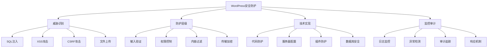
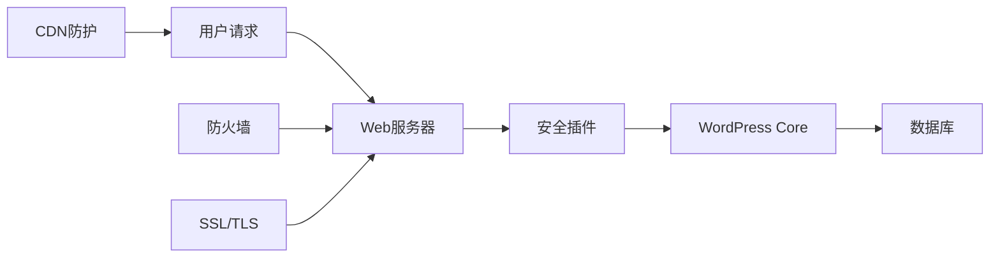

# WordPress安全防护详解

## 🎯 学习目标

> **认识 → 理解 → 应用**
> - **认识**：了解WordPress面临的安全威胁和防护基础
> - **理解**：掌握安全防护的技术原理和实现方法
> - **应用**：能够建设完整的多层安全防护体系

## 📋 知识地图



## 💡 WordPress安全威胁认知

### 主要安全威胁对比

| 威胁类型 | 攻击原理 | 影响范围 | 防护难度 | 危害级别 |
|----------|----------|----------|----------|----------|
| **SQL注入** | 恶意SQL代码注入 | 数据库 | 中等 | ⭐⭐⭐⭐⭐ |
| **XSS跨站** | 脚本注入攻击 | 用户浏览器 | 中等 | ⭐⭐⭐⭐ |
| **CSRF伪造** | 跨站请求伪造 | 用户会话 | 简单 | ⭐⭐⭐ |
| **文件上传** | 恶意文件上传 | 服务器文件系统 | 中等 | ⭐⭐⭐⭐⭐ |
| **暴力破解** | 用户名密码枚举 | 用户账户 | 简单 | ⭐⭐⭐ |

### WordPress安全架构



## 🔧 核心安全防护理解

### 输入验证和安全清理

```php
<?php
/**
 * WordPress输入验证和安全清理系统
 * 多层次数据验证和防护机制
 */

class WordPress_Security_Sanitizer {
    
    /**
     * 高级输入验证类
     */
    class Advanced_Input_Validator {
        
        private static $validation_rules = array();
        
        /**
         * 注册字段验证规则
         */
        public static function register_validation_rule($field_name, $rules) {
            self::$validation_rules[$field_name] = $rules;
        }
        
        /**
         * 验证单个字段
         */
        public static function validate_field($field_name, $value, $context = 'input') {
            if (!isset(self::$validation_rules[$field_name])) {
                return self::default_validation($value, $context);
            }
            
            $rules = self::$validation_rules[$field_name];
            return self::apply_validation_rules($value, $rules);
        }
        
        /**
         * 应用自定义验证规则
         */
        private static function apply_validation_rules($value, $rules) {
            foreach ($rules as $rule_type => $rule_value) {
                switch ($rule_type) {
                    case 'required':
                        if ($rule_value && empty($value)) {
                            return new WP_Error('required_field', 'Field is required');
                        }
                        break;
                        
                    case 'type':
                        if (!self::validate_type($value, $rule_value)) {
                            return new WP_Error('invalid_type', 'Invalid data type');
                        }
                        break;
                        
                    case 'length':
                        $length = strlen($value);
                        if (isset($rule_value['min']) && $length < $rule_value['min']) {
                            return new WP_Error('min_length', 'Value too short');
                        }
                        if (isset($rule_value['max']) && $length > $rule_value['max']) {
                            return new WP_Error('max_length', 'Value too long');
                        }
                        break;
                        
                    case 'pattern':
                        if (!preg_match($rule_value, $value)) {
                            return new WP_Error('pattern_mismatch', 'Value does not match pattern');
                        }
                        break;
                        
                    case 'allowed_values':
                        if (!in_array($value, $rule_value)) {
                            return new WP_Error('disallowed_value', 'Value not allowed');
                        }
                        break;
                        
                    case 'sanitize':
                        $value = self::apply_sanitization($value, $rule_value);
                        break;
                }
            }
            
            return $value;
        }
        
        /**
         * 验证数据类型
         */
        private static function validate_type($value, $type) {
            switch ($type) {
                case 'email':
                    return is_email($value);
                case 'url':
                    return filter_var($value, FILTER_VALIDATE_URL) !== false;
                case 'integer':
                    return is_numeric($value) && !strpos($value, '.');
                case 'float':
                    return is_numeric($value);
                case 'phone':
                    return preg_match('/^[0-9\-\(\)\s\+\+\/]+$/', $value);
                case 'date':
                    return strtotime($value) !== false;
                default:
                    return true;
            }
        }
        
        /**
         * 应用清理规则
         */
        private static function apply_sanitization($value, $sanitize_rules) {
            foreach ($sanitize_rules as $rule) {
                switch ($rule) {
                    case 'text':
                        $value = sanitize_text_field($value);
                        break;
                    case 'html':
                        $value = wp_kses_post($value);
                        break;
                    case 'email':
                        $value = sanitize_email($value);
                        break;
                    case 'url':
                        $value = esc_url_raw($value);
                        break;
                    case 'alphanumeric':
                        $value = preg_replace('/[^a-zA-Z0-9]/', '', $value);
                        break;
                    case 'strip_tags':
                        $value = strip_tags($value);
                        break;
                    case 'trim':
                        $value = trim($value);
                        break;
                }
            }
            
            return $value;
        }
    }
    
    /**
     * SQL注入防护
     */
    class SQL_Injection_Protection {
        
        /**
         * 安全的数据库查询包装器
         */
        public static function secure_query($sql_template, $params = array()) {
            global $wpdb;
            
            // 验证SQL模板安全性
            if (!self::validate_sql_template($sql_template)) {
                return new WP_Error('unsafe_sql', 'SQL template contains unsafe patterns');
            }
            
            // 转义所有参数
            $escaped_params = array_map(function($param) {
                return $wpdb->_escape($param);
            }, $params);
            
            // 使用准备语句
            if ($sql_template === str_replace('%s', '%s', $sql_template)) {
                // 简单的参数替换
                $sql = sprintf($sql_template, ...$escaped_params);
            } else {
                // 使用WordPress准备语句
                $sql = $wpdb->prepare($sql_template, $params);
            }
            
            return $sql;
        }
        
        /**
         * 验证SQL模板安全性
         */
        private static function validate_sql_template($template) {
            // 禁止危险SQL关键字
            $dangerous_keywords = array(
                'drop table', 'delete from', 'truncate', 'alter table',
                'create table', 'insert into', 'update set'
            );
            
            $lower_template = strtolower($template);
            
            foreach ($dangerous_keywords as $keyword) {
                if (strpos($lower_template, $keyword) !== false) {
                    // 记录安全警告
                    self::log_security_warning('dangerous_sql', $template);
                    return false;
                }
            }
            
            return true;
        }
        
        /**
         * 记录安全警告
         */
        private static function log_security_warning($type, $data) {
            error_log("Security Warning [{$type}]: " . json_encode(array(
                'ip' => $_SERVER['REMOTE_ADDR'] ?? 'unknown',
                'user_agent' => $_SERVER['HTTP_USER_AGENT'] ?? 'unknown',
                'data' => $data,
                'timestamp' => current_time('Y-m-d H:i:s')
            )));
        }
    }
    
    /**
     * XSS防护系统
     */
    class XSS_Protection {
        
        /**
         * 清理用户输入防止XSS
         */
        public static function sanitize_user_input($input, $allowed_tags = null) {
            if (is_array($input)) {
                return array_map(function($item) use ($allowed_tags) {
                    return self::sanitize_user_input($item, $allowed_tags);
                }, $input);
            }
            
            // 检查恶意脚本模式
            if (self::detect_malicious_script($input)) {
                self::log_xss_attempt($input);
                return '';
            }
            
            // 使用WordPress清理函数
            if (is_null($allowed_tags)) {
                // 默认允许的HTML标签
                $allowed_tags = array(
                    'p' => array(),
                    'br' => array(),
                    'strong' => array(),
                    'em' => array(),
                    'a' => array('href' => array(), 'title' => array()),
                    'img' => array('src' => array(), 'alt' => array(), 'width' => array(), 'height' => array())
                );
            }
            
            return wp_kses($input, $allowed_tags);
        }
        
        /**
         * 检测恶意脚本
         */
        private static function detect_malicious_script($input) {
            $dangerous_patterns = array(
                '/<script[^>]*>.*?<\/script>/i',
                '/javascript:/i',
                '/on\w+\s*=/i',
                '/vbscript:/i',
                '/data:text\/html/i',
                '/expression\s*\(/i'
            );
            
            foreach ($dangerous_patterns as $pattern) {
                if (preg_match($pattern, $input)) {
                    return true;
                }
            }
            
            return false;
        }
        
        /**
         * 记录XSS攻击尝试
         */
        private static function log_xss_attempt($malicious_input) {
            error_log("XSS Attack Attempt: " . json_encode(array(
                'ip' => $_SERVER['REMOTE_ADDR'] ?? 'unknown',
                'user_agent' => $_SERVER['HTTP_USER_AGENT'] ?? 'unknown',
                'malicious_input' => $malicious_input,
                'timestamp' => current_time('Y-m-d H:i:s'),
                'referer' => $_SERVER['HTTP_REFERER'] ?? 'unknown'
            )));
            
            // 更新安全统计
            self::update_security_stats('xss_attempts');
        }
        
        /**
         * 更新安全统计
         */
        private static function update_security_stats($stat_type) {
            $stats = get_option('security_stats', array());
            $stats[$stat_type] = ($stats[$stat_type] ?? 0) + 1;
            $stats['last_updated'] = current_time('mysql');
            update_option('security_stats', $stats);
        }
    }
}

// 注册验证规则示例
Advanced_Input_Validator::register_validation_rule('user_email', array(
    'required' => true,
    'type' => 'email',
    'sanitize' => array('trim', 'email')
));

Advanced_Input_Validator::register_validation_rule('user_phone', array(
    'type' => 'phone',
    'length' => array('min' => 10, 'max' => 15),
    'sanitize' => array('alphanumeric')
));
?>
```

### CSRF和权限控制

```php
<?php
/**
 * CSRF防护和高级权限控制
 * WordPress安全加固组件
 */

class WordPress_Security_Hardening {
    
    /**
     * CSRF Token管理系统
     */
    class CSRF_Token_Manager {
        
        private static $token_storage = 'options'; // options | db | transient
        
        /**
         * 生成CSRF Token
         */
        public static function generate_token($action = 'default') {
            $user_id = get_current_user_id();
            $nonce_string = wp_create_nonce("csrf_{$action}_{$user_id}");
            
            // 添加时间戳和用户标记
            $token_data = array(
                'nonce' => $nonce_string,
                'action' => $action,
                'user_id' => $user_id,
                'created_at' => time(),
                'ip' => $_SERVER['REMOTE_ADDR'] ?? 'unknown'
            );
            
            // 存储Token
            $token_id = 'csrf_token_' . md5($nonce_string);
            self::store_token($token_id, $token_data);
            
            return $token_id;
        }
        
        /**
         * 验证CSRF Token
         */
        public static function verify_token($token_id, $action = null) {
            $token_data = self::get_token($token_id);
            
            if (!$token_data) {
                return false;
            }
            
            // 验证时间戳（Token有效期24小时）
            if (time() - $token_data['created_at'] > 86400) {
                self::delete_token($token_id);
                return false;
            }
            
            // 验证用户ID
            if ($token_data['user_id'] !== get_current_user_id()) {
                return false;
            }
            
            // 验证IP地址的一致性（可选）
            $current_ip = $_SERVER['REMOTE_ADDR'] ?? 'unknown';
            if ($token_data['ip'] !== $current_ip) {
                // 记录IP变更
                self::log_ip_change($token_data['ip'], $current_ip);
            }
            
            // 验证WordPress nonce
            return wp_verify_nonce($token_data['nonce'], "csrf_{$token_data['action']}_{$token_data['user_id']}");
        }
        
        /**
         * 存储Token
         */
        private static function store_token($token_id, $token_data) {
            switch (self::$token_storage) {
                case 'transient':
                    set_transient($token_id, $token_data, 86400); // 24小时
                    break;
                    
                case 'db':
                    global $wpdb;
                    $wpdb->insert(
                        $wpdb->prefix . 'csrf_tokens',
                        array(
                            'token_id' => $token_id,
                            'token_data' => serialize($token_data),
                            'created_at' => current_time('mysql')
                        ),
                        array('%s', '%s', '%s')
                    );
                    break;
                    
                default:
                    $tokens = get_option('csrf_tokens', array());
                    $tokens[$token_id] = $token_data;
                    update_option('csrf_tokens', $tokens);
                    break;
            }
        }
        
        /**
         * 获取Token
         */
        private static function get_token($token_id) {
            switch (self::$token_storage) {
                case 'transient':
                    return get_transient($token_id);
                    
                case 'db':
                    global $wpdb;
                    $result = $wpdb->get_var($wpdb->prepare(
                        "SELECT token_data FROM {$wpdb->prefix}csrf_tokens WHERE token_id = %s",
                        $token_id
                    ));
                    return $result ? unserialize($result) : false;
                    
                default:
                    $tokens = get_option('csrf_tokens', array());
                    return $tokens[$token_id] ?? false;
            }
        }
        
        /**
         * 删除Token
         */
        private static function delete_token($token_id) {
            switch (self::$token_storage) {
                case 'transient':
                    delete_transient($token_id);
                    break;
                    
                case 'db':
                    global $wpdb;
                    $wpdb->delete(
                        $wpdb->prefix . 'csrf_tokens',
                        array('token_id' => $token_id),
                        array('%s')
                    );
                    break;
                    
                default:
                    $tokens = get_option('csrf_tokens', array());
                    unset($tokens[$token_id]);
                    update_option('csrf_tokens', $tokens);
                    break;
            }
        }
    }
    
    /**
     * 高级文件上传安全
     */
    class Secure_File_Upload {
        
        private static $allowed_extensions = array('jpg', 'jpeg', 'png', 'gif', 'pdf', 'doc', 'docx', 'txt');
        private static $allowed_mime_types = array(
            'image/jpeg', 'image/png', 'image/gif',
            'application/pdf', 'application/msword',
            'application/vnd.openxmlformats-officedocument.wordprocessingml.document',
            'text/plain'
        );
        private static $max_file_size = 5242880; // 5MB
        
        /**
         * 验证上传文件
         */
        public static function validate_upload($file, $attachment_id = null) {
            $errors = array();
            
            // 检查文件大小
            if ($file['size'] > self::$max_file_size) {
                $errors[] = 'File size too large';
            }
            
            // 检查文件扩展名
            $file_extension = strtolower(pathinfo($file['name'], PATHINFO_EXTENSION));
            if (!in_array($file_extension, self::$allowed_extensions)) {
                $errors[] = 'File type not allowed';
            }
            
            // 检查MIME类型
            $finfo = finfo_open(FILEINFO_MIME_TYPE);
            $mime_type = finfo_file($finfo, $file['tmp_name']);
            finfo_close($finfo);
            
            if (!in_array($mime_type, self::$allowed_mime_types)) {
                $errors[] = 'MIME type not allowed';
            }
            
            // 检查文件名安全性
            if (!self::is_filename_safe($file['name'])) {
                $errors[] = 'Unsafe filename detected';
            }
            
            // 扫描文件内容（如果支持）
            if (!self::scan_file_content($file['tmp_name'])) {
                $errors[] = 'Malicious content detected';
            }
            
            if (!empty($errors)) {
                self::log_upload_violation($file, $errors);
                return new WP_Error('upload_security', implode(', ', $errors));
            }
            
            return true;
        }
        
        /**
         * 检查文件名安全性
         */
        private static function is_filename_safe($filename) {
            // 检查危险字符
            $dangerous_chars = array('..', '/', '\\', '<', '>', ':', '"', '|', '?', '*');
            
            foreach ($dangerous_chars as $char) {
                if (strpos($filename, $char) !== false) {
                    return false;
                }
            }
            
            // 检查是否为可执行文件伪装
            $extension = strtolower(pathinfo($filename, PATHINFO_EXTENSION));
            $executable_extensions = array('php', 'php3', 'php4', 'php5', 'phtml', 'exe', 'bat', 'cmd');
            
            if (in_array($extension, $executable_extensions)) {
                return false;
            }
            
            return true;
        }
        
        /**
         * 扫描文件内容
         */
        private static function scan_file_content($file_path) {
            // 读取文件前部分内容
            $file_handle = fopen($file_path, 'rb');
            $file_content = fread($file_handle, 2048); // 读取前2KB
            fclose($file_handle);
            
            // 检查恶意脚本模式
            $malicious_patterns = array(
                '/<\\?php/i',
                '/eval\\s*\\(/i',
                '/base64_decode/i',
                '/shell_exec/i',
                '/system\\s*\\(/i',
                '/exec\\s*\\(/i'
            );
            
            foreach ($malicious_patterns as $pattern) {
                if (preg_match($pattern, $file_content)) {
                    return false;
                }
            }
            
            return true;
        }
        
        /**
         * 记录上传违规行为
         */
        private static function log_upload_violation($file, $errors) {
            error_log("Security Violation - File Upload: " . json_encode(array(
                'filename' => $file['name'],
                'size' => $file['size'],
                'type' => $file['type'],
                'errors' => $errors,
                'ip' => $_SERVER['REMOTE_ADDR'] ?? 'unknown',
                'user_agent' => $_SERVER['HTTP_USER_AGENT'] ?? 'unknown',
                'timestamp' => current_time('Y-m-d H:i:s')
            )));
        }
    }
    
    /**
     * 登录安全强化
     */
    class Login_Security_Enhancement {
        
        /**
         * 强制2FA双因素认证
         */
        public static function enforce_2fa($user_id) {
            // 检查用户是否设置了2FA
            $has_2fa = get_user_meta($user_id, '2fa_enabled', true);
            
            if (!$has_2fa && current_user_can('administrator')) {
                // 管理员必须启用2FA
                wp_redirect(add_query_arg('require_2fa', '1', wp_login_url()));
                exit;
            }
        }
        
        /**
         * 登录尝试限制
         */
        public static function limit_login_attempts($username, $password) {
            $ip = $_SERVER['REMOTE_ADDR'] ?? 'unknown';
            $transient_key = "login_attempts_{$ip}";
            
            $attempts = get_transient($transient_key) ?: 0;
            
            if ($attempts >= 5) { // 最多5次尝试
                // 计算锁定时间（指数退避）
                $lockout_time = pow(2, $attempts - 5) * 60; // 1分钟，2分钟，4分钟...
                set_transient("login_lockout_{$ip}", true, $lockout_time);
                
                return new WP_Error('too_many_attempts', "Too many login attempts. Locked for {$lockout_time} seconds.");
            }
            
            return null;
        }
        
        /**
         * 记录登录尝试
         */
        public static function log_login_attempt($username, $ip, $success = false) {
            global $wpdb;
            
            $wpdb->insert(
                $wpdb->prefix . 'login_log',
                array(
                    'username' => $username,
                    'ip_address' => $ip,
                    'success' => $success ? 1 : 0,
                    'user_agent' => $_SERVER['HTTP_USER_AGENT'] ?? 'unknown',
                    'timestamp' => current_time('mysql')
                ),
                array('%s', '%s', '%d', '%s', '%s')
            );
        }
    }
}
?>
```

## 🚀 高级安全应用

### 实时安全监控系统

```php
<?php
/**
 * WordPress实时安全监控和响应系统
 * 智能威胁检测和自动响应机制
 */

class Advanced_Security_Monitor {
    
    private static $threat_levels = array('low', 'medium', 'high', 'critical');
    
    /**
     * 威胁检测引擎
     */
    class Threat_Detection_Engine {
        
        /**
         * 分析请求特征
         */
        public static function analyze_request() {
            $request_data = array(
                'ip' => $_SERVER['REMOTE_ADDR'] ?? 'unknown',
                'user_agent' => $_SERVER['HTTP_USER_AGENT'] ?? 'unknown',
                'uri' => $_SERVER['REQUEST_URI'] ?? '',
                'method' => $_SERVER['REQUEST_METHOD'] ?? '',
                'referer' => $_SERVER['HTTP_REFERER'] ?? '',
                'timestamp' => current_time('Y-m-d H:i:s')
            );
            
            $threat_score = 0;
            $threat_indicators = array();
            
            // URL攻击模式检测
            if (self::detect_url_attack_patterns($request_data['uri'])) {
                $threat_score += 30;
                $threat_indicators[] = 'URL attack pattern detected';
            }
            
            // User Agent检测
            if (self::analyze_suspicious_user_agent($request_data['user_agent'])) {
                $threat_score += 20;
                $threat_indicators[] = 'Suspicious User Agent';
            }
            
            // IP信誉检测
            if (self::check_ip_reputation($request_data['ip'])) {
                $threat_score += 25;
                $threat_indicators[] = 'Low reputation IP';
            }
            
            // 请求频率检测
            if (self::detect_request_rate_abnormal($request_data['ip'])) {
                $threat_score += 35;
                $threat_indicators[] = 'Abnormal request rate';
            }
            
            // 地理位置异常检测
            if (self::detect_geo_anomaly($request_data['ip'])) {
                $threat_score += 15;
                $threat_indicators[] = 'Geographic anomaly';
            }
            
            $threat_level = self::calculate_threat_level($threat_score);
            
            return array(
                'threat_score' => $threat_score,
                'threat_level' => $threat_level,
                'indicators' => $threat_indicators,
                'request_data' => $request_data,
                'action_required' => $threat_level !== 'low' ? true : false
            );
        }
        
        /**
         * 检测URL攻击模式
         */
        private static function detect_url_attack_patterns($uri) {
            $attack_patterns = array(
                '/\\.\\./', // 目录遍历
                '/script.*?>/i', // XSS尝试
                '/union.*select/i', // SQL注入
                '/wp-admin.*admin/i', // 管理员访问尝试
                '/wp-config/i', // 配置文件访问
                '/proc.*self/i', // 系统文件访问
                '/\\$\\{.*\\}/', // RCE尝试
                '/eval.*\\(/', // 代码注入
            );
            
            foreach ($attack_patterns as $pattern) {
                if (preg_match($pattern, $uri)) {
                    return true;
                }
            }
            
            return false;
        }
        
        /**
         * 分析可疑的User Agent
         */
        private static function analyze_suspicious_user_agent($user_agent) {
            $suspicious_patterns = array(
                '/bot|crawler|spider/i',
                '/sqlmap|nikto|nmap/i',
                '/python-requests|curl|wget/i',
                '/scanner|exploit|hack/i'
            );
            
            foreach ($suspicious_patterns as $pattern) {
                if (preg_match($pattern, $user_agent)) {
                    return true;
                }
            }
            
            return false;
        }
        
        /**
         * 检查IP信誉
         */
        private static function check_ip_reputation($ip) {
            // 获取已知恶意IP列表
            $blacklisted_ips = get_option('security_blacklist_ips', array());
            
            if (in_array($ip, $blacklisted_ips)) {
                return true;
            }
            
            // 检查内网IP
            if (filter_var($ip, FILTER_VALIDATE_IP, FILTER_FLAG_FLAG_NO_PRIV_RANGE | FILTER_FLAG_FLAG_NO_RES_RANGE)) {
                return false;
            }
            
            // 这里是内网IP，需要额外检查
            return false;
        }
        
        /**
         * 检测请求频率异常
         */
        private static function detect_request_rate_abnormal($ip) {
            $transient_key = "request_rate_{$ip}";
            $current_count = get_transient($transient_key) ?: 0;
            
            $current_count++;
            set_transient($transient_key, $current_count, 60); // 1分钟计数器
            
            // 如果1分钟内超过30个请求，认为异常
            return $current_count > 30;
        }
        
        /**
         * 检测地理位置异常
         */
        private static function detect_geo_anomaly($ip) {
            // 获取常见访问国家/地区
            $common_countries = get_option('security_common_countries', array());
            
            // 使用IP地理位置服务（需要API密钥）
            $geo_data = self::get_ip_geolocation($ip);
            
            if ($geo_data && !in_array($geo_data['country'], $common_countries)) {
                return true;
            }
            
            return false;
        }
        
        /**
         * 获取IP地理位置
         */
        private static function get_ip_geolocation($ip) {
            // 这里应该调用实际的地理位置API
            // 例如：ipapi.co, ipstack.com, maxmind等
            $api_key = get_option('geoip_api_key', '');
            
            if (empty($api_key)) {
                return null;
            }
            
            $response = wp_remote_get("http://api.ipstack.com/{$ip}?access_key={$api_key}");
            
            if (is_wp_error($response)) {
                return null;
            }
            
            $body = wp_remote_retrieve_body($response);
            return json_decode($body, true);
        }
        
        /**
         * 计算威胁等级
         */
        private static function calculate_threat_level($score) {
            if ($score >= 80) return 'critical';
            if ($score >= 60) return 'high';
            if ($score >= 40) return 'medium';
            return 'low';
        }
    }
    
    /**
     * 自动安全响应系统
     */
    class Auto_Security_Response {
        
        /**
         * 处理安全威胁
         */
        public static function handle_threat($threat_analysis) {
            $threat_level = $threat_analysis['threat_level'];
            $ip = $threat_analysis['request_data']['ip'];
            
            switch ($threat_level) {
                case 'critical':
                    self::critical_threat_response($ip, $threat_analysis);
                    break;
                    
                case 'high':
                    self::high_threat_response($ip, $threat_analysis);
                    break;
                    
                case 'medium':
                    self::medium_threat_response($ip, $threat_analysis);
                    break;
                    
                default:
                    self::low_threat_response($ip, $threat_analysis);
                    break;
            }
        }
        
        /**
         * 关键威胁响应
         */
        private static function critical_threat_response($ip, $threat_analysis) {
            // 立即IP封锁
            self::block_ip($ip, 'critical_threat', 86400 * 7); // 7天封锁
            
            // 发送紧急告警
            self::send_security_alert('Critical threat detected', $threat_analysis);
            
            // 记录安全日志
            self::log_security_event('critical_threat', $threat_analysis);
            
            // 可能触发WordPress维护模式
            self::enable_emergency_mode();
        }
        
        /**
         * 高威胁响应
         */
        private static function high_threat_response($ip, $threat_analysis) {
            // 临时IP限制
            self::rate_limit_ip($ip, 60); // 限制1分钟
            
            // 增强监控
            self::increase_monitoring($ip);
            
            // 发送告警邮件
            self::send_security_alert('High threat detected', $threat_analysis);
        }
        
        /**
         * 中威胁响应
         */
        private static function medium_threat_response($ip, $threat_analysis) {
            // 记录威胁事件
            self::log_security_event('medium_threat', $threat_analysis);
            
            // 增加CAPTCHA验证
            self::require_verification($ip);
        }
        
        /**
         * 低威胁响应
         */
        private static function low_threat_response($ip, $threat_analysis) {
            // 仅记录日志
            self::log_security_event('low_threat', $threat_analysis);
        }
        
        /**
         * IP封锁功能
         */
        private static function block_ip($ip, $reason, $duration) {
            $blocked_ips = get_option('security_blocked_ips', array());
            
            $blocked_ips[$ip] = array(
                'reason' => $reason,
                'blocked_at' => current_time('mysql'),
                'expires_at' => date('Y-m-d H:i:s', time() + $duration),
                'attempts' => ($blocked_ips[$ip]['attempts'] ?? 0) + 1
            );
            
            update_option('security_blocked_ips', $blocked_ips);
            
            // 添加到.htaccess（如果支持）
            self::add_to_htaccess($ip);
        }
        
        /**
         * 发送安全告警
         */
        private static function send_security_alert($subject, $threat_data) {
            $admin_email = get_option('admin_email');
            $message = "Security Alert: {$subject}\n\n";
            $message .= "Threat Level: " . $threat_data['threat_level'] . "\n";
            $message .= "IP Address: " . $threat_data['request_data']['ip'] . "\n";
            $message .= "Threat Indicators: " . implode(', ', $threat_data['indicators']) . "\n";
            $message .= "Timestamp: " . $threat_data['request_data']['timestamp'] . "\n";
            
            wp_mail($admin_email, "[SECURITY] {$subject}", $message);
        }
        
        /**
         * 记录安全事件
         */
        private static function log_security_event($event_type, $threat_data) {
            global $wpdb;
            
            $wpdb->insert(
                $wpdb->prefix . 'security_log',
                array(
                    'event_type' => $event_type,
                    'ip_address' => $threat_data['request_data']['ip'],
                    'threat_level' => $threat_data['threat_level'],
                    'threat_score' => $threat_data['threat_score'],
                    'user_agent' => $threat_data['request_data']['user_agent'],
                    'request_uri' => $threat_data['request_data']['uri'],
                    'indicators' => json_encode($threat_data['indicators']),
                    'timestamp' => current_time('mysql')
                ),
                array('%s', '%s', '%s', '%d', '%s', '%s', '%s', '%s')
            );
        }
    }
    
    /**
     * 安全事件初始化
     */
    public static function init() {
        // 在所有WordPress请求开始时检查安全威胁
        add_action('init', array(__CLASS__, 'security_check'), 1);
        
        // 添加管理页面
        add_action('admin_menu', array(__CLASS__, 'add_security_dashboard'));
        
        // 清理过期数据和监控缓存
        add_action('wp_scheduled_delete', array(__CLASS__, 'cleanup_security_data'));
    }
    
    /**
     * 安全检查入口
     */
    public static function security_check() {
        // 跳过AJAX和Cron请求的安全检查
        if (wp_doing_ajax() || wp_doing_cron()) {
            return;
        }
        
        $threat_analysis = Threat_Detection_Engine::analyze_request();
        
        if ($threat_analysis['action_required']) {
            Auto_Security_Response::handle_threat($threat_analysis);
        }
        
        // 检查是否被封锁的IP
        $ip = $_SERVER['REMOTE_ADDR'] ?? 'unknown';
        $blocked_ips = get_option('security_blocked_ips', array());
        
        if (isset($blocked_ips[$ip])) {
            $block_info = $blocked_ips[$ip];
            
            // 检查是否仍在封锁期内
            if (strtotime($block_info['expires_at']) > time()) {
                self::handle_blocked_request($block_info);
            } else {
                // 解除过期封锁
                unset($blocked_ips[$ip]);
                update_option('security_blocked_ips', $blocked_ips);
            }
        }
    }
    
    /**
     * 处理被封锁的请求
     */
    private static function handle_blocked_request($block_info) {
        status_header(403);
        ?>
        <!DOCTYPE html>
        <html>
        <head>
            <title>Access Denied</title>
        </head>
        <body>
            <h1>Access Denied</h1>
            <p>Your IP address has been blocked due to suspicious activity.</p>
            <p>Reason: <?php echo esc_html($block_info['reason']); ?></p>
            <p>Block expires: <?php echo esc_html(date('Y-m-d H:i:s', strtotime($block_info['expires_at']))); ?></p>
        </body>
        </html>
        <?php
        exit;
    }
}

// 初始化安全监控系统
Advanced_Security_Monitor::init();
?>
```

## 🎯 刻意练习项目

### 练习1：多层安全防护系统
**目标**：创建完整的WordPress安全防护体系
**技能点**：输入验证、权限控制、威胁检测、自动响应

### 练习2：安全审计工具开发
**目标**：开发WordPress网站安全扫描和审计工具
**技能点**：漏洞扫描、安全评估、合规检查

### 练习3：安全意识培训系统
**目标**：为用户和开发者创建安全知识和培训内容
**技能点**：教育内容、交互式培训、知识检测

## 🔗 拓展学习链接

### 进阶主题
- [[性能优化]] - 安全与性能的平衡
- [[插件开发基础]] - 安全插件开发实践
- [[API开发]] - API安全最佳实践

### 相关技术
- [[钩子机制]] - 安全钩子的设计和实现
- [[数据库配置]] - 数据库安全防护
- [[部署运维]] - 服务器安全配置

### 实战应用
- [[安全项目实战]] - 企业级安全解决方案
- [[性能优化项目]] - 安全和性能双重优化

---

## 💬 知识检查

**理解检验**：
1. WordPress常见的安全威胁有哪些？如何防护？
2. 多层安全防护的架构设计原则是什么？
3. 实时安全监控系统的工作原理？

**应用检验**：
1. 能够设计和实现完整的安全防护体系
2. 理解威胁检测和自动响应机制
3. 掌握安全事件分析和响应流程

### 故障排除

#### 常见安全问题

| 问题 | 原因 | 解决方案 |
|------|------|----------|
| **SQL注入** | 未使用准备语句 | 使用$wpdb->prepare()或参数化查询 |
| **XSS攻击** | 未转义输出 | 使用esc_html()、wp_kses()等函数 |
| **CSRF攻击** | 缺少nonce验证 | 添加wp_nonce_field和验证 |
| **文件上传** | 验证不足 | 限制文件类型、大小和内容扫描 |

**下一步学习**：[[性能优化]] → 掌握WordPress性能优化和监控技术
