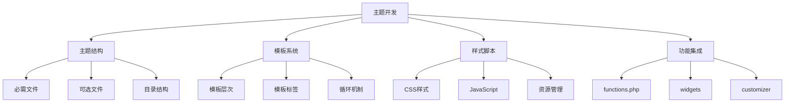
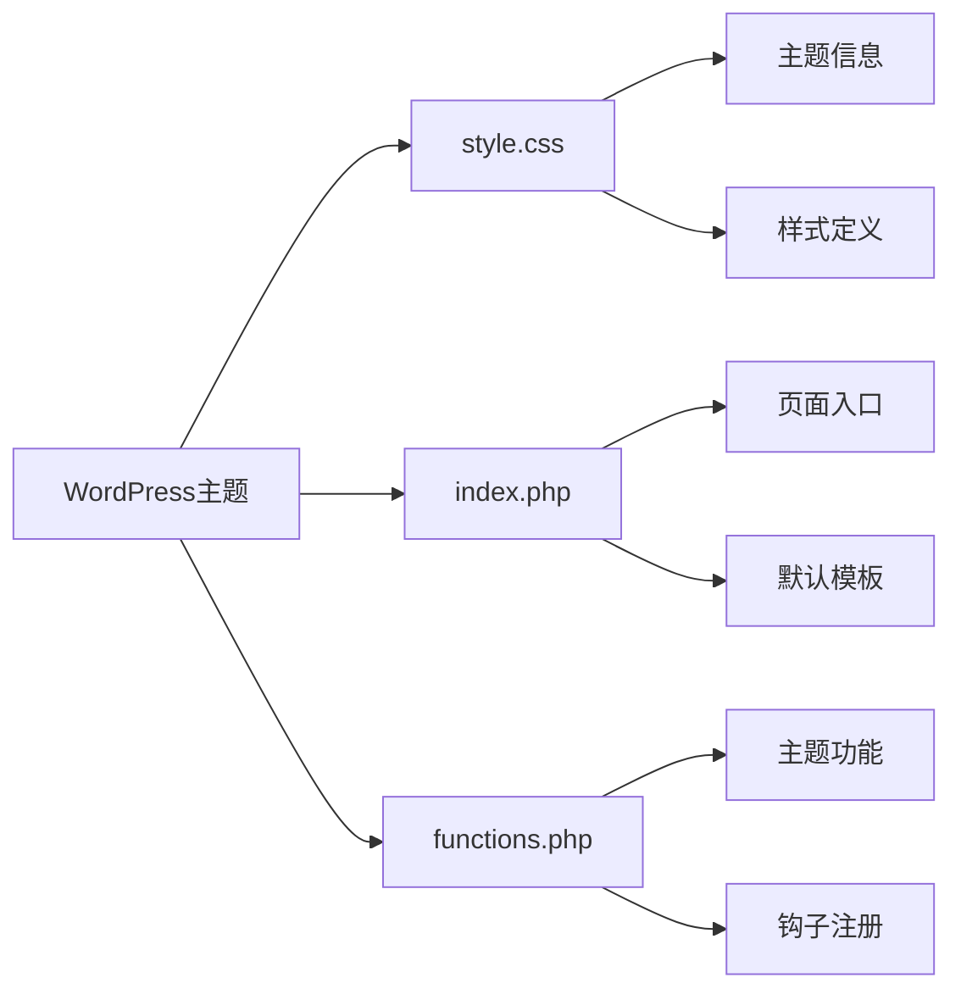

# WordPress主题开发基础

## 🎯 学习目标

> **认识 → 理解 → 应用**
> - **认识**：了解WordPress主题的结构和核心概念
> - **理解**：掌握主题开发的完整流程和技术要点
> - **应用**：能够开发功能完整的自定义主题

## 📋 知识地图



## 💡 主题结构认知

### WordPress主题必备文件



### 主题文件结构对比

| 文件类型 | 必需文件 | 功能 | 优先级 |
|----------|----------|------|--------|
| **核心文件** | style.css, index.php | 主题标识和基础显示 | ⭐⭐⭐⭐⭐ |
| **模板文件** | header.php, footer.php | 页面布局结构 | ⭐⭐⭐⭐ |
| **功能文件** | functions.php | 主题功能逻辑 | ⭐⭐⭐⭐ |
| **模板部分** | single.php, archive.php | 内容显示模板 | ⭐⭐⭐ |
| **辅助文件** | screenshot.png, readme.txt | 主题信息和文档 | ⭐⭐ |

### CSS主题信息解析

```css
/*
Theme Name: 我的特色主题
Theme URI: https://example.com/my-theme/
Description: 一个现代化的WordPress主题，专注于用户体验和性能优化。
Version: 1.0.0
Author: 您的名字
Author URI: https://example.com/
Text Domain: my-custom-theme
Domain Path: /languages/
License: GPL v2 or later
License URI: https://www.gnu.org/licenses/gpl-2.0.html
Tags: responsive, translation-ready, custom-colors, custom-header
Requires at least: 5.0
Tested up to: 6.4
Requires PHP: 7.4
*/
```

## 🔧 模板系统理解

### WordPress模板层次结构

#### 模板查找优先级

```mermaid
graph TD
    A[模板请求] --> B{查询类型}
    
    B -->|首页| C[front-page.php]
    B -->|博客页| D[home.php]
    B -->|文章页| E[single-{post_type}.php]
    B -->|页面页| F[page-{slug}.php]
    B -->|分类页| G[category-{slug}.php]
    B -->|标签页| H[tag-{slug}.php]
    B -->|搜索页| I[search.php]
    B -->|404页| J[404.php]
    
    C --> K[index.php]
    D --> K
    E --> K
    F --> K
    G --> K
    H --> K
    I --> K
    J --> K
```

#### 完整模板层次详解

| 查询类型 | 模板文件优先级 | 说明 |
|----------|---------------|------|
| **首页** | 1.front-page.php<br>2.home.php<br>3.index.php | front-page.php覆盖首页 |
| **博客页** | 1.home.php<br>2.index.php | WordPress博客归档页 |
| **文章详情** | 1.single-{post_type}-{slug}.php<br>2.single-{post_type}.php<br>3.single.php<br>4.index.php | 文章显示模板 |
| **页面** | 1.custom-template-name.php<br>2.page-{slug}.php<br>3.page-{id}.php<br>4.page.php<br>5.index.php | 静态页面模板 |
| **分类页** | 1.category-{slug}.php<br>2.category-{id}.php<br>3.category.php<br>4.archive.php<br>5.index.php | 分类归档页 |
| **标签页** | 1.tag-{slug}.php<br>2.tag-{id}.php<br>3.tag.php<br>4.archive.php<br>5.index.php | 标签归档页 |

### 核心模板文件开发

#### index.php主模板

```php
<?php
/**
 * Template Name: 主模板
 * 主题开发：学习WordPress主题开发基础
 * 作者：您的名字
 * 版本：1.0.0
 */

get_header(); ?>

<div class="main-container">
    <main class="content-area">
        <div class="container">
            
            <?php if (have_posts()) : ?>
                
                <div class="posts-loop">
                    <?php while (have_posts()) : the_post(); ?>
                        
                        <article id="post-<?php the_ID(); ?>" <?php post_class('post-item'); ?>>
                            
                            <?php if (has_post_thumbnail()) : ?>
                                <div class="post-thumbnail">
                                    <a href="<?php the_permalink(); ?>">
                                        <?php the_post_thumbnail('large'); ?>
                                    </a>
                                </div>
                            <?php endif; ?>
                            
                            <div class="post-content">
                                
                                <header class="post-header">
                                    <h2 class="post-title">
                                        <a href="<?php the_permalink(); ?>" rel="bookmark">
                                            <?php the_title(); ?>
                                        </a>
                                    </h2>
                                    
                                    <div class="post-meta">
                                        <span class="post-date">
                                            <time datetime="<?php echo get_the_date('c'); ?>">
                                                <?php echo get_the_date(); ?>
                                            </time>
                                        </span>
                                        
                                        <span class="post-author">
                                            作者: <?php the_author(); ?>
                                        </span>
                                        
                                        <?php 
                                        $categories = get_the_category();
                                        if ($categories) : ?>
                                            <span class="post-categories">
                                                分类: <?php the_category(', '); ?>
                                            </span>
                                        <?php endif; ?>
                                        
                                        <?php 
                                        $tags = get_the_tags();
                                        if ($tags) : ?>
                                            <span class="post-tags">
                                                标签: <?php the_tags('', ', '); ?>
                                            </span>
                                        <?php endif; ?>
                                    </div>
                                </header>
                                
                                <div class="post-excerpt">
                                    <?php 
                                    if (is_home() || is_archive()) {
                                        the_excerpt();
                                    } else {
                                        the_content();
                                    }
                                    ?>
                                </div>
                                
                                <?php if (is_home() || is_archive()) : ?>
                                    <footer class="post-footer">
                                        <a href="<?php the_permalink(); ?>" class="read-more">
                                            阅读更多
                                        </a>
                                    </footer>
                                <?php endif; ?>
                                
                            </div>
                            
                        </article>
                        
                    <?php endwhile; ?>
                </div>
                
                <?php
                // 分页导航
                the_posts_pagination(array(
                    'prev_text' => '上一页',
                    'next_text' => '下一页',
                    'screen_reader_text' => '分页导航'
                ));
                ?>
                
            <?php else : ?>
                
                <div class="no-content">
                    <h1>暂无内容</h1>
                    <p>抱歉，没有找到您要查找的内容。</p>
                </div>
                
            <?php endif; ?>
            
        </div>
    </main>
    
    <?php get_sidebar(); ?>
    
</div>

<?php get_footer(); ?>
```

#### header.php头部模板

```php
<!DOCTYPE html>
<html <?php language_attributes(); ?>>
<head>
    <meta charset="<?php bloginfo('charset'); ?>">
    <meta name="viewport" content="width=device-width, initial-scale=1">
    <meta http-equiv="x-ua-compatible" content="ie=edge">
    
    <?php wp_head(); ?>
    
    <!-- 主题CSS文件 -->
    <style>
        :root {
            --primary-color: #0073aa;
            --secondary-color: #666;
            --text-color: #333;
            --bg-color: #fff;
        }
        
        body {
            font-family: -apple-system, BlinkMacSystemFont, "Segoe UI", Roboto, sans-serif;
            line-height: 1.6;
            color: var(--text-color);
            background-color: var(--bg-color);
            margin: 0;
            padding: 0;
        }
        
        .container {
            max-width: 1200px;
            margin: 0 auto;
            padding: 0 20px;
        }
        
        .site-header {
            background-color: var(--primary-color);
            color: white;
            padding: 1rem 0;
        }
        
        .site-branding {
            display: flex;
            align-items: center;
            justify-content: space-between;
        }
        
        .site-title {
            margin: 0;
            font-size: 1.8rem;
            font-weight: 600;
        }
        
        .site-title a {
            color: white;
            text-decoration: none;
        }
        
        .site-description {
            margin: 0;
            font-size: 0.9rem;
            opacity: 0.8;
        }
        
        .navigation {
            display: flex;
        }
        
        .navigation ul {
            list-style: none;
            margin: 0;
            padding: 0;
            display: flex;
        }
        
        .navigation li {
            margin-left: 2rem;
        }
        
        .navigation a {
            color: white;
            text-decoration: none;
            padding: 0.5rem 0;
            transition: opacity 0.3s;
        }
        
        .navigation a:hover {
            opacity: 0.8;
        }
    </style>
</head>

<body <?php body_class(); ?>>
<?php wp_body_open(); ?>

<div class="site">
    
    <header class="site-header">
        <div class="container">
            
            <div class="site-branding">
                <div class="brand-info">
                    <?php if (is_front_page() && is_home()) : ?>
                        <h1 class="site-title">
                            <a href="<?php echo esc_url(home_url('/')); ?>" rel="home">
                                <?php bloginfo('name'); ?>
                            </a>
                        </h1>
                    <?php else : ?>
                        <p class="site-title">
                            <a href="<?php echo esc_url(home_url('/')); ?>" rel="home">
                                <?php bloginfo('name'); ?>
                            </a>
                        </p>
                    <?php endif; ?>
                    
                    <?php
                    $description = get_bloginfo('description', 'display');
                    if ($description || is_customize_preview()) :
                    ?>
                        <p class="site-description"><?php echo $description; ?></p>
                    <?php endif; ?>
                </div>
                
                <nav class="navigation">
                    <?php
                    // 主菜单
                    wp_nav_menu(array(
                        'theme_location' => 'primary',
                        'container' => false,
                        'menu_class' => 'primary-menu',
                        'fallback_cb' => false,
                    ));
                    ?>
                </nav>
            </div>
            
        </div>
    </header>
    
    <div class="site-content">
```

#### footer.php页脚模板

```php
    </div> <!-- .site-content -->
    
    <footer class="site-footer">
        <div class="container">
            
            <div class="footer-content">
                
                <div class="footer-widgets">
                    <?php if (is_active_sidebar('footer-sidebar')) : ?>
                        <?php dynamic_sidebar('footer-sidebar'); ?>
                    <?php endif; ?>
                </div>
                
                <div class="site-info">
                    <?php if (is_active_sidebar('footer-sidebar')) : ?>
                        <div class="footer-text">
                            <p>&copy; <?php echo date('Y'); ?> <?php bloginfo('name'); ?>. 
                            <a href="<?php echo esc_url(__('https://wordpress.org/', 'my-theme')); ?>">
                                Powered by WordPress
                            </a></p>
                        </div>
                    <?php endif; ?>
                </div>
                
            </div>
            
        </div>
    </footer>

    <style>
        .site-footer {
            background-color: #f8f9fa;
            border-top: 1px solid #dee2e6;
            padding: 2rem 0;
            margin-top: 3rem;
        }
        
        .footer-content {
            display: grid;
            grid-template-columns: 1fr auto;
            gap: 2rem;
            align-items: center;
        }
        
        .footer-widgets {
            flex: 1;
        }
        
        .site-info {
            text-align: right;
        }
        
        .footer-text {
            font-size: 0.9rem;
            color: #6c757d;
            margin: 0;
        }
        
        .footer-text a {
            color: var(--primary-color);
            text-decoration: none;
        }
        
        .footer-text a:hover {
            text-decoration: underline;
        }
        
        @media (max-width: 768px) {
            .footer-content {
                grid-template-columns: 1fr;
                text-align: center;
            }
            
            .site-info {
                text-align: center;
            }
        }
    </style>

</div> <!-- .site -->

<?php wp_footer(); ?>

<script>
// 主题JavaScript代码
document.addEventListener('DOMContentLoaded', function() {
    // 平滑滚动到顶部
    const scrollToTop = document.querySelector('.scroll-to-top');
    if (scrollToTop) {
        window.addEventListener('scroll', function() {
            if (window.pageYOffset > 300) {
                scrollToTop.style.display = 'block';
            } else {
                scrollToTop.style.display = 'none';
            }
        });
        
        scrollToTop.addEventListener('click', function(e) {
            e.preventDefault();
            window.scrollTo({
                top: 0,
                behavior: 'smooth'
            });
        });
    }
});
</script>

</body>
</html>
```

## 🚀 样式脚本应用

### 主题CSS架构设计

#### CSS文件组织结构

```css
/* 
主题CSS架构 - style.css
主题开发：学习WordPress主题开发基础
*/

/* ================================
   1. CSS重置和基础样式
   ================================ */

*, *::before, *::after {
    box-sizing: border-box;
}

html {
    font-size: 16px;
    scroll-behavior: smooth;
}

body {
    margin: 0;
    padding: 0;
    font-family: -apple-system, BlinkMacSystemFont, "Segoe UI", Roboto, "Helvetica Neue", Arial, sans-serif;
    line-height: 1.6;
    color: #333;
    background-color: #fff;
}

img {
    max-width: 100%;
    height: auto;
}

a {
    color: #0073aa;
    text-decoration: none;
    transition: color 0.3s ease;
}

a:hover {
    color: #005177;
}

/* ================================
   2. CSS变量和主题色彩
   ================================ */

:root {
    /* 主色调 */
    --primary-color: #0073aa;
    --primary-hover: #005177;
    --secondary-color: #666;
    
    /* 文本色彩 */
    --text-color: #333;
    --text-light: #666;
    --text-muted: #999;
    
    /* 背景色彩 */
    --bg-color: #fff;
    --bg-light: #f8f9fa;
    --bg-dark: #343a40;
    
    /* 边框和分割线 */
    --border-color: #dee2e6;
    --border-radius: 4px;
    
    /* 阴影 */
    --box-shadow: 0 2px 4px rgba(0,0,0,0.1);
    --box-shadow-lg: 0 4px 8px rgba(0,0,0,0.15);
    
    /* 间距 */
    --spacing-xs: 0.25rem;
    --spacing-sm: 0.5rem;
    --spacing-md: 1rem;
    --spacing-lg: 1.5rem;
    --spacing-xl: 2rem;
    
    /* 字体大小 */
    --font-size-sm: 0.875rem;
    --font-size-base: 1rem;
    --font-size-lg: 1.125rem;
    --font-size-xl: 1.25rem;
    --font-size-h1: 2rem;
    --font-size-h2: 1.75rem;
    --font-size-h3: 1.5rem;
}

/* ================================
   3. 网格系统和布局
   ================================ */

.container {
    max-width: 1200px;
    margin: 0 auto;
    padding: 0 var(--spacing-md);
}

.row {
    display: flex;
    flex-wrap: wrap;
    margin: 0 calc(var(--spacing-sm) * -1);
}

.col {
    flex: 1 0 0%;
    padding: 0 var(--spacing-sm);
}

.col-auto {
    flex: 0 0 auto;
    width: auto;
}

.col-12 { width: 100%; }
.col-11 { width: 91.66667%; }
.col-10 { width: 83.33333%; }
.col-9 { width: 75%; }
.col-8 { width: 66.66667%; }
.col-7 { width: 58.33333%; }
.col-6 { width: 50%; }
.col-5 { width: 41.66667%; }
.col-4 { width: 33.33333%; }
.col-3 { width: 25%; }
.col-2 { width: 16.66667%; }
.col-1 { width: 8.33333%; }

/* ================================
   4. 组件样式
   ================================ */

/* 按钮组件 */
.btn {
    display: inline-block;
    padding: var(--spacing-sm) var(--spacing-lg);
    font-size: var(--font-size-base);
    font-weight: 500;
    line-height: 1.5;
    text-align: center;
    text-decoration: none;
    vertical-align: middle;
    cursor: pointer;
    border: 1px solid transparent;
    border-radius: var(--border-radius);
    transition: all 0.3s ease;
}

.btn-primary {
    color: #fff;
    background-color: var(--primary-color);
    border-color: var(--primary-color);
}

.btn-primary:hover {
    background-color: var(--primary-hover);
    border-color: var(--primary-hover);
}

.btn-secondary {
    color: #6c757d;
    background-color: transparent;
    border-color: #6c757d;
}

.btn-secondary:hover {
    color: #fff;
    background-color: #6c757d;
    border-color: #6c757d;
}

/* Card组件 */
.card {
    position: relative;
    display: flex;
    flex-direction: column;
    min-width: 0;
    word-wrap: break-word;
    background-color: #fff;
    background-clip: border-box;
    border: 1px solid var(--border-color);
    border-radius: var(--border-radius);
    box-shadow: var(--box-shadow);
}

.card-header {
    padding: var(--spacing-md);
    background-color: var(--bg-light);
    border-bottom: 1px solid var(--border-color);
}

.card-body {
    flex: 1 1 auto;
    padding: var(--spacing-md);
}

.card-footer {
    padding: var(--spacing-md);
    background-color: var(--bg-light);
    border-top: 1px solid var(--border-color);
}

/* ================================
   5. 响应式设计
   ================================ */

@media (max-width: 992px) {
    .col-md-12 { width: 100%; }
    .col-md-11 { width: 91.66667%; }
    .col-md-10 { width: 83.33333%; }
    .col-md-9 { width: 75%; }
    .col-md-8 { width: 66.66667%; }
    .col-md-7 { width: 58.33333%; }
    .col-md-6 { width: 50%; }
    .col-md-5 { width: 41.66667%; }
    .col-md-4 { width: 33.33333%; }
    .col-md-3 { width: 25%; }
    .col-md-2 { width: 16.66667%; }
    .col-md-1 { width: 8.33333%; }
}

@media (max-width: 768px) {
    .col-sm-12 { width: 100%; }
    .col-sm-6 { width: 50%; }
    .col-sm-4 { width: 33.33333%; }
    .col-sm-3 { width: 25%; }
    .col-sm-2 { width: 16.66667%; }
    .col-sm-1 { width: 8.33333%; }
}

@media (max-width: 576px) {
    .col-xs-12 { width: 100%; }
    .col-xs-6 { width: 50%; }
    
    .container {
        padding: 0 var(--spacing-sm);
    }
    
    .btn {
        display: block;
        width: 100%;
    }
}
```

### JavaScript集成实现

```javascript
// 主题JavaScript文件 - theme.js
(function($) {
    'use strict';
    
    // 主题对象
    var Theme = {
        init: function() {
            this.bindEvents();
            this.initComponents();
            this.setAOSAnimations();
        },
        
        // 事件绑定
        bindEvents: function() {
            $(document).ready(this.onDocumentReady.bind(this));
            $(window).on('load', this.onWindowLoad.bind(this));
            $(window).on('resize', this.onWindowResize.bind(this));
            $(window).on('scroll', this.onWindowScroll.bind(this));
        },
        
        // 文档准备就绪
        onDocumentReady: function() {
            this.hamburgerMenu();
            this.imageLazyLoading();
            this.footerSideWidgets();
            this.searchToggle();
        },
        
        // 窗口加载完成
        onWindowLoad: function() {
            this.preloaderHide();
            this.backToTop();
        },
        
        // 窗口大小改变
        onWindowResize: function() {
            this.mobileMenuAdjustment();
        },
        
        // 窗口滚动事件
        onWindowScroll: function() {
            this.stickyHeader();
            this.scrollProgress();
        },
        
        // 组件初始化
        initComponents: function() {
            this.slider();
            this.featuredPosts();
            this.paginationButtons();
        },
        
        // 移动端菜单
        hamburgerMenu: function() {
            $('.hamburger-menu').on('click', function(e) {
                e.preventDefault();
                $(this).toggleClass('active');
                $('.menu').toggleClass('active');
                $('body').toggleClass('menu-open');
            });
        },
        
        // 懒加载
        imageLazyLoading: function() {
            if ('IntersectionObserver' in window) {
                var lazyImageObserver = new IntersectionObserver(function(entries, observer) {
                    entries.forEach(function(entry) {
                        if (entry.isIntersecting) {
                            var lazyImage = entry.target;
                            lazyImage.src = lazyImage.dataset.src;
                            lazyImage.classList.remove('lazy');
                            lazyImageObserver.unobserve(lazyImage);
                        }
                    });
                });
                
                var lazyImages = document.querySelectorAll('img[data-src]');
                lazyImages.forEach(function(lazyImage) {
                    lazyImageObserver.observe(lazyImage);
                });
            }
        },
        
        // 返回顶部
        backToTop: function() {
            var backToTopOffset = 300;
            var backToTopButton = $('.back-to-top');
            
            if (backToTopButton.length) {
                $(window).scroll(function() {
                    if ($(this).scroll_top() > backToTopOffset) {
                        backToTopButton.addClass('show');
                    } else {
                        backToTopButton.removeClass('show');
                    }
                });
                
                backToTopButton.on('click', function(e) {
                    e.preventDefault();
                    $('html, body').animate({
                        scrollTop: 0
                    }, 800);
                });
            }
        },
        
        // 粘性头部
        stickyHeader: function() {
            var header = $('.site-header');
            var headerHeight = header.outerHeight();
            var scrollTop = $(window).scrollTop();
            
            if (scrollTop > headerHeight) {
                header.addClass('sticky');
                $('body').addClass('sticky-header');
            } else {
                header.removeClass('sticky');
                $('body').removeClass('sticky-header');
            }
        },
        
        // 滚动进度
        scrollProgress: function() {
            var scrollProgress = $('.scroll-progress');
            if (scrollProgress.length) {
                var windowHeight = $(window).height();
                var documentHeight = $(document).height();
                var scrollTop = $(window).scrollTop();
                var scrollPercent = (scrollTop / (documentHeight - windowHeight)) * 100;
                
                scrollProgress.css('width', scrollPercent + '%');
            }
        },
        
        // AOS动画
        setAOSAnimations: function() {
            if (typeof AOS !== 'undefined') {
                AOS.init({
                    duration: 800,
                    delay: 0,
                    offset: 120,
                    easing: 'ease-in-out'
                });
            }
        },
        
        // 移动端菜单调整
        mobileMenuAdjustment: function() {
            var windowWidth = $(window).width();
            
            if (windowWidth > 768) {
                $('.menu').removeClass('active');
                $('.hamburger-menu').removeClass('active');
                $('body').removeClass('menu-open');
            }
        }
    };
    
    // 初始化主题
    $(document).ready(function() {
        Theme.init();
    });
    
    // 暴露到全局
    window.Theme = Theme;
    
})(jQuery);
```

### functions.php功能集成

```php
<?php
/**
 * 主题功能文件
 * functions.php - WordPress主题开发基础
 */

// 防止直接访问
if (!defined('ABSPATH')) {
    exit;
}

// 主题设置
define('THEME_VERSION', '1.0.0');
define('THEME_NAME', '我的自定义主题');

/**
 * 主题初始化
 */
function my_theme_setup() {
    // 主题支持
    add_theme_support('title-tag');
    add_theme_support('post-thumbnails');
    add_theme_support('custom-logo');
    add_theme_support('html5', array(
        'comment-list', 'comment-form', 'search-form', 'gallery', 'caption'
    ));
    add_theme_support('customize-selective-refresh-widgets');
    add_theme_support('responsive-embeds');
    
    // 添加自定义图片尺寸
    add_image_size('theme-thumbnail', 300, 200, true);
    add_image_size('theme-medium', 600, 400, true);
    add_image_size('theme-large', 900, 600, true);
    
    // 注册导航菜单
    register_nav_menus(array(
        'primary' => '主导航菜单',
        'footer' => '页脚菜单',
    ));
    
    // 设置默认缩略图
    set_post_thumbnail_size(800, 600, true);
}
add_action('after_setup_theme', 'my_theme_setup');

/**
 * 样式和脚本的加载
 */
function my_theme_scripts() {
    // 加载主要样式文件
    wp_enqueue_style('theme-style', get_stylesheet_uri(), array(), THEME_VERSION);
    
    // 加载主CSS文件
    wp_enqueue_style('theme-main', get_template_directory_uri() . '/assets/css/main.css', array(), THEME_VERSION);
    
    // 加载字体库（可选，如Google Fonts）
    wp_enqueue_style('theme-fonts', 'https://fonts.googleapis.com/css2?family=Inter:wght@400;600;700&display=swap');
    
    // 加载jQuery（如果必须）
    if (is_front_page() || is_home()) {
        wp_enqueue_script('jquery');
    }
    
    // 加载主JavaScript文件
    wp_enqueue_script('theme-main', get_template_directory_uri() . '/assets/js/theme.js', array('jquery'), THEME_VERSION, true);
    
    // 本地化JavaScript数据
    wp_localize_script('theme-main', 'theme_ajax', array(
        'ajax_url' => admin_url('admin-ajax.php'),
        'nonce' => wp_create_nonce('theme_nonce'),
        'site_url' => home_url(),
    ));
}
add_action('wp_enqueue_scripts', 'my_theme_scripts');

/**
 * 侧边栏注册
 */
function my_theme_widgets() {
    register_sidebar(array(
        'name' => '主侧边栏',
        'id' => 'sidebar-1',
        'description' => '出现在页面侧边的导航栏位置',
        'before_widget' => '<div id="%1$s" class="widget %2$s">',
        'after_widget' => '</div>',
        'before_title' => '<h3 class="widget-title">',
        'after_title' => '</h3>',
    ));
    
    register_sidebar(array(
        'name' => '页脚侧边栏',
        'id' => 'footer-sidebar',
        'description' => '页脚的窗口小工具区域',
        'before_widget' => '<div class="footer-widget %2$s">',
        'after_widget' => '</div>',
        'before_title' => '<h4 class="footer-widget-title">',
        'after_title' => '</h4>',
    ));
}
add_action('widgets_init', 'my_theme_widgets');

/**
 * 自定义Logo支持
 */
function my_theme_customize_register($wp_customize) {
    // 网站Logo
    $wp_customize->add_setting('custom_logo');
    $wp_customize->add_control(new WP_Customize_Image_Control($wp_customize, 'custom_logo', array(
        'label' => '网站Logo',
        'section' => 'title_tagline',
        'settings' => 'custom_logo',
    )));
    
    // 主题颜色
    $wp_customize->add_setting('theme_primary_color', array(
        'default' => '#0073aa',
        'sanitize_callback' => 'sanitize_hex_color',
    ));
    
    $wp_customize->add_control(new WP_Customize_Color_Control($wp_customize, 'theme_primary_color', array(
        'label' => '主色调',
        'section' => 'colors',
        'settings' => 'theme_primary_color',
    )));
}
add_action('customize_register', 'my_theme_customize_register');

/**
 * 输出自定义CSS
 */
function my_theme_custom_css() {
    $primary_color = get_theme_mod('theme_primary_color', '#0073aa');
    
    if ($primary_color !== '#0073aa') : ?>
    <style type="text/css">
        :root {
            --primary-color: <?php echo esc_attr($primary_color); ?>;
        }
        
        .btn-primary,
        .site-header {
            background-color: <?php echo esc_attr($primary_color); ?> !important;
        }
        
        .site-title a,
        .navigation a {
            color: #fff !important;
        }
        
        a {
            color: <?php echo esc_attr($primary_color); ?>;
        }
    </style>
    <?php endif;
}
add_action('wp_head', 'my_theme_custom_css');

/**
 * AJAX搜索功能
 */
function my_theme_ajax_search() {
    check_ajax_referer('theme_nonce', 'nonce');
    
    $search_term = sanitize_text_field($_POST['search_term']);
    
    $args = array(
        'post_type' => 'post',
        's' => $search_term,
        'posts_per_page' => 5,
        'post_status' => 'publish'
    );
    
    $query = new WP_Query($args);
    
    if ($query->have_posts()) {
        while ($query->have_posts()) {
            $query->the_post(); ?>
            <div class="ajax-search-result">
                <h4><a href="<?php the_permalink(); ?>"><?php the_title(); ?></a></h4>
                <p><?php echo wp_trim_words(get_the_excerpt(), 15); ?></p>
            </div>
            <?php
        }
    } else {
        echo '<p>未找到匹配的内容。</p>';
    }
    
    wp_reset_postdata();
    wp_die();
}
add_action('wp_ajax_my_theme_search', 'my_theme_ajax_search');
add_action('wp_ajax_nopriv_my_theme_search', 'my_theme_ajax_search');

/**
 * 优化和性能改进
 */

// 清理WordPress头部
remove_action('wp_head', 'wp_generator');
remove_action('wp_head', 'wlwmanifest_link');
remove_action('wp_head', 'rsd_link');

// 移除不必要的脚本和样式
function my主题_dequeue_scripts() {
    if (!is_admin()) {
        wp_dequeue_script('wp-embed');
    }
}
add_action('wp_footer', 'my主题_dequeue_scripts');

// 延迟加载图片
function my_theme_lazy_load_images($content) {
    if (is_feed() || is_preview() || is_admin()) {
        return $content;
    }
    
    $content = preg_replace('/(]+)(src[^>]*)([^>]*>)/i', '$1data-src="$2"$3', $content);
    return str_replace(' src="', ' src="data:image/gif;base64,R0lGODlhAQABAAAAACH5BAEKAAEALAAAAAABAAEAAAICTAEAOw==" ', $content);
}
add_filter('the_content', 'my_theme_lazy_load_images');

// 添加预加载链接
function my_theme_preload_critical_resources() {
    echo '<link rel="preload" href="' . get_template_directory_uri() . '/assets/fonts/font.woff2" as="font" type="font/woff2" crossorigin>';
    echo '<link rel="preload" href="' . get_template_directory_uri() . '/assets/css/main.css" as="style">';
}
add_action('wp_head', 'my_theme_preload_critical_resources', 1);

/**
 * 安全和数据验证
 */

// 防止文件直接包含
if (!function_exists('my_theme_sanitize_input')) {
    function my_theme_sanitize_input($data) {
        if (is_array($data)) {
            return array_map('my_theme_sanitize_input', $data);
        } else {
            return htmlspecialchars(strip_tags($data), ENT_QUOTES, 'UTF-8');
        }
    }
}

// 转义输出数据
function my_theme_escape_output($data) {
    return htmlspecialchars($data, ENT_QUOTES, 'UTF-8');
}

/**
 * 调试和错误处理
 */

// 开发模式错误显示
if (defined('WP_DEBUG') && WP_DEBUG) {
    error_reporting(E_ALL);
    ini_set('display_errors', 1);
}

// 自定义错误处理
function my_theme_error_handler($error_level, $error_message, $error_file, $error_line) {
    error_log(sprintf("WordPress主题错误 [级别: %s] %s 在 %s 的第 %s 行", $error_level, $error_message, $error_file, $error_line));
}

if (defined('WP_DEBUG') && WP_DEBUG) {
    set_error_handler('my_theme_error_handler');
}
```

## 🎯 刻意练习项目

### 练习1：主题基础开发
**目标**：从零开始创建一个完整的WordPress主题
**技能点**：文件结构、模板开发、样式设计

### 练习2：响应式设计
**目标**：实现完全响应式的主题设计
**技能点**：CSS Grid、Flexbox、媒体查询

### 练习3：主题功能扩展
**目标**：为主题添加自定义功能和小工具
**技能点**：functions.php、插件集成、用户体验优化

## 🔗 拓展学习链接

### 进阶主题
- [[模板文件详解]] - 深入的模板开发技术
- [[响应式设计]] - 现代前端设计技术
- [[主题开发项目]] - 实际主题开发项目

### 相关技术
- [[钩子机制]] - WordPress扩展机制
- [[Ajax交互]] - 前端交互技术
- [[前端框架集成]] - 现代前端框架

### 实战项目
- [[企业官网项目]] - 企业级主题开发
- [[电商网站项目]] - 电商主题开发

---

## 💬 知识检查

**理解检验**：
1. WordPress主题的核心文件有哪些？各有什么作用？
2. 模板层次结构是如何工作的？
3. functions.php在主题开发中扮演什么角色？

**应用检验**：
1. 能够独立开发一个功能完整的WordPress主题
2. 理解现代前端技术在主题中的应用
3. 掌握主题的性能优化和安全实践

### 故障排除

#### 常见主题问题

| 问题 | 原因 | 解决方案 |
|------------|------|----------|
| **白屏错误** | PHP语法错误或致命错误 | 检查语法，启用调试模式 |
| **样式不加载** | CSS文件路径错误 | 检查文件路径和权限 |
| **功能不工作** | hooks钩子错误 | 检查代码逻辑和钩子注册 |

**下一步学习**：[[模板文件详解]] → 深入学习WordPress模板系统
