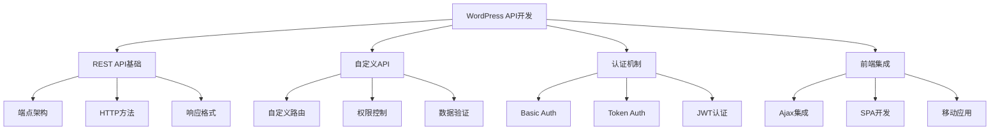
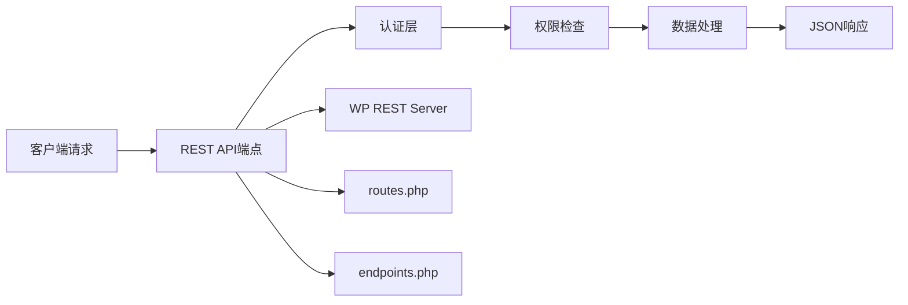
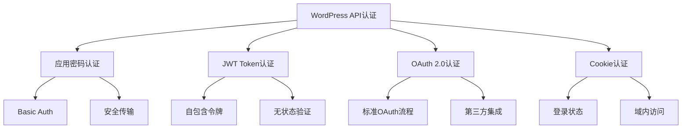

# WordPress API开发详解

## 🎯 学习目标

> **认识 → 理解 → 应用**
> - **认识**：了解WordPress REST API架构和核心功能
> - **理解**：掌握API端点设计、认证和数据处理机制
> - **应用**：能够开发完整的WordPress API服务和客户端

## 📋 知识地图



## 💡 REST API基本认知

### WordPress REST API架构



### REST API核心概念对比

| 概念 | REST API | WordPress实现 | HTTP方法 | 示例 |
|------|----------|---------------|----------|------|
| **资源获取** | GET | `WP_REST_Server::readable` | GET | `GET /wp/v2/posts` |
| **资源创建** | POST | `WP_REST_Server::creatable` | POST | `POST /wp/v2/posts` |
| **资源更新** | PUT/PATCH | `WP_REST_Server::editable` | PUT | `PUT /wp/v2/posts/123` |
| **资源删除** | DELETE | `WP_REST_Server::deletable` | DELETE | `DELETE /wp/v2/posts/123` |

### 内置API端点概览

```php
<?php
/**
 * WordPress内置API端点速查
 * 涵盖文章、用户、媒体等核心功能
 */

// 1. 文章相关端点
$post_endpoints = array(
    'GET /wp/v2/posts' => '获取文章列表',
    'GET /wp/v2/posts/{id}' => '获取单篇文章',
    'POST /wp/v2/posts' => '创建新文章',
    'PUT /wp/v2/posts/{id}' => '更新文章',
    'DELETE /wp/v2/posts/{id}' => '删除文章',
    'GET /wp/v2/posts/{id}/revisions' => '获取文章修订版'
);

// 2. 分类和标签端点
$taxonomy_endpoints = array(
    'GET /wp/v2/categories' => '获取分类列表',
    'GET /wp/v2/tags' => '获取标签列表',
    'POST /wp/v2/categories' => '创建分类',
    'PUT /wp/v2/categories/{id}' => '更新分类'
);

// 3. 媒体文件端点
$media_endpoints = array(
    'GET /wp/v2/media' => '获取媒体文件列表',
    'GET /wp/v2/media/{id}' => '获取单个媒体文件',
    'POST /wp/v2/media' => '上传媒体文件',
    'DELETE /wp/v2/media/{id}' => '删除媒体文件'
);

// 4. 用户和认证端点
$user_endpoints = array(
    'GET /wp/v2/users' => '获取用户列表',
    'GET /wp/v2/users/{id}' => '获取单个用户',
    'GET /wp/v2/users/me' => '获取当前用户',
    'POST /wp/v2/users' => '创建新用户'
);

// 5. 评论系统端点
$comment_endpoints = array(
    'GET /wp/v2/comments' => '获取评论列表',
    'GET /wp/v2/comments/{id}' => '获取单个评论',
    'POST /wp/v2/comments' => '创建新评论',
    'PUT /wp/v2/comments/{id}' => '更新评论'
);
?>
```

## 🔧 API开发理解

### 自定义API端点开发

```php
<?php
/**
 * WordPress自定义API端点开发
 * 创建完整的自定义API服务
 */

// 1. 注册自定义API路由
function register_custom_api_routes() {
    register_rest_route('custom-api/v1', '/products', array(
        'methods' => WP_REST_Server::READABLE,
        'callback' => 'get_custom_products',
        'permission_callback' => '__return_true', // 公开访问
        'args' => array(
            'limit' => array(
                'description' => '返回结果数量限制',
                'type' => 'integer',
                'default' => 10,
                'sanitize_callback' => 'absint',
                'validate_callback' => function($param, $request, $key) {
                    return is_numeric($param) && $param > 0 && $param <= 100;
                }
            ),
            'category' => array(
                'description' => '产品分类筛选',
                'type' => 'string',
                'sanitize_callback' => 'sanitize_url',
                'validate_callback' => 'rest_validate_string'
            ),
            'search' => array(
                'description' => '搜索关键词',
                'type' => 'string',
                'sanitize_callback' => 'sanitize_text_field'
            )
        )
    ));
    
    // POST端点 - 创建产品
    register_rest_route('custom-api/v1', '/products', array(
        'methods' => WP_REST_Server::CREATABLE,
        'callback' => 'create_custom_product',
        'permission_callback' => 'check_product_create_permissions',
        'args' => array(
            'title' => array(
                'required' => true,
                'type' => 'string',
                'description' => '产品标题',
                'sanitize_callback' => 'sanitize_text_field',
                'validate_callback' => function($param, $request, $key) {
                    return strlen($param) >= 3 && strlen($param) <= 100;
                }
            ),
            'description' => array(
                'type' => 'string',
                'description' => '产品描述',
                'sanitize_callback' => 'strip_tags'
            ),
            'price' => array(
                'type' => 'number',
                'description' => '产品价格',
                'validate_callback' => function($param, $request, $key) {
                    return is_numeric($param) && $param >= 0;
                }
            ),
            'category_id' => array(
                'type' => 'integer',
                'description' => '分类ID',
                'sanitize_callback' => 'absint',
                'validate_callback' => function($param, $request, $key) {
                    return term_exists($param, 'product_category');
                }
            ),
            'meta_data' => array(
                'type' => 'object',
                'description' => '自定义字段数据',
                'sanitize_callback' => function($param, $request, $key) {
                    if (is_array($param)) {
                        return array_map('sanitize_text_field', $param);
                    }
                    return array();
                }
            )
        )
    ));
    
    // PUT端点 - 更新产品
    register_rest_route('custom-api/v1', '/products/(?P<id>\d+)', array(
        'methods' => WP_REST_Server::EDITABLE,
        'callback' => 'update_custom_product',
        'permission_callback' => 'check_product_edit_permissions',
        'args' => array(
            'id' => array(
                'required' => true,
                'type' => 'integer',
                'sanitize_callback' => 'absint',
                'validate_callback' => function($param, $request, $key) {
                    return get_post($param) && get_post_type($param) === 'product';
                }
            )
        )
    ));
}
add_action('rest_api_init', 'register_custom_api_routes');

// 2. 获取产品列表回调函数
function get_custom_products($request) {
    $params = $request->get_params();
    
    // 查询参数
    $query_args = array(
        'post_type' => 'product',
        'post_status' => 'publish',
        'posts_per_page' => $params['limit'] ?? 10,
        'no_found_rows' => true,
        'update_post_meta_cache' => false,
        'update_post_term_cache' => false
    );
    
    // 搜索参数
    if (!empty($params['search'])) {
        $query_args['s'] = $params['search'];
    }
    
    // 分类筛选
    if (!empty($params['category'])) {
        $query_args['tax_query'] = array(
            array(
                'taxonomy' => 'product_category',
                'field' => 'slug',
                'terms' => $params['category']
            )
        );
    }
    
    // 执行查询
    $products_query = new WP_Query($query_args);
    $products = [];

    if ($products_query->have_posts()) {
        while ($products_query->have_posts()) {
            $products_query->the_post();
            $post_id = get_the_ID();
            
            $products[] = array(
                'id' => $post_id,
                'title' => get_the_title(),
                'description' => get_the_excerpt(),
                'price' => get_post_meta($post_id, '_product_price', true),
                'featured_image' => get_the_post_thumbnail_url($post_id, 'medium'),
                'categories' => wp_get_post_terms($post_id, 'product_category', array('fields' => 'names')),
                'url' => get_permalink($post_id),
                'date' => get_the_date('c'),
                'meta_data' => get_post_meta($post_id, '_product_meta', true)
            );
        }
        wp_reset_postdata();
    }
    
    // 准备响应数据
    $response_data = array(
        'success' => true,
        'data' => array(
            'products' => $products,
            'total' => $products_query->found_posts,
            'page' => $products_query->get('paged') ?: 1,
            'per_page' => $query_args['posts_per_page']
        ),
        'message' => '产品列表获取成功'
    );
    
    // 添加分页链接
    $max_pages = ceil($products_query->found_posts / $query_args['posts_per_page']);
    if ($max_pages > 1) {
        $response_data['data']['pagination'] = array(
            'current_page' => $products_query->get('paged') ?: 1,
            'total_pages' => $max_pages,
            'next_page' => $max_pages > 1 ? add_query_arg('page', 2, rest_url('custom-api/v1/products')) : null,
            'prev_page' => null
        );
    }
    
    return rest_ensure_response($response_data);
}

//  but 创建产品回调函数
function create_custom_product($request) {
    $params = $request->get_params();
    
    // 准备文章数据
    $post_data = array(
        'post_type' => 'product',
        'post_title' => $params['title'],
        'post_content' => $params['description'] ?? '',
        'post_status' => 'publish',
        'post_author' => get_current_user_id()
    );
    
    // 创建文章
    $post_id = wp_insert_post($post_data);
    
    if (is_wp_error($post_id)) {
        return new WP_Error(
            'product_creation_failed',
            '产品创建失败：' . $post_id->get_error_message(),
            array('status' => 400)
        );
    }
    
    // 设置产品价格
    if (!empty($params['price'])) {
        update_post_meta($post_id, '_product_price', floatval($params['price']));
    }
    
    // 设置产品分类
    if (!empty($params['category_id'])) {
        wp_set_post_terms($post_id, array($params['category_id']), 'product_category');
    }
    
    // 设置自定义字段
    if (!empty($params['meta_data']) && is_array($params['meta_data'])) {
        foreach ($params['meta_data'] as $key => $value) {
            update_post_meta($post_id, $key, $value);
        }
    }
    
    // 返回创建的产品信息
    $created_product = array(
        'id' => $post_id,
        'title' => get_the_title($post_id),
        'description' => get_the_excerpt($post_id),
        'price' => get_post_meta($post_id, '_product_price', true),
        'url' => get_permalink($post_id),
        'date' => get_the_date('c', $post_id)
    );
    
    $response = rest_ensure_response($created_product);
    $response->set_status(201);
    $response->header('Location', rest_url("custom-api/v1/products/{$post_id}"));
    
    return $response;
}
?>
```

## 🔐 API认证机制详解

### 认证方式对比



### JWT Token认证实现

```php
<?php
/**
 * WordPress JWT Token认证实现
 * 安全的API访问控制
 */

// 1. JWT Token生成和管理类
class WP_JWT_Auth {
    
    private static $secret_key;
    private static $algorithm = 'HS256';
    
    /**
     * 初始化JWT认证
     */
    public static function init() {
        self::$secret_key = get_option('jwt_secret_key') ?: wp_generate_password(64);
        
        // 注册API认证路由
        add_action('rest_api_init', array(__CLASS__, 'register_auth_routes'));
        
        // 添加认证处理器
        add_filter('rest_authentication_errors', array(__CLASS__, 'authenticate_request'));
    }
    
    /**
     * 注册认证API路由
     */
    public static function register_auth_routes() {
        // 登录获取Token
        register_rest_route('jwt-auth/v1', '/token', array(
            'methods' => WP_REST_Server::CREATABLE,
            'callback' => array(__CLASS__, 'generate_token'),
            'permission_callback' => '__return_true',
            'args' => array(
                'username' => array(
                    'required' => true,
                    'type' => 'string',
                    'sanitize_callback' => 'sanitize_text_field'
                ),
                'password' => array(
                    'required' => true,
                    'type' => 'string',
                    'sanitize_callback' => 'sanitize_text_field'
                ),
                'expiration' => array(
                    'type' => 'integer',
                    'default' => 86400, // 24小时
                    'sanitize_callback' => 'absint',
                    'validate_callback' => function($param, $request, $key) {
                        return $param > 0 && $param <= 604800; // 最大7天
                    }
                )
            )
        ));
        
        // Token刷新
        register_rest_route('jwt-auth/v1', '/token/refresh', array(
            'methods' => WP_REST_Server::CREATABLE,
            'callback' => array(__CLASS__, 'refresh_token'),
            'permission_callback' => array(__CLASS__, 'check_refresh_permission'),
            'args' => array(
                'refresh_token' => array(
                    'required' => true,
                    'type' => 'string'
                )
            )
        ));
        
        // Token验证
        register_rest_route('jwt-auth/v1', '/token/validate', array(
            'methods' => WP_REST_Server::READABLE,
            'callback' => array(__CLASS__, 'validate_token'),
            'permission_callback' => '__return_true'
        ));
    }
    
    /**
     * 生成访问Token
     */
    public static function generate_token($request) {
        $username = $request->get_param('username');
        $password = $request->get_param('password');
        $expiration = $request->get_param('expiration');
        
        // 验证用户凭据
        $user = wp_authenticate($username, $password);
        
        if (is_wp_error($user)) {
            return new WP_Error(
                'invalid_credentials',
                '用户名或密码错误',
                array('status' => 401)
            );
        }
        
        // 检查用户权限
        if (!user_can($user->ID, 'read')) {
            return new WP_Error(
                'insufficient_permissions',
                '用户权限不足',
                array('status' => 403)
            );
        }
        
        // 生成Token载荷
        $payload = array(
            'user_id' => $user->ID,
            'username' => $user->user_login,
            'roles' => $user->roles,
            'iat' => time(),
            'exp' => time() + $expiration,
            'type' => 'access'
        );
        
        // 生成访问Token
        $access_token = self::create_token($payload);
        
        // 生成刷新Token
        $refresh_payload = array(
            'user_id' => $user->ID,
            'type' => 'refresh',
            'iat' => time(),
            'exp' => time() + (7 * 24 * 60 * 60) // 7天
        );
        $refresh_token = self::create_token($refresh_payload);
        
        // 记录Token使用情况（可选）
        self::log_token_usage($user->ID, 'generated');
        
        return array(
            'success' => true,
            'data' => array(
                'access_token' => $access_token,
                'refresh_token' => $refresh_token,
                'token_type' => 'Bearer',
                'expires_in' => $expiration,
                'user' => array(
                    'id' => $user->ID,
                    'username' => $user->user_login,
                    'display_name' => $user->display_name,
                    'roles' => $user->roles,
                    'email' => $user->user_email
                )
            )
        );
    }
    
    /**
     * 创建JWT Token
     */
    private static function create_token($payload) {
        // JWT Header
        $header = wp_json_encode(array(
            'typ' => 'JWT',
            'alg' => self::$algorithm
        ));
        
        $base64_header = rtrim(strtr(base64_encode($header), '+/', '-_'), '=');
        
        // JWT Payload
        $payload_json = wp_json_encode($payload);
        $base64_payload = rtrim(strtr(base64_encode($payload_json), '+/', '-_'), '=');
        
        // Signature
        $signature = hash_hmac('sha256', $base64_header . '.' . $base64_payload, self::$secret_key, true);
        $base64_signature = rtrim(strtr(base64_encode($signature), '+/', '-_'), '=');
        
        return $base64_header . '.' . $base64_payload . '.' . $base64_signature;
    }
    
    /**
     * Token验证和解析
     */
    public static function authenticate_request($errors) {
        // 检查是否为REST API请求
        if (!defined('REST_REQUEST') || !REST_REQUEST) {
            return $errors;
        }
        
        // 跳过不需要认证的路由
        if (self::should_skip_auth()) {
            return $errors;
        }
        
        $token = self::extract_token();
        
        if (!$token) {
            return new WP_Error(
                'missing_token',
                '访问令牌缺失',
                array('status' => 401)
            );
        }
        
        $token_data = self::validate_token_structure($token);
        
        if (is_wp_error($token_data)) {
            return $token_data;
        }
        
        // 验证Token有效期
        if ($token_data['exp'] < time()) {
            return new WP_Error(
                'token_expired',
                '访问令牌已过期',
                array('status' => 401)
            );
        }
        
        // 验证用户是否存在
        $user = get_user_by('id', $token_data['user_id']);
        if (!$user) {
            return new WP_Error(
                'invalid_user',
                '用户不存在',
                array('status' => 401)
            );
        }
        
        // 登录用户（可选）
        wp_set_current_user($user->ID);
        
        return $errors;
    }
    
    /**
     * 刷新Token
     */
    public static function refresh_token($request) {
        $refresh_token = $request->get_param('refresh_token');
        
        $token_data = self::validate_token_structure($refresh_token);
        
        if (is_wp_error($token_data)) {
            return $token_data;
        }
        
        // 验证是否为刷新Token
        if ($token_data['type'] !== 'refresh') {
            return new WP_Error(
                'invalid_token_type',
                '不是有效的刷新令牌',
                array('status' => 400)
            );
        }
        
        // 验证用户
        $user = get_user_by('id', $token_data['user_id']);
        if (!$user) {
            return new WP_Error(
                'invalid_user',
                '用户不存在',
                array('status' => 401)
            );
        }
        
        // 生成新的访问Token
     $payload = array(
         'user_id' => $user->ID,
         'username' => $user->user_login,
         'roles' => $user->roles,
         'iat' => time(),
         'exp' => time() + 86400, // 24小时
         'type' => 'access'
     );
     
     $access_token = self::create_token($payload);
     
     // 记录使用情况
     self::log_token_usage($user->ID, 'refreshed');
     
     return array(
         'success' => true,
         'data' => array(
             'access_token' => $access_token,
             'token_type' => 'Bearer',
             'expires_in' => 86400
         )
     );
 }
 
 /**
  * Token使用日志记录
  */
 private static function log_token_usage($user_id, $action) {
     if (defined('WP_DEBUG') && WP_DEBUG) {
         error_log(sprintf('JWT Token %s for user %d at %s', $action, $user_id, date('Y-m-d H:i:s')));
     }
 }
 
 /**
  * 检查是否需要跳过认证
  */
 private static function should_skip_auth() {
     $skip_routes = array(
         '/wp-json/',
         '/wp-json/wp/v2/posts',
         '/wp-json/wp/v2/pages'
     );
     
     $current_route = $_SERVER['REQUEST_URI'] ?? '';
     
     foreach ($skip_routes as $route) {
         if (strpos($current_route, $route) === 0) {
             return true;
         }
     }
     
     return false;
 }
 
 /**
  * 提取请求中的Token
  */
 private static function extract_token() {
     $headers = apache_request_headers();
     
     // 检查Authorization头部
     if (isset($headers['Authorization']) || isset($_SERVER['HTTP_AUTHORIZATION'])) {
         $auth_header = $headers['Authorization'] ?? $_SERVER['HTTP_AUTHORIZATION'];
         
         if (preg_match('/Bearer\s+(.*)$/i', $auth_header, $matches)) {
             return $matches[1];
         }
     }
     
     // 检查POST/GET参数
     return $_POST['token'] ?? $_GET['token'] ?? null;
 }
        
        return array(
            'success' => true,
            'data' => array(
                'access_token' => $access_token,
                'token_type' => 'Bearer',
                'expires_in' => 86400
            )
        );
    }
    
    /**
     * Token结构验证
     */
    private static function validate_token_structure($token) {
        $parts = explode('.', $token);
        
        if (count($parts) !== 3) {
            return new WP_Error(
                'invalid_token_format',
                '令牌格式无效',
                array('status' => 400)
            );
        }
        
        // 验证签名
        $header = json_decode(base64_decode(strtr($parts[0], '-_', '+/')), true);
        $payload = json_decode(base64_decode(strtr($parts[1], '-_', '+/')), true);
        
        $signature = base64_decode(strtr($parts[2], '-_', '+/'));
        $expected_signature = hash_hmac('sha256', $parts[0] . '.' . $parts[1], self::$secret_key, true);
        
        if (!hash_equals($expected_signature, $signature)) {
            return new WP_Error(
                'invalid_signature',
                '令牌签名验证失败',
                array('status' => 401)
            );
        }
        
        return $payload;
    }
    
    /**
     * 权限回调函数
     */
    public static function check_refresh_permission($request) {
        $refresh_token = $request->get_param('refresh_token');
        $token_data = self::validate_token_structure($refresh_token);
        
        return !is_wp_error($token_data);
    }
    
    /**
    <｜tool▁call▁begin｜>
     * 权限检查和产品操作验证
     */
    public function check_product_create_permissions($request) {
        return current_user_can('manage_categories') || 
               (is_user_logged_in() && current_user_can('edit_posts'));
    }
    
    public function check_product_edit_permissions($request) {
        $product_id = $request->get_param('id');
        $product = get_post($product_id);
        
        // 检查用户权限
        if (!current_user_can('edit_others_posts')) {
            // 非管理员只能编辑自己的产品
            return $product->post_author == get_current_user_id();
        }
        
        return true;
    }
}

// 初始化JWT认证
WP_JWT_Auth::init();
?>
```

## 💻 前端集成和SPA开发

### JavaScript API客户端实现

```javascript
/**
 * WordPress API JavaScript客户端
 * 完整的Ajax和API调用封装
 */
class WordPressAPIClient {
    constructor(options = {}) {
        this.baseURL = options.baseURL || window.location.origin + '/wp-json';
        this.version = options.version || 'wp/v2';
        this.token = options.token || null;
        this.defaultHeaders = {
            'Content-Type': 'application/json',
            'X-Requested-With': 'XMLHttpRequest'
        };
    }
    
    /**
     * 设置认证Token
     */
    setToken(token) {
        this.token = token;
        if (token) {
            this.defaultHeaders.Authorization = `Bearer ${token}`;
        } else {
            delete this.defaultHeaders.Authorization;
        }
    }
    
    /**
     * 通用HTTP请求方法
     */
    async request(endpoint, options = {}) {
        const url = `${this.baseURL}/${this.version}${endpoint}`;
        const fetchOptions = {
            method: options.method || 'GET',
            headers: {
                ...this.defaultHeaders,
                ...options.headers
            },
            credentials: 'include',
            ...options
        };
        
        try {
            const response = await fetch(url, fetchOptions);
            
            // 检查HTTP状态
            if (!response.ok) {
                const errorData = await response.json().catch(() => ({ message: '请求失败' }));
                throw new Error(errorData.message || `HTTP ${response.status}`);
            }
            
            const data = await response.json();
            return { success: true, data };
            
        } catch (error) {
            console.error('API请求失败:', error);
            return { success: false, error: error.message };
        }
    }
    
    /**
     * 获取文章列表
     */
    async getPosts(params = {}) {
        const queryString = new URLSearchParams(params).toString();
        return await this.request(`/posts${queryString ? '?' + queryString : ''}`);
    }
    
    /**
     * 获取单篇文章
     */
    async getPost(id) {
        return await this.request(`/posts/${id}`);
    }
    
    /**
     * 创建新文章
     */
    async createPost(postData) {
        return await this.request('/posts', {
            method: 'POST',
            body: JSON.stringify(postData)
        });
    }
    
    /**
     * 更新文章
     */
    async updatePost(id, postData) {
        return await this.request(`/posts/${id}`, {
            method: 'PUT',
            body: JSON.stringify(postData)
        });
    }
    
    /**
     * 删除文章
     */
    async deletePost(id) {
        return await this.request(`/posts/${id}`, {
            method: 'DELETE'
        });
    }
    
    /**
     * 搜索功能
     */
    async search(query, params = {}) {
        return await this.request('/search', {
            method: 'POST',
            body: JSON.stringify({
                query,
                ...params
            })
        });
    }
    
    /**
     * 用户认证
     */
    async authenticate(username, password) {
        return await this.request('/auth/token', {
            method: 'POST',
            headers: {
                'Content-Type': 'application/json'
            },
            body: JSON.stringify({ username, password })
        });
    }
}

// 使用示例
document.addEventListener('DOMContentLoaded', function() {
    const apiClient = new WordPressAPIClient();
    
    // 文章列表显示
    async function loadPosts() {
        const result = await apiClient.getPosts({ per_page: 10 });
        
        if (result.success) {
            const postsContainer = document.getElementById('posts-container');
            postsContainer.innerHTML = '';
            
            result.data.forEach(post => {
                const postElement = createPostElement(post);
                postsContainer.appendChild(postElement);
            });
        } else {
            console.error('加载文章失败:', result.error);
        }
    }
    
    // 创建文章元素
    function createPostElement(post) {
        const postDiv = document.createElement('div');
        postDiv.className = 'post-item';
        postDiv.innerHTML = `
            <h3><a href="${post.link}" target="_blank">${post.title.rendered}</a></h3>
            <div class="post-meta">
                <span class="author">作者: ${post.author_name}</span>
                <span class="date">${new Date(post.date).toLocaleDateString()}</span>
            </div>
            <div class="post-excerpt">${post.excerpt.rendered}</div>
            <div class="post-actions">
                <button onclick="editPost(${post.id})">编辑</button>
                <button onclick="deletePost(${post.id})">删除</button>
            </div>
        `;
        return postDiv;
    }
    
    // 编辑文章
    window.editPost = async function(postId) {
        const postData = {
            title: '更新的标题',
            content: '更新的内容',
            status: 'publish'
        };
        
        const result = await apiClient.updatePost(postId, postData);
        
        if (result.success) {
            alert('文章更新成功！');
            loadPosts(); // 重新加载列表
        } else {
            alert('更新失败: ' + result.error);
        }
    };
    
    // 删除文章
    window.deletePost = async function(postId) {
        if (!confirm('确定要删除这篇文章吗？')) {
            return;
        }
        
        const result = await apiClient.deletePost(postId);
        
        if (result.success) {
            alert('文章删除成功！');
            loadPosts(); // 重新加载列表
        } else {
            alert('删除失败: ' + result.error);
        }
    };
    
    // 初始化加载
    loadPosts();
});
```

## 🎯 API性能优化和安全

### 性能优化策略

```php
<?php
/**
 * API性能优化和安全措施
 * 提升API响应速度和安全防护
 */

// 1. API缓存实现
class API_Performance_Optimizer {
    
    /**
     * 添加缓存控制
     */
    public static function add_api_cache_headers($response, $request, $context) {
        // 静态数据缓存1小时
        if (in_array($context, array('view', 'edit'))) {
            $response->header('Cache-Control', 'public, max-age=3600');
            $response->header('ETag', md5(serialize($response->get_data())));
        }
        
        // 搜索请求缓存15分钟
        if (strpos($request->get_route(), 'search') !== false) {
            $response->header('Cache-Control', 'public, max-age=900');
        }
        
        return $response;
    }
    
    /**
     * 数据库查询优化
     */
    public static function optimize_posts_query($args, $request) {
        // 添加查询优化参数
        $args['no_found_rows'] = !$request->get_param('per_page');
        $args['update_post_meta_cache'] = false;
        $args['update_post_term_cache'] = false;
        
        // 只获取需要的字段
        $fields = $request->get_param('_fields');
        if ($fields) {
            $args['fields'] = explode(',', $fields);
        }
        
        return $args;
    }
    
    /**
     * 响应数据压缩
     */
    public static function compress_api_response($data, $response, $request, $context) {
        // 移除不必要的字段
        if (isset($data['content'])) {
            // 保留摘要，移除正文内容
            unset($data['content']['rendered']);
        }
        
        // 压缩元数据
        if (isset($data['meta'])) {
            $data['meta'] = array_filter($data['meta'], function($value, $key) {
                return !empty($value) && !in_array($key, array('_edit_lock', '_edit_last'));
            }, ARRAY_FILTER_USE_BOTH);
        }
        
        return $data;
    }
    
    /**
     * API限流控制
     */
    public static function rate_limit_api_requests($errors) {
        $user_ip = $_SERVER['REMOTE_ADDR'];
        $request_uri = $_SERVER['REQUEST_URI'];
        
        // 构建限流键
        $rate_limit_key = 'api_rate_limit_' . md5($user_ip . $request_uri);
        
        // 检查请求频率
        $request_count = wp_cache_get($rate_limit_key, 'api_ratelimit');
        
        if ($request_count && $request_count > 100) { // 每小时100次
            return new WP_Error(
                'rate_limit_exceeded',
                '请求过于频繁，请稍后再试',
                array('status' => 429)
            );
        }
        
        // 增加计数器
        wp_cache_set($rate_limit_key, ($request_count ?: 0) + 1, 'api_ratelimit', 3600);
        
        return $errors;
    }
}

// 注册性能优化钩子
add_filter('rest_request_after_callbacks', array('API_Performance_Optimizer', 'add_api_cache_headers'), 10, 3);
add_filter('rest_post_query', array('API_Performance_Optimizer', 'optimize_posts_query'), 10, 2);
add_filter('rest_prepare_post', array('API_Performance_Optimizer', 'compress_api_response'), 10, 4);
add_filter('rest_authentication_errors', array('API_Performance_Optimizer', 'rate_limit_api_requests'), 10);

// 2. 安全防护措施
class API_Security_Protection {
    
    /**
     * API请求安全验证
     */
    public static function validate_api_request($request) {
        // 检查非标头攻击
        self::check_header_injection();
        
        // 检查SQL注入
        self::check_sql_injection($request);
        
        // 检查XSS攻击
        self::check_xss_attack($request);
        
        // 检查CSRF攻击
        self::check_csrf_attack($request);
        
        return $request;
    }
    
    /**
     * HTTP头部注入检测
     */
    private static function check_header_injection() {
        $dangerous_headers = array('Content-Length', 'Host');
        
        foreach ($dangerous_headers as $header) {
            if (isset($_SERVER['HTTP_' . strtoupper(str_replace('-', '_', $header))])) {
                $header_value = $_SERVER['HTTP_' . strtoupper(str_replace('-', '_', $header))];
                
                if (preg_match('/[\r\n\0]/', $header_value)) {
                    wp_die('检测到恶意头部注入攻击', '安全错误', array('response' => 400));
                }
            }
        }
    }
    
    /**
     * SQL注入检测
     */
    private static function check_sql_injection($request) {
        $params = $request->get_params();
        
        foreach ($params as $key => $value) {
            if (is_string($value) && (
                preg_match('/union\s+select/i', $value) ||
                preg_match('/drop\s+table/i', $value) ||
                preg_match('/delete\s+from/i', $value) ||
                preg_match('/insert\s+into/i', $value) ||
                preg_match('/update\s+set/i', $value)
            )) {
                // 记录攻击尝试
                error_log('可能的SQL注入攻击: IP=' . $_SERVER['REMOTE_ADDR'] . ', Param=' . $key . ', Value=' . $value);
                
                    wp_die('检测到SQL注入攻击', '安全错误', array('response' => 400));
            }
        }
    }
    
    /**
     * XSS攻击检测
     */
    private static function check_xss_attack($request) {
        $params = $request->get_params();
        
        foreach ($params as $key => $value) {
            if (is_string($value) && (
                preg_match('/<script[^>]*>/i', $value) ||
                preg_match('/javascript:/i', $value) ||
                preg_match('/on\w+\s*=/i', $value)
            )) {
                // 记录攻击尝试
                error_log('可能的XSS攻击: IP=' . $_SERVER['REMOTE_ADDR'] . ', Param=' . $key);
                
                wp_die('检测到XSS攻击', '安全错误', array('response' => 400));
            }
        }
    }
    
    /**
     * CSRF攻击检测
     */
    private static function check_csrf_attack($request) {
        // 检查Referer头部
        $referer = $_SERVER['HTTP_REFERER'] ?? '';
        $site_url = home_url();
        
        if (!empty($referer) && strpos($referer, $site_url) !== 0) {
            // 记录可疑请求
            error_log('可能的CSRF攻击: IP=' . $_SERVER['REMOTE_ADDR'] . ', Referer=' . $referer);
            
            if ($request->get_method() !== 'GET') {
                wp_die('检测到CSRF攻击', '安全错误', array('response' => 403));
            }
        }
        
        // 检查Origin头部
        $origin = $_SERVER['HTTP_ORIGIN'] ?? '';
        if (!empty($origin) && strpos($origin, $site_url) !== 0) {
            wp_die('来源验证失败', '安全错误', array('response' => 403));
        }
    }
}

// 注册安全防护钩子
add_filter('rest_request_before_callbacks', array('API_Security_Protection', 'validate_api_request'));
```

## 🎯 刻意练习项目

### 练习1：电商API服务
**目标**：开发完整的电商产品管理API
**技能点**：自定义字段、分类法、购物车功能

### 练习2：会员API系统
**目标**：创建用户权限和会员管理API
**技能点**：权限控制、订阅功能、付费内容

### 练习3：实时通知API
**目标**：开发WebSocket和推送通知API
**技能点**：实时通信、Push API、消息队列

## 🔗 拓展学习链接

### 进阶主题
- [[钩子机制]] - WordPress扩展机制在API中的应用
- [[性能优化]] - API服务性能优化策略
- [[安全防护]] - API安全最佳实践

### 技术栈
- [[现代交互]] - 前端框架与API集成
- [[部署运维]] - API服务的部署和监控
- [[学习资源]] - WordPress API学习资料

### 实战应用
- [[实战项目]] - API驱动的Web应用开发
- [[高级功能]] - GraphQL和微服务架构

---

## 💬 知识检查

**理解检验**：
1. WordPress REST API的核心架构包括哪些组件？
2. 什么是JWT Token认证，相比传统认证有哪些优势？
3. API开发中需要考虑哪些安全风险？

**应用检验**：
1. 能够设计并实现完整的自定义API端点
2. 理解API性能优化的各种策略和实施方法
3. 掌握前端与WordPress API的集成技术

### 故障排除

#### 常见API问题

| 问题 | 原因 | 解决方案 |
|------|------|----------|
| **API返回404** | 路由注册失败或冲突 | 检查路由名称，确保唯一性 |
| **认证失败** | Token无效或过期 | 检查Token格式和有效期 |
| **响应缓慢** | 数据库查询未优化 | 使用缓存和查询优化 |
| **权限错误** | 用户权限不足 | 检查权限回调和用户能力 |

**下一步学习**：[[钩子优先级]] → 深入学习WordPress钩子执行顺序管理
