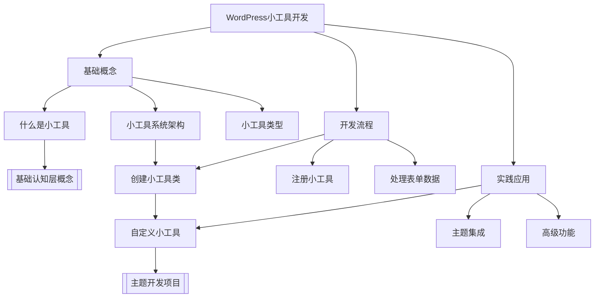
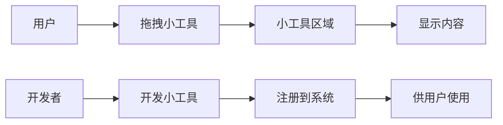
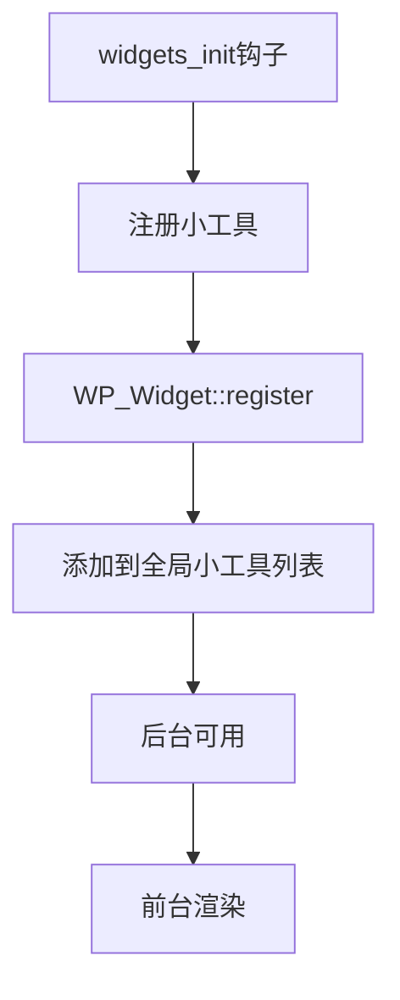
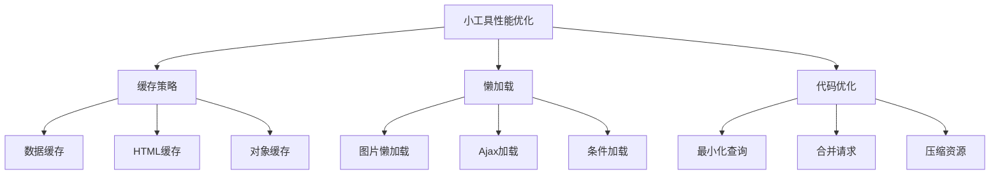

# WordPress小工具（Widget）开发

## 🎯 学习目标

> **认识 → 理解 → 应用**
> - **认识**：了解小工具的基本概念和工作机制
> - **理解**：掌握小工具开发的完整流程和API
> - **应用**：开发自定义小工具并集成到主题中

## 📋 知识地图



## 💡 基础概念认知

### 什么是WordPress小工具

WordPress小工具（Widget）是一种**可复用的UI组件**，允许用户通过拖拽方式在**侧边栏**、**页脚**或**其他小工具区域**添加功能模块。



### 小工具系统架构

| 组件 | 职责 | 位置 |
|------|------|------|
| **小工具API** | 管理系统和小工具生命周期 | `wp-includes/widgets.php` |
| **小工具区域** | 定义小工具的显示位置 | `sidebar.php` / `functions.php` |
| **小工具类** | 封装小工具逻辑和显示 | `wp-includes/widgets/` |
| **小工具表单** | 提供后台配置界面 | `wp-includes/widgets/` |

### 小工具类型分类

| 类型 | 描述 | 示例 |
|------|------|------|
| **原生小工具** | WordPress内置功能 | 文本、分类、标签、搜索 |
| **插件小工具** | 第三方插件提供 | WooCommerce购物车、联系表单 |
| **自定义小工具** | 开发者定制的功能 | 自定义HTML、社交媒体 |

## 🔧 开发流程理解

### 1. 创建小工具类

#### 继承WP_Widget基类

```php
class Custom_Widget extends WP_Widget {
    
    public function __construct() {
        parent::__construct(
            'custom_widget',           // 小工具ID
            __('自定义小工具', 'textdomain'), // 小工具名称
            array(
                'description' => __('这是一个自定义小工具', 'textdomain'),
                'classname'   => 'widget-custom'
            )
        );
    }
    
    // 前台显示方法
    public function widget($args, $instance) {
        echo $args['before_widget'];
        
        if (!empty($instance['title'])) {
            echo $args['before_title'] . apply_filters('widget_title', $instance['title']) . $args['after_title'];
        }
        
        echo '<div class="widget-content">';
        echo '<p>' . esc_html($instance['content']) . '</p>';
        echo '</div>';
        
        echo $args['after_widget'];
    }
    
    // 后台配置表单
    public function form($instance) {
        $title = !empty($instance['title']) ? $instance['title'] : '';
        $content = !empty($instance['content']) ? $instance['content'] : '';
        ?>
        <p>
            <label for="<?php echo $this->get_field_id('title'); ?>">标题：</label>
            <input class="widefat" 
                   id="<?php echo $this->get_field_id('title'); ?>" 
                   name="<?php echo $this->get_field_name('title'); ?>" 
                   type="text" 
                   value="<?php echo esc_attr($title); ?>">
        </p>
        <p>
            <label for="<?php echo $this->get_field_id('content'); ?>">内容：</label>
            <textarea class="widefat" 
                      id="<?php echo $this->get_field_id('content'); ?>" 
                      name="<?php echo $this->get_field_name('content'); ?>" 
                      rows="3"><?php echo esc_attr($content); ?></textarea>
        </p>
        <?php
    }
    
    // 处理更新数据
    public function update($new_instance, $old_instance) {
        $instance = array();
        $instance['title'] = (!empty($new_instance['title'])) ? sanitize_text_field($new_instance['title']) : '';
        $instance['content'] = (!empty($new_instance['content'])) ? sanitize_textarea_field($new_instance['content']) : '';
        
        return $instance;
    }
}
```

### 2. 注册小工具

#### 在functions.php中注册

```php
// 注册小工具到WordPress系统
function register_custom_widget() {
    register_widget('Custom_Widget');
}
add_action('widgets_init', 'register_custom_widget');
```

#### 小工具注册钩子机制



## 🚀 实践应用进阶

### 高级小工具开发技巧

#### 1. 条件显示逻辑

```php
public function widget($args, $instance) {
    // 检查当前页面类型
    if (is_single() && !empty($instance['show_on_single'])) {
        echo $args['before_widget'];
        // 只文章页面显示的内容
        echo $args['after_widget'];
    }
    
    // 检查用户权限
    if (current_user_can('edit_posts') && !empty($instance['admin_only'])) {
        echo $args['before_widget'];
        // 管理员专用内容
        echo $args['after_widget'];
    }
}
```

#### 2. 响应式小工具数据

```php
public function widget($args, $instance) {
    // 使用缓存提高性能
    $cache_key = 'widget_' . $this->id_base . '_' . $args['widget_id'];
    $cached_content = get_transient($cache_key);
    
    if (false === $cached_content) {
        // 执行耗时操作
        $data = wp_remote_get('https://api.example.com/data');
        $cached_content = wp_remote_retrieve_body($data);
        
        // 缓存24小时
        set_transient($cache_key, $cached_content, 24 * HOUR_IN_SECONDS);
    }
    
    echo $args['before_widget'];
    echo $cached_content;
    echo $args['after_widget'];
}
```

#### 3. Ajax动态小工具

```php
public function widget($args, $instance) {
    echo $args['before_widget'];
    ?>
    <div id="widget-content-<?php echo $this->id; ?>">
        <button class="load-more-btn" data-widget-id="<?php echo $this->id; ?>">
            加载更多
        </button>
    </div>
    
    <script>
    jQuery(document).ready(function($) {
        $('.load-more-btn').click(function() {
            var widgetId = $(this).data('widget-id');
            
            $.ajax({
                url: '<?php echo admin_url('admin-ajax.php'); ?>',
                type: 'POST',
                data: {
                    action: 'load_widget_content',
                    widget_id: widgetId,
                    security: '<?php echo wp_create_nonce('widget_ajax_nonce'); ?>'
                },
                success: function(response) {
                    $('#widget-content-' + widgetId).html(response);
                }
            });
        });
    });
    </script>
    <?php
    echo $args['after_widget'];
}
```

### 小工具区域注册

#### 在主题中注册小工具区域

```php
function custom_theme_widgets() {
    register_sidebar(array(
        'name'          => __('侧边栏', 'textdomain'),
        'id'            => 'sidebar-1',
        'description'   => __('主要侧边栏区域', 'textdomain'),
        'before_widget' => '<div id="%1$s" class="widget %2$s">',
        'after_widget'  => '</div>',
        'before_title'  => '<h3 class="widget-title">',
        'after_title'   => '</h3>',
    ));
    
    register_sidebar(array(
        'name'          => __('页脚区域', 'textdomain'),
        'id'            => 'footer-widgets',
        'description'   => __('页脚小工具区域', 'textdomain'),
        'before_widget' => '<div class="footer-widget">',
        'after_widget'  => '</div>',
        'before_title'  => '<h4>',
        'after_title'   => '</h4>',
    ));
}
add_action('widgets_init', 'custom_theme_widgets');
```

#### 在模板中显示小工具

```php
<?php if (is_active_sidebar('sidebar-1')) : ?>
    <div class="sidebar">
        <?php dynamic_sidebar('sidebar-1'); ?>
    </div>
<?php endif; ?>
```

## 📊 开发最佳实践

### 安全性考虑

| 安全问题 | 解决方案 | 代码示例 |
|----------|----------|----------|
| **数据验证** | 使用sanitize函数 | `sanitize_text_field($input)` |
| **输出转义** | 使用esc_html/esc_attr | `echo esc_html($output)` |
| **Nonce验证** | Ajax请求使用wp_nonce | `wp_create_nonce('action')` |
| **权限检查** | 验证用户权限 | `current_user_can('capability')` |

### 性能优化策略



### 调试技巧

#### 开发环境调试

```php
public function widget($args, $instance) {
    // 调试模式输出
    if (defined('WP_DEBUG') && WP_DEBUG) {
        error_log('Widget Data: ' . print_r($instance, true));
        error_log('Widget Args: ' . print_r($args, true));
    }
    
    // 验证模板参数
    if (empty($args['before_widget']) || empty($args['after_widget'])) {
        wp_die('小工具模板参数不完整');
    }
    
    echo $args['before_widget'];
    // ... 其他代码
}
```

## 🎯 刻意练习项目

### 练习题1：文章目录小工具
**目标**：开发自动生成文章目录的小工具
**技能点**：条件逻辑、正则表达式、内容过滤

```php
// 练习要点
class Table_Of_Contents_Widget extends WP_Widget {
    public function widget($args, $instance) {
        // 1. 检查是否在文章页面
        // 2. 提取文章标题（H1-H6）
        // 3. 生成目录结构
        // 4. 添加锚点链接
    }
}
```

### 练习题2：社交媒体分享小工具
**目标**：集成社交分享功能
**技能点**：外部API、缓存、Ajax

### 练习题3：相关文章推荐小工具
**目标**：基于标签和分类推荐文章
**技能点**：WP_Query、相关性算法

## 🔗 拓展学习链接

### 进阶主题
- [[Gutenberg区块开发]] - 现代WordPress编辑体验
- [[自定义文章类型]] - 扩展内容类型
- [[Ajax交互]] - 动态用户体验

### 相关工具
- [[开发工具]] - 提升开发效率
- [[性能优化]] - 优化小工具性能

### 实战项目
- [[前端开发项目]] - 完整前端开发实践
- [[企业官网项目]] - 企业级应用案例

---

## 💬 知识检查

**理解检验**：
1. 小工具类必须继承哪个基类？
2. `widget()`、`form()`、`update()`三个方法的作用分别是什么？
3. 如何注册小工具到WordPress系统？

**应用检验**：
1. 开发一个显示最近评论的小工具
2. 实现小工具的条件显示逻辑
3. 集成Ajax功能提升用户体验

**下一步学习**：[[短代码开发]] → 学习更多扩展WordPress功能的方法
