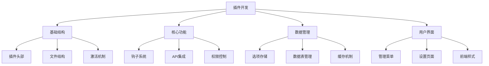
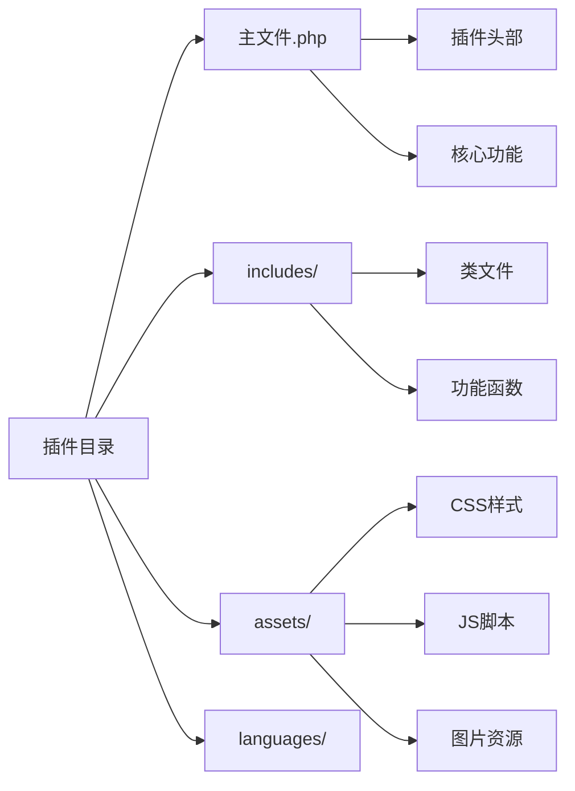

# WordPress插件开发基础

## 🎯 学习目标

> **认识 → 理解 → 应用**
> - **认识**：了解WordPress插件的基本结构和工作机制
> - **理解**：掌握插件开发的核心概念和API
> - **应用**：能够独立开发功能完整的WordPress插件

## 📋 知识地图



## 💡 插件结构认知

### 插件基本信息架构



### 插件文件结构对比

| 文件类型 | 必需性 | 功能 | 样例文件 |
|----------|--------|------|----------|
| **主文件** | ⭐⭐⭐⭐⭐ | 插件入口和核心逻辑 | `my-plugin.php` |
| **样式文件** | ⭐⭐⭐⭐ | 前端样式和UI | `assets/css/style.css` |
| **脚本文件** | ⭐⭐⭐⭐ | 交互功能和Ajax | `assets/js/script.js` |
| **语言文件** | ⭐⭐⭐ | 国际化支持 | `languages/my-plugin.po` |
| **数据库文件** | ⭐⭐⭐ | 数据表结构 | `includes/database.php` |
| **设置页面** | ⭐⭐⭐ | 插件配置界面 | `includes/admin.php` |

### 插件头部信息详解

```php
<?php
/**
 * Plugin Name: 我的功能插件
 * Plugin URI: https://example.com/my-plugin/
 * Description: 这是一个演示WordPress插件开发基础的功能插件，包含了插件的核心功能和管理界面。
 * Version: 1.0.0
 * Author: 开发者姓名
 * Author URI: https://example.com/
 * License: GPL v2 or later
 * License URI: https://www.gnu.org/licenses/gpl-2.0.html
 * Text Domain: my-plugin
 * Domain Path: /languages
 * Requires at least: 5.0
 * Tested up to: 6.4
 * Requires PHP: 7.4
 * Network: false
 * 
 * @package MyPlugin
 * @since 1.0.0
 */

// 防止直接访问
if (!defined('ABSPATH')) {
    exit;
}

// 定义插件常量
define('MY_PLUGIN_VERSION', '1.0.0');
define('MY_PLUGIN_DIR', plugin_dir_path(__FILE__));
define('MY_PLUGIN_URL', plugin_dir_url(__FILE__));
define('MY_PLUGIN_BASENAME', plugin_basename(__FILE__));
?>
```

## 🔧 插件开发理解

### 插件核心类架构

```php
<?php
/**
 * 插件主类
 * 实现插件的核心功能和生命周期管理
 */
class MyPlugin {
    
    /**
     * 插件实例（单例模式）
     */
    private static $instance = null;
    
    /**
     * 插件版本
     */
    const VERSION = '1.0.0';
    
    /**
     * 获取插件实例
     */
    public static function get_instance() {
        if (null === self::$instance) {
            self::$instance = new self();
        }
        return self::$instance;
    }
    
    /**
     * 构造函数
     */
    private function __construct() {
        // 防止多次实例化
        add_action('init', array($this, 'init'));
        add_action('wp_loaded', array($this, 'wp_loaded'));
        
        // 插件激活和停用钩子
        register_activation_hook(__FILE__, array($this, 'activate'));
        register_deactivation_hook(__FILE__, array($this, 'deactivate'));
        
        // 加载其他组件
        $this->load_includes();
        $this->init_hooks();
    }
    
    /**
     * 初始化钩子
     */
    private function init_hooks() {
        // 前台钩子
        add_action('wp_enqueue_scripts', array($this, 'enqueue_frontend_scripts'));
        add_action('template_redirect', array($this, 'handle_custom_routes'));
        
        // 后台钩子
        add_action('admin_menu', array($this, 'add_admin_menu'));
        add_action('admin_enqueue_scripts', array($this, 'enqueue_admin_scripts'));
        add_action('admin_init', array($this, 'register_settings'));
        
        // Ajax钩子
        add_action('wp_ajax_my_plugin_action', array($this, 'handle_ajax_request'));
        add_action('wp_ajax_nopriv_my_plugin_action', array($this, 'handle_ajax_request'));
        
        // 内容钩子
        add_filter('the_content', array($this, 'modify_content'));
        add_action('save_post', array($this, 'handle_post_save'));
    }
    
    /**
     * WordPress初始化完成后执行
     */
    public function init() {
        // 加载文本域
        load_plugin_textdomain(
            'my-plugin',
            false,
            dirname(plugin_basename(__FILE__)) . '/languages'
        );
        
        // 检查更新
        add_action('admin_notices', array($this, 'check_requirements'));
    }
    
    /**
     * WordPress完全加载后执行
     */
    public function wp_loaded() {
        // 延迟加载的功能
        $this->setup_shortcodes();
        $this->register_post_types();
        $this->init_widgets();
    }
    
    /**
     * 加载必需的类文件
     */
    private function load_includes() {
        $includes_dir = MY_PLUGIN_DIR . 'includes/';
        
        $files = array(
            'class-admin.php',
            'class-frontend.php',
            'class-database.php',
            'class-api.php'
        );
        
        foreach ($files as $file) {
            $file_path = $includes_dir . $file;
            if (file_exists($file_path)) {
                require_once $file_path;
            }
        }
    }
}
```

### 插件激活和停用机制

```php
<?php
/**
 * 插件生命周期管理
 * 处理插件的激活、停用和卸载
 */
class PluginLifecycleManager {
    
    /**
     * 插件激活处理
     */
    public static function activate() {
        // 检查WordPress和PHP版本
        self::check_requirements();
        
        // 创建数据库表
        self::create_database_tables();
        
        // 设置默认选项
        self::set_default_options();
        
        // 创建目录
        self::create_plugin_directories();
        
        // 刷新重写规则
        flush_rewrite_rules();
        
        // 记录激活日志
        self::log_activation();
    }
    
    /**
     * 插件停用处理
     */
    public static function deactivate() {
        // 清理临时数据
        self::cleanup_temporary_data();
        
        // 刷新重写规则
        flush_rewrite_rules();
        
        // 记录停用日志
        self::log_deactivation();
    }
    
    /**
     * 插件卸载处理（完全删除时）
     */
    public static function uninstall() {
        // 检查权限
        if (!current_user_can('delete_plugins')) {
            return;
        }
        
        // 检查是否要删除数据
        $options = get_option('my_plugin_settings', array());
        if (!isset($options['delete_data_on_uninstall']) || !$options['delete_data_on_uninstall']) {
            return;
        }
        
        // 删除自定义数据表
        self::drop_database_tables();
        
        // 删除选项数据
        self::delete_option_data();
        
        // 删除用户元数据
        self::delete_user_meta_data();
        
        // 删除文件
        self::delete_plugin_files();
    }
    
    /**
     * 检查系统要求
     */
    private static function check_requirements() {
        global $wp_version;
        
        $requirements = array(
            'WordPress >= 5.0' => version_compare($wp_version, '5.0', '>='),
            'PHP >= 7.4' => version_compare(PHP_VERSION, '7.4', '>='),
            'MySQL >= 5.6' => version_compare(self::get_mysql_version(), '5.6', '>=')
        );
        
        foreach ($requirements as $requirement => $check) {
            if (!$check) {
                wp_die(
                    sprintf('插件激活失败：%s 不符合要求', $requirement),
                    '系统要求不满足',
                    array('back_link' => true)
                );
            }
        }
    }
    
    /**
     * 创建数据库表
     */
    private static function create_database_tables() {
        global $wpdb;
        
        $charset_collate = $wpdb->get_charset_collate();
        
        // 插件自定义数据表
        $table_name = $wpdb->prefix . 'my_plugin_data';
        
        $sql = "CREATE TABLE $table_name (
            id mediumint(9) NOT NULL AUTO_INCREMENT,
            title text NOT NULL,
            content longtext,
            status varchar(20) default 'active',
            created_at datetime DEFAULT CURRENT_TIMESTAMP,
            updated_at datetime DEFAULT CURRENT_TIMESTAMP ON UPDATE CURRENT_TIMESTAMP,
            PRIMARY KEY (id),
            KEY status_index (status),
            KEY created_at_index (created_at)
        ) $charset_collate;";
        
        require_once(ABSPATH . 'wp-admin/includes/upgrade.php');
        dbDelta($sql);
    }
    
    /**
     * 设置默认选项
     */
    private static function set_default_options() {
        $default_options = array(
            'my_plugin_enabled' => true,
            'my_plugin_version' => MY_PLUGIN_VERSION,
            'my_plugin_settings' => array(
                'api_key' => '',
                'auto_update' => true,
                'debug_mode' => false,
                'notification_email' => get_option('admin_email'),
            )
        );
        
        foreach ($default_options as $option_name => $default_value) {
            if (!get_option($option_name)) {
                add_option($option_name, $default_value);
            }
        }
    }
}

// 注册插件生命周期钩子
register_activation_hook(__FILE__, array('PluginLifecycleManager', 'activate'));
register_deactivation_hook(__FILE__, array('PluginLifecycleManager', 'deactivate'));
register_uninstall_hook(__FILE__, array('PluginLifecycleManager', 'uninstall'));
?>
```

## 🚀 数据管理应用

### 数据库操作抽象层

```php
<?php
/**
 * 数据库操作抽象类
 * 提供安全的数据库操作方法
 */
abstract class Plugin_DB {
    
    /**
     * 数据表名前缀
     */
    protected $table_prefix;
    
    /**
     * WordPress数据库对象
     */
    protected $wpdb;
    
    /**
     * 构造函数
     */
    public function __construct() {
        global $wpdb;
        $this->wpdb = $wpdb;
        $this->table_prefix = $wpdb->prefix . 'my_plugin_';
    }
    
    /**
     * 插入数据
     */
    protected function insert($table, $data, $format = null) {
        $table_name = $this->table_prefix . $table;
        
        // 数据验证
        $data = $this->sanitize_data($data);
        
        // 准备格式
        if ($format === null) {
            $format = $this->get_format_array($data);
        }
        
        // 执行插入
        $result = $this->wpdb->insert($table_name, $data, $format);
        
        if ($result === false) {
            $this->log_error('Data insert failed: ' . $this->wpdb->last_error);
            return false;
        }
        
        return $this->wpdb->insert_id;
    }
    
    /**
     * 更新数据
     */
    protected function update($table, $data, $where, $format = null, $where_format = null) {
        $table_name = $this->table_prefix . $table;
        
        // 数据验证
        $data = $this->sanitize_data($data);
        $where = $this->sanitize_data($where);
        
        // 执行更新
        $result = $this->wpdb->update($table_name, $data, $where, $format, $where_format);
        
        if ($result === false) {
            $this->log_error('Data update failed: ' . $this->wpdb->last_error);
            return false;
        }
        
        return $result;
    }
    
    /**
     * 查询数据
     */
    protected function select($table, $where = null, $format = null, $order_by = null, $limit = null) {
        $table_name = $this->table_prefix . $table;
        
        // 构建查询
        $sql = "SELECT * FROM {$table_name}";
        
        if ($where) {
            $where_clause = $this->build_where_clause($where, $format);
            $sql .= " WHERE {$where_clause}";
        }
        
        if ($order_by) {
            $sql .= " ORDER BY {$order_by}";
        }
        
        if ($limit) {
            $sql .= " LIMIT {$limit}";
        }
        
        // 准备语句
        if ($where && $format) {
            $sql = $this->wpdb->prepare($sql, ...array_values($where));
        }
        
        return $this->wpdb->get_results($sql, ARRAY_A);
    }
    
    /**
     * 删除数据
     */
    protected function delete($table, $where, $where_format = null) {
        $table_name = $this->table_prefix . $table;
        
        // 数据验证
        $where = $this->sanitize_data($where);
        
        // 执行删除
        $result = $this->wpdb->delete($table_name, $where, $where_format);
        
        if ($result === false) {
            $this->log_error('Data delete failed: ' . $this->wpdb->last_error);
            return false;
        }
        
        return $result;
    }
    
    /**
     * 数据清理
     */
    protected function sanitize_data($data) {
        if (is_array($data)) {
            foreach ($data as $key => $value) {
                $data[$key] = $this->sanitize_value($value);
            }
        }
        return $data;
    }
    
    /**
     * 单个值清理
     */
    protected function sanitize_value($value) {
        if (is_string($value)) {
            return sanitize_text_field($value);
        } elseif (is_email($value)) {
            return sanitize_email($value);
        } elseif (is_url($value)) {
            return esc_url_raw($value);
        } elseif (is_numeric($value)) {
            return floatval($value);
        }
        return $value;
    }
    
    /**
     * 构建WHERE子句
     */
    protected function build_where_clause($where, $format) {
        $where_parts = array();
        
        foreach ($where as $key => $value) {
            $format_char = isset($format[$key]) ? $format[$key] : '%s';
            $where_parts[] = "{$key} = {$format_char}";
        }
        
        return implode(' AND ', $where_parts);
    }
    
    /**
     * 获取格式数组
     */
    protected function get_format_array($data) {
        $format = array();
        
        foreach ($data as $value) {
            if (is_int($value)) {
                $format[] = '%d';
            } elseif (is_float($value)) {
                $format[] = '%f';
            } else {
                $format[] = '%s';
            }
        }
        
        return $format;
    }
    
    /**
     * 错误日志记录
     */
    protected function log_error($message) {
        if (defined('WP_DEBUG') && WP_DEBUG) {
            error_log('Plugin DB Error: ' . $message);
        }
    }
}
?>
```

### 选项管理类

```php
<?php
/**
 * 插件选项管理类
 * 统一管理插件设置和配置选项
 */
class PluginOptionsManager {
    
    /**
     * 选项组名称
     */
    const OPTION_GROUP = 'my_plugin_options';
    
    /**
     * 所有选项的默认值
     */
    private static $defaults = array(
        'general' => array(
            'enabled' => true,
            'debug_mode' => false,
            'auto_update' => true,
        ),
        'api' => array(
            'api_key' => '',
            'api_url' => 'https://api.example.com',
            'rate_limit' => 100,
        ),
        'ui' => array(
            'theme_color' => '#0073aa',
            'show_notifications' => true,
            'admin_bar_menu' => true,
        ),
        'advanced' => array(
            'cleanup_on_uninstall' => false,
            'enable_logging' => true,
            'cache_duration' => 3600,
        )
    );
    
    /**
     * 获取选项值
     */
    public static function get_option($section, $key = null, $default = null) {
        $options = get_option(self::OPTION_GROUP . '_' . $section, array());
        
        // 如果没有传入key，返回整个section
        if ($key === null) {
            $section_defaults = isset(self::$defaults[$section]) ? self::$defaults[$section] : array();
            return array_merge(self::$defaults[$section], $options);
        }
        
        // 获取特定key的值
        $value = isset($options[$key]) ? $options[$key] : $default;
        
        // 如果没有找到值，尝试默认值
        if ($value === null && isset(self::$defaults[$section][$key])) {
            $value = self::$defaults[$section][$key];
        }
        
        return $value;
    }
    
    /**
     * 更新选项值
     */
    public static function update_option($section, $key, $value) {
        $options = get_option(self::OPTION_GROUP . '_' . \$section, array());
        $options[$key] = self::sanitize_option_value($value);
        update_option(self::OPTION_GROUP . '_' . $section, $options);
        
        // 触发选项更新钩子
        do_action('my_plugin_option_updated', $section, $key, $value);
    }
    
    /**
     * 批量更新选项
     */
    public static function update_options($section, $options_array) {
        $current_options = get_option(self::OPTION_GROUP . '_' . $section, array());
        $new_options = array_merge($current_options, $options_array);
        
        // 清理每个值
        foreach ($new_options as $key => $value) {
            $new_options[$key] = self::sanitize_option_value($value);
        }
        
        update_option(self::OPTION_GROUP . '_' . $section, $new_options);
        
        // 触发批量更新钩子
        do_action('my_plugin_options_updated', $section, $new_options);
    }
    
    /**
     * 重置选项到默认值
     */
    public static function reset_to_defaults($section = null) {
        if ($section === null) {
            // 重置所有section
            foreach (self::$defaults as $section_name => $default_values) {
                update_option(self::OPTION_GROUP . '_' . $section_name, $default_values);
            }
        } else {
            // 重置特定section
            if (isset(self::$defaults[$section])) {
                update_option(self::OPTION_GROUP . '_' . $section, self::$defaults[$section]);
            }
        }
        
        do_action('my_plugin_options_reset', $section);
    }
    
    /**
     * 选项值清理
     */
    private static function sanitize_option_value($value) {
        if (is_string($value)) {
            return sanitize_text_field($value);
        } elseif (is_array($value)) {
            foreach ($value as $key => $val) {
                $value[$key] = self::sanitize_option_value($val);
            }
            return $value;
        } elseif (is_bool($value)) {
            return (bool) $value;
        } elseif (is_numeric($value)) {
            return is_float($value) ? floatval($value) : intval($value);
        }
        
        return $value;
    }
    
    /**
     * 验证选项值
     */
    public static function validate_option($section, $key, $value) {
        // 定义字段验证规则
        $rules = array(
            'api_key' => array(
                'type' => 'string',
                'required' => true,
                'min_length' => 10,
                'pattern' => '/^[a-zA-Z0-9_-]+$/'
            ),
            'rate_limit' => array(
                'type' => 'integer',
                'min' => 1,
                'max' => 10000
            ),
            'theme_color' => array(
                'type' => 'string',
                'pattern' => '/^#[0-9a-fA-F]{6}$/'
            )
        );
        
        if (!isset($rules[$key])) {
            return true; // 没有特殊规则，默认有效
        }
        
        $rule = $rules[$key];
        
        // 类型检查
        if (isset($rule['type'])) {
            switch ($rule['type']) {
                case 'string':
                    if (!is_string($value)) return false;
                    break;
                case 'integer':
                    if (!is_int($value) && !ctype_digit($value)) return false;
                    $value = intval($value);
                    break;
                case 'boolean':
                    if (!is_bool($value)) return false;
                    break;
            }
        }
        
        // 长度检查
        if (isset($rule['min_length']) && strlen($value) < $rule['min_length']) {
            return false;
        }
        
        // 数值范围检查
        if (isset($rule['min']) && $value < $rule['min']) {
            return false;
        }
        if (isset($rule['max']) && $value > $rule['max']) {
            return false;
        }
        
        // 模式匹配
        if (isset($rule['pattern']) && !preg_match($rule['pattern'], $value)) {
            return false;
        }
        
        return true;
    }
}
?>
```

## 🎯 用户界面构建

### 管理页面开发

```php
<?php
/**
 * 插件管理界面类
 * 创建美观实用的插件设置页面
 */
class PluginAdminInterface {
    
    /**
     * 添加管理菜单
     */
    public static function add_admin_menus() {
        // 主菜单页面
        add_menu_page(
            '我的插件',                     // 页面标题
            '我的插件',                     // 菜单标题
            'manage_options',               // 权限
            'my-plugin',                    // 菜单slug
            array(__CLASS__, 'admin_page'), // 回调函数
            'dashicons-admin-generic',      // 图标
            30                             // 位置
        );
        
        // 子菜单：设置
        add_submenu_page(
            'my-plugin',
            '插件设置',
            '设置',
            'manage_options',
            'my-plugin-settings',
            array(__CLASS__, 'settings_page')
        );
        
        // 子菜单：统计
        add_submenu_page(
            'my-plugin',
            '插件统计',
            '统计',
            'manage_options',
            'my-plugin-stats',
            array(__CLASS__, 'stats_page')
        );
        
        // 添加工具菜单（可选）
        add_management_page(
            '插件工具',
            '插件工具',
            'manage_options',
            'my-plugin-tools',
            array(__CLASS__, 'tools_page')
        );
    }
    
    /**
     * 主管理页面
     */
    public static function admin_page() {
        ?>
        <div class="wrap">
            <h1><?php echo esc_html(get_admin_page_title()); ?></h1>
            
            <div class="notice notice-info">
                <p>欢迎使用我的插件！这里是插件的主要功能区域。</p>
            </div>
            
            <div class="my-plugin-admin-dashboard">
                <div class="dashboard-widgets">
                    
                    <!-- 功能概述卡片 -->
                    <div class="dashboard-card">
                        <h2>功能概述</h2>
                        <div class="card-content">
                            <p>插件当前状态：<strong class="status-enabled">已启用</strong></p>
                            <p>最后更新：<?php echo get_option('my_plugin_version'); ?></p>
                            <p>数据库记录：<?php echo self::get_total_records(); ?> 条</p>
                        </div>
                    </div>
                    
                    <!-- 快速设置卡片 -->
                    <div class="dashboard-card">
                        <h2>快速设置</h2>
                        <div class="card-content">
                            <form method="post" action="options.php">
                                <?php
                                settings_fields('my_plugin_general');
                                do_settings_sections('my_plugin_general');
                                ?>
                                <table class="form-table">
                                    <tr>
                                        <th scope="row">启用插件</th>
                                        <td>
                                            <input type="checkbox" name="my_plugin_enabled" 
                                                   value="1" <?php checked(1, get_option('my_plugin_enabled')); ?> />
                                            <label for="my_plugin_enabled">启用插件的主要功能</label>
                                        </td>
                                    </tr>
                                    <tr>
                                        <th scope="row">调试模式</th>
                                        <td>
                                            <input type="checkbox" name="my_plugin_debug_mode" 
                                                   value="1" <?php checked(1, get_option('my_plugin_debug_mode')); ?> />
                                            <label for="my_plugin_debug_mode">启用调试模式（仅开发环境推荐）</label>
                                        </td>
                                    </tr>
                                </table>
                                <?php submit_button('保存设置'); ?>
                            </form>
                        </div>
                    </div>
                    
                    <!-- 最新活动卡片 -->
                    <div class="dashboard-card">
                        <h2>最新活动</h2>
                        <div class="card-content">
                            <?php self::display_recent_activities(); ?>
                        </div>
                    </div>
                    
                </div>
            </div>
            
            <!-- 内置CSS样式 -->
            <style>
                .my-plugin-admin-dashboard {
                    margin-top: 20px;
                }
                
                .dashboard-widgets {
                    display: grid;
                    grid-template-columns: repeat(auto-fit, minmax(300px, 1fr));
                    gap: 20px;
                }
                
                .dashboard-card {
                    background: #fff;
                    padding: 20px;
                    border: 1px solid #ccd0d4;
                    border-radius: 4px;
                    box-shadow: 0 1px 1px rgba(0,0,0,.04);
                }
                
                .dashboard-card h2 {
                    margin: 0 0 15px 0;
                    color: #23282d;
                    border-bottom: 1px solid #eee;
                    padding-bottom: 10px;
                }
                
                .status-enabled {
                    color: #46b450;
                }
                
                .status-disabled {
                    color: #dc3232;
                }
            </style>
        </div>
        <?php
    }
    
    /**
     * 设置页面
     */
    public static function settings_page() {
        ?>
        <div class="wrap">
            <h1>插件设置</h1>
            
            <form method="post" action="options.php">
                <?php
                settings_fields('my_plugin_settings');
                do_settings_sections('my_plugin_settings');
                ?>
                
                <h2>API设置</h2>
                <table class="form-table">
                    <tr>
                        <th scope="row">
                            <label for="api_key">API密钥</label>
                        </th>
                        <td>
                            <input type="text" id="api_key" name="my_plugin_api_key" 
                                   value="<?php echo esc_attr(get_option('my_plugin_api_key')); ?>" 
                                   class="regular-text" />
                            <p class="description">请输入API密钥以获得完整功能支持</p>
                        </td>
                    </tr>
                    <tr>
                        <th scope="row">
                            <label for="api_url">API地址</label>
                        </th>
                        <td>
                            <input type="url" id="api_url" name="my_plugin_api_url" 
                                   value="<?php echo esc_attr(get_option('my_plugin_api_url')); ?>" 
                                   class="regular-text" />
                            <p class="description">API服务的完整URL地址</p>
                        </td>
                    </tr>
                </table>
                
                <h2>界面设置</h2>
                <table class="form-table">
                    <tr>
                        <th scope="row">
                            <label for="theme_color">主题色彩</label>
                        </th>
                        <td>
                            <input type="color" id="theme_color" name="my_plugin_theme_color" 
                                   value="<?php echo esc_attr(get_option('my_plugin_theme_color', '#0073aa')); ?>" />
                            <p class="description">选择插件界面的主要色彩</p>
                        </td>
                    </tr>
                </table>
                
                <?php submit_button(); ?>
            </form>
        </div>
        <?php
    }
    
    /**
     * 统计页面
     */
    public static function stats_page() {
        ?>
        <div class="wrap">
            <h1>插件统计</h1>
            
            <div class="stats-grid">
                <div class="stats-card">
                    <h3>使用统计</h3>
                    <div class="stats-content">
                        <div class="stat-item">
                            <span class="stat-number"><?php echo self::get_total_usage(); ?></span>
                            <span class="stat-label">总使用次数</span>
                        </div>
                        <div class="stat-item">
                            <span class="stat-number"><?php echo self::get_daily_usage(); ?></span>
                            <span class="stat-label">今日使用</span>
                        </div>
                    </div>
                </div>
                
                <div class="stats-card">
                    <h3>性能指标</h3>
                    <div class="stats-content">
                        <div class="stat-item">
                            <span class="stat-number"><?php echo self::get_avg_response_time(); ?>ms</span>
                            <span class="stat-label">平均响应时间</span>
                        </div>
                        <div class="stat-item">
                            <span class="stat-number"><?php echo self::get_success_rate(); ?>%</span>
                            <span class="stat-label">成功率</span>
                        </div>
                    </div>
                </div>
            </div>
            
            <style>
                .stats-grid {
                    display: grid;
                    grid-template-columns: repeat(auto-fit, minmax(300px, 1fr));
                    gap: 20px;
                    margin-top: 20px;
                }
                
                .stats-card {
                    background: #fff;
                    padding: 20px;
                    border: 1px solid #ccd0d4;
                    border-radius: 4px;
                }
                
                .stats-card h3 {
                    margin: 0 0 15px 0;
                    color: #23282d;
                }
                
                .stat-item {
                    display: flex;
                    justify-content: space-between;
                    padding: 10px 0;
                    border-bottom: 1px solid #eee;
                }
                
                .stat-number {
                    font-size: 24px;
                    font-weight: bold;
                    color: #0073aa;
                }
            </style>
        </div>
        <?php
    }
    
    /**
     * 注册设置字段
     */
    public static function register_settings() {
        // 注册设置
        register_setting('my_plugin_settings', 'my_plugin_api_key', array('sanitize_callback' => 'sanitize_text_field'));
        register_setting('my_plugin_settings', 'my_plugin_api_url', array('sanitize_callback' => 'esc_url_raw'));
        register_setting('my_plugin_settings', 'my_plugin_theme_color', array('sanitize_callback' => 'sanitize_hex_color'));
        
        // 添加设置section
        add_settings_section(
            'my_plugin_general_section',
            '常规设置',
            array(__CLASS__, 'general_section_callback'),
            'my_plugin_settings'
        );
    }
    
    /**
     * 获取总记录数
     */
    private static function get_total_records() {
        global $wpdb;
        $table_name = $wpdb->prefix . 'my_plugin_data';
        return $wpdb->get_var("SELECT COUNT(*) FROM {$table_name}");
    }
    
    /**
     * 显示最近活动
     */
    private static function display_recent_activities() {
        $activities = get_option('my_plugin_recent_activities', array());
        
        if (empty($activities)) {
            echo '<p>暂无最近活动</p>';
            return;
        }
        
        echo '<ul>';
        foreach (array_slice($activities, -5) as $activity) {
            echo '<li>' . esc_html($activity['message']) . ' - ' . esc_html($activity['time']) . '</li>';
        }
        echo '</ul>';
    }
    
    /**
     * 获取使用统计
     */
    private static function get_total_usage() {
        return get_option('my_plugin_total_usage', 0);
    }
    
    private static function get_daily_usage() {
        return get_option('my_plugin_daily_usage_' . date('Y-m-d'), 0);
    }
    
    private static function get_avg_response_time() {
        return get_option('my_plugin_avg_response_time', 0);
    }
    
    private static function get_success_rate() {
        return get_option('my_plugin_success_rate', 100);
    }
}
?>
```

## 🎯 刻意练习项目

### 练习1：联系表单插件
**目标**：开发一个完全功能的联系表单插件
**技能点**：短代码、Ajax处理、邮件发送、数据存储

### 练习2：数据图表插件
**目标**：创建数据可视化插件
**技能点**：数据库操作、API开发、图表库集成

### 练习3：缓存管理插件
**目标**：开发高级缓存管理工具
**技能点**：缓存机制、性能优化、清理策略

## 🔗 拓展学习链接

### 进阶主题
- [[短代码开发]] - WordPress短代码系统
- [[用户权限系统]] - 高级权限控制
- [[后端开发项目]] - 实战开发项目

### 相关技术
- [[钩子机制]] - WordPress扩展机制
- [[性能优化]] - 插件性能优化
- [[安全防护]] - 插件安全实践

### 实战项目
- [[会员系统项目]] - 高级插件开发
- [[性能优化项目]] - 性能优化插件

---

## 💬 知识检查

**理解检验**：
1. 插件的基本组织结构是什么？
2. 插件的生命周期包括哪些阶段？
3. 如何安全地处理插件数据存储？

**应用检验**：
1. 能够独立开发一个功能完整的WordPress插件
2. 理解插件与主题的区别和联系
3. 掌握插件开发的性能优化和安全实践

### 故障排除

#### 常见插件问题

| 问题 | 原因 | 解决方案 |
|------|------|----------|
| **插件无法激活** | PHP语法错误或缺少必需函数 | 启用调试模式检查错误 |
| **选项数据丢失** | 数据库表未正确创建 | 重新激活插件，检查数据库 |
| **功能冲突** | 钩子优先级或命名冲突 | 检查钩子名称，调整优先级 |

**下一步学习**：[[短代码开发]] → 学习插件功能的用户接口
