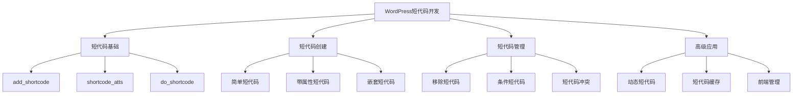
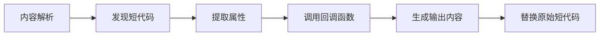

# WordPress短代码开发详解

## 🎯 学习目标

> **认识 → 理解 → 应用**
> - **认识**：了解WordPress短代码的基本概念和工作机制
> - **理解**：掌握短代码开发的核心技术和最佳实践
> - **应用**：能够开发功能完整的自定义短代码系统

## 📋 知识地图



## 💡 短代码基础认知

### WordPress短代码机制



### 短代码函数对比

| 函数名 | 用途 | 参数 | 返回值 | 示例 |
|--------|------|------|--------|------|
| **add_shortcode()** | 注册短代码 | `$tag, $callback` | `void` | `add_shortcode('test', 'test_shortcode')` |
| **shortcode_atts()** | 解析属性 | `$pairs, $atts` | `array` | `shortcode_atts(array('url' => ''), $atts)` |
| **do_shortcode()** | 手动执行短代码 | `$content` | `string` | `do_shortcode('[gallery]')` |
| **remove_shortcode()** | 移除短代码 | `$tag` | `bool` | `remove_shortcode('gallery')` |
| **get_shortcode_regex()** | 获取短代码正则 | 无 | `string` | `get_shortcode_regex()` |
| **shortcode_exists()** | 检查短代码是否存在 | `$tag` | `bool` | `shortcode_exists('test')` |

## 🔧 短代码开发理解

### 基础短代码创建

```php
<?php
/**
 * WordPress基础短代码开发指南
 * 从简单到复杂的短代码实现
 */

// 1. 最简单短代码
function hello_world_shortcode($atts, $content = null) {
    return '<div class="hello-world">Hello World!</div>';
}
add_shortcode('hello', 'hello_world_shortcode');

// 2. 带属性的短代码
function button_shortcode($atts, $content = null) {
    // 默认属性
    $atts = shortcode_atts(array(
        'url' => '#',
        'target' => '_self',
        'size' => 'medium',
        'color' => 'primary',
        'class' => ''
    ), $atts);
    
    // 构建CSS类
    $classes = array('button');
    $classes[] = 'button-' . $atts['size'];
    $classes[] = 'button-' . $atts['color'];
    
    if (!empty($atts['class'])) {
        $classes[] = $atts['class'];
    }
    
    $class_string = implode(' ', $classes);
    
    // 生成HTML
    $output = '<a href="' . esc_url($atts['url']) . '" ';
    $output .= 'target="' . esc_attr($atts['target']) . '" ';
    $output .= 'class="' . esc_attr($class_string) . '">';
    $output .= esc_html($content);
    $output .= '</a>';
    
    return $output;
}
add_shortcode('button', 'button_shortcode');

// 3. 带闭合标签的短代码
function card_shortcode($atts, $content = null) {
    $atts = shortcode_atts(array(
        'title' => '',
        'style' => 'default',
        'width' => 'auto'
    ), $atts);
    
    $output = '<div class="card card-' . esc_attr($atts['style']);
    $output .= (' width="' . esc_attr($atts['width']) . '"') ?: '';
    $output .= '">';
    
    if (!empty($atts['title'])) {
        $output .= '<div class="card-header"><h3>' . esc_html($atts['title']) . '</h3></div>';
    }
    
    if (!empty($content)) {
        // 处理嵌套的短代码
        $processed_content = do_shortcode($content);
        $output .= '<div class="card-body">' . $processed_content . '</div>';
    }
    
    $output .= '</div>';
    
    return $output;
}
add_shortcode('card', 'card_shortcode');

// 4. 复杂短代码 - 产品展示
function product_showcase_shortcode($atts, $content = null) {
    $atts = shortcode_atts(array(
        'id' => '',
        'name' => '',
        'price' => '',
        'image' => '',
        'description' => '',
        'featured' => false,
        'category' => '',
        'layout' => 'horizontal'
    ), $atts);
    
    // 如果没有指定ID，使用名称查找
    $product_id = $atts['id'];
    if (empty($product_id) && !empty($atts['name'])) {
        $product = get_page_by_title($atts['name'], OBJECT, 'product');
        if ($product) {
            $product_id = $product->ID;
        }
    }
    
    // 从数据库获取产品信息
    if (!empty($product_id)) {
        $atts['name'] = $atts['name'] ?: get_the_title($product_id);
        $atts['price'] = $atts['price'] ?: get_post_meta($product_id, '_price', true);
        $atts['description'] = $atts['description'] ?: get_the_excerpt($product_id);
        $atts['image'] = $atts['image'] ?: get_the_post_thumbnail_url($product_id, 'medium');
    }
    
    // 验证数据
    if (empty($atts['name']) || empty($atts['price'])) {
        return '<div class="error">Product information required</div>';
    }
    
    // 构建产品卡片
    $classes = array('product-showcase');
    $classes[] = 'layout-' . $atts['layout'];
    
    if ($atts['featured'] === 'true') {
        $classes[] = 'featured';
    }
    
    $output = '<div class="' . implode(' ', $classes) . '">';
    
    // 产品图片
    if (!empty($atts['image'])) {
        $output .= '<div class="product-image">';
        $output .= '';
        if ($atts['featured'] === 'true') {
            $output .= '<span class="featured-badge">Featured</span>';
        }
        $output .= '</div>';
    }
    
    // 产品信息
    $output .= '<div class="product-info">';
    $output .= '<h3 class="product-name">' . esc_html($atts['name']) . '</h3>';
    
    if (!empty($atts['description'])) {
        $output .= '<p class="product-description">' . esc_html($atts['description']) . '</p>';
    }
    
    $output .= '<div class="product-price">$' . esc_html($atts['price']) . '</div>';
    
    // 添加按钮
    if (!empty($content)) {
        $output .= '<div class="product-actions">';
        $output .= do_shortcode($content);
        $output .= '</div>';
    }
    
    $output .= '</div></div>';
    
    return $output;
}
add_shortcode('product', 'product_showcase_shortcode');
?>
```

### 嵌套短代码系统

```php
<?php
/**
 * WordPress嵌套短代码实现
 * 创建复杂的嵌套短代码结构
 */

class Nested_Shortcode_Manager {
    
    private static $nesting_level = 0;
    private static $max_nesting = 3;
    
    /**
     * 注册嵌套短代码系统
     */
    public static function init() {
        // 注册容器短代码
        add_shortcode('container', array(__CLASS__, 'container_shortcode'));
        add_shortcode('row', array(__CLASS__, 'row_shortcode'));
        add_shortcode('column', array(__CLASS__, 'column_shortcode'));
        
        // 注册组件短代码
        add_shortcode('section', array(__CLASS__, 'section_shortcode'));
        add_shortcode('header', array(__CLASS__, 'header_shortcode'));
        add_shortcode('footer', array(__CLASS__, 'footer_shortcode'));
        
        // 注册交互短代码
        add_shortcode('accordion', array(__CLASS__, 'accordion_shortcode'));
        add_shortcode('tab', array(__CLASS__, 'tab_shortcode'));
        add_shortcode('tabs', array(__CLASS__, 'tabs_shortcode'));
    }
    
    /**
     * 容器短代码
     */
    public static function container_shortcode($atts, $content = null) {
        // 检查嵌套级别
        if (!self::check_nesting_level()) {
            return '<div class="error">Maximum nesting level exceeded</div>';
        }
        
        $atts = shortcode_atts(array(
            'width' => 'full',
            'padding' => 'normal',
            'background' => 'transparent',
            'class' => ''
        ), $atts);
        
        $classes = array('container');
        $classes[] = 'width-' . $atts['width'];
        $classes[] = 'padding-' . $atts['padding'];
        $classes[] = 'bg-' . $atts['background'];
        
        if (!empty($atts['class'])) {
            $classes[] = $atts['class'];
        }
        
        $style = '';
        if ($atts['background'] !== 'transparent') {
            $style = 'background-color: ' . $atts['background'] . ';';
        }
        
        $output = '<div class="' . implode(' ', $classes) . '"';
        if (!empty($style)) {
            $output .= ' style="' . esc_attr($style) . '"';
        }
        $output .= '>';
        
        if (!empty($content)) {
            $output .= do_shortcode($content);
        }
        
        $output .= '</div>';
        
        return $output;
    }
    
    /**
     * 行短代码（Bootstrap风格）
     */
    public static function row_shortcode($atts, $content = null) {
        $atts = shortcode_atts(array(
            'gutters' => 'true',
            'align' => '',
            'class' => ''
        ), $atts);
        
        $classes = array('row');
        
        if ($atts['gutters'] === 'false') {
            $classes[] = 'no-gutters';
        }
        
        if (!empty($atts['align'])) {
            $classes[] = 'align-' . $atts['align'];
        }
        
        if (!empty($atts['class'])) {
            $classes[] = $atts['class'];
        }
        
        $output = '<div class="' . implode(' ', $classes) . '">';
        $output .= do_shortcode($content);
        $output .= '</div>';
        
        return $output;
    }
    
    /**
     * 列短代码
     */
    public static function column_shortcode($atts, $content = null) {
        $atts = shortcode_atts(array(
            'width' => 'auto',
            'offset' => '0',
            'alignment' => '',
            'visibility' => 'all',
            'class' => ''
        ), $atts);
        
        $classes = array();
        
        // Bootstrap列类
        if ($atts['width'] !== 'auto') {
            $classes[] = 'col-' . $atts['width'];
        } else {
            $classes[] = 'col';
        }
        
        // 偏移
        if ($atts['offset'] !== '0') {
            $classes[] = 'offset-' . $atts['offset'];
        }
        
        // 对齐
        if (!empty($atts['alignment'])) {
            $classes[] = 'text-' . $atts['alignment'];
        }
        
        // 可见性
        if ($atts['visibility'] !== 'all') {
            $classes[] = 'd-none d-' . $atts['visibility'] . '-block';
        }
        
        if (!empty($atts['class'])) {
            $classes[] = $atts['class'];
        }
        
        $output = '<div class="' . implode(' ', $classes) . '">';
        $output .= do_shortcode($content);
        $output .= '</div>';
        
        return $output;
    }
    
    /**
     * 手风琴短代码
     */
    public static function accordion_shortcode($atts, $content = null) {
        static $accordion_count = 0;
        $accordion_count++;
        
        $atts = shortcode_atts(array(
            'id' => 'accordion-' . $accordion_count,
            'multiple' => 'false',
            'class' => ''
        ), $atts);
        
        $classes = array('accordion');
        if (!empty($atts['class'])) {
            $classes[] = $atts['class'];
        }
        
        $data_attributes = '';
        if ($atts['multiple'] === 'false') {
            $data_attributes = 'data-multiple="false"';
        }
        
        $output = '<div class="' . implode(' ', $classes) . '" id="' . esc_attr($atts['id']) . '" ' . $data_attributes . '>';
        $output .= do_shortcode($content);
        $output .= '</div>';
        
        return $output;
    }
    
    /**
     * 标签页短代码
     */
    public static function tabs_shortcode($atts, $content = null) {
        static $tabs_count = 0;
        $tabs_count++;
        
        // 解析标签内容
        $pattern = '/\[tab[^\]]*\]/i';
        preg_match_all($pattern, $content, $matches);
        
        $tabs_html = '';
        $tabs_content_html = '';
        
        foreach ($matches[0] as $index => $tab_match) {
            // 提取标签属性
            $tab_atts = shortcode_parse_atts(str_replace(array('[tab', ']'), '', $tab_match));
            
            $tab_id = 'tab-' . $tabs_count . '-' . $index;
            $tab_title = $tab_atts['title'] ?? 'Tab ' . ($index + 1);
            
            // 生成标签头
            $tab_class = ($index === 0) ? ' nav-link active' : ' nav-link';
            $tabs_html .= '<li class="nav-item">';
            $tabs_html .= '<a class="nav-link' . $tab_class . '" data-bs-toggle="tab" href="#' . $tab_id . '">' . esc_html($tab_title) . '</a>';
            $tabs_html .= '</li>';
            
            // 生成标签内容区域
            $content_class = ($index === 0) ? ' tab-pane active' : ' tab-pane';
            $tabs_content_html .= '<div class="tab-pane' . $content_class . '" id="' . $tab_id . '">';
            $tabs_content_html .= '<!-- 标签内容将在JavaScript中动态填充 -->';
            $tabs_content_html .= '</div>';
        }
        
        $output = '<div class="tabs-container" data-tabs-id="' . $tabs_count . '">';
        $output .= '<ul class="nav nav-tabs">' . $tabs_html . '</ul>';
        $output .= '<div class="tab-content">' . $tabs_content_html . '</div>';
        $output .= '</div>';
        
        // 添加JavaScript处理
        self::add_tabs_javascript($tabs_count, $matches);
        
        return $output;
    }
    
    /**
     * 检查嵌套级别
     */
    private static function check_nesting_level() {
        return self::$nesting_level < self::$max_nesting;
    }
    
    /**
     * 添加标签页JavaScript
     */
    private static function add_tabs_javascript($tabs_id, $matches) {
        static $js_added = false;
        
        if (!$js_added) {
            add_action('wp_footer', function() use ($tabs_id, $matches) {
                ?>
                <script>
                jQuery(document).ready(function($) {
                    // 标签页切换功能
                    $('.tabs-container').on('click', '.nav-link', function(e) {
                        e.preventDefault();
                        var $this = $(this);
                        var $tabId = $this.attr('href');
                        
                        if ($tabId) {
                            $this.closest('.tabs-container').find('.nav-link').removeClass('active');
                            $this.addClass('active');
                            $this.closest('.tabs-container').find('.tab-pane').removeClass('active');
                            $($tabId).addClass('active');
                        }
                    });
                });
                </script>
                <?php
            });
            
            $js_added = true;
        }
    }
}

// 初始化嵌套短代码管理器
Nested_Shortcode_Manager::init();
?>
```

### 动态短代码系统

```php
<?php
/**
 * WordPress动态短代码系统
 * 支持用户创建和管理自定义短代码
 */

class Dynamic_Shortcode_Manager {
    
    private static $dynamic_shortcodes = array();
    
    /**
     * 初始化动态短代码系统
     */
    public static function init() {
        // 加载保存的动态短代码
        add_action('init', array(__CLASS__, 'load_dynamic_shortcodes'));
        
        // 注册管理功能
        add_action('admin_menu', array(__CLASS__, 'add_admin_menu'));
        add_action('wp_ajax_create_shortcode', array(__CLASS__, 'ajax_create_shortcode'));
        add_action('wp_ajax_edit_shortcode', array(__CLASS__, 'ajax_edit_shortcode'));
        add_action('wp_ajax_delete_shortcode', array(__CLASS__, 'ajax_delete_shortcode'));
        
        // 添加前端编辑功能
        if (current_user_can('edit_posts')) {
            add_action('wp_footer', array(__CLASS__, 'add_frontend_editor'));
        }
    }
    
    /**
     * 加载动态短代码
     */
    public static function load_dynamic_shortcodes() {
        $shortcodes = get_option('dynamic_shortcodes', array());
        
        foreach ($shortcodes as $tag => $config) {
            if ($config['status'] === 'active') {
                add_shortcode($tag, array(__CLASS__, 'render_dynamic_shortcode'));
            }
        }
        
        self::$dynamic_shortcodes = $shortcodes;
    }
    
    /**
     * 渲染动态短代码
     */
    public static function render_dynamic_shortcode($atts, $content = null) {
        $shortcode_tag = current_filter();
        $config = self::$dynamic_shortcodes[$shortcode_tag] ?? null;
        
        if (!$config) {
            return '';
        }
        
        // 解析属性
        $atts = shortcode_atts($config['default_atts'], $atts);
        
        // 处理模板
        return self::process_template($config['template'], $atts, $content);
    }
    
    /**
     * 处理短代码模板
     */
    private static function process_template($template, $atts, $content) {
        // 替换属性变量
        foreach ($atts as $key => $value) {
            $template = str_replace("{{$key}}", $value, $template);
        }
        
        // 替换内容变量
        if ($content !== null) {
            $template = str_replace('{{content}}', $content, $template);
        }
        
        // 处理条件标签
        $template = self::process_conditionals($template, $atts);
        
        // 处理循环标签
        $template = self::process_loops($template);
        
        return $template;
    }
    
    /**
     * 处理条件标签
     */
    private static function process_conditionals($template, $atts) {
        $pattern = '/\{if\s+([^}]+)\}(.*?)\{\/if\}/s';
        
        return preg_replace_callback($pattern, function($matches) use ($atts) {
            $condition = trim($matches[1]);
            $content = $matches[2];
            
            // 简单的条件逻辑
            if (self::evaluate_condition($condition, $atts)) {
                return $content;
            }
            
            return '';
        }, $template);
    }
    
    /**
     * 处理循环标签
     */
    private static function process_loops($template) {
        $pattern = '/\{loop\s+count=(\d+)\}(.*?)\{\/loop\}/s';
        
        return preg_replace_callback($pattern, function($matches) {
            $count = intval($matches[1]);
            $content = $matches[2];
            $output = '';
            
            for ($i = 0; $i < $count; $i++) {
                $item_content = str_replace('{{index}}', $i, $content);
                $output .= $item_content;
            }
            
            return $output;
        }, $template);
    }
    
    /**
     * 评估条件表达式
     */
    private static function evaluate_condition($condition, $atts) {
        // 简单的条件表达式支持
        if (preg_match('/^(\w+)\s*==\s*["\']?([^"\']*)["\']?$/', $condition, $matches)) {
            $var_name = $matches[1];
            $expected_value = trim($matches[2], '"\'');
            
            return isset($atts[$var_name]) && $atts[$var_name] === $expected_value;
        }
        
        return false;
    }
    
    /**
     * 添加管理菜单
     */
    public static function add_admin_menu() {
        add_submenu_page(
            'tools.php',
            '动态短代码',
            '动态短代码',
            'manage_options',
            'dynamic-shortcodes',
            array(__CLASS__, 'admin_page_content')
        );
    }
    
    /**
     * 管理页面内容
     */
    public static function admin_page_content() {
        $action = $_GET['action'] ?? 'list';
        ?>
        <div class="wrap">
            <h1>动态短代码管理</h1>
            
            <?php if ($action === 'list'): ?>
                <?php self::show_shortcodes_list(); ?>
            <?php elseif ($action === 'create'): ?>
                <?php self::show_create_form(); ?>
            <?php elseif ($action === 'edit'): ?>
                <?php self::show_edit_form($_GET['id'] ?? ''); ?>
            <?php endif; ?>
        </div>
        
        <style>
            .shortcode-item { border: 1px solid #ddd; padding: 15px; margin-bottom: 10px; }
            .shortcode-item h3 { margin-top: 0; }
            .shortcode-code { background: #f1f1f1; padding: 10px; border-radius: 3px; }
            .status-active { color: green; }
            .status-inactive { color: red; }
        </style>
        <?php
    }
    
    /**
     * 显示短代码列表
     */
    private static function show_shortcodes_list() {
        $shortcodes = get_option('dynamic_shortcodes', array());
        ?>
        <a href="?page=dynamic-shortcodes&action=create" class="button button-primary">创建新短代码</a>
        
        <h2>已注册的短代码</h2>
        
        <?php foreach ($shortcodes as $tag => $config): ?>
            <div class="shortcode-item">
                <h3><?php echo esc_html($config['name']); ?> 
                    <span class="status-<?php echo $config['status']; ?>">(<?php echo $config['status']; ?>)</span>
                </h3>
                <p><strong>标签:</strong> <code><?php echo esc_html($tag); ?></code></p>
                <p><strong>描述:</strong> <?php echo esc_html($config['description']); ?></p>
                
                <div class="shortcode-code">
                    <strong>使用示例:</strong><br>
                    <code>[<?php echo esc_html($tag); ?> key="value"]内容[/<?php echo esc_html($tag); ?>]</code>
                </div>
                
                <p>
                    <a href="?page=dynamic-shortcodes&action=edit&id=<?php echo esc_attr($tag); ?>" class="button">编辑</a>
                    <button type="button" onclick="deleteShortcode('<?php echo esc_attr($tag); ?>')" class="button">删除</button>
                </p>
            </div>
        <?php endforeach; ?>
        
        <script>
            function deleteShortcode(tag) {
                if (confirm('确定要删除短代码 "' + tag + '" 吗？')) {
                    jQuery.post(ajaxurl, {
                        action: 'delete_shortcode',
                        shortcode_tag: tag,
                        nonce: '<?php echo wp_create_nonce('delete_shortcode'); ?>'
                    }, function(response) {
                        if (response.success) {
                            location.reload();
                        } else {
                            alert('删除失败: ' + response.data);
                        }
                    });
                }
            }
        </script>
        <?php
    }
    
    /**
     * 显示创建表单
     */
    private static function show_create_form() {
        ?>
        <form method="post" action="">
            <?php wp_nonce_field('create_shortcode', 'shortcode_nonce'); ?>
            
            <table class="form-table">
                <tr>
                    <th scope="row">短代码标签</th>
                    <td><input type="text" name="shortcode_tag" required pattern="[a-z_][a-z0-9_]*"></td>
                </tr>
                <tr>
                    <th scope="row">显示名称</th>
                    <td><input type="text" name="shortcode_name" required></td>
                </tr>
                <tr>
                    <th scope="row">描述</th>
                    <td><textarea name="shortcode_description" rows="3"></textarea></td>
                </tr>
                <tr>
                    <th scope="row">默认属性</th>
                    <td>
                        <div id="attributes-container">
                            <div class="attribute-row">
                                <input type="text" name="attr_name[]" placeholder="属性名">
                                <input type="text" name="attr_default[]" placeholder="默认值">
                            </div>
                        </div>
                        <button type="button" onclick="addAttributeRow()">添加属性</button>
                    </td>
                </tr>
                <tr>
                    <th scope="row">HTML模板</th>
                    <td>
                        <textarea name="shortcode_template" rows="10" cols="50"><?php echo esc_textarea('<div class="shortcode-output">'); ?>
属性: {{属性名}}
内容: {{content}}
</div>'); ?></textarea>
                    </td>
                </tr>
            </table>
            
            <?php submit_button('创建短代码'); ?>
        </form>
        
        <script>
            function addAttributeRow() {
                var container = document.getElementById('attributes-container');
                var newRow = document.createElement('div');
                newRow.className = 'attribute-row';
                newRow.innerHTML = '<input type="text" name="attr_name[]" placeholder="属性名"> <input type="text" name="attr_default[]" placeholder="默认值"> <button type="button" onclick="removeAttributeRow(this)">删除</button>';
                container.appendChild(newRow);
            }
            
            function removeAttributeRow(button) {
                button.parentElement.remove();
            }
        </script>
        
        <style>
            .attribute-row { margin-bottom: 5px; }
            .attribute-row input { margin-right: 10px; }
        </style>
        <?php
    }
    
    /**
     * Ajax删除短代码
     */
    public static function ajax_delete_shortcode() {
        check_ajax_referer('delete_shortcode', 'nonce');
        
        $shortcode_tag = sanitize_text_field($_POST['shortcode_tag']);
        
        $shortcodes = get_option('dynamic_shortcodes', array());
        
        if (isset($shortcodes[$shortcode_tag])) {
            // 移除已注册的短代码
            remove_shortcode($shortcode_tag);
            
            // 从数据库中删除
            unset($shortcodes[$shortcode_tag]);
            update_option('dynamic_shortcodes', $shortcodes);
            
            wp_send_json_success('短代码删除成功');
        } else {
            wp_send_json_error('短代码不存在');
        }
    }
}

// 初始化动态短代码管理器
Dynamic_Shortcode_Manager::init();
?>
```

## 🎯 刻意练习项目

### 练习1：页面构建器短代码
**目标**：创建类似Page Builder的短代码系统
**技能点**：嵌套短代码、动态布局、前端编辑器

### 练习2：内容展示短代码组
**目标**：开发完整的展示类短代码（轮播图、画廊、目录等）
**技能点**：JavaScript集成、数据绑定、交互功能

### 练习3：业务特定短代码
**目标**：为企业网站创建特定业务短代码
**技能点**：数据库集成、API调用、CRM集成

## 🔗 拓展学习链接

### 进阶主题
- [[插件开发基础]] - 短代码在插件中的集成
- [[钩子机制]] - 钩子在短代码开发中的应用
- [[性能优化]] - 短代码性能优化策略

### 相关技术
- [[主题开发基础]] - 短代码样式和前端集成
- [[API开发]] - 短代码与REST API的结合
- [[安全防护]] - 短代码安全最佳实践

### 实战应用
- [[功能开发基础]] - 短代码驱动的内容管理
- [[前端开发实践]] - 现代前端技术在短代码中的应用

---

## 💬 知识检查

**理解检验**：
1. WordPress短代码的工作原理是什么？
2. 如何安全地处理短代码中的用户输入？
3. 嵌套短代码的实现机制和注意事项？

**应用检验**：
1. 能够开发功能完整的自定义短代码
2. 理解短代码的性能影响和优化策略
3. 掌握动态短代码系统的设计和实现

### 故障排除

#### 常见短代码问题

| 问题 | 原因 | 解决方案 |
|------|------|----------|
| **短代码不显示** | 回调函数错误或未正确注册 | 检查add_shortcode调用和函数名 |
| **属性未解析** | shortcode_atts使用错误 | 检查默认属性数组和参数传递 |
| **嵌套失败** | do_shortcode位置错误 | 在适当位置调用do_shortcode处理嵌套内容 |

**下一步学习**：[[用户权限系统]] → 深入学习WordPress用户权限控制机制
