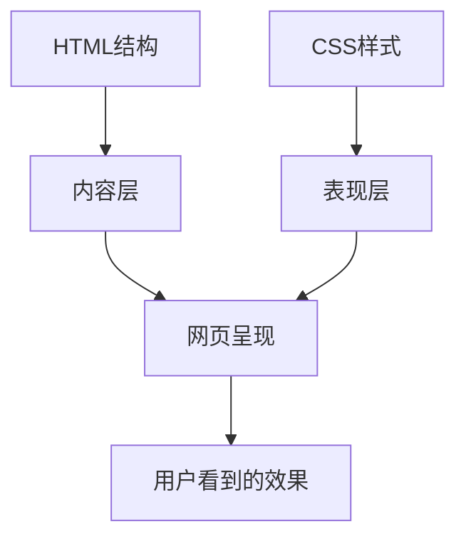

# CSS概述与基础概念

## 什么是CSS？

**CSS（Cascading Style Sheets）** 是层叠样式表，用于描述HTML文档的呈现方式。

### 核心作用
- **样式控制**：控制网页的外观和布局
- **内容分离**：将样式与HTML结构分离
- **统一管理**：集中管理网站样式

## CSS发展历程

| 版本 | 发布时间 | 主要特性 |
|------|----------|----------|
| CSS1 | 1996年 | 基础样式属性 |
| CSS2 | 1998年 | 定位、媒体查询 |
| CSS3 | 1999年至今 | 模块化、新特性 |

## CSS核心概念

### 1. 层叠性（Cascading）
- 多个样式规则作用于同一元素
- 优先级决定最终样式
- 详见：[[CSS语法与结构#优先级规则]]

### 2. 继承性（Inheritance）
- 子元素继承父元素样式
- 某些属性可继承，某些不可
- 详见：[[CSS语法与结构#属性继承]]

### 3. 特异性（Specificity）
- 选择器权重计算
- 决定样式优先级
- 详见：[[选择器系统/基础选择器#选择器权重]]

## CSS与HTML的关系

## 学习路径建议

1. **基础阶段**：掌握CSS语法和选择器
2. **进阶阶段**：理解盒模型和布局
3. **高级阶段**：掌握现代CSS特性和最佳实践

## 相关链接

- [[CSS语法与结构]] - 深入学习CSS语法
- [[CSS引入方式]] - 了解如何引入CSS
- [[浏览器渲染原理]] - 理解CSS工作原理
- [[CSS知识地图]] - 查看完整知识体系

## 实践建议

- 从简单的样式修改开始
- 理解每个属性的作用
- 多动手实践，观察效果
- 使用浏览器开发者工具调试

---

*下一步：学习 [[CSS语法与结构]] 了解CSS的具体语法规则*
