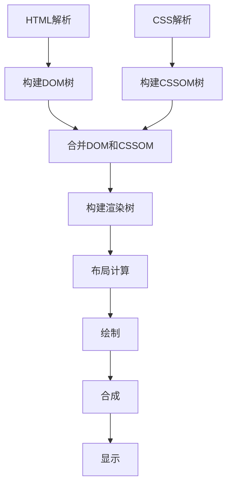

# 浏览器渲染原理

## 渲染流程概述

浏览器渲染是一个复杂的过程，CSS在其中起到关键作用。理解渲染原理有助于编写高效的CSS代码。

## 渲染管道（Rendering Pipeline）



## 1. HTML解析与DOM构建

### DOM树构建
- 解析HTML标记
- 创建DOM节点
- 构建DOM树结构

### 示例
```html
<html>
  <head>
    <title>页面标题</title>
  </head>
  <body>
    <h1>主标题</h1>
    <p>段落文本</p>
  </body>
</html>
```

## 2. CSS解析与CSSOM构建

### CSSOM树构建
- 解析CSS规则
- 计算样式优先级
- 构建CSSOM树

### 示例
```css
body { font-size: 16px; }
h1 { color: red; }
p { margin: 10px; }
```

## 3. 渲染树构建

### 合并过程
- 将DOM树与CSSOM树合并
- 只包含可见元素
- 计算最终样式

### 渲染树特点
- 包含所有可见元素
- 每个节点都有样式信息
- 不包含`display: none`的元素

## 4. 布局（Layout/Reflow）

### 布局计算
- 计算元素位置和大小
- 确定盒模型尺寸
- 处理浮动和定位

### 触发布局的因素
```css
/* 这些属性会触发布局 */
width, height, margin, padding
border, position, top, left
display, float, clear
```

## 5. 绘制（Paint）

### 绘制过程
- 填充颜色和背景
- 绘制边框和阴影
- 处理文本渲染

### 绘制层级
```css
/* 绘制顺序 */
background-color
background-image
border
box-shadow
text
```

## 6. 合成（Composite）

### 合成层
- 将不同层合并
- 处理透明度
- 应用变换效果

### 合成层创建条件
```css
/* 这些属性会创建合成层 */
transform: translateZ(0)
opacity: 0.99
will-change: transform
position: fixed
```

## 性能优化策略

### 1. 减少重排（Reflow）
```css
/* 避免频繁修改布局属性 */
.element {
    /* 一次性设置所有布局属性 */
    width: 100px;
    height: 100px;
    margin: 10px;
}
```

### 2. 减少重绘（Repaint）
```css
/* 使用transform代替位置属性 */
.element {
    /* 避免 */
    left: 100px;
    
    /* 推荐 */
    transform: translateX(100px);
}
```

### 3. 使用合成层
```css
/* 创建合成层 */
.animated-element {
    will-change: transform;
    transform: translateZ(0);
}
```

## 渲染性能指标

### 关键指标
| 指标 | 描述 | 目标值 |
|------|------|--------|
| FCP | 首次内容绘制 | < 1.8s |
| LCP | 最大内容绘制 | < 2.5s |
| CLS | 累积布局偏移 | < 0.1 |
| FID | 首次输入延迟 | < 100ms |

### 测量工具
- Chrome DevTools
- Lighthouse
- WebPageTest
- Performance API

## 常见性能问题

### 1. 布局抖动
```css
/* 问题代码 */
.element {
    width: 100px;
    height: 100px;
}

/* 解决方案 */
.element {
    width: 100px;
    height: 100px;
    contain: layout;
}
```

### 2. 过度绘制
```css
/* 问题代码 */
.overlay {
    background-color: rgba(0,0,0,0.5);
    position: absolute;
    top: 0;
    left: 0;
    right: 0;
    bottom: 0;
}

/* 解决方案 */
.overlay {
    background-color: rgba(0,0,0,0.5);
    position: fixed;
    inset: 0;
}
```

### 3. 字体加载阻塞
```css
/* 问题代码 */
@font-face {
    font-family: 'CustomFont';
    src: url('font.woff2');
}

/* 解决方案 */
@font-face {
    font-family: 'CustomFont';
    src: url('font.woff2');
    font-display: swap;
}
```

## 现代渲染优化

### 1. CSS Containment
```css
.container {
    contain: layout style paint;
}
```

### 2. CSS Grid/Flexbox
```css
/* 使用现代布局 */
.grid {
    display: grid;
    grid-template-columns: repeat(auto-fit, minmax(300px, 1fr));
}
```

### 3. CSS Custom Properties
```css
:root {
    --primary-color: #007bff;
    --spacing: 16px;
}

.element {
    color: var(--primary-color);
    margin: var(--spacing);
}
```

## 相关链接

- [[CSS语法与结构]] - 了解CSS语法规则
- [[CSS引入方式]] - 理解CSS加载过程
- [[性能优化/渲染优化]] - 深入学习渲染优化
- [[现代CSS特性/CSS函数与计算]] - 了解现代CSS特性

## 实践练习

### 基础练习
1. 使用Chrome DevTools分析页面渲染
2. 观察不同CSS属性的渲染影响
3. 测量页面性能指标

### 进阶练习
1. 优化页面渲染性能
2. 实现流畅的动画效果
3. 减少布局和重绘

---

*下一步：学习 [[选择器系统/基础选择器]] 掌握CSS选择器基础*
