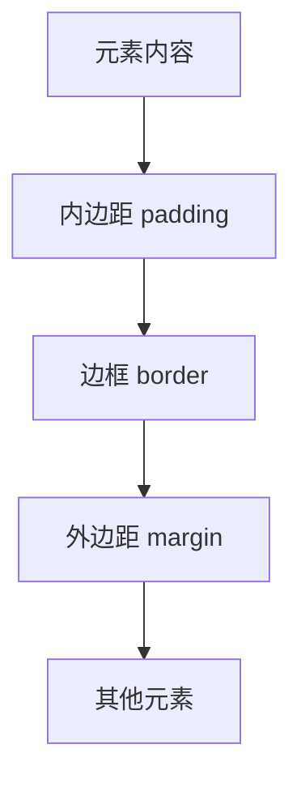

# 标准盒模型

## 盒模型概述

盒模型是CSS布局的基础概念，理解盒模型对于掌握CSS布局至关重要。

## 盒模型结构



### 盒模型组成
- **内容区域（Content）**：元素的实际内容
- **内边距（Padding）**：内容与边框之间的空间
- **边框（Border）**：围绕内边距的线条
- **外边距（Margin）**：元素与其他元素之间的空间

## 标准盒模型计算

### 元素总宽度
```
总宽度 = width + padding-left + padding-right + border-left + border-right + margin-left + margin-right
```

### 元素总高度
```
总高度 = height + padding-top + padding-bottom + border-top + border-bottom + margin-top + margin-bottom
```

### 示例
```css
.box {
    width: 200px;
    height: 100px;
    padding: 20px;
    border: 5px solid black;
    margin: 10px;
}
```

**计算过程：**
- 内容宽度：200px
- 内边距：20px × 2 = 40px
- 边框：5px × 2 = 10px
- 外边距：10px × 2 = 20px
- **总宽度：270px**

## 盒模型属性

### 1. 内容尺寸
```css
/* 设置内容宽度和高度 */
.element {
    width: 300px;
    height: 200px;
}

/* 最小和最大尺寸 */
.element {
    min-width: 100px;
    max-width: 500px;
    min-height: 50px;
    max-height: 300px;
}
```

### 2. 内边距（Padding）
```css
/* 四个方向相同 */
.element {
    padding: 20px;
}

/* 上下、左右 */
.element {
    padding: 20px 40px;
}

/* 上、左右、下 */
.element {
    padding: 20px 40px 60px;
}

/* 上、右、下、左 */
.element {
    padding: 20px 40px 60px 80px;
}

/* 单独设置 */
.element {
    padding-top: 20px;
    padding-right: 40px;
    padding-bottom: 60px;
    padding-left: 80px;
}
```

### 3. 边框（Border）
```css
/* 简写语法 */
.element {
    border: 2px solid red;
}

/* 分别设置 */
.element {
    border-width: 2px;
    border-style: solid;
    border-color: red;
}

/* 单独方向 */
.element {
    border-top: 2px solid red;
    border-right: 1px dashed blue;
    border-bottom: 3px dotted green;
    border-left: 1px solid black;
}
```

### 4. 外边距（Margin）
```css
/* 四个方向相同 */
.element {
    margin: 20px;
}

/* 上下、左右 */
.element {
    margin: 20px 40px;
}

/* 上、左右、下 */
.element {
    margin: 20px 40px 60px;
}

/* 上、右、下、左 */
.element {
    margin: 20px 40px 60px 80px;
}

/* 单独设置 */
.element {
    margin-top: 20px;
    margin-right: 40px;
    margin-bottom: 60px;
    margin-left: 80px;
}
```

## 盒模型类型

### 标准盒模型（content-box）
```css
.element {
    box-sizing: content-box; /* 默认值 */
    width: 200px;
    padding: 20px;
    border: 5px solid black;
}
/* 总宽度 = 200 + 40 + 10 = 250px */
```

### 怪异盒模型（border-box）
```css
.element {
    box-sizing: border-box;
    width: 200px;
    padding: 20px;
    border: 5px solid black;
}
/* 总宽度 = 200px（包含padding和border） */
```

## 盒模型可视化

### 标准盒模型
```
┌─────────────────────────────────┐ ← margin
│ ┌─────────────────────────────┐ │ ← border
│ │ ┌─────────────────────────┐ │ │ ← padding
│ │ │                         │ │ │
│ │ │        content          │ │ │
│ │ │                         │ │ │
│ │ └─────────────────────────┘ │ │
│ └─────────────────────────────┘ │
└─────────────────────────────────┘
```

### 怪异盒模型
```
┌─────────────────────────────────┐ ← margin
│ ┌─────────────────────────────┐ │ ← border
│ │ ┌─────────────────────────┐ │ │ ← padding
│ │ │                         │ │ │
│ │ │        content          │ │ │
│ │ │                         │ │ │
│ │ └─────────────────────────┘ │ │
│ └─────────────────────────────┘ │
└─────────────────────────────────┘
```

## 实际应用

### 1. 卡片组件
```css
.card {
    width: 300px;
    padding: 20px;
    border: 1px solid #ddd;
    border-radius: 8px;
    margin: 20px;
    box-shadow: 0 2px 4px rgba(0,0,0,0.1);
}
```

### 2. 按钮样式
```css
.button {
    padding: 12px 24px;
    border: 2px solid #007bff;
    border-radius: 4px;
    background-color: #007bff;
    color: white;
    margin: 5px;
    cursor: pointer;
}

.button:hover {
    background-color: #0056b3;
    border-color: #0056b3;
}
```

### 3. 表单输入框
```css
.input {
    width: 100%;
    padding: 12px 16px;
    border: 1px solid #ccc;
    border-radius: 4px;
    margin-bottom: 16px;
    box-sizing: border-box;
}
```

## 盒模型调试

### 1. 使用开发者工具
- 打开Chrome DevTools
- 选择Elements面板
- 查看盒模型可视化

### 2. 添加调试样式
```css
.debug * {
    outline: 1px solid red;
}

.debug *::before {
    content: attr(class);
    position: absolute;
    background: red;
    color: white;
    padding: 2px 4px;
    font-size: 10px;
}
```

## 常见问题

### 1. 盒模型计算错误
```css
/* 问题：总宽度超出预期 */
.container {
    width: 100%;
    padding: 20px;
    border: 1px solid black;
}
/* 总宽度 = 100% + 40px + 2px = 超出容器 */

/* 解决：使用border-box */
.container {
    width: 100%;
    padding: 20px;
    border: 1px solid black;
    box-sizing: border-box;
}
```

### 2. 外边距重叠
```css
/* 问题：垂直外边距重叠 */
.element1 { margin-bottom: 20px; }
.element2 { margin-top: 20px; }
/* 实际间距只有20px，不是40px */

/* 解决：使用padding或border */
.element1 { margin-bottom: 20px; }
.element2 { margin-top: 0; padding-top: 20px; }
```

## 相关链接

- [[怪异盒模型]] - 了解border-box盒模型
- [[盒模型应用]] - 学习盒模型实际应用
- [[定位与布局/文档流]] - 理解盒模型在布局中的作用
- [[CSS语法与结构]] - 回顾CSS基础语法

## 实践练习

### 基础练习
1. 计算不同盒模型的总尺寸
2. 使用padding和margin创建间距
3. 理解box-sizing的作用

### 进阶练习
1. 创建响应式卡片组件
2. 解决盒模型布局问题
3. 优化盒模型性能

---

*下一步：学习 [[怪异盒模型]] 了解border-box盒模型*
